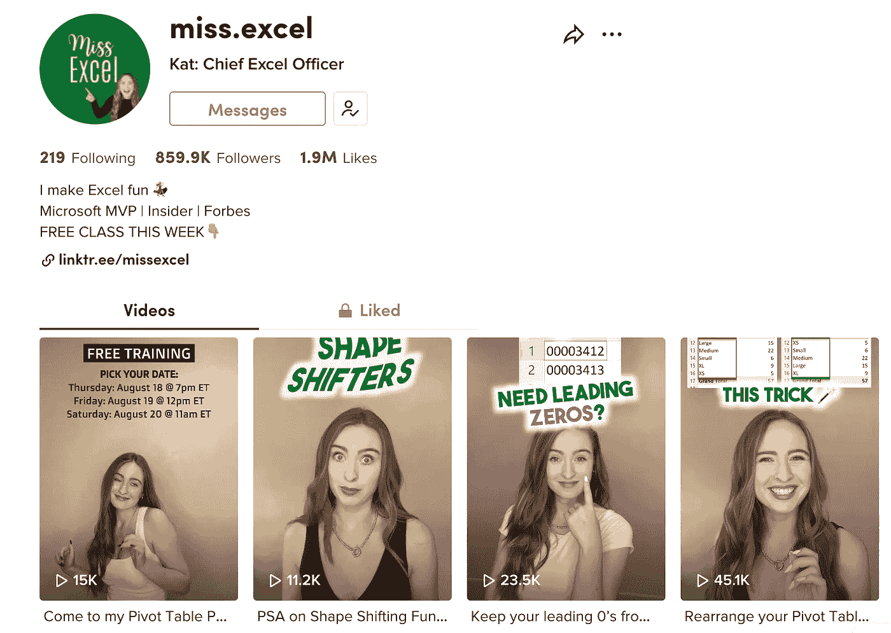

# Excel 小姐只是一个开始

> 原文：<https://medium.com/geekculture/miss-excel-is-just-the-start-8a8ceb292fa1?source=collection_archive---------4----------------------->

## 2023 年生产力影响者将如何继续增长

在过去的几年里，包括我们(保持生产力)在内，生产力软件影响者市场翻了一番，甚至可能翻了三倍。

在过去的 12 个月里，事情变得更加有趣——随着 YouTubers 发现概念和“桌面旅游”,生产力世界在全球主流观众中变得更加受欢迎。

Excel 小姐在抖音吸引了多达 80 万名粉丝，她是一个全新的生产力影响者，凭借她教授生产力工具的创造性方法，将改变我们对生产力影响者的看法。

 [## Kat:首席 excel 官(@miss.excel)抖音|手表 Kat:首席 Excel 官最新抖音…

### Kat:抖音首席 Excel 官(@ miss . Excel)| 190 万赞。859.9K 粉丝。我让 Excel 变得有趣💃🏼微软 MVP |…

www.tiktok.com](https://www.tiktok.com/@miss.excel?lang=en) 

与更传统的学习方法非常静态的渠道相比，Excel 小姐的方法与众不同。以下是一些例子:

*   **🚀有趣**——她的视频大部分是基于舞蹈的，这是一种流行的抖音趋势，她将这种趋势融入到教授 Excel hacks for work 中
*   ⚡️ **平易近人**——她很容易在她的视频中被关注，甚至让非 Excel wise 的人也能看得懂
*   📱**现代**——更容易吸引年轻观众

# 💃🏿每个影响生产力的人都会跳舞吗？

## 不，他们不会。

但最相关的将使用的方式与他们的观众和抖音明星小姐 Excel 只是开始影响世界，这可以有效地合并在一起，而不会失去结果。

以下是我对未来几个月的预测:

*   🔥**唱歌**——想象一首基于生产力建议的歌曲..
*   🧑🏻‍💻**演示** —使用类比来教授生产力
*   🎉**运动** —生产力应用程序之间的竞赛 IRL 流(wild one)

但你可以明白我的意思，由于她在形式和材料上采取的创造性方法，这个空间将永远改变。

我刚刚与 Excel 小姐合作提供她的课程，因此如果您想了解她如何使用 Microsoft Excel、PowerPoint 等进一步教授 it，请在下面找到它们并支持我们的努力。

 [## Excel 小姐

### 你有惊人的能力以直接、简洁和相关的方式交流和传达信息，同时…

www.miss-excel.com](https://www.miss-excel.com/?ref=fd4441) 

# ✨感谢你的阅读！