# 熊猫数据框架中缺少值

> 原文：<https://medium.com/geekculture/missing-values-in-pandas-dataframe-df5a80552ff3?source=collection_archive---------8----------------------->


Photo by [Ross Stone](https://unsplash.com/@rs2photography?utm_source=medium&utm_medium=referral) on [Unsplash](https://unsplash.com?utm_source=medium&utm_medium=referral)

在这篇文章中，我们将讨论熊猫数据帧中的缺失值。我们将讨论以下内容:

*   为什么会出现缺失值及原因？
*   如何检查缺失值？
*   如何处理缺失值？
*   管理缺失值的方法。

***为什么会出现缺失值？***

当我们获取数据进行分析时，您的数据可能包含缺失值和重复值。为了进行良好的分析，您需要删除重复项并填充缺失值，这样您的最终结果才会精确。

当没有为项目提供信息时，可能会出现数据缺失。这些缺失的价值在现实生活中造成了很大的问题。

这些缺失的值可能会影响数据所输入的模型。

缺失值的原因可能是随机的、有意的和错误的。

*   信息的丢失
*   数据上传不一致
*   创建数据帧时数据不可用。
*   存在但未收集
*   数据不存在

在熊猫中，缺失值用 NaN 表示，而不是两者都用。

> **如何检查缺失值**

在熊猫中，缺失值由 NaN 表示。大多数情况下，缺失值和空值是可以互换的。

对于基本的熊猫图书馆提供了两个功能，两个检测缺失值。

*   isnull()
*   notnull()
*   isna()
*   诺特娜( )

下面两个和上面两个相似。

。isnull()类似于 isna()，notnull()类似于 notna()。

为了计算缺失值，我们使用上面的函数，返回布尔值。这些方法可以应用于序列和数据帧。

例如:

**第一步。**首先导入库，然后读取文件数据。对于本文，我选择了一个缺少一些值的文件。您可以加载该数据，以查看数据帧保存的数据。

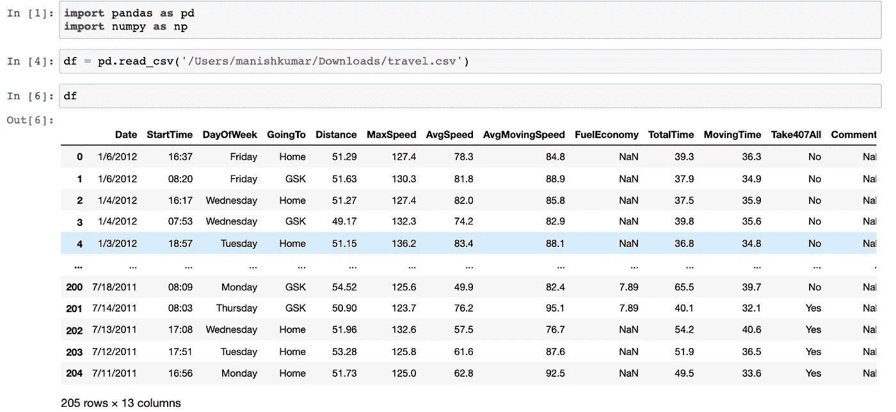

**第二步。现在，我们将检查每列包含的数据行，并尝试计算每列中缺少多少个值。**

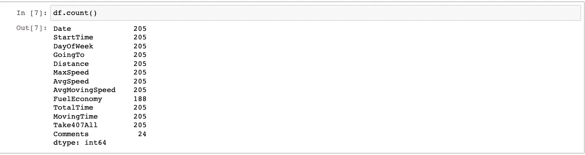

我们可以看到每一列的值。

在这里，Comments 列只有 24 个值，其余的都是 NaN，这是缺少的值。我们也可以按列检查条目。

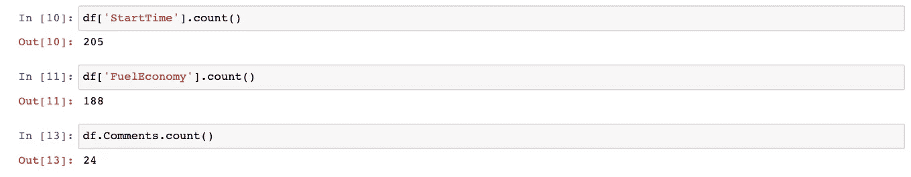

对于“StartTime”列，这些值不会丢失，因为当我们对列应用 count()函数时，DataFrame 中的总行数为 205，而 StartTime 列中有 205 个值。

但是对于像“燃料经济”和“评论”这样的列，缺少一些值。

第三步。现在，我们将借助函数来检查哪些值丢失了。

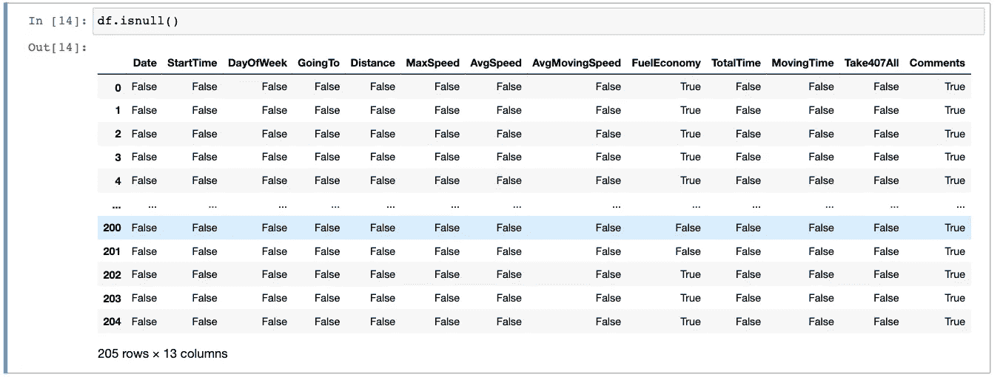

> **isnull()函数为缺失值给出布尔值 True，为有效值给出布尔值 False。**

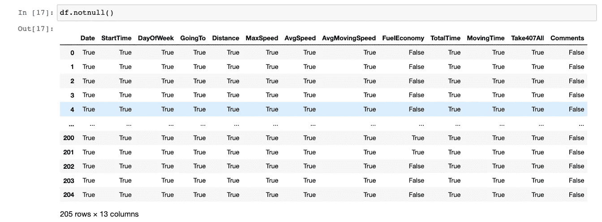

> **notnull()函数为缺失值提供布尔值 False，为有效值提供 True**

为了直接检查数据帧是否包含缺失值，我们可以使用 **values.any()进行检查。**

它表明数据帧中有一些缺失值。

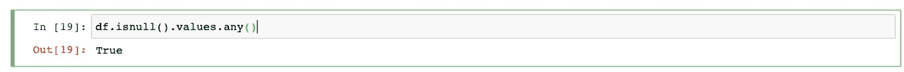

我们也可以为熊猫系列做同样的检查。

`isnull()`方法是有用的，但是有时我们想要评估在**序列**中是否有任何值是`missing`。

将多个方法链接在一起，执行速度最快的**方法是`.values.any()`:**

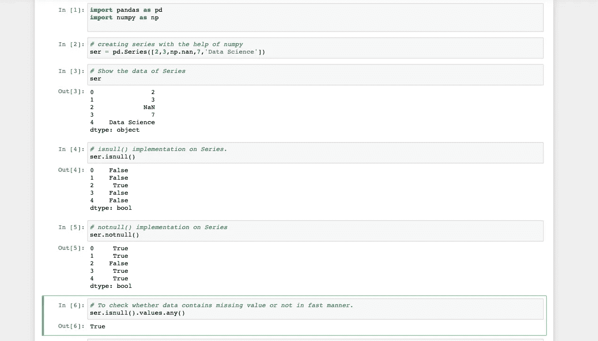

我们可以通过扩展链接方法或添加更多方法来知道有多少缺失值。

我们可以利用。sum()和其余方法的链。

在数据框中，只有两列在第 20 个单元格中缺少值。

在 21 号单元格系列中，ser 只有一个值缺失。

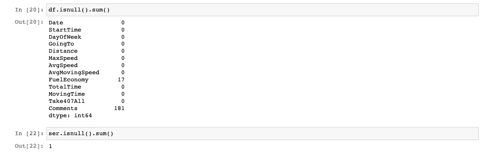

现在我们来看看如何处理缺失值？

***如何处理缺失值？***

没有处理缺失值的最佳方法。但是根据数据集和任务的特征，我们可以选择:

*   删除缺少的值
*   替换丢失的值
*   填充缺失的值

丢弃丢失的值仅仅意味着删除那些出现丢失值的记录。为此，我们有 dropna()函数，其语法如下。

```
these settings are by default
dropna(axis = 0, how = 'any',thresh = None, inplace = False )
```

现在，我们将借助示例来观察每一个参数。

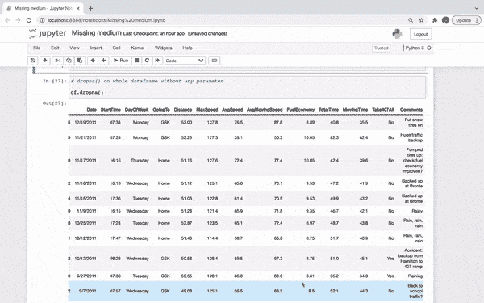

所有包含缺失值的记录或行都被删除了。

现在用参数

1.  **轴**。可以是 0 和 1。0 表示行，1 表示列。
2.  **如何**。为此，您可以传递“任何”或“全部”。
3.  **脱粒。**这是每行中应该出现的有效条目或非缺失行的最小数量。它的值可以是整数。
4.  **子集。**定义在哪些列中查找缺失值。
5.  **原地**。它帮助你使改变永久或暂时。对于永久更改为 True，对于临时更改为 False。

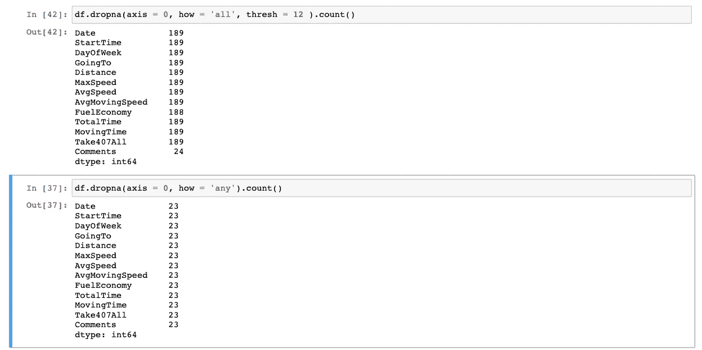

***thresh 表示→*** 只保留至少有 N 个非 NaN 值的行:

当我们更改轴参数时，我的列数会减少，因为有两列包含缺失值，这些列现在已被删除。

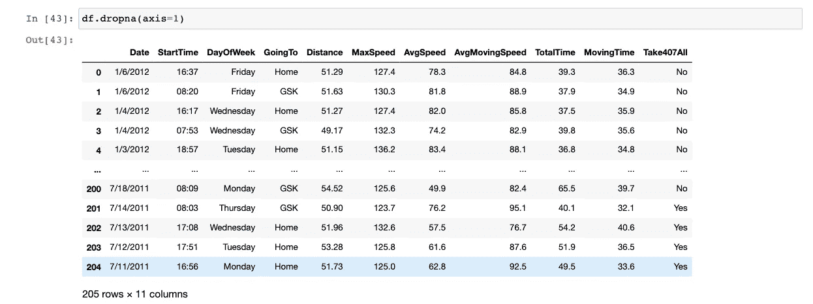

*   **子集参数。**当您应用该参数时，dropna()函数将仅从给定的列名中删除行。

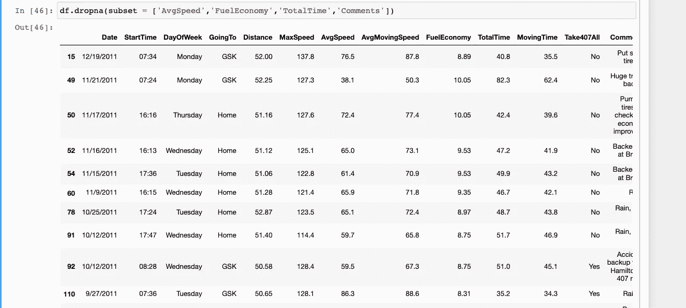

处理缺失值的另一个方法是用 **replace( )** 函数替换值。`replace()`方法搜索整个数据帧并替换指定值的每一种情况。

我们可以用来处理缺失值的最后一种方法是 **fillna()方法。**

```
fillna(value=None, method = None, axis = None, inplace = False, limit = None, downcast = None)
```

我们将通过例子来学习这些参数。

不带任何参数的 fillna()函数的最简单例子。它在每个 NaN 值处填充 1 或您在 fillna()函数中传递的任何值。

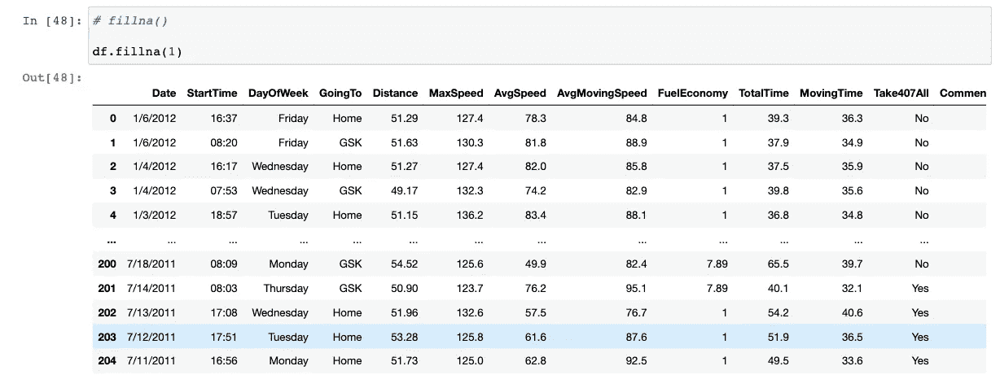

现在，在下面的例子中，我只在指定的列中填充值。

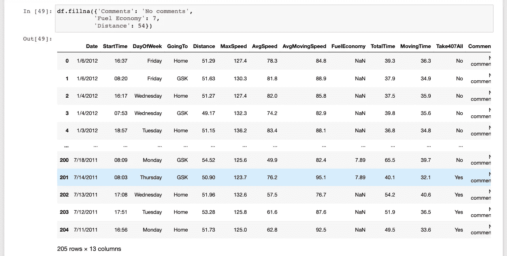

**方法参数**。在方法参数中我们可以传递 **ffill，bfill，pad，回填，None。**

[**为极限参数**](https://pandas.pydata.org/docs/reference/api/pandas.DataFrame.fillna.html?highlight=fillna#pandas.DataFrame.fillna) **。**如果指定了方法，这是向前/向后填充的连续 NaN 值的最大数量。换句话说，如果连续 nan 的数量超过这个数量，则只会部分填充缺口。如果未指定方法，这是沿整个轴将填充 nan 的最大条目数。如果不是无，则必须大于 0。

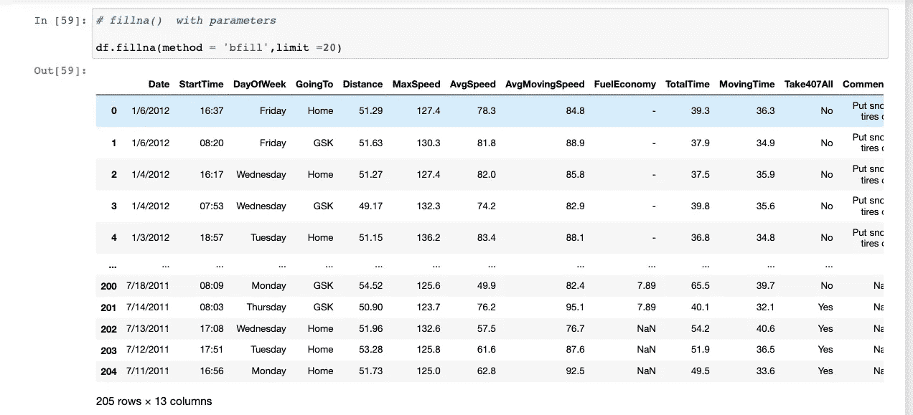

**interpolate( )** :处理 DataFrame 中缺失值的另一种方法是 interpolate()函数。它用上一行和下一行之间的数字替换 NaN 值。

简单地说，插值就是借助已知量来估计未知量。

语法及其参数。

```
DataFrame.interpolate(method=’linear’, axis=0, limit=None, inplace=False, limit_direction=None, limit_area=None, downcast=None, **kwargs)
```

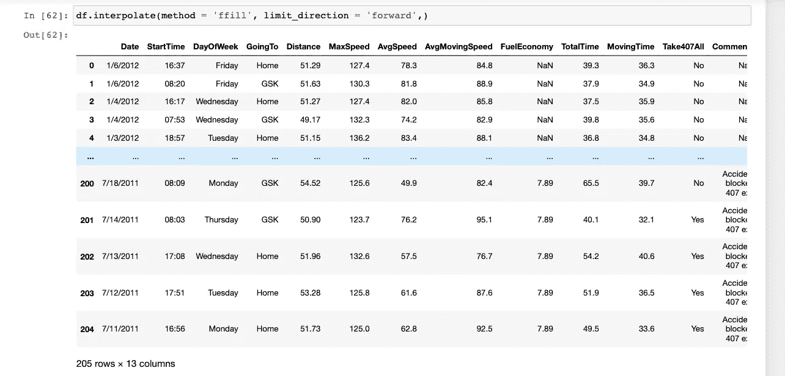

*   感谢大家抽出时间阅读。
*   觉得有用就分享，让别人也能学习。