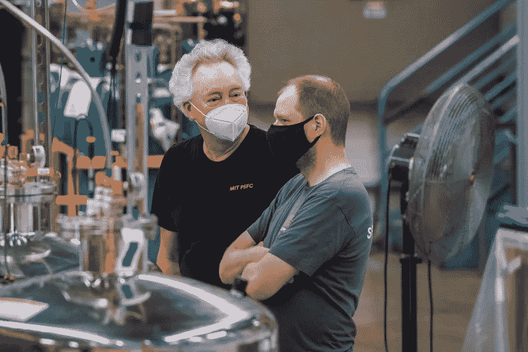

# 麻省理工学院和公司实现重大融合里程碑——市场疯人院

> 原文：<https://medium.com/geekculture/mit-and-company-achieve-major-fusion-milestone-market-mad-house-79594a83cce9?source=collection_archive---------27----------------------->

2021 年 9 月 5 日，麻省理工学院和英联邦聚变系统研究人员在聚变道路上达到了一个重要的里程碑。

据*麻省理工新闻*报道，研究人员首次测试了[世界上最强大的高温超导电磁体](https://news.mit.edu/2021/MIT-CFS-major-advance-toward-fusion-energy-0908)。电磁体产生了 20 特斯拉的磁场。麻省理工学院新闻声称,*这是地球上有史以来最强大的磁场。*

