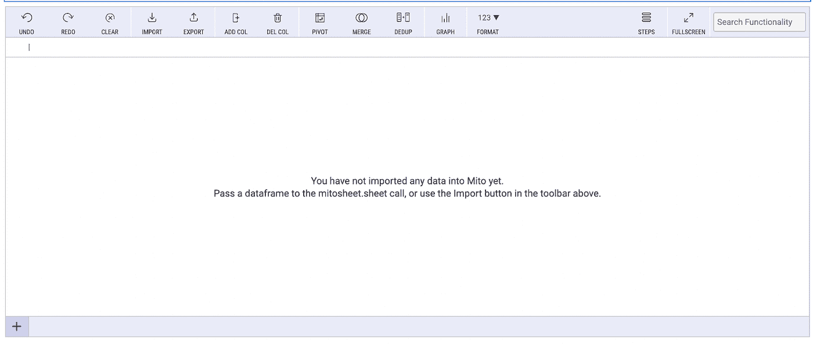
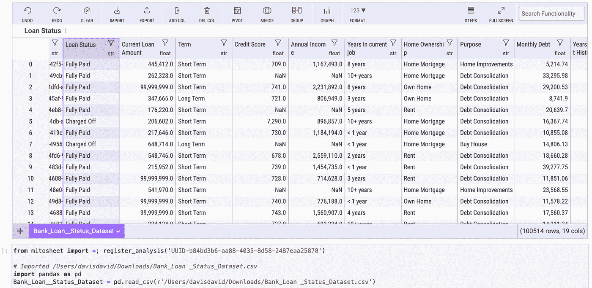
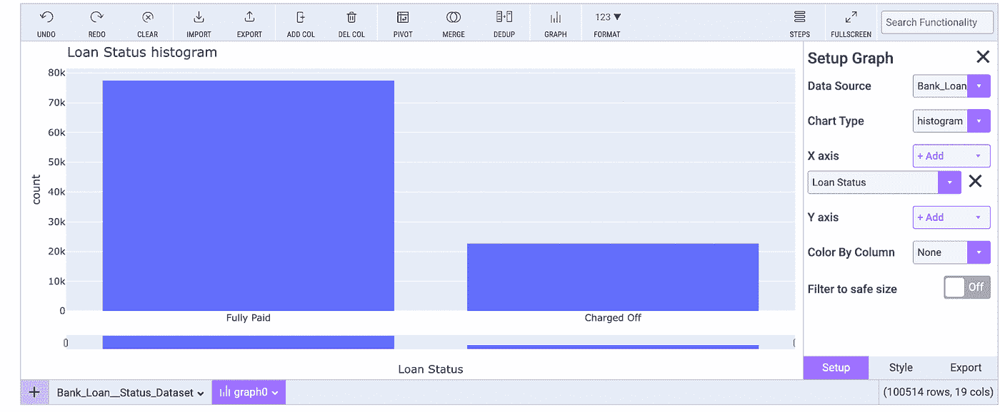
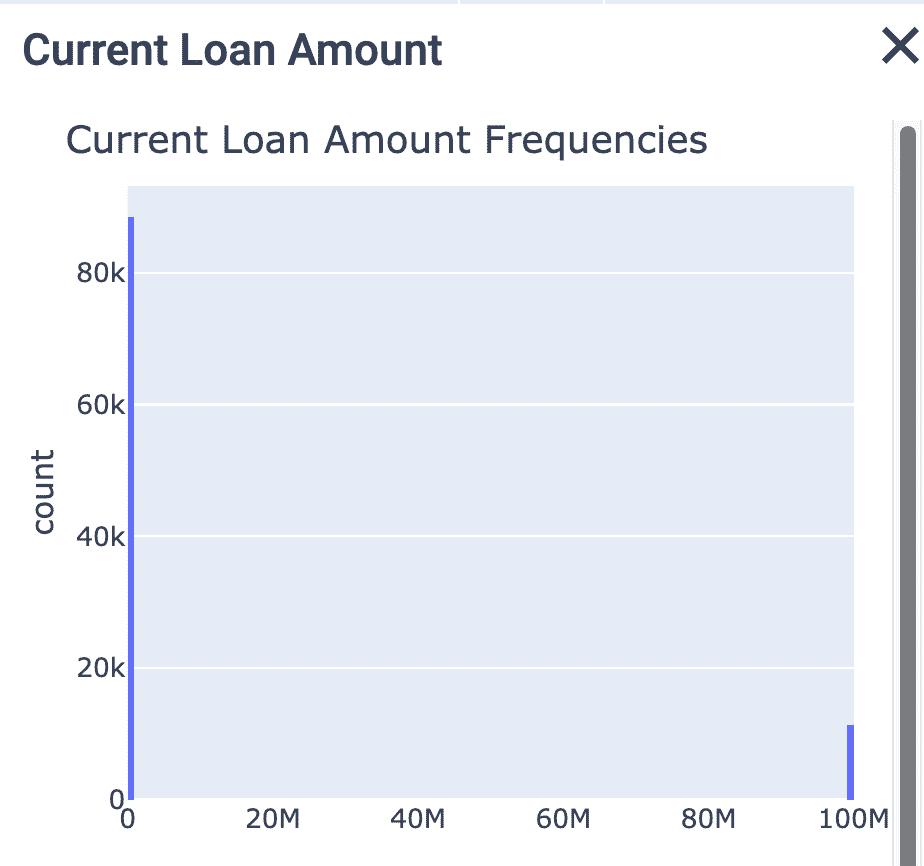
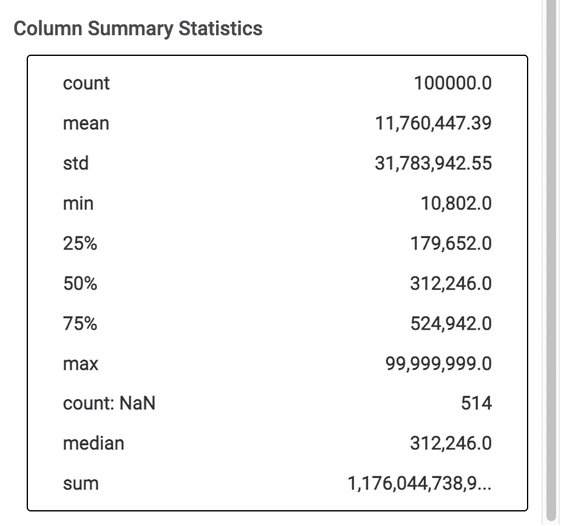
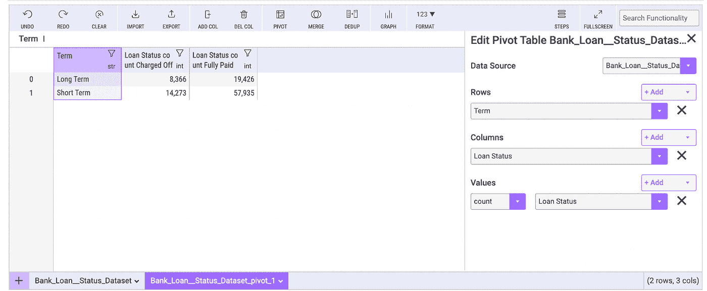
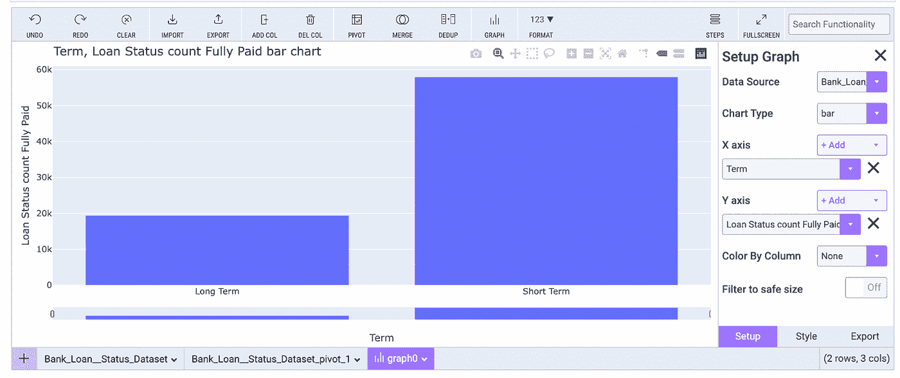
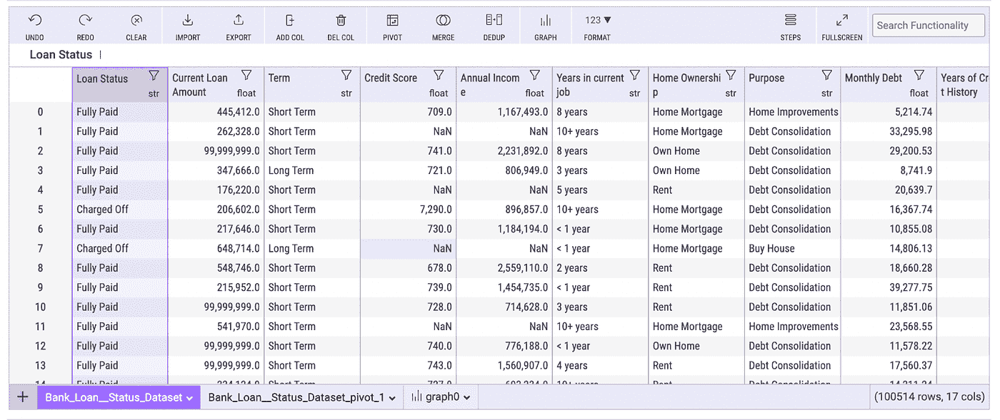
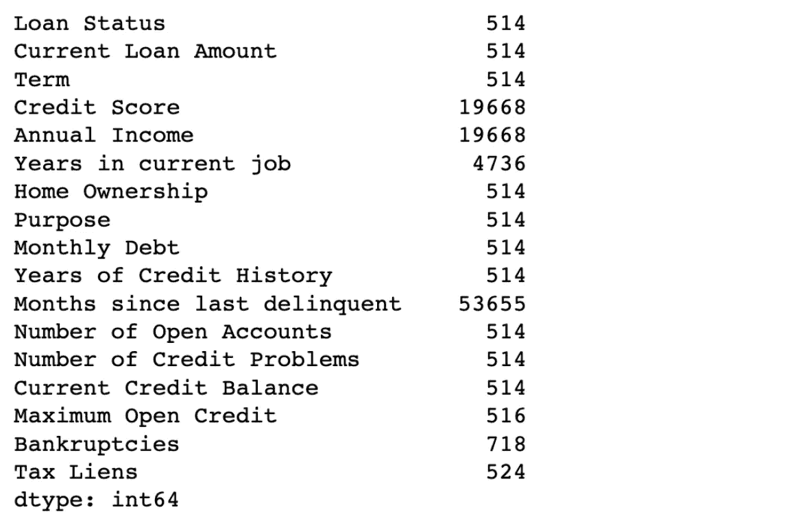
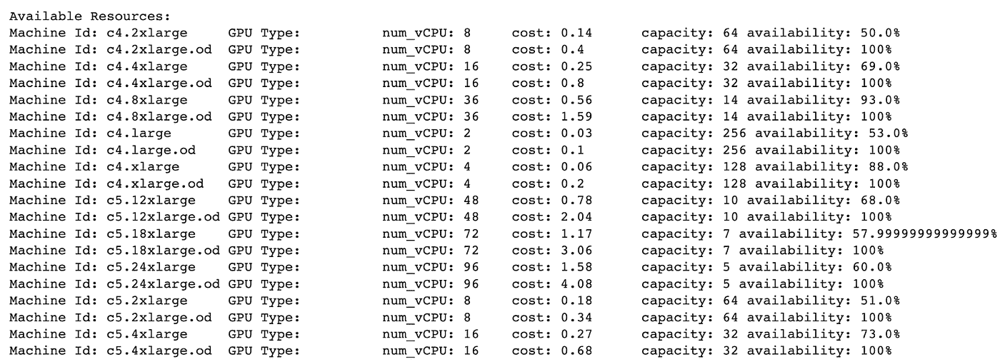

# 米托和艾布罗:用于数据分析和模型训练的两个最好的 Python 库

> 原文：<https://medium.com/geekculture/mito-aibro-the-two-best-python-libraries-for-data-analysis-and-model-training-43dc432b176c?source=collection_archive---------1----------------------->


Photo by [Jason Goodman](https://unsplash.com/@jasongoodman_youxventures?utm_source=medium&utm_medium=referral) on [Unsplash](https://unsplash.com?utm_source=medium&utm_medium=referral)

根据 [CrowdFlower](https://visit.figure-eight.com/rs/416-ZBE-142/images/CrowdFlower_DataScienceReport_2016.pdf) 对 80 名数据科学家的调查，与收集数据、训练模型、改进算法或部署模型等其他任务相比，数据科学家花 60%的时间清理和组织数据。

使用正确的工具，您可以加快探索和分析数据的过程，以最终训练您的机器学习模型。

在本文中，您将学习如何使用米托轻松分析和探索您的数据，以及如何使用 Aibro 在一行 python 代码中训练您的模型。

所以让我们开始吧。

# 什么是米托，它解决什么问题？

[米托](https://www.trymito.io/)是一个开源的 python 库( [GitHub](https://github.com/mito-ds/monorepo) )，它能够可视化地探索和分析你的数据。这是一个 python 的电子表格，可以在类似 Excel 的界面中查看 Excel 文件、CSV 文件和数据帧。

有了米托，您完成数据分析的速度比以前快 10 倍。当您分析电子表格时，米托将使用您的分析活动为您生成 python 代码。当您在 Mitosheet 中分析数据时，可以使用生成的 python 代码来重现相同的结果。Mitosheet 是一个添加和分析数据的界面，具有不同的电子表格功能，如排序和过滤数据。

数据分析可能是你工作中乏味的一部分。米托可以轻松快速地完成这些任务:

*   浏览数据
*   创建数据透视表
*   应用电子表格公式
*   创建探索性图表
*   筛选列

# 来自米托的有用特性

米托提供了许多可以帮助您探索和分析数据的功能。以下是一些有用的功能，您可以开始将它们应用到您的数据中。

## 1.将数据导入米托

要将数据导入米托，您可以传入现有的数据框或使用导入按钮搜索添加本地文件，然后它将填充 Mitosheet 中的单元格。

**注意:**米托将自动生成相关的 python 代码，将您的数据导入数据框。

## 2.创建数据透视表

米托可以通过汇总存储在不同列和行中的数据来帮助您创建数据透视表。您可以使用数据透视表来查看数据中的模式、比较或趋势。在你的机器上安装米托后，你将学习如何创建一个数据透视表。

## 3.显示汇总统计数据

通过检查列的统计数据，您可以快速了解列的数据。这将显示计数、平均值、标准偏差、最小值、最大值等指标，以及使用。描述熊猫的功能。

## 4.创建图表

您可以使用米托创建不同类型的交互式图表，以便更好地理解您的数据。它目前支持以下图形类型:

*   分散
*   线条
*   酒吧
*   柱状图
*   箱子
*   小提琴
*   剥夺
*   ECDF(经验累积分布函数)
*   密度热图
*   等密度线

## 5.格式化电子表格中的列

米托可以帮助您在不改变基础数据的情况下格式化列的显示。米托有不同的格式选项供您选择，例如用科学记数法或百分比显示数字。你可以在米托文档页面上阅读更多选项[。](https://docs.trymito.io/how-to/formatting)

# 如何安装米托

米托要求您拥有 python 3.6 或更高版本。您可以运行以下命令查看您的 python 版本。

```
python —- version
```

在您的终端中运行以下命令来下载米托安装程序。

```
python -m pip install mitoinstaller
```

然后运行米托安装程序将其安装在您的机器上。

```
python -m mitoinstaller install
```

***注意:*** *安装过程可能需要一段时间在您的机器上安装和设置米托。*

最后，你可以启动 Jupyter 实验室。如果您的机器上没有，您可以按照 [Jupyterlab 文档](https://jupyterlab.readthedocs.io/en/stable/getting_started/installation.html)中的说明来安装 Jupyterlab。

要测试是否所有东西都已成功安装，请在新笔记本中运行以下 python 代码来初始化 Mitosheet。

```
*# Run this cell to render a Mitosheet*import mitosheet
mitosheet.sheet()
```



Mitosheet output

输出显示米托已成功安装，您可以开始使用米托来浏览和分析您的数据。

# 如何使用米托执行 EDA

在本节中，您将使用米托探索和分析银行贷款状态数据集。

数据集可以从 kaggle.com 下载。

# 加载数据集

要在 Mitosheet 上添加数据集，只需单击 import 按钮并选择您下载的银行贷款状态数据集。



Mitosheet table preview

如您所见，导入数据集后，米托会在 Mitosheet 下方的单元格中自动生成 python 代码。你在米托表上执行的每一个动作都会用下面的 python 代码来表达。Mitosheet 显示我们的数据集有 19 列和 100，514 行数据。

# 绘图图表

米托提供了不同类型的图表，您可以在浏览数据时绘制这些图表。要绘制图表，请单击“图表”按钮，选择数据源，选择要绘制的图表类型，并设置 X 轴和 Y 轴。

在下面的例子中，我们将绘制贷款状态列，以可视化全部支付和冲销状态的总数。



Loan status histogram

该图显示，超过 77k 的客户已经全额支付了贷款，大约 22k 的客户已经注销了贷款。

您可以按照相同的步骤为数据集中的其他列绘制图表，并获得更多信息。

# 显示汇总统计数据

要查看数据集中特定列的统计信息，您需要单击列标题中列控制面板上的过滤器图标，然后选择摘要统计信息选项卡。在下面的示例中，您将查看名为 Current Loan Amount 的列的统计信息。



Current Loan Amount Frequencies



Column Summary Statistics

摘要显示数据总数、平均贷款额、最高和最低贷款额。最后，它显示所有客户的贷款总额。

# 创建数据透视表

数据透视表可以通过比较数据集中的两列或更多列来帮助您获得更多信息。要创建数据透视表，请单击米托工具栏中的数据透视表图标，然后使用任务窗格对其进行配置。

在任务窗格中，您可以

1.  选择数据透视表的行、列和值列。
2.  为值列选择聚合函数。您可以选择不同的选项，例如:平均值、计数、总和、中值、最大值、最小值和标准偏差。



Mitosheet pivot table

您还可以查看为创建的数据透视表生成的 python 代码。

```
*# Pivoted Bank_Loan__Status_Dataset into df2*
unused_columns = Bank_Loan__Status_Dataset.columns.difference(set([‘Term’]).union(set([‘Loan Status’])).union(set({‘Loan Status’})))
tmp_df = Bank_Loan__Status_Dataset.drop(unused_columns, axis=1)
pivot_table = tmp_df.pivot_table(
 index=[‘Term’],
 columns=[‘Loan Status’],
 values=[‘Loan Status’],
 aggfunc={‘Loan Status’: [‘count’]}
)
pivot_table.set_axis([flatten_column_header(col) for col in pivot_table.keys()], axis=1, inplace=True)
Bank_Loan__Status_Dataset_pivot_1 = pivot_table.reset_index()
```

从数据透视表中，您可以发现，与拥有长期贷款的客户相比，拥有短期贷款的大多数客户能够全额偿还贷款。您还可以创建一个图表来显示这种洞察力，如下所示。



Term, loan status count fully paid bar chart

# 删除列

浏览和分析数据集后，还可以使用米托删除与项目目标无关的列。例如，在此银行数据集中，您可以删除贷款 ID 和客户 ID 列，因为在创建机器学习模型时不需要它们。

要删除列，您必须选择列，然后单击米托工具栏中的删除列按钮。



Delete a column by Mito toolbar

上面的 Mitosheet 显示，在删除了贷款 ID 和客户 ID 这两列之后，列数减少到了 17 列。

# 准备数据以训练 ML 模型

在探索和分析数据集之后，下一步是准备数据集来训练机器学习模型。您将使用米托生成的 python 代码作为准备数据的起点(即，您不需要从头开始)。

# 处理缺失值

如果数据集有一些缺失值，您可以使用以下代码检查缺失值的数量:

```
*#check missing values* 
Bank_Loan__Status_Dataset.isnull().sum()
```



Check missing values

下面的代码块将通过以下方式处理丢失的值

1.  通过使用每个分类列中最常见的值来填充分类列中缺失的值。
2.  通过使用每个数字列的平均值来填充数字列中缺失的值。

```
*# fill missing values for categorical features*
Bank_Loan__Status_Dataset[“Loan Status”].fillna(“Fully Paid”, inplace=True)
Bank_Loan__Status_Dataset[“Term”].fillna(“Short Term”, inplace=True)
Bank_Loan__Status_Dataset[“Years in current job”].fillna(“10+ years”,
 inplace=True)
Bank_Loan__Status_Dataset[“Home Ownership”].fillna(“Home Mortgage”,
 inplace=True)
Bank_Loan__Status_Dataset[“Purpose”].fillna(“Debt Consolidation”, inplace=True)*# fill missing values for integers features*
intergers_columns = list(
 Bank_Loan__Status_Dataset.select_dtypes(include=[‘floating’]).columns)for column in intergers_columns:
 Bank_Loan__Status_Dataset[column].fillna(
 Bank_Loan__Status_Dataset[column].mean(), inplace=True)
```

## 预处理数据集

在定型模型之前，必须将分类列转换为数值。您将使用 sklearn 的 LabelEncoder 来预处理两个二进制分类列，分别称为 Loan Status 和 Term。

```
*# preprocess binary categorical columns*
from sklearn.preprocessing import LabelEncoderle = LabelEncoder()
binary_columns = [“Loan Status”, “Term”]for column in binary_columns:
 Bank_Loan__Status_Dataset[column] = le.fit_transform(
 Bank_Loan__Status_Dataset[column])
```

可以使用 pandas 的 ***pd.get_dummies*** 函数对多个分类列进行预处理。在这里，您将把以下多个分类列转换成数值。

*   目前工作年限
*   房屋所有权
*   目的

```
*# preprocess multiple categorical columns* Bank_Loan__Status_Dataset = pd.get_dummies(
 Bank_Loan__Status_Dataset,
 columns=[“Years in current job”, “Home Ownership”, “Purpose”])
```

然后将数据集分为要素和目标。

```
*# split data into target and features* target = Bank_Loan__Status_Dataset[“Loan Status”].values
features = Bank_Loan__Status_Dataset.drop(“Loan Status”,axis=1)
```

由于要素具有不同的范围，sklearn 的 MinMaxScaler 方法将通过将每个要素缩放到 0 和 1 的给定范围来转换和规范化要素。

```
*# scaling the dataset* 
from sklearn.preprocessing import MinMaxScalerscaler = MinMaxScaler()
features = scaler.fit_transform(features)
```

# 如何用 Aibro 训练一个 ML 模型

在这一部分中，您将学习如何使用另一个名为 Aibro 的 python 库在云上快速训练机器学习模型。

# 什么是 Aibro？

[Aibro](https://aipaca.ai/?ref=hackernoon.com) 是一个无服务器的 MLOps 工具，让机器学习云计算变得便宜、简单、快速。该工具可以帮助数据科学家或机器学习工程师在数据科学生命周期中执行两个重要步骤，即训练和[部署机器学习模型](https://davis-david.medium.com/how-to-deploy-machine-learning-models-to-the-cloud-quickly-and-easily-41cca9425c75?source=user_profile---------1-------------------------------)。使用 Aibro，您可以在短时间内完成这两项任务。

Aibro 支持 AWS 云平台，他们计划支持更多云平台，如微软 Azure、谷歌云、阿里云和 IBM 云。它还将支持市场上大多数流行的机器学习框架，如 TensorFlow、Pytorch、Scikit-learn 和 XGboost。

**注意:**目前只支持基于 Keras 的模型训练。将来，它将支持 Pytorch 和 Scikit learn 等其他框架。

使用 Aibro 的另一个优势是能够使用专为机器学习构建的独家成本节约策略将云成本降低 85%。在了解 Aibro 及其服务之后，让我们根据您使用米托分析的银行贷款状态数据集来训练一个机器学习模型。

# 安装 Aibro

在您的终端中运行以下命令，在您的机器上安装 Aibro。

```
pip install aibro
```

# 在云上训练模型的步骤

以下步骤将指导您如何使用 Aibro 在云上训练机器学习模型。

## 步骤 1:拆分准备好的数据

第一步是使用 scikit-learn 库中的 train_test_split 方法将数据分成训练集和验证集。

```
*# split data into train and validation set*
from sklearn.model_selection import train_test_splittrain_X, validation_X,train_Y, validation_Y = train_test_split(
 features, target, test_size=0.3, stratify=target, random_state=42)
```

步骤 2:创建张量流分类模型

第二步是创建一个简单的 TensorFlow 模型来对客户的贷款状态进行分类。

```
import tensorflow as tftf.random.set_seed(42)inputs = tf.keras.Input(shape=(45,))
x =tf.keras.layers.Dense(256, activation=’relu’)(inputs)
x =tf.keras.layers.Dense(128, activation=’relu’)(x)
output = tf.keras.layers.Dense(1, activation=’sigmoid’)(x)model = tf.keras.Model(inputs, output)model.compile(
 loss=tf.keras.losses.binary_crossentropy,
 optimizer=tf.keras.optimizers.Adam(lr=0.03),
 metrics=[
   tf.keras.metrics.BinaryAccuracy(name=’accuracy’),
   tf.keras.metrics.Precision(name=’precision’),
   tf.keras.metrics.Recall(name=’recall’)
 ]
)
```

## 第三步:选择云机器

你需要选择一个云机器来训练 TensorFlow 模型。Aibro 支持市场上可用的 AWS [上的各种 spot 实例](https://aipaca.ai/marketplace)，您可以选择这些实例来训练您的模型。

available_machine 方法将显示可用云机器的列表，以及其他重要细节，例如:

*   它的可用性(指定的 spot 实例类型成功启动的概率)
*   其容量(指可请求的实例数量)
*   GPU 类型
*   CPU 类型
*   费用

```
*# select cloud machine*
from aibro.training import available_machinesavailable_machines()
```

样本输出:



Aibro available machines

## 步骤 4:启动培训作业

你需要使用 ***aibro.training*** 对象的 ***online_fit*** 方法来初始化云机器，开始训练你的模型。

***online_fit*** 方法接收以下参数以开始训练模型:

*   张量流模型
*   训练数据集(训练 X 和训练 Y)
*   验证数据集(验证 X 和验证 Y)
*   您选择的云机器 id
*   时代数
*   帮助你识别工作的简单描述

```
*#train the model on the cloud machine*from aibro.training import Trainingjob_id, trained_model, history = Training.online_fit(
 model=model,
 train_X=train_X,
 train_Y=train_Y,
 validation_data=(validation_X, validation_Y),
 machine_ids=[“g4dn.4xlarge.od”],
 epochs=10,
 description=’training binary classification model’
 )
```

一旦培训工作开始，它将遵循 7 个阶段来完成任务。

**1。【LAUNCHING】**
第一阶段是向云平台发送打开实例的请求。

```
Already authenticated!
Please open [https://aipaca.ai/training_jobs](https://aipaca.ai/training_jobs) to track job status.
[LAUNCHING]: Starting training job: train_7260f2ff-430b-49c7–8b2f-8805a27f440f
[LAUNCHING]: Requesting g4dn.4xlarge.od to be ready…
[LAUNCHING]: g4dn.4xlarge.od server successfully requested, launching and building…
[LAUNCHING]: Tensorflow needs around 5 mins to gear up env on new machines (Any thought to reduce it? Contact us!)[LAUNCHING]:
[ Getting server ready in around: 6m 30s ]Your g4dn.4xlarge.od is now ready 🎉
```

**2。【发送】**
第二阶段是将模型和数据传输到实例。

```
[SENDING]: Serializing your model…
[SENDING]: Serializing your data…
[SENDING]: Sending model and data to the server to start training
[SENDING]: |>>>>>>>>> | 97.39 % 7.88 / 8.09 MiB [avg: 4.78MiB/s][SENDING]: |>>>>>>>>>>| 100.00 % 8.09 / 8.09 MiB [avg: 4.72MiB/s]
2022–03–23 10:09:03.237618: I tensorflow/compiler/jit/xla_cpu_device.cc:41] Not creating XLA devices, tf_xla_enable_xla_devices not set
[SENDING]: Received model and data
```

**3。【镜像】**
第三阶段是把你本地的深度学习环境克隆到云端。

```
[TRAINING]: GPU Devices: [PhysicalDevice(name=’/physical_device:GPU:0', device_type=’GPU’)]
2022–03–23 10:09:03.793867: I tensorflow/core/profiler/lib/profiler_session.cc:136] Profiler session initializing.
2022–03–23 10:09:03.793933: I tensorflow/core/profiler/lib/profiler_session.cc:155] Profiler session started.2022–03–23 10:09:03.798531: I tensorflow/core/profiler/lib/profiler_session.cc:172] Profiler session tear down.
To enable them in other operations, rebuild TensorFlow with the appropriate compiler flags.
2022–03–23 10:09:04.945947: I tensorflow/compiler/jit/xla_gpu_device.cc:99] Not creating XLA devices, tf_xla_enable_xla_devices not set
2022–03–23 10:09:06.102062: I tensorflow/compiler/mlir/mlir_graph_optimization_pass.cc:116] None of the MLIR optimization passes are enabled (registered 2)
2022–03–23 10:09:06.127457: I tensorflow/core/platform/profile_utils/cpu_utils.cc:112] CPU Frequency: 2500000000 Hz
```

**4。【训练】:**
在这个阶段，它会开始训练模型。

```
[TRAINING]: Loading the model
[TRAINING]: Loading the data
[TRAINING]: Finished loading the data
[TRAINING]: Open 107.23.193.207:8008 to view tensorboard[TRAINING]: Start model fit
[TRAINING]: Epoch 1/10
2022–03–23 10:09:07.895968: I tensorflow/core/profiler/lib/profiler_session.cc:155] Profiler session started.
2022–03–23 10:09:07.898925: I tensorflow/core/profiler/lib/profiler_session.cc:71] Profiler session collecting data.
2022–03–23 10:09:07.901233: I tensorflow/core/profiler/lib/profiler_session.cc:172] Profiler session tear down.
```

**5。【概要】**

第五阶段是回复一份关于培训工作的简要总结。

```
[SUMMARY]: Best epoch was: epoch 1
[SUMMARY]: Lowest val_loss was: 0.4333568811416626
```

6。【接收】
最后，它会将训练好的模型等结果发回给用户。

```
[RECEIVING]: Uploading training log and tensorboard log
[RECEIVING]: |█████████-| 100.0% 0.45MiB/0.45MiB [avg: 1.02MiB/s]
```

7。【收盘】

最后一个阶段是销毁训练数据并终止实例。

一旦训练作业完成，它将返回以下对象:

*   作业 id
*   受过训练的模特
*   历史

现在你已经在云机器上成功训练了一个分类模型，并得到了结果。

# 检查模型性能

您可以使用历史对象来确定训练集中的最佳得分，如下所示。

```
training_best_score = max(history.history[‘accuracy’])
print(training_best_score)>> 0.8196819424629211
```

检查验证集的最佳分数。

```
validation_best_score = max(history.history[‘val_accuracy’])
print(validation_best_score)>> 0.8208920359611511
```

# 结论

在本文中，您了解了如何使用米托 python 包轻松浏览和分析数据集，并使用生成的代码做进一步准备。您还学习了如何使用 aibro python 包在短时间内在云上快速训练您的模型并获得结果。

本文演示的简单机器学习项目可以让您清楚地了解如何在下一个机器学习项目中使用米托和 Aibro python 库。

如果你学到了新的东西或者喜欢阅读这篇文章，请分享给其他人看。

如有任何问题或疑问，请随时联系我。