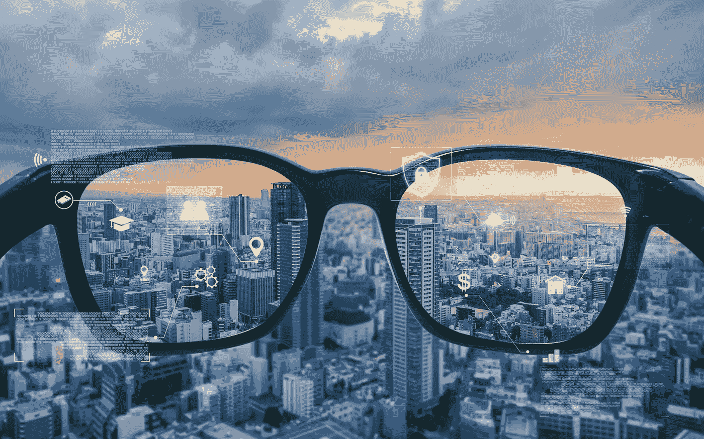
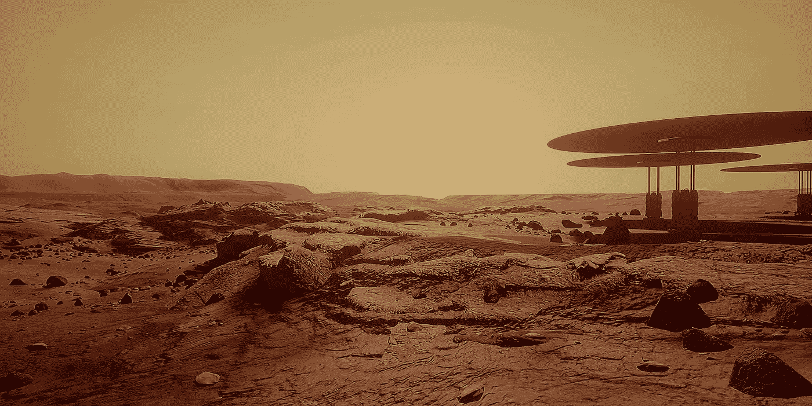
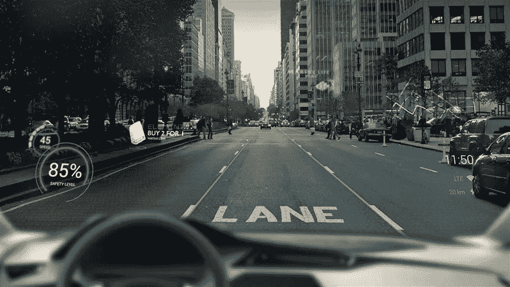
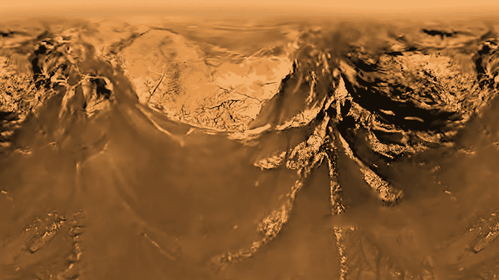

# 混合现实指南

> 原文：<https://medium.com/geekculture/mixed-reality-guide-efd1e1b80754?source=collection_archive---------15----------------------->

## 关于混合现实的思考

Source: [https://www.daacap.com/augmented-reality-and-virtual-reality-past-present-and-future/](https://www.daacap.com/augmented-reality-and-virtual-reality-past-present-and-future/)

  W 当你看不见东西的时候你会做什么？我们*想象*。我们人类真的很擅长想象，或者说*可视化*一些我们无法在我们面前观察到的东西。问题*“火星看起来会是什么样子？”我们的思维很快就能理解。用不了一秒钟，我们的脑海中就会浮现出一幅带有尘土飞扬的黄橙色滤色镜的火星沙丘的图像。想象事物是创造性努力的先导，也是使我们成为人类的基本区别之一。当我们想到它们时，创造生动形象的能力是我们大脑中最突出的能力之一。在某种程度上，想象和相信想象中的神话的能力是人类在全球层面合作的动力。*

A scene from **Mars 2030,** a Virtual Reality game rendered using Unreal engine

我们想象的东西(物体/实体)有两种。

*   我们想象真实的物体，在我们无法从物理上感知它们的情况下。
*   我们想象目前物理上不存在的东西，或者现实世界中*不可能*存在的东西。

当我们*想象的时候，*我们本质上做的是创造一个完全虚拟的世界。例如，幻觉是将虚拟的——想象的——实体增强到现实世界结构中的一种形式。此外，有大量文献认为幻觉是一种不同形式的想象——是感官想象的退化。但是尽管有这些区别，可以肯定的是所有类型的想象都是暂时的。它们持续很短一段时间，然后就消失了。例如，梦是只持续一夜的想象形式。当一些梦结束时，悲伤充满了我们，但在某些情况下，带给我们轻松。

# “虚拟”的层次

正是因为我们不能长时间保持我们渴望感知的生动的想象力，人们发明了设备来帮助解决这个问题。你戴上这些设备，通过它们，你可以看到一个不同的世界，一个我们根据自己的选择创造的人造世界——一个你渴望回归的世界。它捕捉到你的呼吸，你瞬间沉浸在一个不同于你自己时空现实的现实中。

早在 1994 年，Paul Milgram 和 Fumio Kishino 在论文[混合现实视觉显示的分类](https://www.researchgate.net/publication/231514051_A_Taxonomy_of_Mixed_Reality_Visual_Displays)中将这种沉浸水平解释为一个连续体。连续体的要点是，在完全真实和完全虚拟世界的两端，环境中存在不同层次的真实和虚拟对象/实体的*混合*。例如，一个完全虚拟的环境可能会有几个真实世界的对象——在这种情况下，真实-虚拟对象的混合往往位于更接近连续体中完全虚拟点的点。在另一种情况下，真实世界可以由几个虚拟对象/实体填充，这些虚拟对象/实体位于光谱中更接近全真实点的点。前一点被命名为*增强虚拟*，后一点被命名为*增强现实*。

撇开技术层面，什么米尔格拉姆*等人*。意思是你如何看待一个虚拟环境取决于你在设计它的时候将现实和虚拟的混合程度。米尔格拉姆*等人*。把这种现象叫做*混合现实*。

Augmented Reality, a Vision for the Future: Source: [https://medium.com/ecomi/augmented-reality-a-vision-of-the-future-e573501c012](/ecomi/augmented-reality-a-vision-of-the-future-e573501c012)

# 纯真实和纯虚拟

两头呢？一端是我们生活的时空。没有一个是想象出来的。但是在另一端，你有完全想象的世界——或者完全设计的世界。人们想要的混合物是什么？

这种混合形式的现实都是关于增强琐碎的经历。例如，当在直路上行驶时，我们通常会跟踪速度和其他元数据，如燃油。为了跟踪这些，我们不断地查看仪表板。它至少在一小段时间内分散了驾驶员的注意力。为什么我们不把这个仪表板增加到我们的显示器上呢？这意味着我们*将*我们需要的数据嵌入我们的视野，这样我们就不必冒着眼睛偏离道路的风险。

我们已经提到虚拟世界主要处理想象力。比如说，我们正在计划一项载人任务，前往一个遥远的星球——比如说，土星最大的卫星——泰坦。现在，美国国家航空航天局(或任何其他组织，就此而言)的工程师需要了解这一旅程的动力学，着陆，起飞，漫游任务等。请注意，这是一个我们以前从未完全看到和检查过的地方。我们不知道它是什么样子，因为我们没有见过它。我们只有有限数量的信号来推断它看起来像什么，最接近的是惠更斯太空探测器发送的全景图像。

Surface of Titan, captured by Huygens Probe, Source: [https://www.space.com/35315-saturn-moon-titan-landing-anniversary-huygens.html](https://www.space.com/35315-saturn-moon-titan-landing-anniversary-huygens.html)

现在，当美国国家航空航天局的工程师们设计一次远征训练时，他们需要数字化地重现整个环境。在这次体验中，真实世界的环境(也就是地球)将被一个完全虚拟的——数字化设计的——泰坦世界所取代。在合成这个世界时，必须特别小心，宇航员需要感觉好像他们沉浸在土卫六中，这样的体验才会有效。

因此，这个泰坦环境完全是虚拟的。或者，我们可以设计成这样一种方式，宇航员携带真实世界的组件——设备——将融入虚拟世界，使其成为一种增强的虚拟体验。然而，这个环境在很大程度上是虚拟的。只有很小一部分环境是真实的。

# “沉浸”的维度

很明显，真实和虚拟元素的混合比完全虚拟的场景更接近我们的日常生活。这种“融合”为我们在现实生活中的体验增加了另一个维度，使我们能够与数字生成的互动。设计这样的世界需要在几个“维度”方面的完善和小心，这些维度是用户“沉浸感”丰富程度的标尺。

*   对环境的适应性
*   可信度

上下文可以从几个子维度来看:环境/周围，目标/任务，用户的行为，以及用户的精神状态。如果混合现实领域内的虚拟内容缺乏**调整**自身以融入环境的能力，那么交互对于用户来说似乎是疏远的，因为交互的感知感觉不会融合成一种丰富的双向通信形式。一个这样的例子是虚拟物体上的环境照明水平。真实世界对象的一个显著特征是它将环境阴影投射到表面上，并且角度、半径和这样的特征将由对象在空间中相对于光源的位置来确定。因此，在 MR 领域中，为了在需要时给人一种真实感，这些重要的上下文特征应该在领域内部被模仿。情境意识可能也必须由技术来实现:例如，当代的半空中手势——用户用来与虚拟实体互动——在日常生活中仅用于表达情感或意图。在讨论中，除非手势与物体表面接触，否则他们不会与物体进行物理交互。需要检测这种表面的可适应界面——通常使用深度学习技术来检测这种表面——来模拟虚拟领域中的这种场景。

MR 交互特征的另一个维度是 MR 领域中的自然&可信交互。自然交互可以被定义为用户已经熟悉的交互，或者用户可以更容易地习惯的交互(对用户来说很容易&)。自然交互可以包括用户已经熟悉的交互，例如典型的讲话、每天的手势运动等等。

然而，这并不是说非自然发生的相互作用会使磁共振领域人为地变得陌生。在某些需要新颖性的情况下，可以嵌入这样的交互，同时确保以用户友好的方式使用交互。例如，像娱乐这样的行业可能涉及这样的交互，这种交互将想象的片段展现到虚拟空间中，并且与这样的增强交互可能与我们在现实生活中所做的不同。然而，关键是，这些知觉错觉必须具有**可信**的特征，这样整个体验才不会感到疏远。可以说，在娱乐(游戏等)这种情况下，人们牺牲了现实感。)，但是交互仍然需要易于掌握，并且对用户的指令轰炸较少。支持交互这一方面的一个关键因素是多模态:也就是说，多种模态相互补充，在沉浸式环境中提供丰富的体验。例如，视觉输出可以用触觉反馈(视觉-触觉显示)来补充，以提供沉浸感。由于人类是作为多模态生物进化而来的，所以多模态在沉浸式体验中扮演着关键的角色也就不足为奇了。然而，重要的是要注意，随着模态的增加，处理讨论中的交互所需的能力变得更强，因此需要装备更好和更复杂的硬件来驱动软件。

# 未来

当代的磁共振系统很好，但还不够好。他们在与虚拟物体互动的某些方面仍然落后，使得现实和虚拟世界之间的接缝有点厚。当一个人意识到位于同一环境中的真实和虚拟对象之间的显著差异(排除对象本身特征之间的微小差异)时，它不会反映自然的 MR 世界。这些滞后很大程度上是由于技术困难，例如将大量计算能力嵌入小型头戴设备的痛苦。计算机视觉、自然语言处理和人机交互领域的其他困难使整个过程更加复杂。MR 系统的未来需要寻求技术来减轻这些滞后，并使真实和虚拟实体之间的交互边界变薄(或“看起来”变薄)。高效计算技术是这方面的基石。

无论困难看起来有多复杂，最终产品都是值得的。这项技术的潜力可以催生大量的用例，这些用例分布在广阔的领域中。在信息时代，MR 是一种可以融合信息，使信息丰富，并以最令人信服和震撼的方式带给我们的技术，全面辅助我们的日常生活。结合人工智能和量子计算(QC)，这是一项可以推动人类文明向前迈出一大步的技术。在某种程度上，现代技术的三大支柱(人工智能、质量控制和磁共振)相互帮助，变得有用、有用。在某种程度上，MR 为我们的生活增加了另一个轴，我们可以使用自己的自然传感器和执行器来感知我们获得的信息和我们渴望获得的信息。