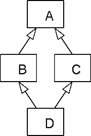

# 混合和特性

> 原文：<https://medium.com/geekculture/mixin-and-treats-94035022182c?source=collection_archive---------0----------------------->

米辛，钻石问题，继承

> 混合是抽象基类的同义词。从 mixin 继承不是一种专门化的形式，而是一种收集功能的方式。一个类或对象可能从一个或多个 mixin“继承”它的大部分或全部功能，因此 mixin 可以被认为是多重继承的一种机制…
> 
> …mixin 鼓励代码重用并避免众所周知的与多重继承相关的病态。然而，mixin 引入了他们自己的一套折衷…
> 
> …当一个类包含一个 mixin 时，这个类… **包含**，而不是继承 mixin 的所有属性(字段、特性)和方法。它们在编译期间成为类的一部分。
> 
> 使用 mixins，类定义只定义与该类相关的属性和参数；方法被留在别处定义，如在 Flavors 和 CLOS 中，并被组织在“通用函数”中。这些通用函数是由类型分派和方法组合在多种情况(方法)下定义的函数。CLOS 和 Flavors 允许 mixin 方法向现有方法添加行为::before 和:after 守护进程、whoppers 和 Flavors 中的包装器。CLOS 增加了:around 方法和通过 CALL-NEXT-METHOD 调用隐藏方法的能力。因此，举例来说，stream-lock-mixin 可以在流类的现有方法周围添加锁定。在 Flavors 中，人们会编写一个包装器或 whopper，而在 CLOS 中，人们会使用:around 方法。clo 和 Flavors 都允许通过方法组合进行计算重用。:before、:after 和:around 方法是标准方法组合的一个特征。提供了其他方法组合。
> 
> ……ECMAScript(俗称 JavaScript)等一些语言在语言层面上并不支持 mixin，但可以通过在运行时将方法从一个对象复制到另一个对象来轻松模仿它们，从而“借用”mixin 的方法。注意，这对于静态类型语言也是可能的，但是它需要用扩展的方法集构造一个新的对象……
> 
> ……mixin 的一些功能是由 Java 和 C#等流行语言中的接口提供的。然而，接口只指定类必须支持什么，而不能提供实现。另一个类提供了一个实现，并依赖于接口，需要将常见行为重构到一个地方。与面向方面编程相结合的接口可以在支持这些特性的语言中产生成熟的 mixins，比如 C#或 Java。此外，通过使用标记接口模式、泛型编程和扩展方法，C# 3.0 具有模仿混合的能力。

[http://en.wikipedia.org/wiki/Mixin](http://en.wikipedia.org/wiki/Mixin)

Scala 语言的一个小例子，基于[http://c2.com/cgi/wiki?MixIn](http://c2.com/cgi/wiki?MixIn):

和

```
new ColoredPoint3D(1, 2, 3, "blue").toString()
```

会回来的

```
"x = 1, y = 2, z = 3, col = blue".
```

Mixin 可以看作是多重继承的部分实现。在支持多重继承的编程语言中，mixin 很容易被模拟。例如，在 C++模板中可以使用给定运算符添加运算符==(基于[http://ru.wikipedia.org/wiki/примесь_(программирование)](http://ru.wikipedia.org/wiki/%D0%9F%D1%80%D0%B8%D0%BC%D0%B5%D1%81%D1%8C_%28%D0%BF%D1%80%D0%BE%D0%B3%D1%80%D0%B0%D0%BC%D0%BC%D0%B8%D1%80%D0%BE%D0%B2%D0%B0%D0%BD%D0%B8%D0%B5%29):

*继承机制是面向对象编程范例的核心组件。继承意味着一个类“继承”另一个类的定义和类型。继承表达* ***是-个*** *的关系。一只狗* ***是——一只*** *宠物，一辆车* ***是——一辆*** *车辆。我想再次强调:代码重用不是继承的目标。代码重用是 mixin 的一个目标。在 Python 中，mixin 是通过使用(合作多重)继承实现的(见下文)。*

**“钻石问题”**是当两个类 B 和 C 从 A 继承，类 D 从 B 和 C 都继承时产生的歧义，如果 A 中有一个方法 B 和 C 都重写了，而 D 没有重写它，那么 D 继承的是方法的哪个版本:B 的版本，还是 C 的版本？



[https://en . Wikipedia . org/wiki/Multiple _ inheritance # The _ diamond _ problem](https://en.wikipedia.org/wiki/Multiple_inheritance#The_diamond_problem)

因为这种情况下类继承图的形状，所以被称为“钻石问题”。在这种情况下，A 类位于顶部，B 和 C 分别位于其下，D 在底部将两者连接在一起，形成一个菱形。Wikipedia 将 Mixin 定义为“一个类，它提供了一个可以被子类继承的特定功能，但并不意味着它是独立的。从 mixin 继承不是一种专门化的形式，而是一种收集功能的手段。一个子类甚至可以选择通过多重继承来继承一个或多个 mixins 的大部分或全部功能。mixin 也可以被看作是一个*接口，带有实现的方法。*

继承定义了类之间的“是”关系。狗是宠物，汽车是交通工具——汽车是交通工具的专门化。另一方面, **mixin** 是一种在一系列相关类之间共享功能的**方式，这些相关类并不继承自同一个基类。mixin 允许您重用代码，而不暗示类之间的关系。它还允许您稍微绕过单一继承模型来做到这一点。**

*我从 JavaScript 示例开始，因为它通过将方法从 mixin 复制到 object 来实现 mixin，这是 mixin 的一个很好的心智模型。

所有其他例子(除了 C#)使用继承来实现 mixin 理论上是错误的，因为 mixin 没有 IS-A 语义。*

**JavaScript 中的 Mixin**

基于[https://en.wikipedia.org/wiki/Mixin#In_JavaScript](https://en.wikipedia.org/wiki/Mixin#In_JavaScript)

技术上可以通过将函数绑定到对象中的键来为对象添加行为。然而，这种状态和行为之间缺乏分离。

**第一种方式——使用 *extend(obj，mixin)* 函数。**

**第二种方式——object . assign(obj，mixin)**

# **版本低于 8 的 Java**

Java-8 之前的 Java 对象没有多重继承。在 Java 中模拟多重继承的标准方式是*委托/组合/装饰*。

**代表团**:

**装饰工**:

这种技术的最终例子是 BufferedOutputStream。能够将 Java 中建模的流缓冲为对象(因为 Java 中的“一切”都是对象)。其实应该是 mixin。这是正交概念。比如 BufferedInputStream 中也使用了这个能力。

**注:**

Java-8 之前的版本对接口有多重继承。类可以实现多个接口(一个接口也可以扩展另一个接口)。由方法名冲突引起的歧义是非常有限的。不管怎样，这种碰撞是在两个(或多个)纯粹抽象的方法之间发生的。假如接口没有状态，哪种方法有效并不重要(为了使类可用，你应该在类中提供这种方法的实现，这种实现将用于所有纯粹的抽象方法)。特别是，如果我们有钻石问题，这个问题是与纯粹的抽象方法，所以这个问题是非常有限的，如上所述。

# Java 8 接口

对接口中的多重继承的支持有限。你可以有实际的*行为*(默认情况下是(非抽象的)方法；你也可以配置静态方法，但这与继承无关)，但你不能在那里有状态(不允许有数据成员)。因此，虽然从技术上讲你有菱形问题，但是方法解析规则是以这样一种方式特别制作的，在调用哪个类上没有二义性。只有当你有实现这些接口的类时，*状态*才会出现。如果他提供了自己的实现，那么它的实现将获胜，如果没有，那么将使用其中一个接口的实现(Java 不考虑 implements 子句中指定接口的顺序)，但是因为接口没有状态，所以使用哪个特定接口并不重要。

**注意:** Java 8 接口还是无状态的。

> 随着 Java 8 中默认方法的引入，现在一个类可以从多个地方(比如另一个类或接口)继承同一个方法。以下规则可用于确定在这种情况下选择哪种方法:
> 
> 1。类或超类方法声明总是优先于默认方法
> 2。否则，使用具有最具体的缺省提供接口的方法
> 3。最后，如果方法同样具体，将会有一个编译器错误，你将被迫显式地覆盖该方法，并指定你的类应该调用哪一个
> …

> 答:A
> 
> 子接口 B 和 C 没有覆盖方法，所以实际上只有 A 的方法可供选择。顺便提一下，如果 B 或 C(但不是两者)覆盖了该方法，那么规则 2 将适用。对了，这是钻石问题。

[https://fahdshariff . blogspot . com/2016/06/Java-8-default-method-resolution-rules . html](https://fahdshariff.blogspot.com/2016/06/java-8-default-method-resolution-rules.html)

如果规则 1 和规则 2 不能确定使用哪个方法，那么根据规则 3，我们应该在实现这些接口的类中添加方法，这将提供对其中一个接口的显式调用。有关这些规则的详细解释和示例，请参见上面的链接。

# **Scala**

基于[https://en.wikipedia.org/wiki/Mixin#In_JavaScript](https://en.wikipedia.org/wiki/Mixin#In_JavaScript)

顾名思义，**特征**通常被用来代表一个不同的特征或方面，通常与一个具体类型或至少某个实例的职责正交。例如，唱歌的能力被建模为这样一个正交特征:它可以应用于鸟、人等等。

**注意:** Scala 的 trait 可以有状态。Scala 支持特征多重继承。对于如何解决多重继承有严格规则。 *Java 8 接口是特质。*

在这里，Bird 将 trait 的所有方法混合到自己的定义中，就好像 Bird 类自己定义了方法`sing()` 。

因为 extends 也用于从超类继承，在 trait 的情况下，如果没有超类被继承，则使用 extends，并且只用于第一个 trait 中的 mixin。以下所有特征在使用关键字 with 时混合在一起。

# **C#** 3.0

也可以通过使用扩展方法模拟 mixin，参见[用 C#扩展方法实现 mixin](https://www.zorched.net/2008/01/03/implementing-mixins-with-c-extension-methods/)。

# **科特林**

可以用两种方式模拟 mixin，作为 Java 8 接口和扩展方法。

# **Python**

基于[https://en.wikipedia.org/wiki/Mixin#In_Python](https://en.wikipedia.org/wiki/Mixin#In_Python)

在 Python 中，mixin 是通过使用继承实现的。

在 Python 中，`SocketServer`模块有一个`UDPServer`类和一个`TCPServer` 类。它们分别充当`UDP` 和`TCP` 套接字服务器的服务器。此外，还有两个 mixin 类:`ForkingMixIn`和`ThreadingMixIn`。通常，所有新连接都在同一个进程中处理。通过用`ThreadingMixIn`延长`TCPServer` ，如下所示:

`ThreadingMixIn` 类为`TCP` 服务器增加了功能，这样每个新的连接都会创建一个新的线程。或者，使用`ForkingMixIn`会导致进程为每个新连接分叉。显然，创建新线程或派生进程的功能作为一个独立的类并不十分有用。

在这个使用示例中，mixins 提供了替代的底层功能，而不影响作为套接字服务器的功能。

*原发表于我的博客:*

[https://www.toalexsmail.com/2012/09/mixin-and-treats.html](https://www.toalexsmail.com/2012/09/mixin-and-treats.html)

[https://www . toalexsmail . com/2019/03/mixin-diamond-problem-inheritance . html](https://www.toalexsmail.com/2019/03/mixin-diamond-problem-inheritance.html)