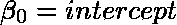
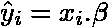
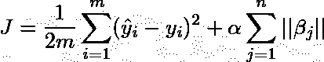

# ML 算法 1.01:线性回归

> 原文：<https://medium.com/geekculture/ml-algorithms-1-01-linear-regression-5829a9698aa9?source=collection_archive---------38----------------------->

Source: [Joel & Jasmin](https://unsplash.com/photos/P8b0bg-w_YA?utm_source=unsplash&utm_medium=referral&utm_content=creditShareLink)

## 介绍

这是任何人踏入机器学习领域时学习的第一个算法。这个模型的优点在于简单。线性模型具有高偏差和低方差。此外，如果特征被归一化，那么在使用梯度下降时，它有助于算法更快地收敛。缺失值需要在线性回归中进行估算或剔除。离群值影响最佳拟合线的形成。应该使用箱线图或任何其他方法对它们进行过滤。

## 假设

*   目标变量和预测变量之间的关系是线性的
*   这些特征是相互独立的
*   同方差性:随机变量具有相同的有限方差
*   残差和目标变量之间没有关系
*   残差呈正态分布

## 优势

*   假设为真时表现非常好
*   高模型可解释性

## 不足之处

*   数据几乎不符合假设
*   模型容易过度拟合

## 模型

设 **X** 为具有 *m* 个样本和 *n* 个特征的特征集。设 **y** 为连续响应。

模型的参数表示为:

我们可以将模型的初始参数𝜷设置为接近 0。让我们定义模型的损失(*成本*)函数:

成本函数的负梯度给出了我们应该为我们的模型优化𝜷的方向。我们以步长η(学习速率)向下移动损失函数的负梯度。注意，我们不更新截距项。

线性回归的代价函数是凸函数。因此，我们迭代更新𝜷，直到梯度为 0。如果我们不能达到梯度 0，我们迭代直到梯度小于某个ε值。经过这些步骤，我们获得了模型的最佳参数𝜷和数据的最佳拟合线。

## 估计

现在，我们可以通过我们的模型估计连续变量，如下所示:

## 超参数调谐

在线性回归中不需要或不可能进行太多的调整。我们可以使用套索或岭回归技术来惩罚成本函数。

岭回归用于通过惩罚较高的参数值𝜷.来减少模型中的方差

*岭回归成本函数:*

在岭回归中，参数向 0 收缩，但永远不会变成 0。套索回归可以强制某些参数为 0。这实现了自动特征选择。

*拉索回归成本函数:*

* * * * * * * * * * * * * * * * * * * * * * * * * * * * * * * * * * * * * * * * * * * * * * * * * * * * * * * * * * **示例代码:*

从 sklearn.linear_model 导入线性回归作为 LR

lr =LR()

lr.fit(X_train，y_train)

y_hat = lr.predict(X_test)

*****************************************************************

## 参考

 [## 《汽车杂志》

### 4，188，060 已注册机器学习是让计算机在没有明确…

www.coursera.org](https://www.coursera.org/learn/machine-learning?utm_source=gg&utm_medium=sem&utm_campaign=07-StanfordML-IN&utm_content=07-StanfordML-IN&campaignid=1950458127&adgroupid=70479331563&device=c&keyword=andrew%20ng%20machine%20learning&matchtype=e&network=g&devicemodel=&adpostion=&creativeid=351348153032&hide_mobile_promo)  [## krishnaik 06/采访-准备-数据-科学

### 在 GitHub 上创建一个帐户，为 krishnaik 06/采访准备数据科学的发展做出贡献。

github.com](https://github.com/krishnaik06/Interview-Prepartion-Data-Science/blob/master/Interview%20Preparation-%20Day%202-%20Linear%20Regression.ipynb)