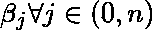
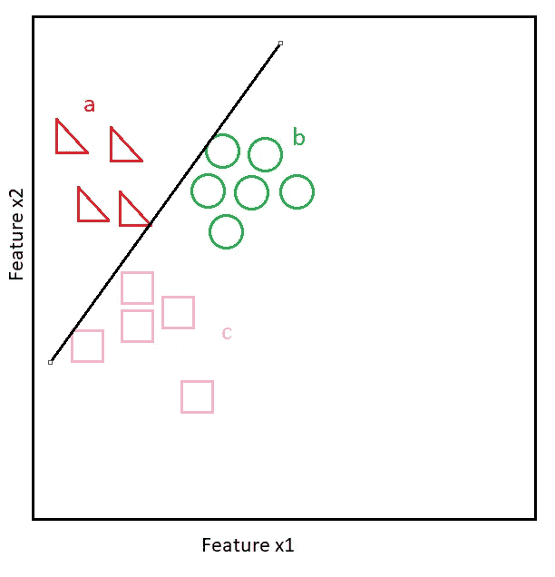
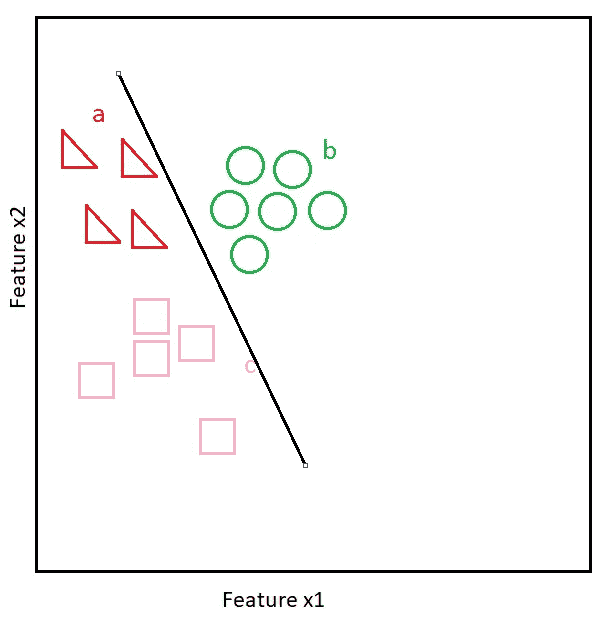
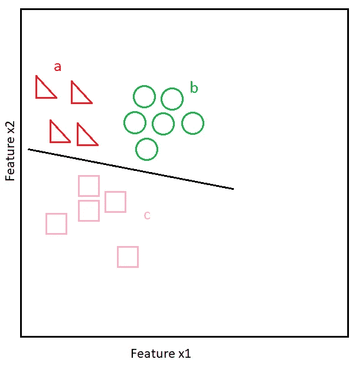

# 最大似然算法 1.02:逻辑回归

> 原文：<https://medium.com/geekculture/ml-algorithms-1-02-logistic-regression-f2ca619c97ff?source=collection_archive---------21----------------------->

[Source](https://unsplash.com/photos/KEIrdasbkhw?utm_source=unsplash&utm_medium=referral&utm_content=creditShareLink)

# 介绍

当使用[线性回归](/geekculture/ml-algorithms-1-01-linear-regression-5829a9698aa9)时，如果你对自己说，“天哪，我怎么用它来分类呢？”，你读对了文章。逻辑回归从线性回归中借用最佳拟合线的概念，以 OVR(一与其余)的方式划分类别。由于所需的输出是一个预测，因此该模型使用 sigmoid 变换将输出范围保持在[0，1]内。此外，损失函数从线性回归中看到的连续凸损失函数变为铰链损失。缺失值需要在线性回归中进行估算或剔除。离群值影响最佳拟合线的形成。应该使用箱线图或任何其他方法对它们进行过滤。缩放对于模型是有益的。这里值得一提的是，由于输出是一个概率，逻辑回归可以用作 bagging/boosting 算法中的基本估计量。

# 假设

*   预测值和目标正类对数比数之间的线性关系
*   预测值之间很少或没有相关性

# 优势

*   高模型可解释性
*   当数据是线性可分时，性能非常好
*   输出类别概率

# 不足之处

*   数据几乎不符合假设
*   在极少数问题中，数据是线性可分的，没有核技巧
*   模型无法解释复杂的关系

# 模型

设 **X** 为具有 *m* 个样本和 *n* 个特征的特征集。设 **y** 为类响应。

模型的参数表示为:

我们可以将模型的初始参数𝜷设置为接近 0。让我们定义模型的损失(*成本*)函数:

上面的等式代表了 sigmoid 变换。

让我们理解为什么我们在损失函数中使用了 log()。

对于一次观察，例 1 和例 4 中的误差约为 0；案例 2 和 3 中的误差= 1。

病例 1 和 4 分类正确，病例 2 和 3 分类错误。

如下图所示，单个对数损失函数惩罚与预期输出的高偏差:

[Source](https://www.desmos.com/calculator/cmghmic8rz)

红线代表 log(ŷ){which 对应 class=1}，蓝线代表 log(1-ŷ){which 对应 class=0}。注意红线射向 0 附近的无穷大，反之亦然。

这就是损失函数如何惩罚错误的类预测。

∑前的负号是因为小数值的对数为负。

请注意，我没有将 y 或(1-y)乘以曲线，因为我们可以*说*它用于选择损失函数中的相关对数项。对于特定的观察，它也是恒定的。

## 设置阈值

模型输出是一个概率，而不是直接的类**。**对于二分类问题，当这个概率大于某个阈值(一般为 0.5)时，输出被预测为正类。这个阈值可以使用 ROC 曲线来设置。期望的阈值是给出 TPR 相对于 FPR 的最大变化的阈值，即阈值= argmax(TPR-FPR)。这在不平衡的班级问题中特别有用。

## 一对多是如何工作的

在二元分类中，建立一个超平面来分离点。

对于 n 个类，将构建 n 个超平面(*或 2 个特征的线*)。每一个都将被用来积极地预测一个特定的阶层**。**

**设一个问题中有 a、b、c 三类要分类。**

**超平面 1:1 = a；0=b，c**

****

**超平面 2:1 = b；0=a，c**

****

**超平面 3:1 = c；0=a，b**

****

**使用超平面 1，我们获得类别 a 的概率，类似地，我们获得类别 b 和 c 的概率。这三个类别中最高的类别概率用于输出相应的类别作为模型输出。**

*** * * * * * * * * * * * * * * * * * * * * * * * * * * * * * * * * * * * * * * * * * * * * * * * * * * * * * * * * * * * **示例代码:***

**来自 sklearn.linear_model 导入逻辑回归为 LR**

**lr =LR()**

**lr.fit(X_train，y_train)**

**y_hat = lr.predict(X_test)**

*********************************************************************

**参考资料:**

** [## 机器学习

### 4，182，163 已注册机器学习是让计算机在没有明确…

www.coursera.org](https://www.coursera.org/learn/machine-learning?utm_source=gg&utm_medium=sem&utm_campaign=07-StanfordML-IN&utm_content=07-StanfordML-IN&campaignid=1950458127&adgroupid=70479331563&device=c&keyword=andrew%20ng%20machine%20learning&matchtype=e&network=g&devicemodel=&adpostion=&creativeid=351348153032&hide_mobile_promo)  [## krishnaik 06/采访-准备-数据-科学

### 在 GitHub 上创建一个帐户，为 krishnaik 06/采访准备数据科学的发展做出贡献。

github.com](https://github.com/krishnaik06/Interview-Prepartion-Data-Science/blob/master/Interview%20Preparation-%20Day%205-Logistic%20Regression.ipynb)**