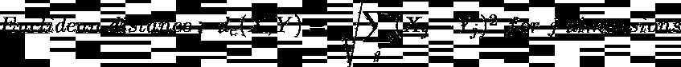
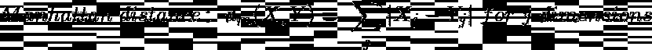
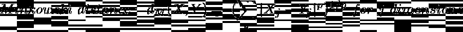
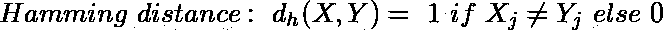
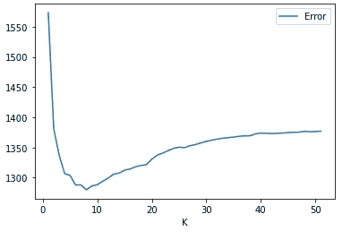

# ML 算法 1.03: K 个最近邻

> 原文：<https://medium.com/geekculture/ml-algorithms-1-03-k-nearest-neighbors-5f54470b5e30?source=collection_archive---------51----------------------->

[Source](https://unsplash.com/photos/fIMqGvVaATk?utm_source=unsplash&utm_medium=referral&utm_content=creditShareLink)

# 介绍

k 近邻是一个懒惰的学习者。它并不构建这样的模型。当要素具有不同的范围时，在计算距离之前有必要对要素进行缩放。

# 优势

1.  无需培训。
2.  非常容易解读。

# 不足之处

1.  需要找到最佳 K(邻居的数量)。随着新数据的添加，这种情况可能会发生变化。
2.  当数据非常大或者维数很大时，问题就出现了。这可以通过使用 kd 树和球树算法来解决。
3.  它对噪声数据很敏感。

# 距离度量

# 模型结构

需要注意的要点:

1.  我们需要规范化/标准化数字特征，并将分类特征编码为虚拟特征。
2.  如果预测数据是数字和分类特征的混合，我们只能对数字数据进行最小最大缩放。这是为了将值限制在与分类编码变量相同的范围内的[0，1]内。
3.  如果预测值都是数字，我们可以使用欧几里得距离、曼哈顿距离、米诺斯基距离或马哈拉诺比斯距离。
4.  如果预测值只是绝对的，我们可以使用海明距离。
5.  如果预测因子是数字和分类的混合，我们必须非常小心地选择距离度量。
6.  当数据具有非常高的维度时，我们会遭受维数灾难。在这种情况下，我们限制在闵可夫斯基距离中使用较低的功率。我们也可以求助于降维技术和特征选择。
7.  K 的最佳值可以通过绘制误差和 K 来找出。

Image by author

# 预言；预测；预告

新的观察结果被放置在训练数据的特征空间中。

## 分类

输出类是 n 个邻居的模态类。

## 回归

输出估计值是 n 个邻居的平均值。

> 当类的数量是偶数时，你应该保持邻居的数量为奇数，反之亦然，以避免混淆。

# 超参数调谐

*   **n_neighbors** :设置邻居数量
*   **砝码**:统一；距离:
    一致:所有点的权重一致
    距离:越近的点的权重越大，与它们的距离成反比
*   **算法**:算法构造的类型。
    kd-tree:将形成 K 维树(轴平行超平面)
    ball-tree:将空间划分为同心球体
    蛮力:将计算所有距离
*   **leaf _ size:**KD 树或 ball 树叶子中的点数
*   **p:** 闵可夫斯基度规的功率参数
*   **度量:**算法的距离度量
*   **metric_params:** 附加度量参数；像马氏距离的协方差矩阵

* * * * * * * * * * * * * * * * * * * * * * * * * * * * * * * * * * * * * * * * * * * * * * * * * * * * * * * * * * **示例代码:*

从 sklearn.neighbors 导入 KNeighborsRegressor 作为 K {或 KNeighborsClassifier}

knn =K(n_neighbors=5)

KNN . fit(X _ 火车，y _ 火车)

y_hat = knn.predict(X_test)

******************************************************************

# 参考

 [## sk learn . neighbors . kneighborsclassifier-scikit-learn 0 . 24 . 2 文档

### 实现 k-最近邻投票的分类器。了解更多信息。参数 n_neighborsint，默认值=5…

scikit-learn.org](https://scikit-learn.org/stable/modules/generated/sklearn.neighbors.KNeighborsClassifier.html#sklearn.neighbors.KNeighborsClassifier)