# 最大似然算法 1.09:梯度推进机器

> 原文：<https://medium.com/geekculture/ml-algorithms-1-09-1-gradient-boosted-machines-9abd09c4bdfe?source=collection_archive---------45----------------------->

Souce: [Shapelined](https://unsplash.com/photos/90siM5kmRbM?utm_source=unsplash&utm_medium=referral&utm_content=creditShareLink)

## 介绍

梯度推进机器是一种推进集成技术。增强算法性能更好，因为方差和偏差都可以通过仔细的超参数调整来控制。与 AdaBoost 中的树桩相比，GBM 使用浅层决策树。它们的预测/估计性能介于 AdaBoost 和 XGBoost 之间。GBM 的优点是性能比 AdaBoost 好，但机制比 XGBoost 简单。

## 模型

设 **X** 为具有 *m* 个样本和 *n* 个特征的特征集。设 **y** 为连续响应。

模型的参数表示为:

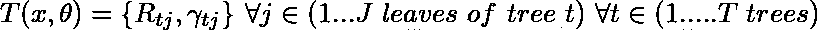

对于回归:

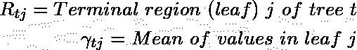

对于分类:

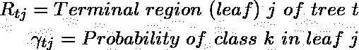

这里，通过 softmax 函数预测的类别 k 的概率由下式给出:

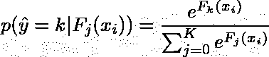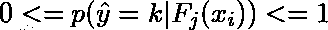

在 GBM 分类中，我们为 K 个类建立 K 棵平行树。

当我们创建第一棵树时，它只有根节点，这是回归问题所有响应的平均值。对于分类问题，根节点的 softmax 值是最初数据中所有类别中的类别 k 的分数。对于我们随后构建的每棵树 *t* ,我们尝试使树适合残差。在分类中，残差的计算方式与回归树中相同，因为实际上，我们正在为每个 k 类构建回归树，以匹配 k 类的概率。残差的计算方式如下:

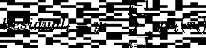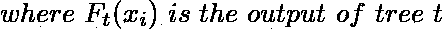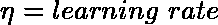

我们使用 MSE 或其他分裂标准**将树 *t* 拟合到残差，用于回归和分类**。与先前的树相比，发生了不同的分裂，因为该树正被拟合到残差，该残差正接近实际的 ***y*** 并且每个树都被构造。此后，我们必须优化损失函数 L，如下所示:

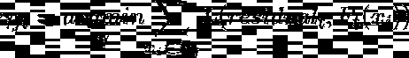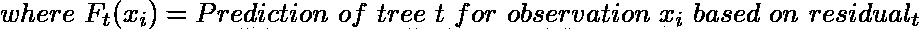

被提升的树很浅。对于每个残差，根据其特征(n 个特征)，它到达树 t 中的特定叶子。总共 **m** 个观察值(引导后)将到达叶子。所以，*一般来说*不止一个观测到达每片叶子。我们需要以连续的方式找到每片树叶的最佳值。

对于回归，我们需要找到损失函数 l 的梯度。回归的损失函数由 MSE 给出:

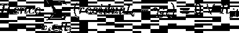

对于分类，我们需要找到类别 k 的损失函数 L 的梯度。GBM 分类问题的损失函数由多项式偏差给出:

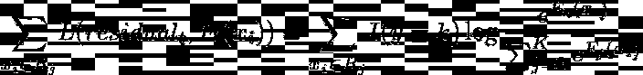

粗略地说，在树 t 中，对于类 k，在每片叶子中，γ是该类是 k 的概率。通过求解上面的方程，我们得到每片叶子的最佳γ。随着每棵树的构建，我们在损失函数的负梯度方向上移动 **L** 接近实际的 **y.**

在树 t 建立之后，树 t 输出估计值如下:

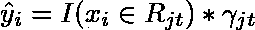

对于分类，具有最高概率的类作为输出给出。

下一棵树 t 的残差计算如下:

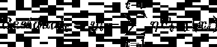

以这种方式构建树，直到树的最大数量被构建或者残差低于某个阈值ε。

## 预言；预测；预告

增强机器的最终预测是所有树的预测的总和，这些树由学习率加权。

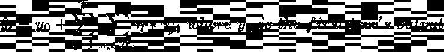

参考资料:

我参考了 Josh Starmer 在他的渐变增强视频中展示的一些材料。其余内容来自学校教授的课程材料。