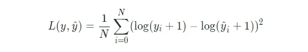
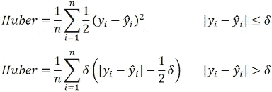
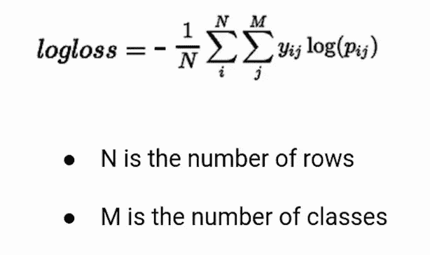

# ML 损失函数:综述

> 原文：<https://medium.com/geekculture/ml-loss-functions-an-overview-14dcca261504?source=collection_archive---------9----------------------->


Photo by [Franki Chamaki](https://unsplash.com/@franki?utm_source=medium&utm_medium=referral) on [Unsplash](https://unsplash.com?utm_source=medium&utm_medium=referral)

什么是损失函数？这就是我们如何发现我们的算法执行得好或不好，算法的主要目的是减少这种损失，以便使我们的预测接近实际值。

*在选择一个适合你的模型的损失函数之前，你应该理解问题陈述，你正在处理的数据和不同类型的损失函数！你显然可以自定义自己的损失函数。*

让我们来看看一些预定义的损失函数。大体上有两类:回归损失和分类损失。我认为重要的是理解*是什么？为什么？*和*如何？*各有所失。

# **回归损失**

# **均方误差(MSE)/均方根误差(RMSE)**

## 什么？

1.  在统计学中，均方误差(MSE)被定义为实际值和估计值之差的平均值。


2.当误差被平方时，MSE 单位阶高于误差单位。要得到同样的单位阶，要取 MSE 的平方根的很多倍。它被称为均方根误差(RMSE)。RMSE = SQRT(均方误差)

## 为什么？

1.  结果总是积极的。所以，不管预测值和实际值的符号是什么，你总是要把它最小化。
2.  平方意味着较大的错误比较小的错误导致更多的错误，这意味着模型因犯较大的错误而受到惩罚。
3.  为什么是方形？这是因为，否则，预测值有时会比实际值少，有时会比实际值多，这可能导致它们之间的负差和正差，从而导致不正确的求和，在最坏的情况下，有时会为 0！这让我们相信我们的模型是完美的！

## 怎么会？

1.  可在 Keras 中使用，方法是在编译模型时将“mse”或“mean_squared_error”指定为损失函数。

```
*model.compile(loss=’mean_squared_error’) model.compile(loss=’root_mean_squared_error’)*
```

2.来自 python 的 Sklearn 模块

```
*from sklearn.metrics import mean_squared_error
mean_squared_error(y_true, y_pred)*
*mean_squared_error(y_true, y_pred, squared=False) ;* if squared=False it returns RMSE instead of MSE
```

3.使用 Numpy 模块

```
*mse = np.square(y_true — y_pred).mean(axis=0)
rmse = np.sqrt(mse)*
```

# **平均绝对误差(MAE)**

## 什么？

1.  平均绝对误差(MAE)被定义为实际值和估计值之间的绝对差的平均值。


## 为什么？

1.  它平等地对待大错误和小错误。与 MSE 损失不同，对异常值不太敏感。

## 怎么会？

1.  可在 Keras 中使用，方法是在编译模型时将“mean_absolute_error”指定为损失函数。

```
*model.compile(loss=’mean_absolute_error’)*
```

2.来自 python 的 Sklearn 模块

```
*from sklearn.metrics import mean_absolute_error
mean_absolute_error(y_true, y_pred)*
```

3.使用 Numpy 模块

```
*mae = np.absolute(y_true — y_pred).mean(axis=0)*
```

# **均方对数误差(MSLE)/ RMSLE**

## 什么？

1.  首先计算每个预测值和实际值的自然对数，然后计算均方误差。这被称为均方对数误差损失，或 MSLE。



## 为什么？

1.  它只关心实际值和预测值之间的相对差异，或者说，它们之间的百分比差异。
2.  这意味着它将把小的实际值和预测值之间的小差异视为大的实际值和预测值之间的大差异。所以，举个例子，如果
    *实际= 30，预测= 20；那么 MSLE = 0.02861 和
    实际= 30000，预测= 20000；那么 MSLE = 0.03100，但是这里 MSE= 100000000*
3.  当目标值的范围很大时，即可以从 10 变化到 10000 甚至更大时，这很有用。

## 怎么会？

1.  可在 Keras 中使用，方法是在编译模型时将“均方对数误差”指定为损失函数。

```
*model.compile(loss=’mean_squared_logarithmic_error’)*
```

2.使用 Numpy 模块

```
*msle = np.sum(np.square(np.log(y_true+1) -np.log(y_pred+1))).mean(axis=0)*
and simliarly we can have, *rmsle = np.sqrt(msle)*
```

# **胡贝尔损失**

## 什么？

1.  Huber 损失 MSE 和 MAE 的组合



## 为什么？

1.  通过平衡 MSE 和 MAE，它提供了两个世界的优点。当误差较小时，它是二次型的。
2.  对较大的损失值使用 MAE 减轻了我们对异常值的重视，因此我们仍然可以得到一个全面的模型。同时，我们使用较小损失值的 MSE 来保持中心附近的二次函数。
3.  任何时候，当你觉得需要在给异常值一些权重之间取得平衡时，使用休伯损失，但不要太多。对于异常值对您非常重要的情况，使用 MSE！对于您根本不关心异常值的情况，请使用 MAE！

## 怎么会？

1.  编译模型时，通过将“huber_loss”指定为损失函数，可在 Keras 中使用。

```
*model.compile(loss=’huber_loss’)* or *model.compile(loss=tf.keras.losses.Huber())*
```

2.使用 Sklearn

```
*from sklearn.linear_model import HuberRegressor
huber = HuberRegressor().fit(X, y)*
```

3.使用张量流

```
def huber_loss_fn(y_true, y_pred, delta=1):
 error = y_true — y_pred
 is_small_error = tf.abs(error) < delta
 squared_loss = tf.square(error) / 2
 linear_loss = delta * (tf.abs(error) — delta/2)
 return tf.where(is_small_error, squared_loss, linear_loss)
```

# 分类损失

# 二元交叉熵损失

## 什么？

在二元分类中，我们预测 X 在第 1 类中的概率。


当观察值属于类别 1 时，公式的第一部分变为有效，第二部分消失，反之亦然，此时观察值的实际类别为 0。

## 为什么？

1.  它与目标值在集合{0，1}中的二元分类一起使用。然后，它根据与期望值的距离计算惩罚概率的分数。这意味着离实际值有多近或多远。

## 怎么会？

1.  在喀拉斯

```
model.compile(loss='binary_crossentropy')
model.compile(loss=tf.keras.losses.BinaryCrossentropy(from_logits=True))
```

2.在 Sklearn

```
**from** **sklearn.metrics** **import** log_loss
log_loss(*y_true*, *y_pred)*
```

3.在 Numpy

```
loss = -(y_true*np.log(y_pred)+(1-y_true)*np.log(1-y_pred)).mean()
```

# 铰链损耗

## 什么？

铰链损耗特别用于 SVM 模型或目标值在集合{-1，1}中的情况

```
hinge_loss = max(0, 1-y_true*y_pred)
```

## 为什么？

1.  在 SVM，我们有两个类-1 和 1，我们试图模拟决策边界。因此，预测值显示了与决策边界的距离。
2.  在这种情况下，如果一个类被预测为-1.6，而实际为-1。这意味着它远离决策边界，因此将没有损失。越靠近边界，其铰链损耗越大，并且如果在边界的错误一侧，铰链损耗将继续增加。

## 怎么会？

1.  在喀拉斯

```
model.compile(loss='hinge')
```

2.在 Sklearn

```
from sklearn.metrics import hinge_loss
hinge_loss(y_true, y_pred)
```

3.在 Numpy

```
loss = np.max([0.0, 1 - y_true*y_pred])
```

# 多类交叉熵损失/分类交叉熵

## 什么？

这是多类分类中使用的默认损失函数。



## 为什么？

1.  当我们有多个类而不是只有两个类时使用它，我们不是计算每个标签的二进制损失，而是计算所有类的分类损失。

## 怎么会？

1.  在喀拉斯

```
model.compile(loss='categorical_crossentropy')
```

2.在 Sklearn

```
sklearn.metrics.log_loss(y_true, y_pred, labels=[all_labels])
```

# 稀疏多类交叉熵损失

## 什么？

类别交叉熵和稀疏类别交叉熵都具有上面等式中定义的相同损失函数。两者之间唯一的区别是如何定义真理标签。…在稀疏分类交叉熵中，真值标签是**整数编码的**，例如，[1]，[2]和[3]等。，而在分类交叉熵中，它们是一次性编码的。

## 为什么？

1.  它用于有大量标签的情况，对它们进行一次性编码只会导致问题。

## 怎么会？

1.  在喀拉斯

```
model.compile(loss='sparse_categorical_crossentropy')
```