# ML 系列 7:伯努利朴素贝叶斯

> 原文：<https://medium.com/geekculture/ml-series7-naive-bayes-e740731a658a?source=collection_archive---------37----------------------->

ML 的概率方法&朴素贝叶斯不是贝叶斯

朴素贝叶斯是一种简单有效的算法，用于解决各种分类问题。它易于构建，对于大型数据集尤其有用。更重要的是，该模型引入了一种概率方法来理解机器学习。

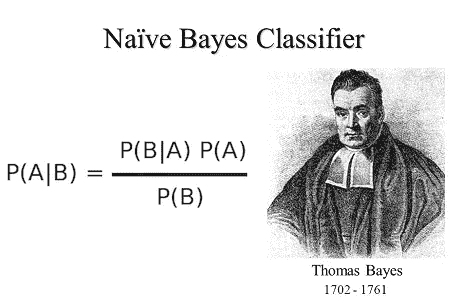

Father of Bayes’ Theorem

按照概率方法，假设我们有 n 个类别标签 y = {c1，c2，…cn}，ƛ是错误分类 cj 到 ci 的损失，x 是我们的样本。我们有条件风险

Risk is expected loss from classifying x to c.

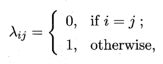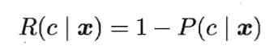

并试图找到最佳的 h: X -> Y，使整体风险最小化。h 是我们的分类器。

从上面的定义，我们可以看到关键是找到 **P(c|x)** 。求 P(c|x)有两种策略:**判别模型**和**生成模型**。给定 x，判别模型直接预测 c。(示例包括逻辑回归、决策树和 SVM)另一方面，生成模型使用贝叶斯定理转换 **P(c|x】**

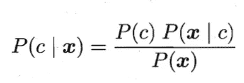

P(c) is prior probability. P(x|c) is likelihood.

# 从最大似然估计导出朴素贝叶斯

因为 P(x)与分类无关，而只是一个规格化器，所以我们现在忽略它。因此，我们的目标是找到最有可能使 P(c)P(x|c)最大化的 c ∈ {1…k}。用 d =属性的数量，并且在**属性条件独立性假设下，**似然函数为

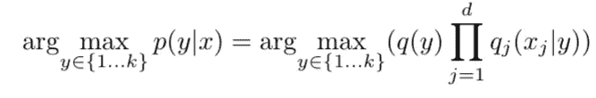

**In order to differentiate, I use q as probability sign for the right side. And use y in replacement of c.**

为了估计两个 q_s 的值，朴素贝叶斯使用 [**MLE(最大似然估计)**](https://en.wikipedia.org/wiki/Maximum_likelihood_estimation) **，**，它试图在参数空间中找到使似然函数最大化的点。

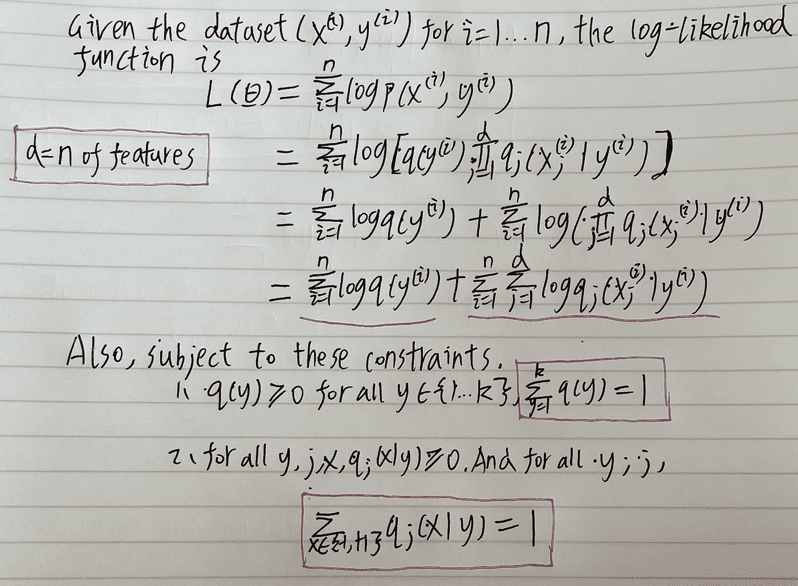

Maximize this function L to get optimal parameters

知道如何使用 MLE 是很重要的。现在评估分成两部分。由于它们互不依赖，我们可以简单地逐个最大化它们。

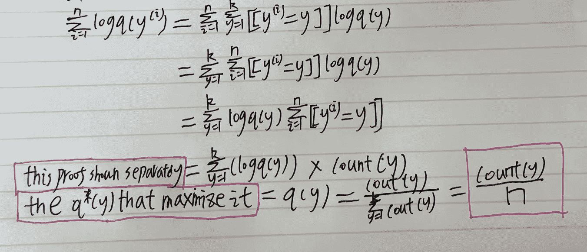

1st Part, *important note we define [[y^(i) = y]] to be 1 if they are equal, y^(i) is ith **class** of y.

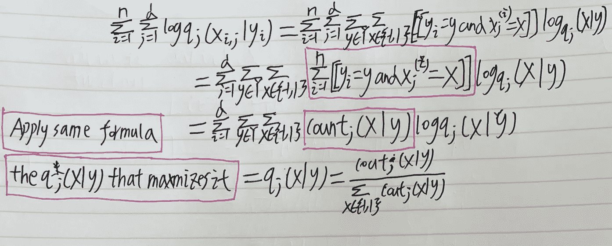

2nd Part

得到上述最终估计量的证明。两部分的最后一步。

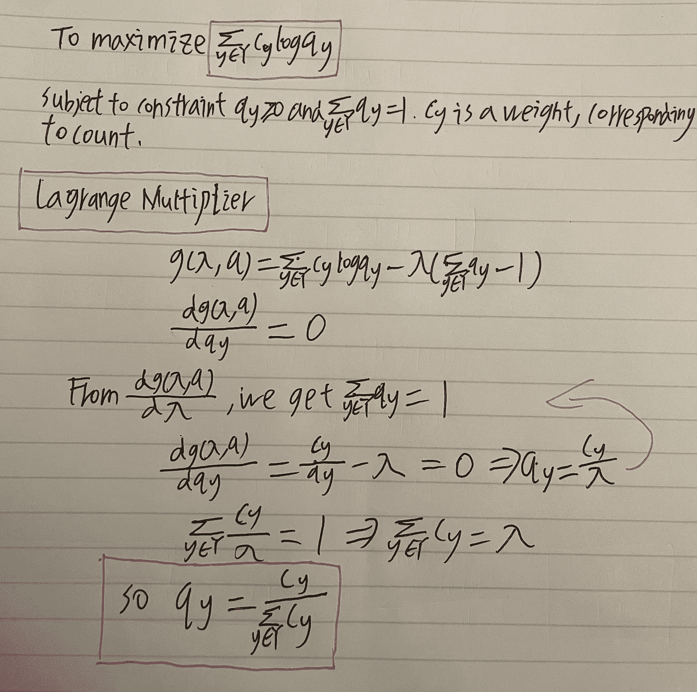

最终估算值为

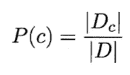

Prior Probability. D_c is number of class c in dataset D

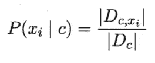

Posterior Probability. D_c,x is number of attribute x in D_c

统计推断中有两个学派:**频率主义者**和**贝叶斯。**你可能认为既然我们使用贝叶斯定理，朴素贝叶斯就是一种贝叶斯推断。**不是这样的**，因为它不做任何先验分布的假设，它使用最大似然法来推导它的参数。所以，这仍然是一个频繁主义者的推论。

正如您所看到的，最终的参数很容易计算，也很简单。因为算法的强假设**“属性条件独立性”和简单性**。它被命名为天真。以下是一些我觉得有用的资源:

1.  [朴素贝叶斯的使用](https://towardsdatascience.com/all-about-naive-bayes-8e13cef044cf)
2.  [贝叶斯和频率主义者的区别](https://www.behind-the-enemy-lines.com/2008/01/are-you-bayesian-or-frequentist-or.html)举例

# 面试问题

1.  如何利用拉格朗日乘数进行优化？
2.  MLE 怎么用？
3.  贝叶斯条件概率定理怎么用？
4.  频繁主义者和贝叶斯的区别，是什么造就了朴素贝叶斯频繁主义者？

**感谢您阅读这篇文章！希望这对你有帮助。如果你需要更多的信息，请告诉我。**