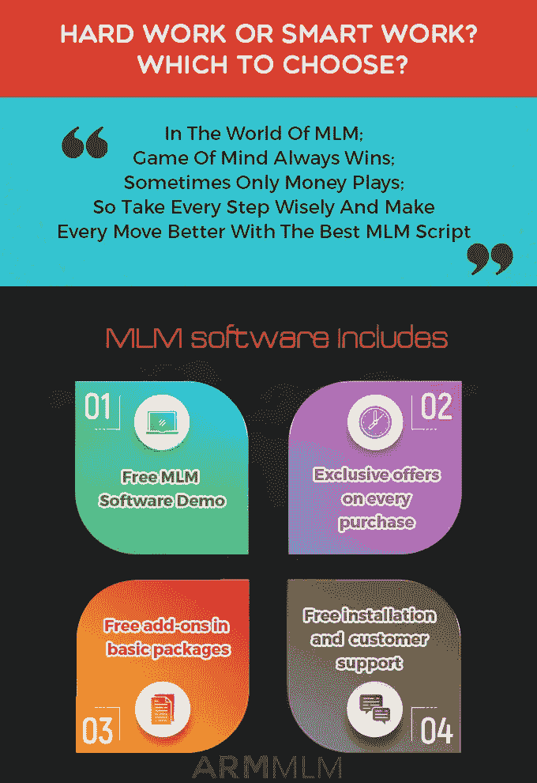

# MLM 软件在直销业务中的重要性

> 原文：<https://medium.com/geekculture/mlm-software-importance-in-direct-selling-business-e9a63ec63757?source=collection_archive---------25----------------------->

MLM 软件是一套在网络营销业务中实现人工操作自动化的程序。换句话说，它是管理 MLM 公司整个系统的软件。该解决方案使您能够跟踪和监控整个业务交易，如用户位置的状态、新条目、销售和推荐，并计算佣金和奖金。

MLM 软件的功能已经为市场上的人所熟知。他们真的很享受剧本给他们的网络营销业务带来的好处。下面列出了创业企业家应该具备的一些特征

*   用户化
*   电子钱包系统
*   移动响应
*   复制的网站
*   通信工具
*   多语言帮助
*   电子商务集成
*   多个支付网关

上述特性将使软件独一无二、高度灵活、可伸缩和可靠。佣金和奖金管理、图表、图表和文本、推荐系统、利用自动应答器的线索捕获和定制增加了选择此解决方案的另一个理由，以便您可以平稳高效地运营您的业务。建议为您的直销业务选择合适的 MLM 软件，因为市场上有大量的供应商。

在某种程度上，ARM MLM 软件公司十多年来在为多层次营销业务提供解决方案方面拥有丰富的专业知识。我们提供带有内置安全机制的低成本 MLM 软件，以满足贵公司的要求。我们为定制功能和服务提供了广泛的选项，您可以在购买前尝试免费演示。