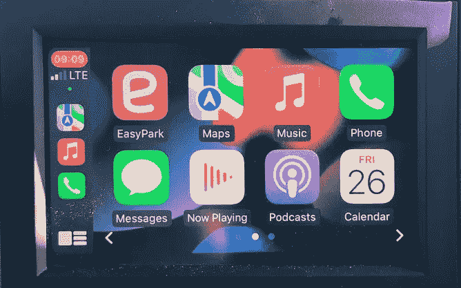
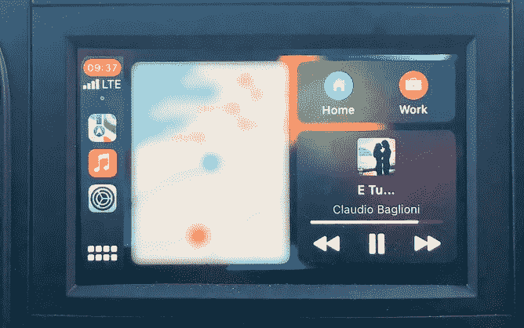

# 2022 年移动应用发展趋势

> 原文：<https://medium.com/geekculture/mobile-app-development-trends-2022-b4ed760cca3e?source=collection_archive---------7----------------------->

*根据资深* [*Android 开发者*](https://www.itmagination.com/career-paths/android)*Karlo Karagic，资深* [*iOS 开发者*](https://www.itmagination.com/career-paths/ios)*Andrej Krizmanic 的经验，我们整理了一份* [*手机 App 开发*](https://www.itmagination.com/services/custom-software-development/mobile-application-development)*2022 趋势清单。*

# 以声明方式构建用户界面

这种趋势随着“反应”( T21)的兴起而出现，或者更确切地说，是“反应当地”( T23)的兴起——而且这种趋势现在还会持续下去。但是让我们倒回去一点。什么是声明式(UI)编程？

网上有大量的文章和定义，但我们会尽力给你我们的理解。我们称之为建立在命令式 UI 之上的抽象层。它关心的不是如何构建 UI，而是你想构建什么。

使声明式 UI 构建如此流行的是状态和状态管理的问题。我们越来越倾向于状态不变的反应式编程。变异变量开始成为禁忌。因此，这就延伸到了声明式 UI 方法，在这种方法中，我们宁愿重新构建 UI 的一部分，而不是改变它们。

用声明的方式创建 UI，我们得到的一个好处是，为不同平台开发的[看起来很相似](https://betterprogramming.pub/from-react-to-swiftui-f08c29b7d3b)，因此，可以毫不费力地从 [Swift UI](https://www.itmagination.com/technologies/swift) 切换到 Compose，甚至是 Flutter 和 React Native(鲍勃·罗斯称之为“快乐的小意外”)。

在 Android 和的情况下，声明性已经在这里了，但你还不算太晚。许多人甚至仍然不愿意尝试。我们是来告诉你试一试的。这需要一点时间来理解，但这是一次有趣而愉快的经历。

# 多平台开发

这一节的目的不是告诉您去寻找本机或多平台，而是向您展示移动技术的发展方向。因此，这将是一个高层次的市场状况概述。

让我们从原生移动应用程序开发开始。维护你的作品会更加昂贵，需要更多的工作，因为你需要在两个完全不同的代码库上工作。在有些情况下，这几乎是你唯一的选择，或者说是最好的选择。例如，对于利用本机 API 和硬件的应用程序以及高性能应用程序(大量动画或大量渲染或两者兼有)，本机是更好的解决方案。这也适用于可以转向许多不同方向的应用程序，并且可能会超出多平台解决方案的某些功能范围(例如，实现增强现实功能的社交媒体应用程序)。我们想要展示的最后一个用例是当您需要对本机应用程序进行最终控制时。除了使用原生工具之外，没有其他方法可以定制应用程序。

**React Native** 是跨平台开发领域的巨头。工具中包含的小部件有点简单，但是有很多库可以帮助你。然而，Airbnb 团队有一篇关于他们为什么放弃 React Native 的精彩文章，我们建议您阅读。即使有一家大公司离开了生态系统，大众化的列车也没有停下来或慢下来。React Native 不会很快消失，因为你可以很容易地在基于 web 的 React 社区中找到人才——目前是 web 开发领域最受欢迎的工具。

下一个工具是[T5【旋舞】T6](https://www.itmagination.com/ebooks/developing-performant-mobile-apps-native-cross-platform-pwas)。它与 React Native 并列为多平台领导者。它受到开发人员的喜爱，有谷歌的支持，并包含高质量的功能。它的缺点是，它与 React Native 完全相反。它使用 Dart 而不是 JavaScript/TypeScript。这是一种专门用于 Flutter 的语言，其他用例逐渐消失。这种语言无论如何都不差，但它未能接近现代语言的流行程度，这是一个遗憾，因为它设计得很好，感觉好像 Java 和 JavaScript 有一个孩子。

最后，我们有了新的玩家，**科特林多平台移动(KMM)** 。它对事物的看法有点不同。与 Flutter 不同，它的目标是只共享核心应用程序逻辑，而 UI 代码则委托给本地语言。这意味着你用 KMM(用 Kotlin)编写你的应用程序的逻辑，然后当你进入 UI 部分时，你将 iOS 功能委托给 [Swift](https://www.itmagination.com/blog/is-objective-c-still-relevant-in-2022-or-is-swift-the-only-real-choice) ，Android 委托给 [Kotlin/Java](https://www.itmagination.com/blog/kotlin-vs-java-for-android-development-is-it-time-to-abandon-java) ，如果你打算开发桌面/web，则构建多平台。构建多平台是另一个工具。它也是用 Kotlin 编写的，并且基于新的 Compose 技术，这种技术现在正作为下一个 UI 工具在 Android 世界流行。

Native 不会去任何地方，但多平台仍然会施加压力。对于各种平台的共享代码，质量工具从来没有这么多选择。这里的趋势是支持至少尝试一种多平台解决方案，以跟上时代的步伐。此外，有了一些经验和计划，也许你甚至可以同时利用它们(诀窍是知道什么时候使用什么)。

# 可折叠设备—害怕吧

随着可折叠设备销量的飙升(2020 年至 2021 年增长 300%)，市场似乎正在发出一个明确的信号，表明下一件大事将会是什么。Android 目前处于领先地位，三星领先。谷歌甚至发布了名为 Android 12L 的新版本操作系统，以更好地适应平板电脑和可折叠设备。还没有多少应用程序针对可折叠文件夹进行了优化，因为我们仍然不太确定如何正确地利用它们。不要在这里进入太多的细节，看起来这些新工具仍然没有出现在开发者的脑海中，但有了这些销售数字，我们肯定可以期待用户开始要求对他们的可折叠设备提供更好的支持。

有人一定会问:苹果呢？当然，谣言总是有的。街上的消息是，我们可以期待在 2025 年的某个时候推出苹果可折叠设备，尽管关于可折叠类型的信息存在矛盾(屏幕后面是否有铰链)。专利并不是观察未来产品的万无一失的方法，但它值得一提。苹果目前持有**多项**折叠相关专利。移动开发者最感兴趣的是这家总部位于库比蒂诺的公司将在软件领域做些什么。也许我们看到的是 iOS 和 iPad OS 的组合？也许我们会得到伊弗多斯？

开发商应该感到担忧。这不仅为我们提供了大量新的屏幕尺寸，还提供了全新的宽高比和大量不同多任务窗口的组合(以及状态之间的转换)。完整的名单还不是最终的，因为我们现在只有少数型号。我们也可以期待新的和野生的设计和想法。

# 应用商店(慢慢)开放

你可能已经听说过发生了一些诉讼，T2 的 Epic Games(堡垒之夜的家伙)认为苹果和谷歌在堡垒之夜的每笔交易中强制收取 30%的费用，这显示了垄断行为。 Epic Games 输掉了这场官司，但确实做出了一些改变。不久之后，苹果和谷歌都将该应用赚取的第一个 100 万美元的费用从 30%降至 15%。你可以在这里详细阅读[。他们这样做当然不是因为他们的利他主义，而是为了改善他们的形象，缓解来自监管机构的压力。然而这并没有完全奏效，因为监管机构正在加倍努力让苹果公司允许应用程序的侧装。](https://www.theverge.com/2021/9/12/22667694/epic-v-apple-trial-fortnite-judge-yvonne-gonzalez-rogers-final-ruling-injunction-breakdown)

我们为什么要关心？谷歌从一开始就允许这样做，所以苹果开始这样做并不是完全不合理的。此外，用户购买了设备，因此应该被允许用它做他想做的任何事情，即使这是一种风险(99%的用户永远不会这样做)。在极少数情况下，侧面加载应用程序是有意义的，这是为了规避位置限制或当它是唯一的选择。那么，让我们回到堡垒之夜的案例。他们所做的是允许堡垒之夜只能通过他们的网页安装在 Android 设备上，这样他们就避免了向谷歌支付应用程序内每笔交易的 30%的费用。抛开所有的考虑，苹果不太可能开放 App Store 哪怕一点点，除非他们将被法律或法院强制。奇迹有时会发生，所以也许“我公司”会改变主意？

我们如此习惯于通过谷歌和苹果商店发布我们的应用程序，以至于我们可能会忘记事实并非如此。它们带来了一些价值，但我们应该对该领域目前的双头垄断感到满意吗？用户习惯于直接去他们的应用商店安装应用。也许他们会习惯安装 PWAs？

# 进步的网络应用终于有机会了？

渐进式网络应用至少和 iPhones 一样古老。史蒂夫·乔布斯在展示苹果公司的第一款手机时提出了这样一个想法。

尽管那是很久以前的事了，但它们从未真正起飞过。然而，这种情况可能会发生变化，因为今天的设备比我们过去的设备强大得多。此外，人们对可安装网站的兴趣似乎接近历史最高水平。[至少谷歌的数据表明了这一点。](https://trends.google.com/trends/explore?date=all&geo=US&q=%2Fg%2F11bzxympx6)

旧的，也许被遗忘的播放器帮助所有开发者将他们的网站打包成 PWAs，并分发到谷歌的 Play Store，微软的 Windows Store 和 Meta 的 Quest。会是什么公司呢？微软！你可能会认为将 web 应用程序分发到应用程序存储库是一个合适的解决方案。你大错特错了！Twitter、脸书和抖音等公司都这样做了，并取得了令人瞩目的成果。 [Tinder 将他们的应用程序从 30MB 减少到 2.8MB](/@addyosmani/a-tinder-progressive-web-app-performance-case-study-78919d98ece0) ，[阿里巴巴在 Android 上的流量增加了 30%](https://developers.google.com/web/showcase/2016/alibaba)，而[安装了 Trivago 应用程序的人在该网站上的参与度增加了 150%。](https://www.thinkwithgoogle.com/intl/en-gb/marketing-strategies/app-and-mobile/trivago-embrace-progressive-web-apps-as-the-future-of-mobile/)

iOS 是怎么回事？我们这里没有好消息。不幸的是，尽管他们是第一个提出这个想法的人，但他们现在是采用这项技术的最大阻碍者之一。[iphone 上的 Safari 和其他网络浏览器不支持安装应用](https://caniuse.com/web-app-manifest)(“A2HS”)。在实现最新的网络标准方面，它也落后于 Firefox 和 Chrome。因此，很难指望这家加州公司会很快开始支持渐进式网络应用。

pwa 像一股被遗忘的时尚潮流一样卷土重来。对它们的兴趣达到了顶峰，因为开发这些应用的公司可能会瞄准现代操作系统，这些操作系统在所有平台上都具有相同的界面，更容易安装，而且(也许最重要的是)没有佣金。

# 用户隐私

许多公司依赖基于用户数据的商业模式。过去，用户被蒙在鼓里，不知道具体是哪家公司在收集什么数据。

脸书(说 Meta 会更好，但只是隐私和数据收集标签更贴合“脸书”这个名字)和谷歌(Alphabet，推理同上)可能是迄今为止最臭名昭著的。我们将在这里提到苹果，因为它对 way 有着直接的影响，不仅仅是移动行业。让我们诚实地说，可以说我们经常发现苹果站在对立面——倡导隐私，并将其作为市场中的一个关键差异化因素。

最近发生了什么事，让你觉得这是一个戏剧性的转变？

让我们从脸书开始。在 2019 年的 F8 活动上，马克·扎克伯格在活动开幕式上谈到了隐私，并发表了“未来是私人的”的声明。这话出自脸书首席执行官之口，令许多人感到意外。Meta 及其所有产品正朝着一个进化的方向前进，这将带来值得信赖和透明的隐私保护。

后来，当苹果公司要求最终用户批准与 IDFA 进行跨站点跟踪时，这似乎是一个有影响的变化。但这并没有停止。当“隐私标签”被引入时，阅读关于什么应用程序拥有最长的已收集数据列表的故事是很有趣的。许多臭名昭著的应用程序打破了两周更新一次的惯例，在发布新的更新之前花了大量时间，并在隐私标签中暴露了他们的跟踪做法。

我们知道这句话已经有一段时间了，“如果你不为产品付费，那么你就是产品”，但现在似乎连谷歌都意识到用户知道这一点，并迅速效仿，推出了以隐私为中心的功能(Play Store 上的隐私标签、隐私仪表盘等)。).

*移动开发者现在比以往任何时候都更需要考虑仅在真正需要时访问私人信息，并透明地公开应用程序可能访问的所有敏感信息。*

# 蓝牙已死，蓝牙万岁！

1998 年，一种新的短距离无线技术——蓝牙技术问世。有趣的是，它的名字来自维京国王哈拉尔德“蓝牙”戈姆松，它原本是一个占位符名称，但历史阻碍了它的发展。这项技术的标志是国王的首字母。

蓝牙过去和现在都是移动短距离通信的事实标准(NFC 是短距离通信的一个荣誉称号)。在很长一段时间里，它有一些问题，主要是范围和功耗。当然，随着时间的推移和技术的发展，它变得越来越好，直到 2010 年，我们引入了蓝牙智能，或者如你所知的蓝牙低能耗(蓝牙 LE；BLE)。幸运的是，他们去掉了这个名字，以免让人混淆。

Bluetooth 4.0 或 Bluetooth LE 损失了一些带宽，但在功耗方面获得了显著改善(使用的功率减少了 100 倍)。以至于它成为许多物联网设备的可行解决方案。它也给电池寿命至关重要的移动设备市场带来了巨大的变化。从现在开始，我们将蓝牙(或蓝牙 classic——我们将使用这个术语来更明确地表达)和蓝牙 LE 放在同一个伞下。

这一发展一直持续到 2016 年，当时我们获得了蓝牙 5.0，其范围和速度都有所增加。现在有了一个选择，以牺牲范围为代价获得与蓝牙经典对等的速度，反之亦然。这使得蓝牙变得更好，但对于音频部分来说，这还不够。这就是为什么蓝牙 Classic 仍然被广泛用于音频流(手机和 BT 扬声器)。直到 2021 年 5.3 版本发布(2020 年宣布，2022 年披露)。现在，我们有了一个可行的解决方案，通过蓝牙 LE Audio 进行音频流传输。它还提供了额外的功能，如一对多和多对一广播(Auracast)。

那么，作为一名开发人员，您为什么要关心呢？更好的特性带来了更好的 API。换句话说，它让我们的生活变得更轻松。在 Android 上，Bluetooth LE 为常见的使用情况(心率、骑自行车、运动等)提供了内置配置文件。)而过去只有一个预定义的配置文件可供选择。线程现在也为我们处理了，我们不再需要使用广播接收器了。这项技术更好用。

我们可能永远不再使用蓝牙 Classic 了。它更耗电，覆盖范围更小，带宽与 LE 相同。Bluetooth LE 将继续发展，我们很高兴看到它会带来什么。它可能会在很长一段时间内成为这一领域的标准，但请记住一项名为 Passive-Wi-Fi 的新技术，它可能会带来一场革命。

# 汽车操作系统

让我们看看目前的情况，自 2014 年苹果宣布 CarPlay 以来，车内体验已经发展了很多，一年后谷歌向我们展示了 Android Auto。这两种是我们将手机上的移动体验直接传输到汽车上的信息娱乐系统的两种方式。重要的是，这种体验是由我们的手机控制的，无论我们是使用 iPhone 还是 Android 手机。汽车制造商在很大程度上采用了这些技术。我们习惯于只需一个连接，无论是连接到 USB 还是拥有无线连接的特权。我这里说的特权，是因为无线选项还没有有线连接那么普遍。

因此，我们可以使用我们“喜爱的”语音助手来控制我们的音乐、播客、打电话、启动公园计时器等。

但是今年，我们看到了地平线上的许多新事物。除了 Android Auto，谷歌还一直在开发 Android Automotive OS，这是一个开源操作系统，旨在用于汽车仪表盘。虽然它是在 2017 年宣布的，但在新车中仍然很少看到。关键的区别在于，安卓汽车操作系统是安装在汽车仪表板上的操作系统，不需要安卓手机就能工作。它可以更好地集成车辆数据，甚至可以控制你的空调，座椅加热等。以及访问您选择的音乐和导航应用程序。许多制造商签署了协议，将于 2023 年开始销售使用 Android Automotive 的车辆。这份名单超越了奥迪、沃尔沃、雷诺-日产-三菱、福特、本田、宝马、通用汽车等..

看起来苹果也在考虑与车辆数据进行更紧密的集成，以控制空调、座椅加热等功能。考虑到这一点，他们宣布了 CarPlay2，作为对 CarPlay 功能的几乎所有方面的升级。这当然会迫使汽车制造商适应这些新的特点和变化。我们期待在 2023 年末推出支持 CarPlay2 的新车。新功能将支持在所有车辆屏幕上扩展 CarPlay 体验，以及访问车辆数据、控制车辆设置等。这将包括显示小工具，用手机(可能还有智能手表)解锁汽车，以及与朋友分享你的数字车钥匙。

CarPlay dashboard in 2018 Citroën Berlingo

基本汽车信息娱乐系统的日子似乎屈指可数了。开发者需要为全新的沉浸式汽车体验做准备，这给了他们很多工作。

# 绿色科技？

你可能已经注意到，这个世界正试图通过更加关注我们产生的废物来重新思考我们的生活。移动设备也不例外。我们已经开始看到充电器从盒子里消失(利润的增加只是一个令人高兴的意外)，并且更加关注从废弃/旧/坏的设备中提取稀有矿物。

绿色进化与软件有什么关系？三星刚刚宣布将支持其最新设备的操作系统更新**4 年，而不是 2** 。我们已经看到，随着操作系统和安全更新，谷歌像素长期以来一直是可行的设备。随着移动市场的成熟，手机不会每隔几年就自动过时，人们会继续使用它们。这些更新将让他们有更多的时间远离垃圾填埋场。

不要在这里忽略苹果，他们在操作系统更新，设备生命周期和回收方面比安卓好得多。使用 5 或 6 年的 iPhones 是完全正常的，这在 Android 领域非常罕见。

*未来是绿色的，人们更换设备的频率会大大降低。在为你的应用程序设置目标操作系统时，请考虑这一点。*

# 通知——苹果和谷歌正在努力解决通知混乱的问题

还有比实现期望更好的感觉吗？当我们期待一个包裹被投递，或者当我们等待送披萨的人，或者当我们只是希望有人(或者至少是尽可能多的人)给我们一个喜欢的东西。你手机上熟悉的通知声可能会在我们眼中产生火花。因此，我们开始使用手机，为我们的应用程序提供通知。直到我们得到太多。然后呢？我们有麻烦了。用户对通知感到不安，并开始阻止它们。也有一些人会被通知的声音淹没:比如那些患有自闭症的人。

幸运的是，谷歌和苹果都理解这种情况，并给我们提供了通知选项，旨在找回我们曾经的兴奋感。

在 Android 上，最近最受欢迎的变化可能是默认的通知选择机制。现在，只有在用户同意后，应用程序才能发送通知。不再打扰你了。

苹果可能更臭名昭著，因为它对应用程序如何打断用户采取了更保守的方法。最近，我们得到了一些受欢迎的变化，如:能够直接通知通知摘要；一个只允许在我们定义的时间打断我们注意力的地方。拥有不同类型的“请勿打扰”(称为焦点模式)允许我们在允许特定应用程序通知时设置不同的规则。我们可以专注于工作时间，允许 Skype 和团队通知只在工作时间打扰我们，但不允许我们在家时打扰。

此外，如果一个通知太频繁地妨碍我们，我们有方便的选项显示通知，以改变我们的同意和暂停中断。最重要的是，如果我们觉得受到太多的干扰，并希望减少通知的数量，我们已经在“屏幕时间”标签中有通知统计数据在等着我们。

如今，通知也可以变成实时的，并继续实时显示更新的内容。假设你在等披萨外卖。在 iPhone 上，通知可以自我更新，而不是用无数的后续通知淹没用户。在 iOS 上，该功能被称为“实时活动”。

*用户现在可以更好地控制何时从哪些应用程序获得什么通知。我们不必被不断的叮当声所困扰，在某些情况下，还会伤害我们。*

# 可访问性——每个人都受欢迎

你大概能猜到，但 iOS 总体上是比 Android 更量身定制和设计的体验。这也适用于可及性区域(尽管这种情况正在改变)。

传统上，iOS 领先**光年**，但 Android 正在缩小差距。[现在甚至有一些 Android 上可用的功能还没有在苹果生态系统中实现。](https://www.itmagination.com/blog/360deg-it-check-9-android-12-beta-signal-mobile-coin-chinese-tech-go-117-ddos-cloudflare)尽管如此，iOS 在这方面仍然更加精致和直观，而 Android 则凭借其众多的 OEM 和定制选项而变得更加全面。

用户怎么说？他们更喜欢 iOS。请记住，Android 手机的数量远远超过 iPhones，而每个平台上需要特殊辅助工具的用户数量是相同的。这个数字在过去更偏向于苹果，这证明了 Android 在这方面做出了一些改进。

最后，由于这两个最受欢迎的平台为我们提供了更多帮助残疾人的工具，所以我们开发者应该尽我们所能实现这些功能。尽你最大的努力，记住，如果你不使你的应用适应每个人，将会有成千上万的人，如果不是数百万的话，会很乐意使用你的竞争对手的应用。

*操作系统(Android 13 或 iOS 16)的每一个新的主要版本都会带来新的功能和创造性的解决方案(如自动图像描述和门检测)以及对现有功能的不断改进。未来似乎是每个人都可以实现的，而不仅仅是身体健全的人。*

*原载于*[*https://www.itmagination.com*](https://www.itmagination.com/blog/mobile-app-development-trends-2022)*。*