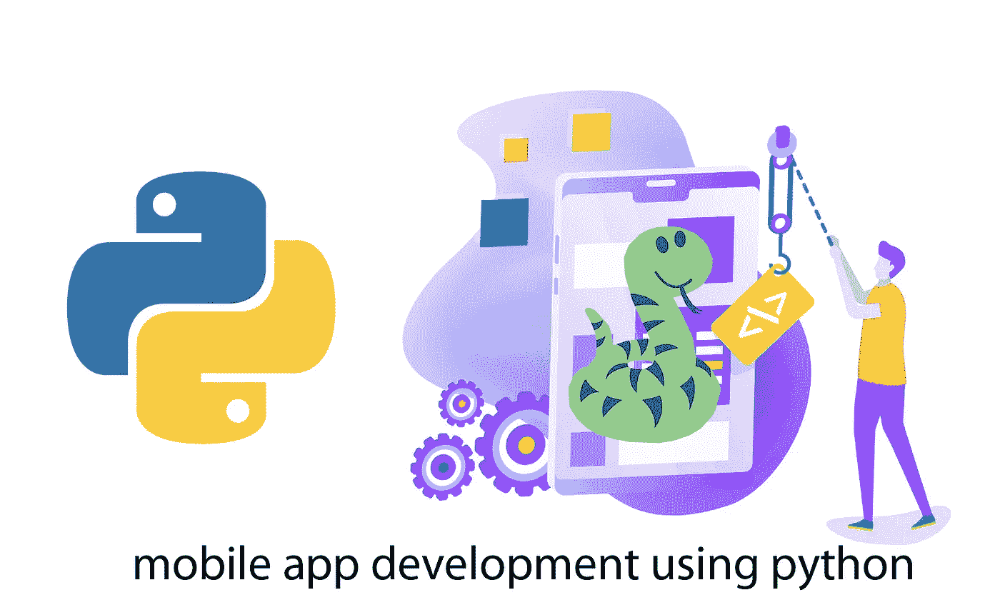
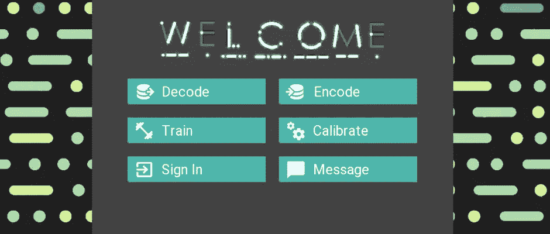
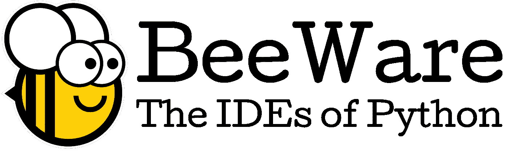

# 使用 PYTHON 开发移动应用程序

> 原文：<https://medium.com/geekculture/mobile-app-development-using-python-3c130c954783?source=collection_archive---------2----------------------->

## 使用 python 语言和框架开发移动应用程序的介绍。

*应用程序开发*现在是增长最快的技术之一，它的统计数据正呈指数级增长，而*应用程序开发*已经见证了许多新的框架和软件被引入这个领域，其中一些已经确立了它们的统治地位。如果每一种语言都在某个领域显示了自己的存在，那么 **Python** 会如何被甩在后面。在本文中，我们将讨论使用 **Python** 开发应用程序。Python 生态系统拥有种类繁多的库，几乎涵盖了软件开发的所有方面。Python 以其灵活性和易于理解的能力而闻名。但是用 python 开发应用程序的问题是，原生 Android 和 iOS 软件不能理解这种语言，因此，有许多框架和库被用来在原生 Python 应用程序之间架起桥梁。让我们更深入地研究，并试图获得关于这个话题的每一点信息。



Image: [https://pythondevs.org](https://pythondevs.org/)

# **为什么是 PYTHON？**

Python 已经成为近年来最流行的语言之一，python 在软件开发方面的各种优势如下:

*   **更快的编程性能:**

Python 程序由解释器直接执行，即不需要编译器，不像其他语言，这使它成为编程的首选语言，因为它用更简单的方法捕捉错误，执行时间更少。

*   **测试驱动开发兼容性:**

Python 使得应用程序的原型创建更加容易。它完全支持原型开发，并允许您通过重构原型来直接构建应用程序。Python 在多种操作系统上兼容，因此可以跨多种平台用于开发和运行代码。

*   **各种库:**

Python 允许您根据自己的需求从其广泛的高效且健壮的库中选择模块，而无需大量编码。

*   **强势社区:**

社区在语言的发展中扮演着重要的角色，对于 python 来说，社区是非常积极的，他们提供了无数的指南、教程和文档，这让它占了上风。

# **应用开发框架:**

## **基维:**



Kivy 将自己宣传为一个开源的 **Python** 库，用于跨平台 UI 应用的快速开发。它使开发者能够跨各种平台开发 python GUIs，如 Windows、Linux、iOS、Android。它有一个基于 OpenGL 构建的图形引擎，因此它可以在必要时处理 GPU 绑定的工作负载。但问题又来了，当 React Native 和 Flutter 拥有像 Material io 和 React libraries 这样漂亮的库来开发有吸引力的 ui 时，为什么开发者要选择 Kivy 呢？Kivy 有一个定制的 UI 工具包，提供文本标签、文本输入表单、按钮等版本。因此，这些工具并没有使用本地用户界面控件来表示，但是该工具确保了您的*移动应用程序在不同平台之间的*一致性和灵活性。它还有一个 python-to-android 项目，可以让你将 python 应用移植到 **Android** 。它有一个类似于 **iOS** 的工具包，但是 iOS 工具包只能和 **Python 3.4** 一起使用。

如果你想使用一个基于非本地 UI 的应用，那么 Kivy 是最好的选择之一，因为它只需要 python 的知识，而不需要 Swift 或 Kotlin 这样的平台同心语言。

示例:

```
$ python3 -m venv my_kivy_project$ source bin/activate$ python -m pip install kivyfrom kivy.app import Appfrom kivy.uix.button import Buttonclass TestApp(App):def build(self):return Button(text='Hello World')
```

> 关于在 **Kivy** 框架中在[https://realpython.com/mobile-app-kivy-python/](https://realpython.com/mobile-app-kivy-python/)上开发应用的详细文章

## **蜂产品:**



BeeWare 是另一个流行的框架，它允许您用 Python 编写应用程序并编译它们，以便在各种

操作系统，包括 macOS、Windows 和 Linux GTK，以及 Android 和 iOS 等移动平台。BeeWare 的知识库定期更新。它为您提供了工具和抽象层，您可以使用 Python 编写自然的桌面和移动应用程序。Beeware 和 Kivy 的主要区别在于，Beeware 使用原生 UI 工具包，而 Kivy 使用自定义 UI 工具包。由于 Beeware 使用原生 UI 工具包，因此，您可以在跨平台上构建令人惊叹的、具有原生感觉和外观的 UI。使用 BeeWare 项目的一个主要缺点是它相对较新，因此需要时间来建立一个强大的社区。

示例:

```
$ python3 -m venv .env$ pip3 install briefcase$ briefcase newFormal Name [Hello World]: PyythonApp Name [Hello]: TestAppBundle Identifier [com.example]: com.thepepper.writeHelloProject Name [First Project]:Author [Developer Name]: <Your Name>Author's Email: <Your Email>Application URL:Select one of the following:[1] Python[2] PySide2[3] NumPy[4] NoneGUI Framework [1]: 1
```

*   **公文包工具**允许您为特定的本地应用程序创建项目样板，并通过提示您输入关键信息来提供一种交互式方式来帮助您创建项目。

> 上使用 **Beeware** 框架开发应用程序的详细文章
> 
> https://dev . to/pystar/build-a-native-ui-Android-app-with-python-and-beeware-16me

# **结论**

Python 已经达到了更高的高度，并且在最近几年中正在快速增长，因此在未来几年中可以在企业和产品基础上用于开发应用程序。 **Odoo** 和 **Tryton** 是用 Python 开发的众多流行企业应用中的两个。