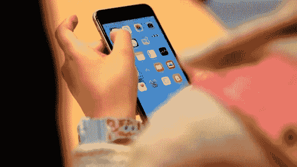
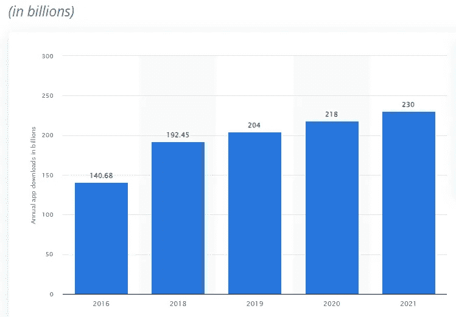
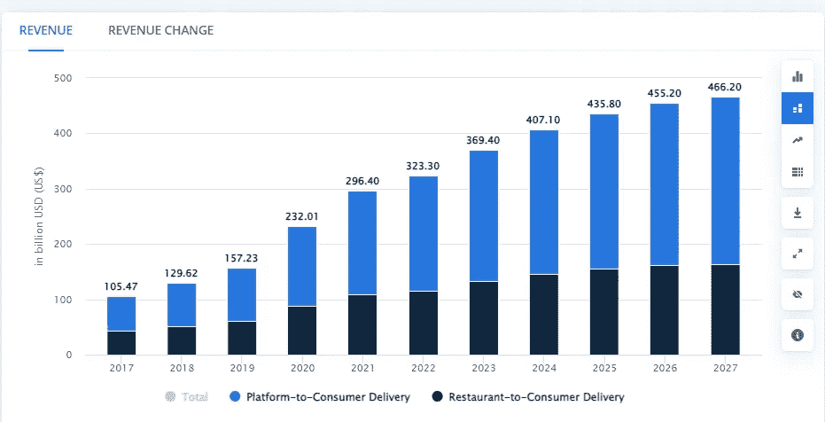

# 2022 年初创企业的顶级移动应用创意

> 原文：<https://medium.com/geekculture/mobile-app-ideas-2022-cebe9cfa8ad4?source=collection_archive---------13----------------------->

Mobile App Ideas

随着普通人生活方式的改变，这些趋势也在逐渐改变。随着技术领域的扩大，商业磁铁急切地等待着为他们的业务明智地使用它们。就像我们需要的每一个内容的结果都在几毫秒内出现一样，人们期望他们在日常生活中经历的每一项工作都是如此。无论是组织日常活动、听音乐、玩游戏、看视频，还是使用网上银行，我们都越来越依赖我们的移动应用程序。无论你在手机上做什么，我们 88%的时间都在使用手机应用程序。

***这里是全球移动应用下载总量的统计，***

App Downloads

根据一项研究，到 2023 年底，移动应用程序预计将产生超过 9350 亿美元的收入。随着移动应用程序复杂性的增加，这一数字在未来几年还会增加。构建一个移动应用程序可能是你业务的良好开端。以下是开始使用移动应用的最佳创意。

# 成功创业的移动应用理念

## 餐厅预订应用程序

顾客走进酒店时，排队会很快给他们带来麻烦。甚至在到达目的地之前就安排好自己的位置会让他们感到舒适。如果有一个家庭聚会，他们可以放心提供最舒适的区域由酒店用餐。尽管呼叫设备会因为配音而造成很多不必要的混乱。但是，虽然它出现在移动应用程序中，但它无法被其他模式击败。通过这种方式，可以进一步添加许多功能，以防他们在需要长时间准备的情况下可以添加食物。

**例子:** Reserve，EazyDiner，Dineout。

## 送餐应用

比起远行，在你最喜欢的地方，在你最喜欢的地点，吃光你最喜欢的食物更令人愉快。同样，你也可以给你所爱的人一个惊喜，把他们的食物送到他们家。它允许人们不用去参观就可以尝试新的食物点和他们的食物。让人们从不同的地方购买各种套餐，并在送餐应用程序的帮助下创建新的套餐。让人们能够及时了解酒店或镇上的最新动态。随着新电影在电视上热播，人们可以把食物送到家里。所以是时候用 [**UberEats 克隆 App**](https://appticz.com/ubereats-clone) 建立一个类似 UberEats 的 App，开始一个送餐业务了。

例子:Zomato，UberEats，Swiggy，Grubhub。

## 健身追踪应用

整天跑步去工作是为了过好健康的生活，在那些跑步的人忘记去跑步或散步。他们无法弥补这一点，但可以建议他们定期使用健身跟踪应用程序，在日常生活中定期处理数据，从而改变他们的健康状况。这个健身跟踪应用程序会根据他们的身体状况向他们提出建议，在他们需要检查时立即进行。在世界各地出现一些不稳定的情况后，人们意识到，现在人们更多地使用健身跟踪应用程序。

***例子:*** *Google fit、Runtastic、Sworkit、workit、FitNotes、三星健康*

## **杂货配送应用**

随着 [**杂货递送应用**](https://appticz.com/instacart-clone-app) 的引入，去市场购买杂货的日子已经一去不复返了，这使得人们可以在自己舒适的家中轻松地购买杂货。每个零售商店，超级市场到小杂货店都有一部手机来增加他们的销售额。

示例: *Instacart，Bigbasket*

## 在线购物应用

当你阅读这篇文章的时候，你会得到一些你非常需要的产品的建议，但是你没有时间去买，在这种情况下你只需要点击几下就可以买到。如今，网上购物——电子商务的用户数量庞大。您可以更多地了解同类产品和提供这些产品的各种品牌。与此同时，当你购物时，你将拥有世界上所有的时间。人们可以在你需要的时候离开。他们可以像那样检查所有的错别字比较。

***例子:*** *Flipkart、亚马逊、易贝、InstaCart、脸书市场、Chewy。*

## 房地产移动应用

需要更多信息作为数据的业务。当你离这个地方很远的时候，你会觉得你在一个你愿意卖或买的地方。有了数据扇区，你就可以得到最新的信息。24/7 了解详情无需等待介绍人或中间人进行买卖。据调查，大约 70%的人愿意购买 80%的人的房产。这样你就可以缩小受众范围，并且可以买到没有任何非法文件的产品。

**【Apartments.com】例子:** *Redfin、Trulia、Zillow、、Realtor、Xome 拍卖。*

## 旅游和旅行应用

旅行时没有任何预订中断。你所需要的是在探索城市之前，探索旅行和住宿的方式。对旅行者来说，这是最令人吃惊的事情。其中一个好处是你不需要把你的钱兑换成所需国家的货币。你可以在旅行开始前检查旅行和住宿的价值。这样你就可以省下钱，以防在兑换货币时有所损失。

***例子:*** *猫途鹰，MakeMyTrip。*

阅读: [***如何搭建度假租房 App？***](https://appticz.com/how-to-create-a-vacation-rental-website-like-airbnb)

## 度假租赁应用

如果你正在一个著名的国家度假，但你需要住在一个像家一样的地方来体验这个国家。还有像 Airbnb 这样的度假租赁应用，你可以通过它预订一部分或部分房子。它还被那些住在出租房子里的人使用，或者它可以是你自己的，愿意留下房子的一部分出租，你可以通过这个度假租赁应用程序实现这一点。 [**Airbnb 克隆网站**](https://appticz.com/airbnb-clone) 可以帮助你在短时间内搭建自己的度假租房 app。

***举例:*** *Airbnb，Booking.com，Vrbo*

## 出租车预约 App

因为在自然界中，在世界各地预订出租车乘车是如此普遍。随着人口的增长，不可能每个人都拥有自己的汽车。如果他们想搬出去，他们选择舒适区旅行作为第一选择，这样预订出租车是最常见的过程。因此，出租车预订市场处于领先地位。 [**创建一个类似优步**](https://appticz.com/uber-clone) 的出租车预订应用程序来增加你的收入

***举例:*** *优步，奥拉*

## 加密交换应用

在 [**密码交易**](https://appticz.com/cryptocurrency-exchange-script) 领域，有大量的交易推出。如果有可信的加密交换，人们永远不会离开这些应用程序。有了你巨大的用户界面，你可以把人们从其他人中间拉出来。他们是加密用户中最需要的人。这可以通过产品的前一个数据来暗示，这一个应用使用户经常与他们交互。因此，在 [**币安克隆**](https://appticz.com/binance-clone-script) 的帮助下，推出一个像币安这样的密码交易所，可以成为密码业务的一个良好开端。

***举例:*** *币安、比特币基地、帕克斯富*

## NFT 市场应用程序

至于预订和购买的其他用途，这个 NFT 市场应用程序允许用户铸造，购买，销售他们的任何平台的 NFT 产品。因为这种情况本质上不利于通过到世界各地旅行来做生意，即使他们可以这样做。很多人都对在 NFT 这样的在线平台上做生意感兴趣。这是一个创业的好时机，也是一个平台的好时机，而不是在未来高流量和竞争的时候创业。

***举例:*** *币安 NFT，Opensea*

## 加密钱包应用

就像我们在数字加密钱包中使用不同的打字卡进行货币交易一样，我们可以在一个容易访问的地方添加所有的加密资产。由于有许多加密货币，拥有许多加密货币的用户值得拥有这种类型的钱包。如今，加密技术的崛起令人震惊。其效果将在未来经历。Trustwallet 是一个吸引大量客户的加密钱包。在 Trust Wallet Clone 的帮助下构建自己的 [**加密钱包**](https://appticz.com/cryptocurrency-wallet-development) 。

***举例:*** *信任钱包*

## **在线学习和教育应用**

有很多学生愿意在家学习，即使他们的父母愿意在家学习，因为不稳定的疾病恶性情况——例如 covid 情况。当他们在最舒适的地方时，他们可以花自己的时间学习。在 [**电子学习应用**](https://appticz.com/udemy-clone) 的帮助下，学生可以在家学习。

他们仍然可以立即与员工交谈。如果可以晚一点上课，他们就不会缺课。他们还可以在实时会议中分享自己的想法并进行互动。

***举例:*** *Coursera，Udemy，Byju 的*

## 体育博彩应用

预测对于使用这个应用程序来说是足够的。只有通过他们的预测，人们才能赚钱。他们可以选择比赛的选手并下注。他们可以赚取他们正在使用的投注类别。使用该应用程序最重要的一点是，它在许多国家都是合法的。

***举例:*** *梦 11*

## 结论

这些是在 2022 年启动你的业务的顶级移动应用创意。你知道吗，89%的应用程序创业失败都是因为糟糕的开发团队。完美地执行移动应用的想法和有一个不可思议的想法一样重要。要成功实现你的想法，你需要一个经验丰富的 [**应用程序开发伙伴**](https://appticz.com/) 。与合适的开发团队一起让您的应用取得成功