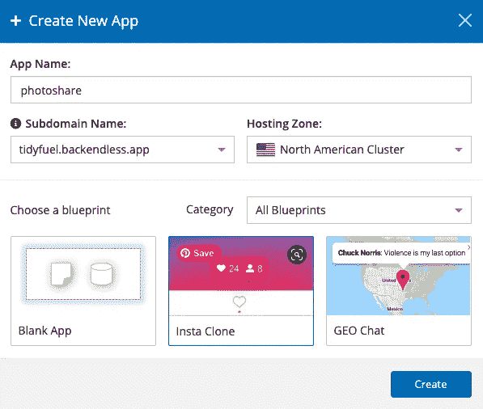
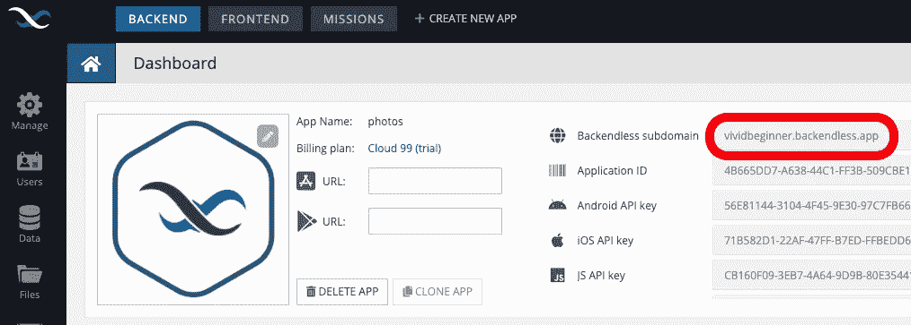
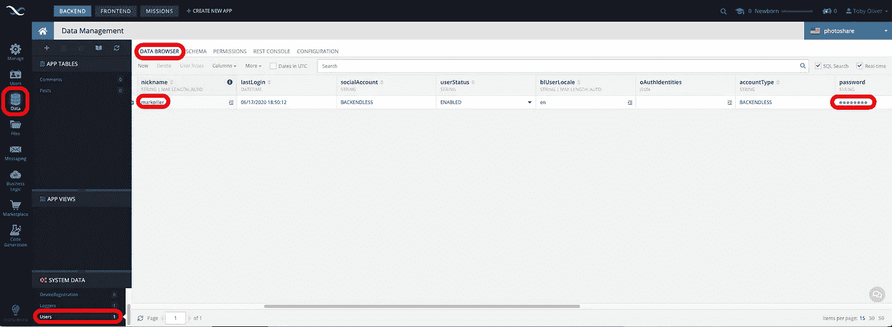
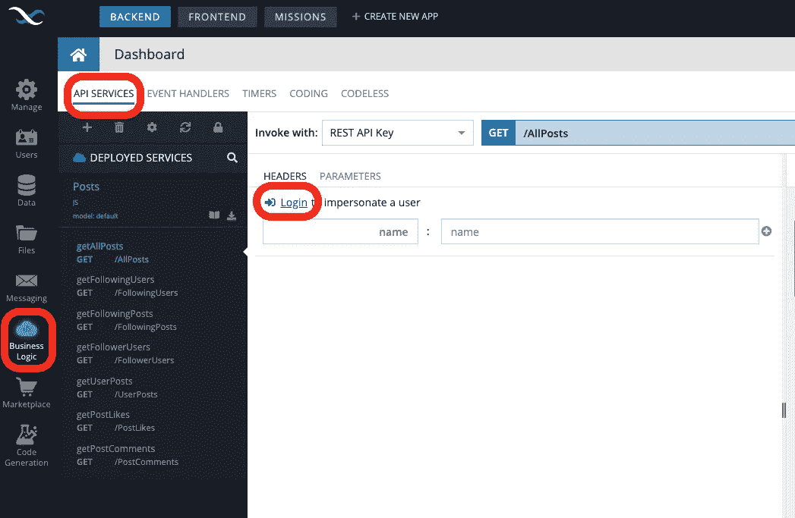
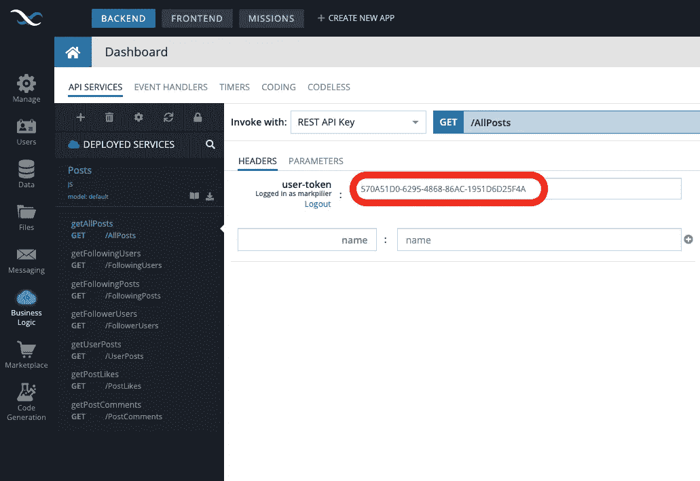
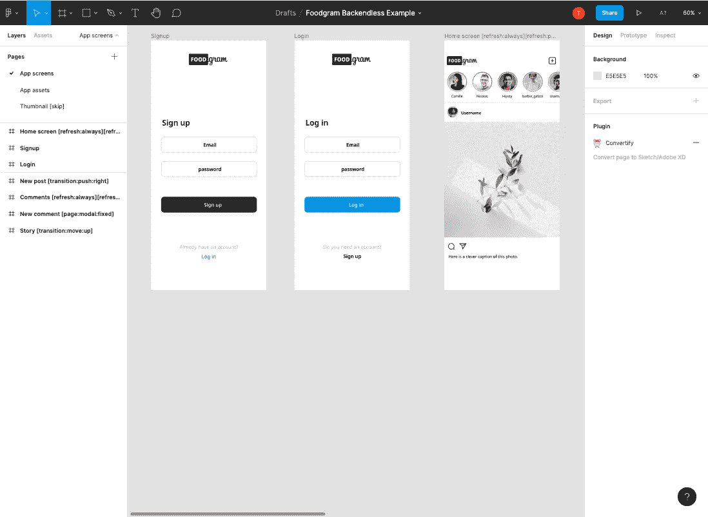

# 使用 Figma 和 Backendless 的移动无前端照片共享应用程序

> 原文：<https://medium.com/geekculture/mobile-frontendless-photo-sharing-app-using-figma-and-backendless-c950cf5207c8?source=collection_archive---------28----------------------->

> 更新—自本文撰写以来，Bravo 增加了一个自定义登录功能，简化了授权请求。你可以在这里了解更多:[https://docs . Bravo studio . app/integrations/user-authentic ation/custom-authentic ation-beta](https://docs.bravostudio.app/integrations/user-authentication/custom-authentication-beta)

Backendless([https://backendless.com/](https://backendless.com/))是一个很棒的服务，它允许你将你的应用前端连接到他们的 API、数据库和服务，可以为你提供大量的功能(有太多的功能需要学习 back endless 已经将学习过程游戏化，使它变得更有趣[https://back endless . com/introducing-back endless-missions-learn-get-rewards/](https://backendless.com/introducing-backendless-missions-learn-get-rewards/))。

Bravo Studio([https://Bravo Studio . app](https://www.bravostudio.app/?utm_source=referral&utm_medium=medium&utm_campaign=Mobile%20Frontendless%20photo%20sharing%20app%20using%20Figma%20and%20Backendless))非常擅长从你的设计文件中即时生成原生移动应用，以连接 Backendless 等后端系统。在本教程中，我将向您展示如何连接 Backendless 的照片共享应用程序示例应用程序到 Bravo Studio 的 Adobe XD 中的 Foodgram 模板。

# a)在 backendless 创建后端

1.  注册 Backendless 并创建一个名为`photoshare`的应用程序，选择 insta 克隆蓝图，然后点击`create.`



2.你现在应该在你的后面无尽的仪表板。我们现在需要获得项目中所有 API 的基本 URL。方法是将`/api`添加到你的子域中。在这个例子中，基本 URL 变成了[https://vividbeginner.backendless.app/api](https://vividbeginner.backendless.app/api)。



3.虽然 Backendless 现在为我们设置了一个测试用户，但我们需要重新设置密码。转到`Data`选项卡，点击`System Data`中的`Users`表，然后点击`Data Browser`，然后将用户昵称更改为`testuser`，密码字段更改为`backendless`，并点击 enter 确认(您可能需要滚动查看)。



4.最后，我们需要获得一个 api 键来设置 API。点击`Business Logic`选项卡，然后点击`API Services`，最后点击`Login`。将弹出一个窗口，您可以在其中键入用户名:`testuser`和密码`backendless`(您之前设置的)进行登录。



登录后，复制用户令牌并将其粘贴到某个地方，因为我们稍后会在 API 中用到它



你已经有了设置 b 组所需的一切。

# b)在 Bravo 中设置设计

1.  注册 Bravo—[https://projects.bravostudio.app/signup](https://projects.bravostudio.app/signup?utm_source=medium&utm_medium=medium&utm_campaign=backendless_foodgram)
2.  打开这个 Figma 文件并复制它:[https://www . fig ma . com/file/TB b5 jozipfupwwtr 49 v1 ekh/food gram-back endless-Example](https://www.figma.com/file/Tbb5JoZiFPUWwtR49v1ekH/Foodgram-Backendless-Example)
3.  将您的 Figma 文件版本导入 Bravo。



# c)在 Bravo 中设置 API

我们需要添加 Bravo 中 Backendless 需要的所有 api 请求:

1.点击左侧 Bravo 中的`Data Library`

2.点击`New Collection`

3.点击“自定义 API”并将其命名为`Foodgram with Backendless`

4.单击请求旁边的+按钮，为以下 6 个请求中的每一个添加新请求(注意来自上面的步骤(A)2。

*   注册

```
Name: Signup
Type: POST
Request URL: <Base Request URL>/users/register
Headers : None
Parameters: None
Body (JSON):
{  
  "nickname" : "${login}",
  "password" : "${password}"
}
```

*   注册

```
Name: Login
Type: POST
Request URL: <Base Request URL>/users/login
Headers : None
Parameters:
  Key = login, Value = testuser
  Key = password, Value = backendless
Body (JSON): 
{
 "login" : "${login}",
 "password" : "${password}"
}
```

输入上述内容后，点击该请求的蓝色`send`按钮，获取样本数据，以便为该请求设置接收到的数据。

确保勾选了`.data.user-token`字段，然后在`Selected Data`选项卡中将字段名称更改为`user-token`。我们可以在其他请求中引用这个名称作为变量，以允许请求通过身份验证。

*   添加帖子

```
Name: Add post
Type: POST
Request URL: <Base Request URL>/services/Posts/Post
Headers : Key = user-token, Value = ${user-token}      
Parameters: None
Body (JSON): 
{
  "caption" : "${caption}",
  "image_url" : "${image_url}"
}
```

*   获取所有帖子

对于这一步，我们将需要来自步骤(A) 4 的用户令牌，以使我们能够突出显示我们需要的数据。

```
Name: Get all posts
Type: GET
Request URL: <Base Request URL>/data/Posts?sortBy=created%20desc
Headers : Key = user-token, Value = ${user-token}
Parameters: Key = user-token, Value = <User Token from step (A)4>
Body: None
```

输入上述内容后，点击该请求的蓝色`send`按钮，获取样本数据，以便为该请求设置接收到的数据。

确保在`Received data`面板中勾选了以下字段:`.data[]`、`.data[].objectId`、`.data[].description`、`.data[].image`。然后在所选数据窗格中将`.data[].objectId`字段的名称改为`post-id` 。(注意此名称`post-id`需要保持一致，即**而不是** `post_id`贯穿整个查询，因为应用程序使用它来引用特定的帖子进行评论等)。

同样复制响应中的`.data[].objectId`的数据，并粘贴到某个地方，因为我们将在下一步中需要它。

*   添加评论

```
Name: Add comment
Type: POST
Request URL: <Base Request URL>/services/Posts/Comment
Headers : Key = user-token, Value = ${user-token}
Parameters: 
  Key = user-token, Value = <User Token from step (A)4>
  Key = comment, Value = Test Comment
  Key = post-id, Value = <data[].objectId from the previous step>
Body (JSON): 
{
  "text": "${comment}",
  "postId": "${post-id}"
}
```

一旦你输入了上面的内容，点击这个请求的蓝色`send`按钮，创建一个测试注释来帮助注释设置。

*   获取帖子评论

```
Name: Get comments for a post
Type: GETRequest URL: <Base Request URL>/services/Posts/PostComments?postId=${post-id}Headers : Key = user-token, Value = ${user-token}
Parameters: 
  Key = user-token, Value = <Auth Token from step (A)4>
  Key = post-id, Value = <data[].objectId from the previous steps>
Body: None
```

输入上述内容后，点击该请求的蓝色`send`按钮，获取样本数据，以便为该请求设置接收到的数据。

确保在`Received data`窗格中勾选了以下字段:`.data.comments[]`、`.data.comments[].objectId`、`.data.comments[].text`。

现在所有的 API 都已经在 Bravo 中设置好了，我们只需要将它们连接到设计中。

# d)将 API 绑定到 Bravo 中的设计

现在我们有了 Bravo 中的 API，最后一步是将它们连接到应用程序设计。使用 Bravo 中的 Backendless 应用程序进入 Foodgram，这样您就可以看到所有屏幕。

1.注册

点击`Signup`屏幕编辑该屏幕的绑定，选择`Foodgram with Backendless`集合，然后选择`signup`请求

*   在`Select Visual Elements`列表中点击`username`元件，并将其连接到`Content Destination`部分右侧绑定面板中的`login`。这将把输入字段绑定到将在请求中使用的变量。
*   点击`password`元件，并将其连接到右侧绑定面板中的`password`
*   将`Response Actions — on success`改为`Go to Page — Login`。
*   将响应操作—失败时更改为文本为'`Signup Failed`'的`Show Alert`

2.注册

点击`Login`屏幕编辑该屏幕的绑定，选择`Foodgram with Backendless`集合，然后选择`login`请求

*   在`Select Visual Elements`列表中点击`username`元件，并将其连接到`Content Destination`部分右侧绑定面板中的`login`。这将把输入字段绑定到将在请求中使用的变量。
*   点击`password`元件并将其连接到右侧绑定面板中的`password`
*   将`Response Actions — on success`改为`Go to Page — Home Screen`。
*   将响应行动—失败时更改为文本为'`Login Failed`'的`Show Alert`

3.主屏幕

点击`Home`屏幕编辑该屏幕的绑定，选择`Foodgram with Backendless`集合，然后选择`Get all posts`请求

*   在`Select Visual Elements`列表中点击`Post list`元件，并将其连接到右侧绑定面板中的`Data`。这将为列表中的所有项目重复这个容器元素，因此我们可以为每个项目绑定内容。
*   点击`**image`元素并将其连接到内容绑定中的`image`。
*   点击`**caption`元素，将其连接到内容绑定中的`Description`。

4.新帖子屏幕

点击`New Post`屏幕编辑该屏幕的绑定，选择`Foodgram with Backendless`集合，然后选择`Add Post`请求

*   在`Select Visual Elements`列表中点击`**image upload`元素，并将其连接到`Content Destination`部分右侧绑定面板中的`image_url`字段。这将把输入字段绑定到将在请求中使用的变量。
*   点击`**caption`元件，并将其连接到右侧绑定面板中的`caption`
*   将`Response Actions — on success`改为`Go to Page — Home screen`。
*   更改响应行动—失败时，发送文本'`Upload Failed`'至`Show Alert`

5.评论屏幕

点击`Comments`屏幕编辑该屏幕的绑定，选择`Foodgram with Backendless`集合，然后选择`Get comments for a post` 请求

*   在`Select Visual Elements`列表中点击`Comment list`元件，并将其连接到右侧绑定面板中的`Comments`。这将为列表中的所有项目重复这个容器元素，因此我们可以为每个项目绑定内容。
*   点击`**caption`元素并将其连接到内容绑定中的`Comments Text`。

6.新评论屏幕

点击`New Comment`屏幕编辑该屏幕的绑定，选择`Foodgram with Backendless`集合，然后选择`Add Comment`请求

*   在`Select Visual Elements`列表中点击`**comment`元素，并将其连接到`Content Destination`部分右侧绑定面板中的`comment`字段。这将把输入字段绑定到将在请求中使用的变量。
*   将`Response Actions — on success`改为`Go to Page — Comments`。
*   将响应行动—失败时更改为文本为“`Comment Failed`”的`Show Alert`

# 测试

您现在应该能够在 Bravo Vision 中测试您的应用程序，注册，然后登录，添加图像并对其进行评论。

当你添加内容时，你可以通过查看后面的表格来检查它的工作情况。

玩得开心，如果遇到困难，请告诉我们。

b 队