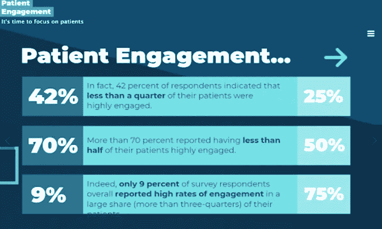
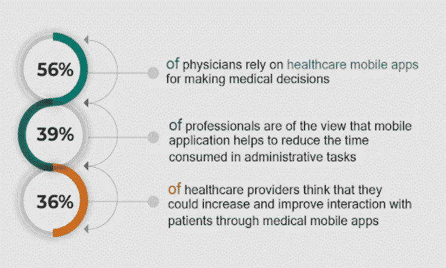
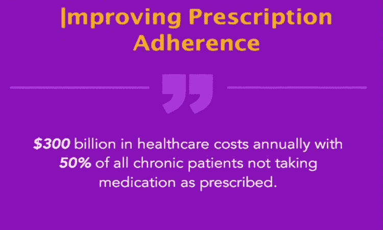
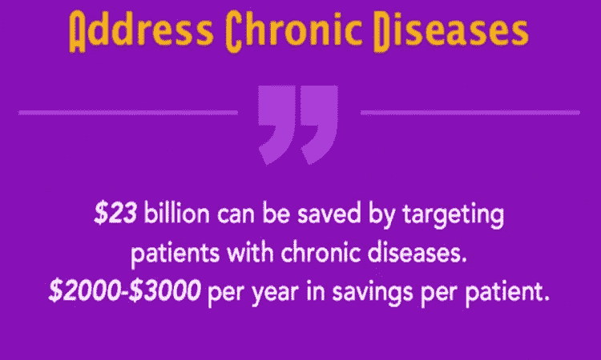
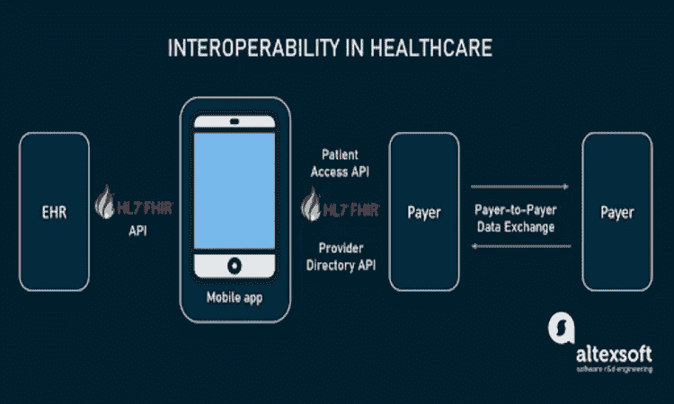
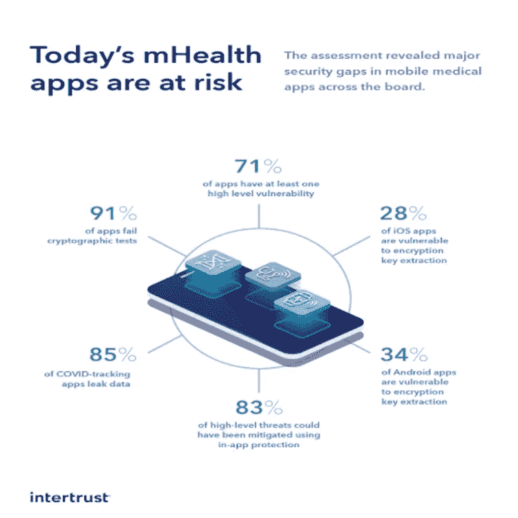
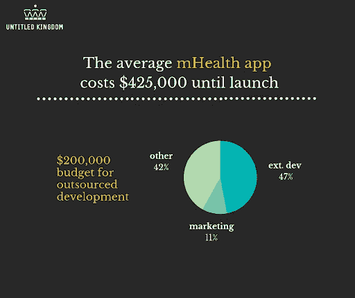

# 2022 年的移动医疗应用:主要优势和挑战

> 原文：<https://medium.com/geekculture/mobile-healthcare-apps-in-2022-top-benefits-challenges-eac0f415e269?source=collection_archive---------2----------------------->

2018 年，**全球移动医疗应用市场**的价值为 283.20 亿美元，到 2023 年，**将达到 1023.5 亿美元，同期 CAGR 为 29.30%** 。

目前，市场上大约有 **35 万个数字健康应用**。移动设备和应用的涌入正在重新定义医疗保健行业，推动着医生、护士、办公室助理、医疗技术人员和其他临床支持专业人员的发展。这种广泛的市场渗透将在未来几天促进移动应用的采用。

([Source](https://cdn.vigyanix.com/site/wp-content/uploads/a-revolution-in-the-Making-how-mobile-applications-are-evolving-healthcare-n-.png))

随着移动医疗保健应用程序日益占据主导地位，医院现在正在雇佣[医疗保健应用程序开发公司](https://www.pixelcrayons.com/healthcare-software-development-services) 来提供高质量的医疗服务。如果做得正确，适当的规划可以带来惊人的好处，而且没有陷阱。

那么，想知道医疗保健应用程序的优势及其开发挑战吗？继续读下去，找到你的答案。

# 移动医疗应用的主要优势:

## 1.通过健康知识普及和预防保健提高患者参与度和护理水平:

(s[ource](https://tglv8lyxesoiyue1wzi0cmgt-wpengine.netdna-ssl.com/wp-content/uploads/2018/01/CC180108-3.png))

大多数医疗保健提供者认识到让患者参与他们的护理和提高健康素养以预防或延缓慢性疾病的重要性。根据世界卫生组织(世卫组织)的报告，“积极改变生活习惯的患者更有可能成功控制慢性疾病。”

在这种情况下，移动设备的直接好处是不言而喻的。在这里，我也列举了几个:

*   患者可以在方便的时候，在家舒适地访问和监控他们的医疗记录和处方细节。
*   医疗保健提供商可以通过饮食计划或锻炼应用程序的实用建议，提供一种保持健康生活方式的简单方法，从而在患者中推广预防保健。
*   由于移动应用程序的离线功能，即使没有互联网连接，患者也可以访问健康相关信息。

## 2.通过促进人口健康管理降低医疗保健成本:

越来越多的公司，如 Walgreens Boots Alliance，Inc .、CVS Health Corp .、Medtronic PLC 和高通人寿保险公司，正在投资人口健康管理(PHM)计划以改善患者的结果。

**移动医疗应用在该场景中的优势如下:**

*   通过为患者提供疾病管理和慢性病自我护理的入门级培训，医疗保健提供商可以提高护理质量，促进患者自主。
*   凭借随时随地在移动设备上管理健康记录的灵活性，医疗保健专业人员将能够花更多的时间与患者相处，而花更少的时间处理文书工作。
*   凭借远程监控功能，医疗保健提供商可以通过移动应用程序跟踪患者的进展，这有助于早期检测和及时干预，以控制慢性病。

## 3.通过提供触手可及的实时数据做出明智的决策:

[(source)](https://dafq4moetmy65.cloudfront.net/cdn/ff/57TtEd0fSg0zapA4iCg8kW-_u_rRpvGWKkeA2LUJ5O0/1551444241/public/inline-images/0-3_1.jpg)

在大数据分析的世界中，信息是新的货币，即时访问医疗保健相关数据和预测性见解可以帮助公司做出更好的决策。

**为医疗专业人员提供实时数据的优势:**

([Source](https://cdn.vigyanix.com/site/wp-content/uploads/a-revolution-in-the-Making-how-mobile-applications-are-evolving-healthcare-n-.png))

*   医生和其他医疗保健专业人员在治疗患者时可以做出数据驱动的决策。他们可以及早发现症状，实时制定治疗计划，并为患者提供更好的护理。
*   例如，使用移动设备访问电子医疗记录(EMR)的内科医生可以将患者数据实时传输到中央 EMR 系统。它使他们能够在单个屏幕上查看患者信息，与患者的护理人员交流，并提高设备之间的互操作性。

**向消费者提供实时数据的好处:**

*   消除医生就诊时将个人健康数据手动输入电子健康记录(EHR)的麻烦。无论何时咨询医疗保健专业人员，消费者都可以轻松地将医疗记录上传到移动设备上。
*   对面临药物相互作用或副作用挑战的患者很有帮助，因为他们可以实时获取有关药物潜在有害反应的信息。这有助于他们在服药前做出明智的决定。
*   随时随地获取信息使消费者能够对自己的健康负责。例如，患有流感的人可以在移动健康应用程序上跟踪他们的症状，并立即咨询医生。

## 4.通过消除障碍，更好地坚持治疗计划

([Source](https://cdn.vigyanix.com/site/wp-content/uploads/a-revolution-in-the-Making-how-mobile-applications-are-evolving-healthcare-n-.png))

帮助患者坚持治疗计划对于临床试验和最终提供更好的结果至关重要。对这些计划的依从性很大程度上取决于患者的参与度、对技术的舒适度和易用性。

**移动健康应用对坚持性的好处:**

*   通过接收电子提醒，提醒他们即将到来的约会或到期的药物治疗，患者可以继续他们的日常活动，而不必担心错过治疗。
*   移动应用程序帮助患者跟踪和记录他们的健康数据，他们可以与医疗保健提供商或护理人员分享这些数据，以改善患者的疗效。
*   这些应用程序还提供药物相互作用检查器，让消费者了解特定药物如何协同工作，以及它们可能会出现什么副作用。
*   患者和护理人员可以使用移动设备存储和管理医疗记录，如病史、药物处方和检验结果。它有助于消除在旅行或自然灾害中丢失健康记录的风险，这种风险在世界某些地区经常发生。

## 5.更好地监控临床研究和患者结果:

在一个越来越关注 R&D 医疗保健的世界，移动健康应用已经成为一个有前途的技术平台，有助于监控药物开发临床研究的质量。

**移动健康应用在临床试验中的优势:**

*   临床研究组织(cro)可以使用移动应用程序来跟踪遵守率，促进临床试验参与，并同时管理多项研究。
*   移动应用程序还可以帮助患者与他们的医生、护理人员或家庭成员进行实时交流。它确保他们了解任何新的治疗更新、安全预防措施或即将进行的医疗保健提供者访问。
*   在最近的一项临床试验中，患者被要求使用智能手机上的移动应用程序，在不良事件发生时立即报告。它使研究人员能够实时监控研究药物的表现，并允许他们采取纠正措施。

## 6.管理慢性疾病或监测生命体征:

([Source](https://cdn.vigyanix.com/site/wp-content/uploads/a-revolution-in-the-Making-how-mobile-applications-are-evolving-healthcare-n-.png))

全球数百万消费者患有高血压、糖尿病和哮喘等慢性疾病，他们可以在移动健康应用的帮助下更好地管理这些疾病。

**移动医疗应用对慢性病管理的好处:**

*   移动设备为患者提供了获取自身状况信息和自我护理教育材料的途径。它使他们能够采取积极主动的措施来管理自己的状况。
*   由于这些设备可以帮助患者记录血压、血糖水平和心率等生命体征，他们可以与医生分享这些信息，以了解他们对不同药物或治疗计划的反应。

## 7.通过降低运营成本实现规模经济

随着“好的应用”的流行持续增长，医疗保健行业可以见证移动健康应用开发的指数级增长。

**移动医疗应用为规模经济带来的好处:**

*   移动健康应用程序可以帮助患者跟踪他们的治疗进展，并与医疗保健提供商实时沟通。它将使医疗服务提供者能够同时监测多个病人，而无需投资昂贵的基础设施。
*   由于大多数医院已经转向无纸化环境，他们可以使用移动设备与世界各地的医生安全地共享医疗记录。这使他们能够更好地交流患者护理，即使他们不在同一地点或同一家医院。
*   使用移动设备，患者还可以与他们的医生和护理人员就即将到来的医疗预约进行交流，并实时提问。它有助于减少沟通中的错误，并确保患者不会错过治疗。

## 8.降低医疗保健行业的监管负担

医疗保健行业的严格法规要求许多提供商和医院遵守患者隐私和数据保护准则。

**降低监管负担的移动健康应用的优势:**

*   移动设备本质上是个人的。它确保了患者、护理人员或医生之间共享的所有信息都是安全的、私密的，未经授权的个人无法截获这些信息。这意味着患者、护理人员或医生之间的所有通信都是个人的，除了授权用户之外的任何人都不能访问它。
*   经患者、护理人员或医生许可，医疗保健提供者可以使用移动设备实时监控健康记录。
*   由于这些设备易于携带，因此可由多名医疗保健专业人员使用。它确保医生、护士和其他临床工作人员能够随时访问最新的患者信息。
*   这些应用程序还可以帮助医疗保健提供商更轻松地实时报告不良事件，从而遵守安全医疗器械报告指南。

## 9.为医疗保健提供者和专业人员节省时间

医疗保健移动应用程序可以帮助患者与医疗保健提供商和专业人士沟通，以加快他们的护理计划。它可以让医生专注于其他高优先级活动，如诊断、患者咨询和制定治疗计划。

**移动健康应用节省时间的好处:**

*   移动医疗保健应用程序可以让患者快速填写表格或完成调查，分享他们的病史，并与医疗保健专业人员实时沟通。它可以帮助医生专注于其他高优先级的活动，而不必担心手动完成这些任务的时间。
*   患者还可以使用移动设备在医院或诊所登记预约，填写同意书或在家监控自己的健康状况。因此，医生可以将更多的时间用于患者咨询和诊断，同时减轻完成文书工作的负担。

# 医疗保健应用开发的主要挑战

你知道移动健康应用开发的好处。让我们了解一下医疗移动医疗应用开发的主要挑战。

## 1.许多移动设备缺乏互操作性

***“大约 90%的医院将使用 20 个或更多的移动医疗应用，但在未来几天缺乏互操作性。”***

[(source)](https://www.altexsoft.com/media/2020/10/word-image-15.png)

互操作性是医疗保健应用的一个基本特征，因为它使患者、护理人员和医生更容易以最有效的方式共享数据。

**缺乏互操作性给移动健康应用开发带来的挑战:**

-由于市场上有许多配备不同软件、硬件和操作系统的移动设备，因此并非所有用户都能访问兼容的应用程序。这意味着医生需要为他们的病人找到合适的应用。

-不同设备之间缺乏互操作性也意味着通过一个应用程序收集的数据不能与其他患者护理应用程序共享。这将使医生无法有效地跟踪多个医疗保健活动。

## 2.安全问题仍然是一个重大关切

([source](https://www.securitymagazine.com/ext/resources/images/Infographic_H2_Security-report-on-global-mhealth-apps-2020.jpg?1601570507))

***“50%的医生出于消费者隐私和安全考虑，不打算购买移动医疗应用”。***

患者经常在他们的移动设备上存储个人和敏感信息，如他们的病史、财务细节或医疗保险。

**安全问题给移动健康 app 开发带来的挑战:**

-由于大多数移动应用程序不加密数据，未经授权的各方可以相对容易地访问这些信息。这使得患者和医疗保健提供者很难在不维护隐私和保密性的情况下共享他们的病史。

-未经授权访问医疗数据也可能会产生隐私问题，因为未经授权的个人可能会试图使用这些信息进行欺诈活动。

## 3.移动健康应用缺乏高效的支付模式

***“2021 年，医疗保健应用开发的成本为 73 万美元，但由于缺乏高效的支付模式，只有 1%的应用实现了盈利。”***

许多移动健康应用程序是免费的，但有些需要用户为各种功能或服务付费。尽管这听起来像是一种明智的商业模式，但它往往会阻碍用户使用这款应用。

([source](https://miro.medium.com/max/1400/1*M7qYPrYEe8o7UN4T3Fo8Bg.png))

**由于缺乏高效的支付模式，移动医疗应用开发面临的挑战:**

-提供医疗建议或援助是移动健康应用程序的另一个常见功能，但它可能相当昂贵。这使得用户很难购买这些功能，如果他们不确定他们是否物有所值。

- **应用开发者**经常使用一次性付费模式来免费制作应用，但这让用户不确定他们能使用该应用多长时间。这种不确定性可能会阻止用户在随时可能停止的移动健康应用程序上投入时间。

## 4.对额外服务的需求

由于用户有许多不同的需求和要求，开发一个移动健康应用程序可能具有挑战性。开发商可能必须提供补充服务或提供定制计划来吸引更广泛的客户，从而吸引更多的用户。

**由于对额外服务的需求，移动医疗保健应用开发面临的挑战:**

-由于移动健康应用程序可能无法实现潜在用户所需的所有主题，这些应用程序需要为用户提供额外的服务或定制计划。

-定制服务也很有帮助，因为移动设备可以在其操作系统和服务器上存储大量信息，授权方可以轻松访问这些信息。这意味着医疗保健提供商可以通过他们的移动设备向患者和客户提供额外的服务。

# 结论

移动医疗应用的好处超过了开发它们的挑战。由于对这些应用的需求预计将在 2022 年增长，我们希望开发者能够构建更多创新的解决方案，以创建有益且高效的医疗保健应用。

所以，现在就开始构建你的医疗保健移动应用程序，并在印度雇佣一家[移动应用程序开发公司](https://www.pixelcrayons.com/mobile-app-development/) **。**他们将为您提供最佳的市场解决方案。

加入牧神: [**网站**](https://faun.to/i9Pt9) 💻**|**|[**播客**](https://faun.dev/podcast)**🎙️**|**[**推特**](https://twitter.com/joinfaun) 🐦 **|** [**脸书**](https://www.facebook.com/faun.dev/) 👥**|**[**insta gram**](https://instagram.com/fauncommunity/)**📷| [**Facebook 群**](https://www.facebook.com/groups/364904580892967/)**🗣️**|**[**LinkedIn 群**](https://www.linkedin.com/company/faundev) 💬 **|** [**松弛**](https://faun.dev/chat) 📱 **|** [**云原生** **新闻**](https://thechief.io) 📰 **|** [**更有**](https://linktr.ee/faun.dev/) **。********

****如果这篇文章有帮助，请点击拍手👏按钮几下，以示你对作者的支持👇****