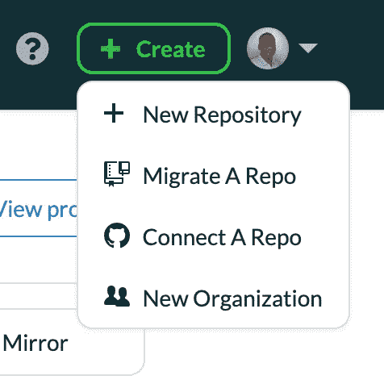
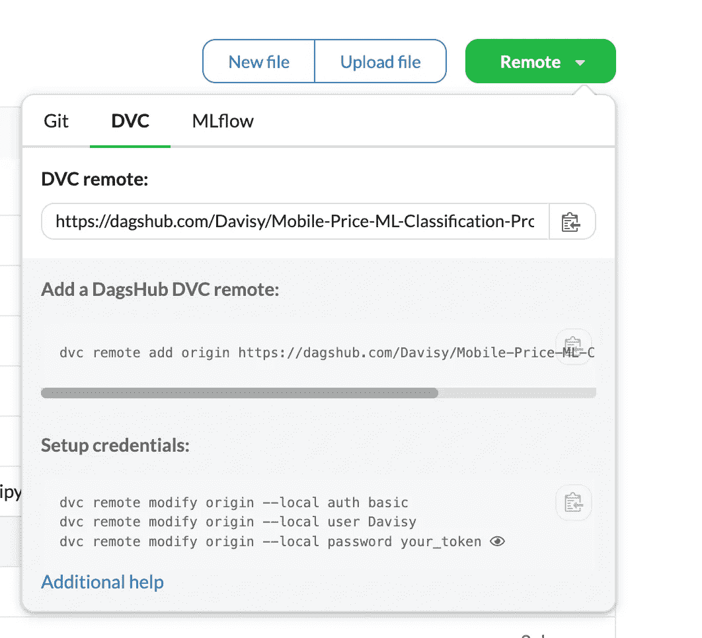
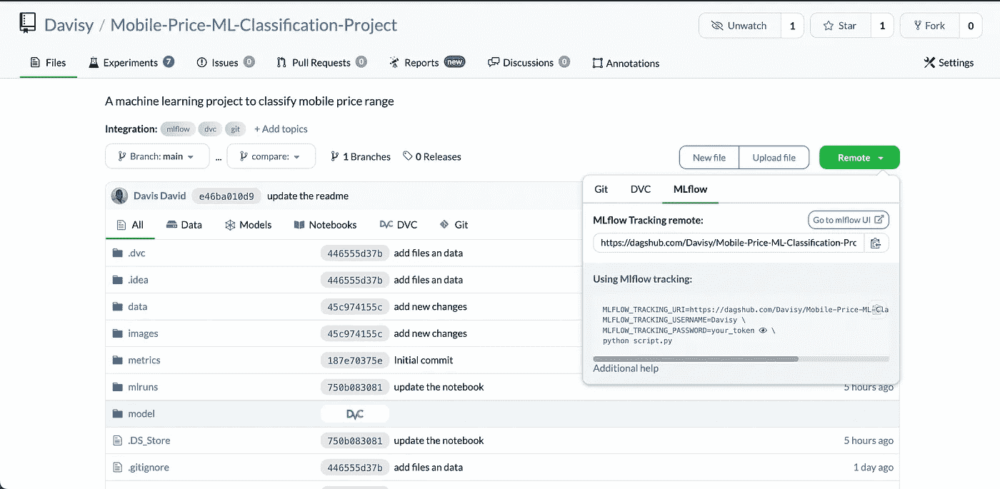
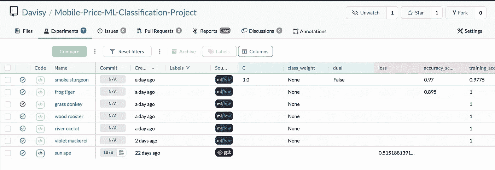
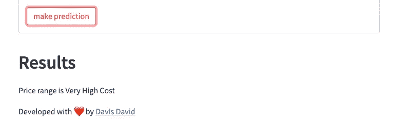
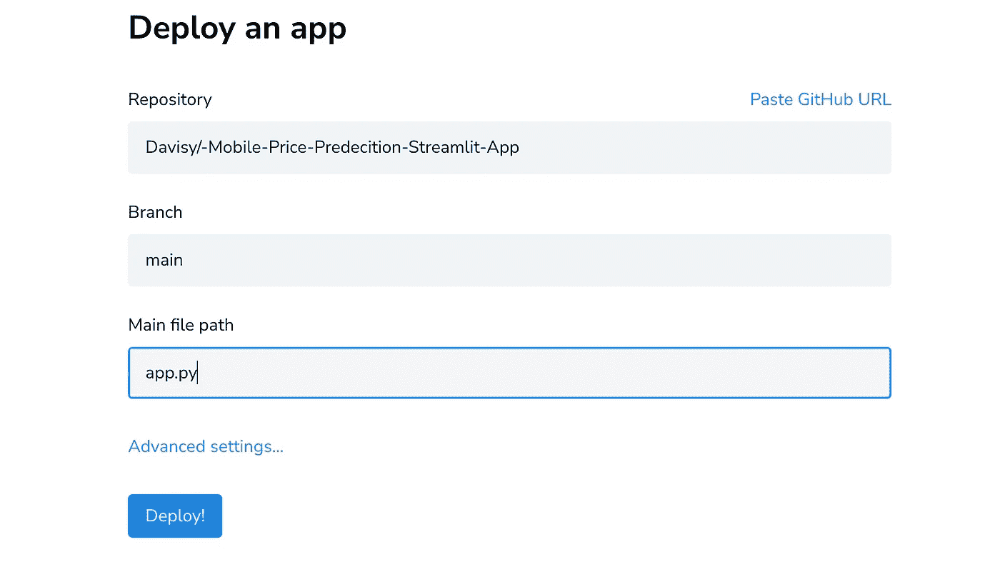

# 移动价格分类:Dagshub 的开源数据科学项目

> 原文：<https://medium.com/geekculture/mobile-price-classification-an-open-source-data-science-project-with-dagshub-720e2ae6a710?source=collection_archive---------15----------------------->

## 使用 Dagshub 和 Streamlit 构建和部署 ML 模型，对移动价格范围进行分类


Photo by Rann Vijay from [Pexels:](https://www.pexels.com/photo/close-up-of-smart-phones-7952560/)

机器学习模型通常在训练环境中开发，训练环境可以是在线或离线的，一旦经过测试，就可以部署用于实时数据。

如果你从事涉及数据科学和机器学习的项目，你需要具备的最重要的才能之一是部署模型的能力。

**模型部署**是将您的模型集成到现有生产环境中的过程。该模型将接收输入并预测输出。您将学习如何管理您的机器学习项目，并使用以下开源工具将机器学习模型部署到生产中:

**1。Dagshub** 它是一个网络平台，供数据科学家和机器学习工程师托管和发布*代码、数据、实验和机器学习模型*，并与其他开源工具集成，如:

*   **Git** —跟踪源代码和其他文件
*   **DVC** —追踪数据和机器学习模型
*   **MLflow** —追踪机器学习实验。

**2。Streamlit** 它是一个开源 Python 库，用于为数据科学和机器学习项目创建和共享 web 应用程序。该库可以帮助您使用几行代码在几分钟内开发和部署一个数据科学解决方案。

在本教程中，将涵盖以下主题:

*   使用 **Dagshub** 创建和管理您的机器学习项目。
*   建立一个 ML 模型来分类移动价格范围。
*   使用 **Streamlit** 部署您的 ML 模型，创建一个简单的数据科学 web 应用程序。

所以让我们开始吧。

# 如何使用 Dagshub 创建项目

在 Dagshub 上创建您的帐户后，您将获得不同的选项来开始使用 Dagshub 创建您的第一个项目。

*   **新存储库:**直接在 Dagshub 平台上创建一个新的存储库。
*   **迁移一个 Repo:** 将一个存储库从 GitHub 迁移到 Dagshub。
*   **连接一个 Repo:** 通过 Github 和 Dagshub 连接并管理您的存储库。



Screenshot from the Dagshub platform (Author).

DagsHub 上的新存储库的接口和 GitHub 上的现有存储库的接口应该有很多相似之处。但是，应该有一些附加的选项卡，如实验、报告和注释。

您可以在 DagsHub 上的 [this repository](https://dagshub.com/Davisy/Mobile-Price-ML-Classification-Project) 中克隆并给出一个星号来跟随整篇文章。

# 移动价格数据集

我们将使用移动价格数据集将价格范围分为以下不同类别。

*   0(低成本)
*   1(中等成本)
*   2(高成本)
*   3(成本非常高)

数据集可在[这里](https://www.kaggle.com/iabhishekofficial/mobile-price-classification?ref=hackernoon.com)获得。

我们在数据文件夹中有一个可用的， *data.csv.* 我们将把数据集分成训练和测试数据帧，用于训练和验证。

## **软件包安装**

在这个项目中，我们将使用以下 python 包。

*   **熊猫**进行数据操作。
*   **sklearn** 用于训练机器学习算法。
*   **MLflow** 用于跟踪机器学习实验。
*   **DVC** (数据版本控制)，用于对数据集和机器学习模型进行跟踪和版本控制。
*   **Joblib** 用于保存和加载机器学习模型。
*   **Streamlit** 用于在 web 应用中部署机器学习模型。

所有这些包都列在 [requirement.txt 文件](https://dagshub.com/Davisy/Mobile-Price-ML-Classification-Project/src/main/requirements.txt)中。通过在终端中运行以下命令来安装这些软件包。

`pip install -r requirements.txt`

## **导入 Python 包**

安装完所有软件包后，您需要在开始使用它们之前导入软件包。

```
*# import packages

import* pandas *as* pd
*import* numpy *as* np

*import* sklearn
*from* sklearn.model_selection *import* train_test_split
*from* sklearn.preprocessing *import* StandardScaler
*from* sklearn.metrics *import* accuracy_score

*from* sklearn.ensemble *import* RandomForestClassifier
*from* sklearn.linear_model *import* LogisticRegression

*import* mlflow

mlflow.sklearn.autolog()  *# set autlog for sklearn* mlflow.set_experiment('Ml-classification-experiment')*import* joblib
*import* json
*import* os

np.random.seed(1234)
```

**注:**有了 MLflow，你可以使用 **mlflow.skearn** 模块中一个名为 **autolog()** 的函数自动跟踪机器学习实验。

## **加载和版本化移动价格数据集**

```
raw_data = pd.read_csv("data/raw/data.csv")
```

**数据版本控制(** DVC)是一个开源解决方案，允许你跟踪你的机器学习项目的数据及其模型的变化。完成帐户创建过程后，Dagshub 将为您提供 10 GB 的 DVC 免费存储空间。

在每个存储库中，Dagshub 将自动生成一个远程存储链接以及一个命令列表，以启动您的数据跟踪过程。



Screenshot from Dagshub (Author).

运行以下命令添加 Dagshub DVC 远程服务器。

```
dvc remote add origin [https://dagshub.com/Davisy/Mobile-Price-ML-Classification-Project.dvc](https://dagshub.com/Davisy/Mobile-Price-ML-Classification-Project.dvc)
```

**注意:**上面的命令会将存储库添加为 DVC 存储的远程存储，并且 URL 会与您看到的略有不同。

然后，您可以使用以下命令开始跟踪数据集。

```
*dvc commit -f data / raw.dvc*
```

让我们检查数据集的形状。

```
print(raw_data.shape)
```

该数据集包含 21 列(20 个要素和 1 个目标)，幸运的是，该数据集没有缺失值。

将移动价格数据分为功能和目标。目标列名为“价格范围”。

```
features = raw_data.drop(['price_range'], axis=1)

target = raw_data.price_range.values
```

## 数据预处理

这些特征在适合机器学习算法之前必须被标准化。我们将使用 s **cikit-learn** 中的 Standardscaler 来执行任务。

```
scaler = StandardScaler()
features_scaled = scaler.fit_transform(features)
```

下一步是将数据分成训练集和验证集。20%的移动价格数据集将用于验证。

```
X_train, X_valid, y_train, y_valid = train_test_split(features_scaled, target, test_size=0.2,
                                          stratify=target,
                                          random_state=1)
```

这里是列车组的样本(X_train 的第一行)。

```
print(X_train[0])[ 1.56947055 -0.9900495   1.32109556 -1.01918398  0.15908825 -1.04396559
 -1.49088996  1.03435682  0.61459469  0.20963905  1.00341448 -0.93787756
 -0.57283137 -1.3169798   0.40204724  1.43112714  0.73023981  0.55964063 0.99401789  0.98609664]
```

我们需要用 DVC 跟踪处理过的数据，以提高效率和重现性。首先，我们为训练集和有效集创建一个数据帧，最后将它们保存在一个已处理的文件夹中，如下面的代码块所示。

```
*# create a dataframe for train set* X_train_df = pd.DataFrame(X_train, columns=list(features.columns))
y_train_df = pd.DataFrame(y_train, columns=["price_range"])

*#combine features and target for train set* train_df = pd.concat([X_train_df, y_train_df], axis=1)

*# create a dataframe for traine set* X_valid_df = pd.DataFrame(X_valid, columns=list(features.columns))
y_valid_df = pd.DataFrame(y_valid, columns=["price_range"])
*#combine features and target for train set* valid_df = pd.concat([X_valid_df, y_valid_df], axis=1)*# save processed train and valid set* train_df.to_csv('data/processed/data_train.csv', index_label='Index')
valid_df.to_csv('data/processed/data_valid.csv', index_label='Index')
```

然后运行以下命令来跟踪已处理的数据(训练和有效集合)。

```
*dvc commit -f process_data.dvc*
```

最后，我们可以使用 joblib 包中的 dump 方法保存训练好的标准定标器。

```
*# save the trained scaler* joblib.dump(scaler, 'model/mobile_price_scaler.pkl')
```

**注意:**我们将在 streamlit web 应用程序中使用经过培训的缩放器。

## **训练机器学习算法**

MLflow 是一个很棒的开源机器学习实验包。您可以使用它来打包和部署机器学习项目，但在本文中，我们将专注于它的跟踪 API。

我们将使用 Dagshub 提供的免费跟踪服务器，以便所有 MLflow 文件都远程保存在存储库中，任何可以访问您的项目的人都可以查看它们。



screenshot from the Dagshub repository (Author).

要将机器学习实验结果发送到跟踪服务器，您需要如下设置跟踪 URL、您的 Dagshub 用户名和密码。

**注意:**您只需要在 Dagshub 存储库中复制 MLflow 的远程跟踪 URL。

```
*# using MLflow tracking* mlflow.set_tracking_uri("https://dagshub.com/Davisy/Mobile-Price-ML-Classification-Project.mlflow")

os.environ["MLFLOW_TRACKING_USERNAME"] = "username"
os.environ["MLFLOW_TRACKING_PASSWORD"] = "password"
```

**注:**实验结果将直接记录到**实验选项卡**下的 Dagshub 存储库中。

最后，我们需要运行一些机器学习实验。首先，我们从训练集和有效集中分离特征和目标。

```
*# load the processed data for both train and valid set* X_train = train_df[train_df.columns[:-1]]
y_train = train_df['price_range']

X_valid = valid_df[valid_df.columns[:-1]]
y_valid = valid_df['price_range']
```

第一个实验是在训练集上训练随机森林算法，并在有效性测试上检查性能。

```
*# train randomforest algorithm* rf_classifier = RandomForestClassifier(n_estimators=200, criterion="gini")

*with* mlflow.start_run():
    *#train the model* rf_classifier.fit(X_train, y_train)

    *#make predictions* y_pred = rf_classifier.predict(X_valid)

    *#check performance* score = accuracy_score(y_pred, y_valid)

mlflow.end_run()

print(score)
```

上述代码块将执行以下任务:

*   实例化随机森林算法
*   开始 MLflow 运行。
*   训练机器学习模型。
*   对验证集进行预测。
*   检查机器学习模型的准确性。
*   结束 MLflow 运行。
*   最后打印机器学习模型的准确率分数。

随机森林算法的准确度分数为 **0.895** 。

**注意:**我们使用 **mlflow.sklearn** 中的 **autolog** 函数来自动跟踪实验。这意味着它将自动跟踪模型参数、指标、文件和类似的信息。

您可以更改 Randomforest 算法的默认参数来运行多个实验，并找出哪些值提供了最佳性能。

让我们尝试使用逻辑回归算法运行另一个实验。

```
*# train logistic regression algorithm* lg_classifier = LogisticRegression(penalty='l2', C=1.0)

*with* mlflow.start_run():
    *#train the model* lg_classifier.fit(X_train, y_train)

    *#make predictions* y_pred = lg_classifier.predict(X_valid)

    *#check performance* score = accuracy_score(y_pred, y_valid)

mlflow.end_run()

print(score)
```

逻辑回归的准确度得分为 **0.97** 。这种机器学习模型的性能优于随机森林算法。

这是 DagsHub 上记录的机器学习实验列表，在实验选项卡下。



Screenshot from the Dagshub repository(Author).

Dagshub 上的 E **实验选项卡**提供了不同的功能来分析实验结果，例如使用不同的指标将一个实验与另一个实验进行比较。

您还需要通过运行以下命令来跟踪模型的版本。

```
*dvc commit -f model.dvc*
```

## 向 MLflow 注册最佳模型

我们将使用 Mlflow registry 来维护和管理机器学习模型的版本。您需要知道产生具有最佳性能的模型的 run_id。您可以通过点击实验选项卡中的实验名称((**Ml-分类-实验’**)找到 run_id。

在本例中，逻辑回归模型的 run_id 为**' 17 CCD 85 B4 C7 e 491 bbdbcba 58 b5 eafae 1 '**。然后使用 MLflow 中的 register_model()函数来执行任务。

```
*# Grab the run ID* run_id = '17ccd85b4c7e491bbdbcba58b5eafae1'

*# Select a subpath name for the run* subpath = "best_model"

*# Select a name for the model to be registered* model_name = "Logistic Regression Model"

*# build the run URI* run_uri = f'runs:/{run_id}/{subpath}'

*# register the model* model_version = mlflow.register_model(run_uri, model_name)
```

输出:

```
Successfully registered model 'Logistic Regression Model'.
2022/11/10 00:22:33 INFO mlflow.tracking._model_registry.client: Waiting up to 300 seconds for model version to finish creation.                     Model name: Logistic Regression Model, version 1
Created version '1' of model 'Logistic Regression Model'.
```

# 使用 Streamlit 在 MLflow 中部署日志模型

Streamlit 是一个开源 Python 工具包，用于构建和共享数据科学 web 应用程序。您可以使用 streamlit 通过几行代码在短时间内部署您的数据科学解决方案。

Streamlit 可以轻松地与著名的 python 库集成，如 NumPy、Pandas、Matplotlib、Scikit-learn 和数据科学中的其他库。

在这一部分，我们将在 MLflow **(逻辑回归模型)**中部署记录的模型，以便对手机的价格范围进行分类。

## 创建 app.py 文件

第一步是创建一个名为 **app.py** 的 python 文件，其中包含运行数据科学 web 应用程序的所有源代码。

## 导入包

然后，您需要导入包来运行 streamlit 和最佳训练模型。

```
*# import packages
import* streamlit *as* st
*import* pandas *as* pd
*import* numpy *as* np
*from* os.path *import* dirname, join, realpath
*import* joblib
```

## **创建应用标题和描述**

您可以使用 streamlit 中的三种不同方法为您的 data science web 应用程序设置*标题、图像和子标题*，这三种方法分别名为 **header()** 、 **image()** 和 **subheader()** ，如下面的代码所示。

```
*# add banner image* st.header("Mobile Price Prediction")
st.image("images/phones.jpg")
st.subheader(
    """
A simple machine learning app to  classify mobile price range
"""
)
```

## **创建一个接收手机详细信息的表单**

我们需要一个简单的形式，将接收移动细节，以便进行预测。Streamlit 有一个叫做 **form()** 的方法，可以帮助你创建一个包含不同字段的表单，比如*数字、多选、文本和其他*。

```
*# form to collect mobile phone details* my_form = st.form(key="mobile_form")

@st.cache
*# function to transform Yes and No options
def* func(value):
    *if* value == 1:
        *return* "Yes"
    *else*:
        *return* "No"

battery_power = my_form.number_input(
    "Total energy a battery can store in one time measured in mAh", min_value=500
)
blue = my_form.selectbox("Has bluetooth or not", (0, 1), format_func=func)

clock_speed = my_form.number_input(
    "speed at which microprocessor executes instructions", min_value=1
)

dual_sim = my_form.selectbox("Has dual sim support or not", (0, 1), format_func=func)

fc = my_form.number_input(
    "Front Camera mega pixels", min_value=0
)

four_g = my_form.selectbox("Has 4G or not", (0, 1), format_func=func)

int_memory = my_form.number_input(
    "Internal Memory in Gigabytes", min_value=2
)

m_dep = my_form.number_input(
    "Mobile Depth in cm", min_value=0
)

mobile_wt = my_form.number_input(
    "Weight of mobile phone", min_value=80
)

n_cores = my_form.number_input(
    "Number of cores of processor", min_value=1
)
pc = my_form.number_input(
    "Primary Camera mega pixels", min_value=0
)

px_height = my_form.number_input(
    "Pixel Resolution Height", min_value=0
)

px_width = my_form.number_input(
    "Pixel Resolution Width", min_value=0
)

ram = my_form.number_input(
    "Random Access Memory in Mega Bytes", min_value=256
)

sc_h = my_form.number_input(
    "Screen Height of mobile in cm", min_value=5
)

sc_w = my_form.number_input(
    "Screen Width of mobile in cm", min_value=0
)

talk_time = my_form.number_input(
    "longest time that a single battery charge will last when you are", min_value=2
)

three_g = my_form.selectbox("Has 3G or not", (0, 1), format_func=func)

touch_screen = my_form.selectbox("Has touch screen or not", (0, 1), format_func=func)

wifi = my_form.selectbox("Has wifi or not", (0, 1), format_func=func)

submit = my_form.form_submit_button(label="make prediction")
```

上面的代码块包含了填写手机详细信息的所有字段和一个简单的按钮**提交**详细信息，然后进行预测。

## 在 MLflow 和 Scaler 中加载日志模型

然后，您需要加载 MLflow 模型中用于预测的记录模型和用于输入转换的缩放器。joblib 包中的 **load()** 方法将执行该任务。

```
# load the mlflow registered model and scaler
mlflow_model_path = "mlruns/1/17ccd85b4c7e491bbdbcba58b5eafae1/artifacts/model/model.pkl"with open(
        join(dirname(realpath(__file__)), mlflow_model_path),
        "rb",
) as f:
    model = joblib.load(f)scaler_path  = "model/mobile_price_scaler.pkl"
with open(join(dirname(realpath(__file__)), scaler_path ), "rb") as f:
    scaler = joblib.load(f)
```

## 创建结果字典

经过训练的模型会将输出预测成数字( *0、1、2 或 3* )。为了更好的用户体验，我们可以使用下面的字典来呈现实际含义。

```
*# result dictionary* result_dict = {
    0: "Low Cost",
    1: "Medium Cost",
    2: "High Cost",
    3: "Very High Cost",
}
```

## **进行预测并显示结果**

我们的最后一个代码块是当用户添加手机信息并点击表单部分的“ **make prediction** ”按钮时，进行预测并显示结果。

点击按钮后，web 应用程序将执行以下任务:

*   收集所有输入(手机详细信息)。
*   为输入创建一个数据框架。
*   使用定标器转换输入。
*   对转换后的输入执行预测。
*   根据结果字典(result_dict)显示移动价格的结果。

```
*if* submit:
    *# collect inputs* input = {
        'battery_power': battery_power,
        'blue': blue,
        'clock_speed': clock_speed,
        'dual_sim': dual_sim,
        'fc': fc,
        'four_g': four_g,
        'int_memory': int_memory,
        'm_dep': m_dep,
        'mobile_wt': mobile_wt,
        'n_cores': n_cores,
        'pc': pc,
        'px_height': px_height,
        'px_width': px_width,
        'ram': ram,
        'sc_h': sc_h,
        'sc_w': sc_w,
        'talk_time': talk_time,
        'three_g': three_g,
        'touch_screen': touch_screen,
        'wifi': wifi,
    }

    *# create a dataframe* data = pd.DataFrame(input, index=[0])

    *# transform input* data_scaled = scaler.transform(data)

    *# perform prediction* prediction = model.predict(data_scaled)
    output = int(prediction[0])

    *# Display results of the Mobile price prediction* st.header("Results")
    st.write(" Price range is {} ".format(result_dict[output]))
```

## 测试数据科学 Web 应用程序

我们已经成功创建了一个简单的 web 应用程序，用于在 MLflow 中部署记录的模型并预测价格范围。

要运行 web 应用程序，您需要在终端中使用以下命令。

```
streamlit run app.py
```

然后，web 应用程序将立即出现在您的 web 浏览器中，或者您可以使用本地 URL[http://localhost:8501](http://localhost:8501)访问它。


Screenshot from the web app (Author).

您需要填写手机详细信息，然后单击“进行预测”按钮查看预测结果。



Screenshot from the Streamlit Web app (Author).

在填写移动细节并点击“进行预测”按钮后，机器学习模型预测价格范围为**非常高的成本。**

## 在细流云中部署细流 Web 应用

最后一步是确保 streamlit 应用程序可供任何想要访问它的人使用，并使用我们的机器学习模型来预测移动价格范围。

Streamlit cloud 允许您在云上免费部署 streamlit web 应用程序。您只需遵循以下步骤:

1.  在 GitHub 上创建一个新的 GitHub 资源库
2.  添加您的 streamlit web 应用程序(app.py)、模型文件夹和 requirements.txt。
3.  在 [streamlit 云平台](https://streamlit.io/cloud)上创建您的帐户
4.  创建一个新的应用程序，然后通过键入资源库的名称来链接您创建的 GitHub 资源库。
5.  将 streamlit app 文件名从 **streamlit_app.py** 更改为 **app.py**
6.  最后，单击部署按钮。



screenshot from Streamlit Cloud.Image from Author (Author).

在 streamlit cloud 完成安装 streamlit 应用程序及其所有先决条件后，您的应用程序将最终上线，任何人都可以通过 streamlit cloud 提供的链接进行访问。

**链接:**[https://davisy-mobile-price-pre detection-streamlit-app-app-7 clk ZD . streamlit . app/](https://davisy--mobile-price-predecition-streamlit-app-app-7clkzd.streamlit.app/)

# 结论

您已经获得了使用数据版本控制(DVC)进行数据和模型跟踪的专业知识，以及使用 MLflow 和 DagsHub 跟踪机器学习实验的专业知识。你可以和全世界分享你的机器学习实验的结果，包括成功的和失败的。您还获得了强大的工具，可以帮助您有效地组织您的机器学习项目。

在本教程中，您已经学习了:

*   如何创建您的第一个 Daghubs 存储库。
*   如何使用数据版本控制(DVC)跟踪您的数据并连接到 Dagshub DVC 遥控器。
*   如何使用 MLflow 的自动日志类自动跟踪机器学习实验？
*   如何将 MLflow 连接到 DagsHub 中的远程跟踪服务器。
*   如何使用 Streamlit 为您的机器学习模型创建数据科学 web 应用程序。

你可以在这里下载本文用到的源代码:[https://dagshub . com/Davisy/Mobile-Price-ML-class ification-Project](https://dagshub.com/Davisy/Mobile-Price-ML-Classification-Project)

如果你学到了新的东西或者喜欢阅读本教程，请分享给其他人看。在那之前，下一篇文章再见！

你也可以在 Twitter 上找到我，地址是 [@Davis_McDavid](https://twitter.com/Davis_McDavid?ref=hackernoon.com) 。

*最后一件事:在以下链接中阅读更多类似的文章*

[](https://python.plainenglish.io/how-to-web-scrape-using-python-snscrape-harperdb-56c53cac876e) [## 如何使用 Python、Snscrape 和 HarperDB 进行网络抓取

### 使用 HarperDB 将抓取的数据自动存储在数据库中

python .平原英语. io](https://python.plainenglish.io/how-to-web-scrape-using-python-snscrape-harperdb-56c53cac876e) [](https://python.plainenglish.io/how-to-create-an-engaging-readme-for-your-data-science-project-on-github-30fb5d334702) [## 如何在 Github 上为您的数据科学项目创建引人入胜的自述文件

### 自述文件是开发人员访问您托管在…上的数据科学项目时首先要检查的项目

python .平原英语. io](https://python.plainenglish.io/how-to-create-an-engaging-readme-for-your-data-science-project-on-github-30fb5d334702) [](https://towardsdatascience.com/how-to-perform-data-augmentation-in-nlp-projects-5c4b86c25035) [## 如何在 NLP 项目中执行数据扩充

### 利用文本攻击库进行数据扩充的简单方法

towardsdatascience.com](https://towardsdatascience.com/how-to-perform-data-augmentation-in-nlp-projects-5c4b86c25035) 

*本文首发* [*此处*](https://hackernoon.com/mobile-price-classification-an-open-source-data-science-project-with-dagshub) *。*