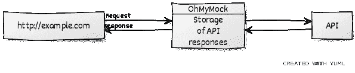
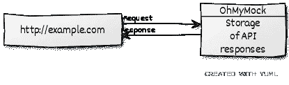
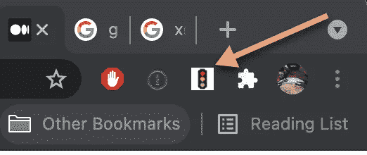
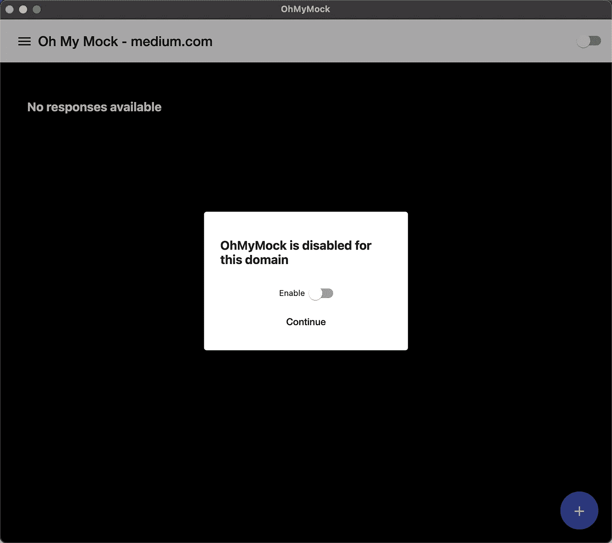
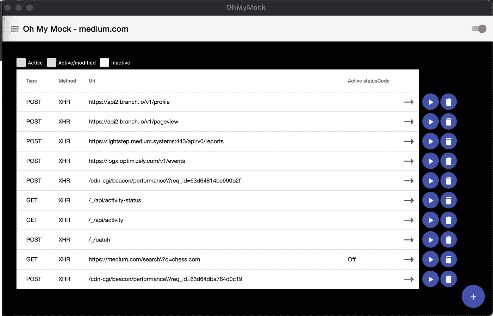
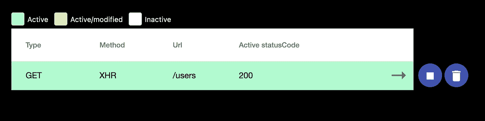
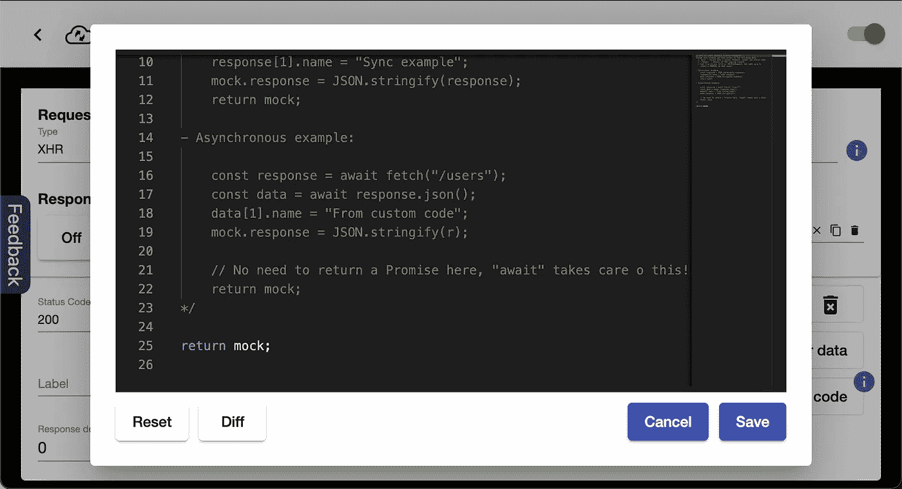
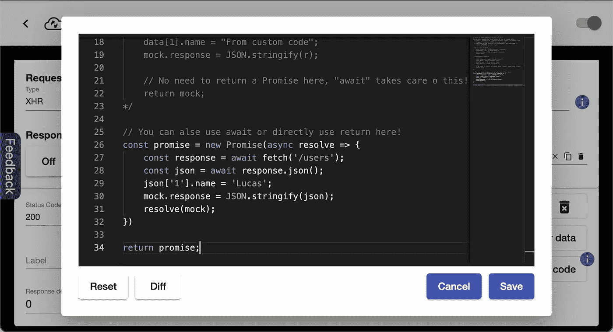
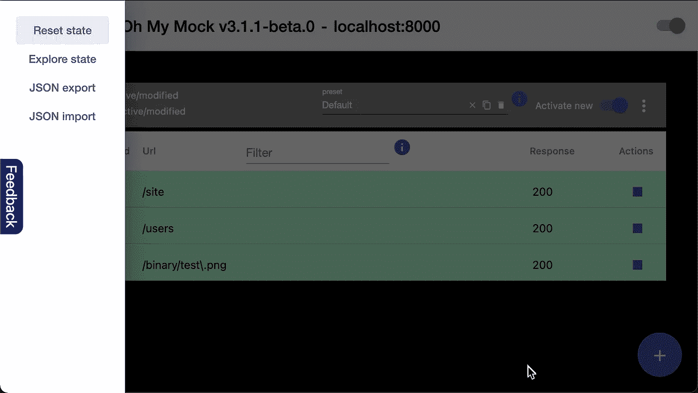
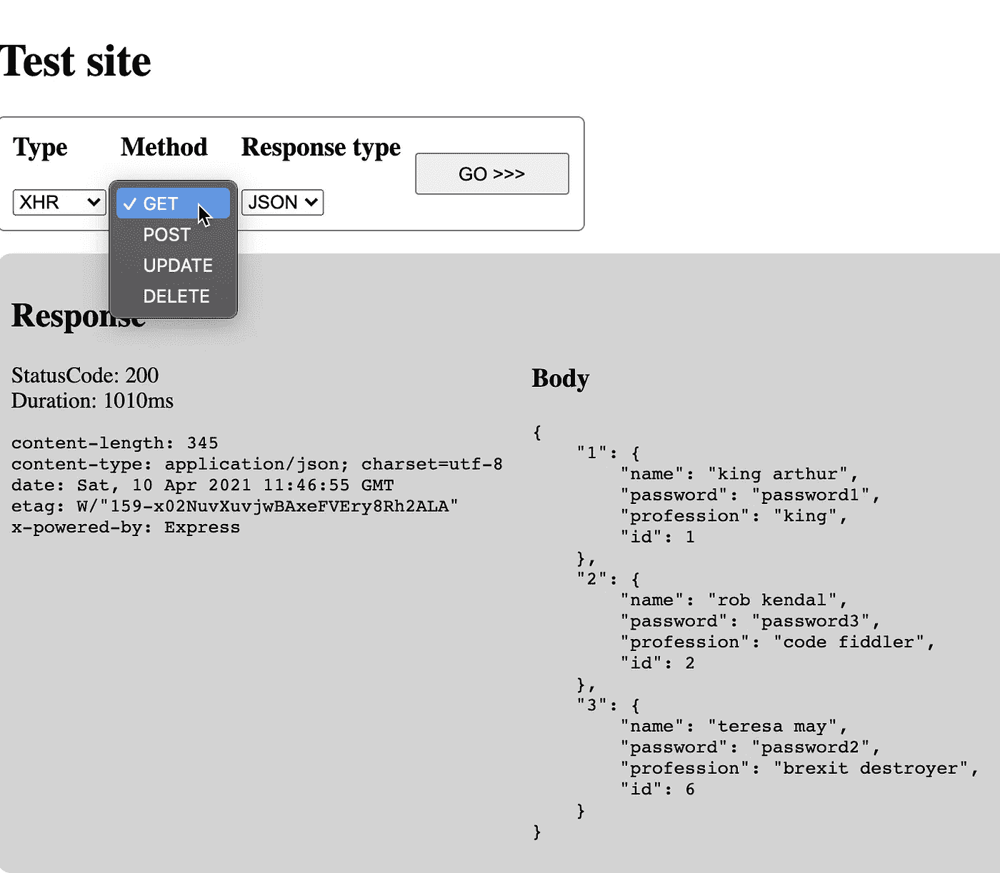

# 使用名为 OhMyMock 的 Chrome 扩展模拟 API 响应

> 原文：<https://medium.com/geekculture/mock-api-responses-with-a-chrome-extension-called-ohmymock-875ac5d85999?source=collection_archive---------2----------------------->

今天大多数网站通过调用(REST)API 来检索数据。这也意味着当前端开发人员承担创建新特性的任务时，他们很可能在工作中依赖这些 API。这很好，不一定是个问题，但是如果 API 很慢或不稳定，它肯定不会促进开发。

在这篇文章中，我将讨论如何通过嘲讽将 API 从等式中去掉。不仅仅是嘲讽，而是*用一个叫做[**OhMyMock**](https://chrome.google.com/webstore/detail/oh-my-mock/egadlcooejllkdejejkhibmaphidmock)的新 Chrome 扩展来嘲讽简单的方式*。

# OhMyMock

Chrome 扩展很酷的一点是，它们可以在浏览器中做任何事情。OhMyMock 利用了这一点，并使用存储和网络流量监控特性来模拟 API 调用。

那么， **OhMyMock** 是如何模仿 API 的呢？这很简单，第一次进行 API 调用时 **OhMyMock** 会让调用通过，API 服务于请求。

If no cache is available, the response is served by the API and cached by OhMyMock

但是 **OhMyMock** 会缓存响应。下一次当同样的请求出现时 **OhMyMock** 将介入并服务它。

Response served by OhMyMock

# OhMyMock 演练

虽然 OhMyMock 的用户界面非常直观，但我还是会带你浏览一下。第一步当然是安装[**OhMyMock**](https://chrome.google.com/webstore/detail/oh-my-mock/egadlcooejllkdejejkhibmaphidmock)([source](https://github.com/scaljeri/oh-my-mock))并点击浏览器中的新扩展图标

OhMyMock icon

这将触发 **OhMyMock** 窗口

Initial view of the OhMyMock popup

最初这个页面是空的，但是这里需要注意的是标题中的 url。域名作为一个上下文，这里显示的所有模拟都属于它。因此，如果你切换到另一个领域，你将不会再看到*medium.com*模仿，但只有那些新的领域。让我们来看看它的运行情况，启用 **OhMyMock** 并点击你可能会得到这样的结果

A list of stored responses of API calls made by medium.com

首先，每个新存储的响应都被禁用，这意味着 **OhMyMock** 不会使用它们，模仿也不会发生。但是如果你点击每一行末尾的 play 按钮， **OhMyMock** 就会开始模仿那个特定的请求**。也可以从头开始创建模拟，如果 API 还不存在的话，这会很方便。这可以通过右下角的加号按钮来完成。**

Activated mock for **/users**

若要停止模仿，请点按“停止”或“删除”按钮。

要查看响应详细信息，请单击行本身

Details of a cached request

在此视图的顶部，您可以看到哪些状态代码可用，以及哪一个处于活动状态。带有绿色边框的是活动的，该模拟的详细信息如下所示。因此，如果调用了 **/users** API，OhMyMock 将用状态码 200 及其相应的响应和头进行响应。后面的加号按钮允许您创建新的状态代码。每个状态代码都有自己的响应和标题。如果你喜欢，它们也可以被修改！

OhMyMock 提供的每个 mock 都是由一段 javascript 创建的，如果您单击“*mock with code*”按钮，也可以修改这段 JavaScript

Dynamic/conditional mocking

在这里，你可以超越静态嘲笑，做任何你需要做的魔术。您将可以访问几个对象，其中一个包含所有的模拟细节

*   **模拟响应** —响应数据(*字符串*)
*   **mock.headers** —响应头(*记录<字符串，字符串>)*
*   **模拟延迟** —模拟响应的延迟，单位为毫秒(*数字*)
*   **mock.statusCode** —响应的状态码(*号*)

例如， **mock.response** 保存缓存的响应，但如果将其更改为 **mock.response = "yolo"** ，模拟响应将为“yolo”。

另一个是**请求**，它包含关于正在进行的请求的信息

*   **request.url** —请求的 URL(*字符串*)
*   **请求.方法** —获取、发布、删除或更新(*字符串*)
*   **请求体** —请求体(*未知*)
*   **request.headers** —请求头(*记录<字符串，字符串>* )

Dynamic/Condition mocking

如果需要，您甚至可以在这里进行 Fetch 或 XMLHttpRequest。但是如果您这样做了，请确保返回一个承诺(或使用 await)来解析上面提到的模拟对象！！

Dynamic mocking with asynchronous code

但是你还可以做更多的事情。你可能已经注意到左上角的菜单按钮。如果单击，您会看到以下菜单

OhMyMock menu

*   **重置状态** —移除当前域的所有模仿或清除所有内容(所有域)
*   **探索状态** —探索跨域的所有模仿。在这里，您可以将来自另一个域的响应克隆到当前域中。例如，如果您有一个只发生在产品中的 bug，这可能很方便。只需缓存生产 API 调用，并将它们克隆回您的开发领域！
*   **JSON 导出** —将 mocks 导出为 JSON 文件。可以方便地备份您的模拟，或者如果您需要在工作中与同事分享一些东西。
*   **JSON 导入** —导入 JSON 模拟文件

# 捐助

如果您认为缺少了什么，请随意创建一个[特征请求](https://github.com/scaljeri/oh-my-mock/issues)！！所有代码都可以在 GitHub 上公开获得。如果您想了解更多，一个很好的起点是[演示测试页面](https://scaljeri.github.io/oh-my-mock/)。该页面支持 **OhMyMock** 支持的所有请求类型。注意 GitHub 上的页面没有后端，所以你需要在这里模仿！！

OhMyMock Test / demo page

这大概是我现在能想到的。我很乐意听到你对这个工具的体验，所以不要犹豫，请在下面发表评论或给我发邮件。

干杯