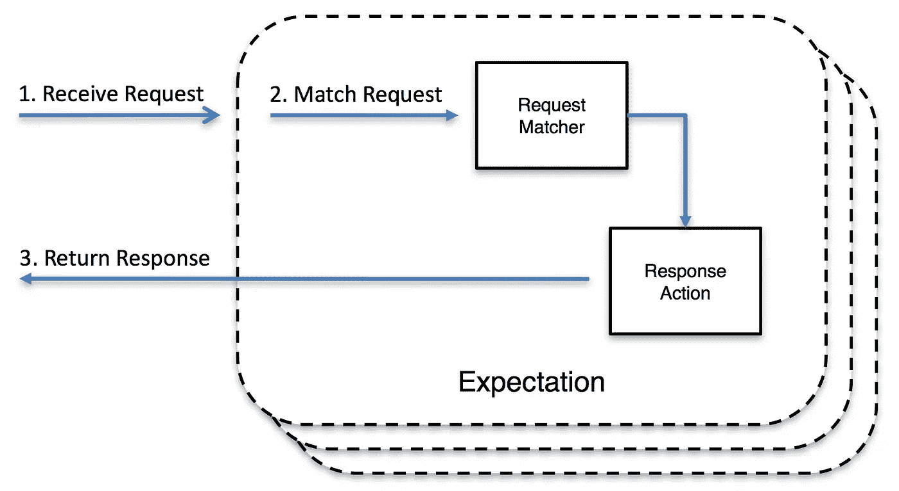

# 在集成测试中模仿第三方服务

> 原文：<https://medium.com/geekculture/mocking-third-party-services-in-integration-testing-7ded9ac1fe83?source=collection_archive---------6----------------------->


Photo by [Glen Carrie](https://unsplash.com/@glencarrie?utm_source=medium&utm_medium=referral) on [Unsplash](https://unsplash.com?utm_source=medium&utm_medium=referral)

由于各种原因，当前的应用程序开发越来越多地使用第三方服务，以加快开发过程，依赖一些健壮和可靠的解决方案以及许多其他合理的原因。

然而，我们需要一种有效的方法，能够在隔离的环境中为我们的应用程序编写和执行自动化测试，因为，永远记住…

> 无法测试的代码是有缺陷的。

在本文中，我将解释我发现的在进行集成测试时使用名为 [MockServer](https://www.mock-server.com/) 的工具模拟外部服务的有效策略。

假设您正在处理一个应用程序，它需要在不同的场景中验证一个 [IBAN](https://it.wikipedia.org/wiki/International_Bank_Account_Number) ，例如，在创建一个新用户的时候。为此，可以采用不同的方法，从仅仅验证 IBAN 格式*(弱检查)*，到与第三方服务交互的实时验证，如[这个](https://www.iban.com/validation-api)。

所以，首先，让我们给出一些关于这个工具的细节。

# 模拟服务器

我不久前发现了这个伟大的工具，它是❤的一见钟情

该工具可用作:

*   一个被配置为针对不同请求返回特定响应的 mock。
*   代理记录并有选择地修改请求和响应。
*   既是某些请求的代理，同时又是其他请求的模拟。

当 MockServer 接收到请求时，它将该请求与已配置的活动**期望**进行匹配，如果没有找到匹配，它将在适当时代理该请求，否则返回 404。

一个**期望**定义了被采取的**动作**，例如，一个响应可能被返回。



Example of mocking with MockServer

可以通过多种方式使用这个工具，但是我更喜欢使用官方 Docker 图片，在我写这篇文章的时候，这个图片已经被点击了 5000 多万次。

# 它是如何工作的？

简单解释一下，可以通过定义期望来配置 MockServer，期望是请求-响应的块。

我喜欢例子，我认为它们是让人们理解概念的最好方式，所以让我们回到需要验证 IBAN 的应用程序。

我们可能会执行一个类似下面的 HTTPs 请求

```
GET [https://iban-validator-service.com](https://iban-validator-service.com)/api/v1/validate?iban=NL95RABO9809158653Authorization: Bearer api-key
```

所以，我们需要像这样定义一个期望

```
{
        "httpRequest": {
            "method": "GET",
            "path": "/api/v1/validate",
            "queryStringParameters": {
                "iban": [ "NL95RABO9809158653" ]
            },
            "headers": {
                "Authorization": [
                    "Bearer api-key"
                ]
            },
        },
        "httpResponse": {
            "statusCode": 200,
            "body": {
                "bank_data": {
                    "bic": "RABONL2UXXX",
                    "branch": null,
                    "bank": "RABOBANK NEDERLAND",
                    "address": "CROESELAAN 18",
                    "city": "UTRECHT",
                    "state": null,
                    "zip": "3500 HG",
                    "phone": null,
                    "fax": null,
                    "www": null,
                    "email": null,
                    "country": "Netherlands",
                    "country_iso": "NL",
                    "account": "9809158653",
                    "bank_code": "RABO",
                    "branch_code": ""
                },
                "sepa_data": {
                    "SCT": "YES",
                    "SDD": "YES",
                    "COR1": "YES",
                    "B2B": "YES",
                    "SCC": "NO"
                },
                "validations": {
                    "chars": {
                        "code": "006",
                        "message": "IBAN does not contain illegal characters"
                    },
                    "account": {
                        "code": "002",
                        "message": "Account Number check digit is correct"
                    },
                    "iban": {
                        "code": "001",
                        "message": "IBAN Check digit is correct"
                    },
                    "structure": {
                        "code": "005",
                        "message": "IBAN structure is correct"
                    },
                    "length": {
                        "code": "003",
                        "message": "IBAN Length is correct"
                    },
                    "country_support": {
                        "code": "007",
                        "message": "Country supports IBAN standard"
                    }
                },
                "errors": []
            }
        }
    }
```

定义了这个期望后，模拟服务器将会像我们与真实服务交互一样进行回复。

显然，这是一个非常简单的例子，只是为了展示这个工具使用背后的主要思想。更多期望示例可在[官方文档页面](https://www.mock-server.com/mock_server/creating_expectations.html)上找到。

# 怎么用？

如前所述，MockServer 有不同的形式，但我更喜欢通过官方 Docker 镜像。

假设我们有一个 PHP 应用程序，在 *docker-compose.yml* 上定义了一个 [Docker Compose](https://docs.docker.com/compose/) 集群，如下所示

```
version: '3.8'
# --------- #
# Services  #
# --------- #
services:
  nginx:
    ...
  php-fpm:
    networks:
      internal:
        aliases:
          - php-fpm.internal
    ...
# --------- #
# Networks  #
# --------- #
networks:
  internal:
```

然后我们要做的是为 IBAN 验证器服务添加一个 MockServer 实例，将配置转换成这个实例

```
version: '3.8'
# --------- #
# Services  #
# --------- #
services:
  nginx:
    ...
  php-fpm:
    networks:
      internal:
        aliases:
          - php-fpm.internal
    ...
  mock-iban-validator:
    image: mockserver/mockserver
    networks:
      internal:
        aliases:
          - mock-iban-validator.internal
    volumes:
      - $PWD/docker/mock-server/iban-checker/:/config/
    environment:
      SERVER_PORT: 1080
      MOCKSERVER_INITIALIZATION_JSON_PATH: /config/expectations.json
# --------- #
# Networks  #
# --------- #
networks:
  internal:
```

注意，在*$ PWD/docker/mock-server/iban-checker*文件夹中，存储了一个名为 *expectations.json* 的文件，其中包含了所有需要的期望。

有了这个配置， *php-fpm* 服务就能够 ping 通 *mock-iban-validator* 服务，除此之外，还能够做如下事情

```
$ curl mock-iban-validator.internal:1080/api/v1/validate?iban=NL95RABO9809158653 -H "Authorization: Bearer api-key"
```

获得预期的响应。

# 最后的想法

我希望这篇文章能够帮助你们中的一些人理解这个工具对于创建集成测试的潜力！

感谢您的阅读，并随时添加关于您的体验的评论:)