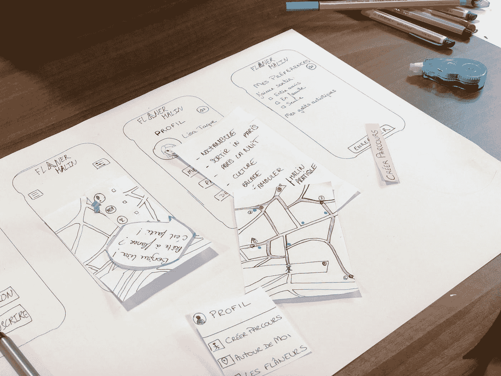

# Mockitt:快速、简单的工具原型制作方法

> 原文：<https://medium.com/geekculture/mockitt-the-fast-easy-way-to-prototyping-tool-138eea350ed6?source=collection_archive---------14----------------------->

## 轻松创建和共享 web 和移动应用程序的交互式原型！

Photo by [Amélie Mourichon](https://unsplash.com/@amayli?utm_source=medium&utm_medium=referral) on [Unsplash](https://unsplash.com?utm_source=medium&utm_medium=referral)

Mockitt 是一个原型工具，可以帮助您快速创建和测试原型。它非常适合构建用户界面、网页和其他形式的交互式内容。您可以使用 Mockitt 快速测试设计，并查看它们如何在不同的…