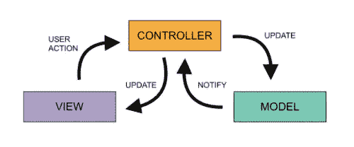

# 模型视图控制器

> 原文：<https://medium.com/geekculture/model-view-controller-70cfd248455d?source=collection_archive---------38----------------------->

模型-视图-控制器(MVC)是一种架构模式，它将对象分成三种不同的类型，主要由模型、视图和控制器组成。

值得理解的是，控制器实际上包含视图和模型。每个组件都有不同的职责，其中:

*   模型保存应用程序数据。
*   视图显示视觉元素，并且…