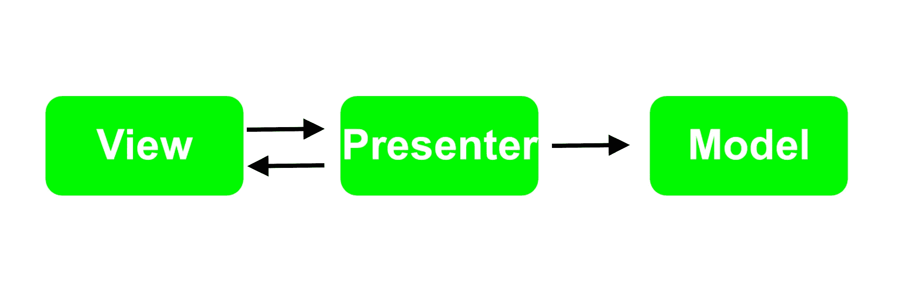

# 模型视图演示者

> 原文：<https://medium.com/geekculture/model-view-presenter-78725944e5bb?source=collection_archive---------47----------------------->

模型视图表示器(MVP)是一种架构模式，它将对象分成三种不同的类型，主要由模型、视图和表示器组成。

MVP 的发明是为了促进单元测试，并改善表示逻辑中关注点的分离。

MVP 中的每个组件都扮演着重要的角色:

*   模型保存应用程序数据。