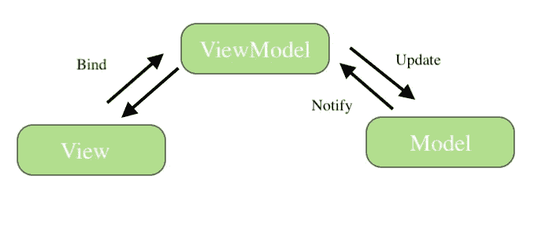

# 模型视图视图模型

> 原文：<https://medium.com/geekculture/model-view-viewmodel-d20bf341fbd6?source=collection_archive---------22----------------------->

模型视图视图模型(MVVM)是一种架构模式，它将对象分为三种不同的类型，主要由模型、视图和视图模型组成。

微软建筑师 Ken Cooper 和 Ted Peters 发明了模型视图 ViewModel (MVVM)。目标是简化用户界面的事件驱动编程。MVVM 的每个组成部分都扮演着重要的角色:

*   模型保存应用程序数据。