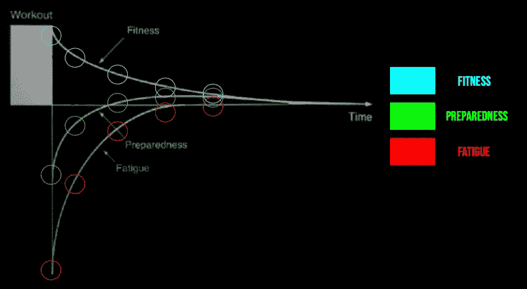
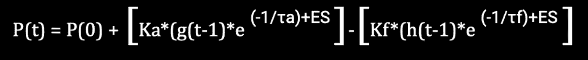
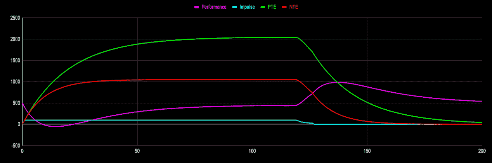

# 对健康、疲劳和表现建模

> 原文：<https://medium.com/geekculture/modeling-fitness-fatigue-and-performance-6985f155671b?source=collection_archive---------15----------------------->

脉冲响应模型简介

在《反脆弱》这本书里，纳西姆·塔勒布讲述了一个国王的故事，一怒之下，他宣布他的儿子必须为他的错误行为受到惩罚，惩罚将包括让一块巨石砸在他的头上，这无疑会砸死他。随着惩罚的日子越来越近，国王开始后悔他的决定，但他也不愿意撤回他的惩罚法令，担心他的臣民会认为他是软弱的。结果，他的顾问们想出了一个巧妙的办法来解决他的困境。他不是把一块大石头砸在他儿子的头上，而是把石头打碎成一千块，然后一个接一个地砸在他儿子的头上。同样的总数会落在他的儿子身上，但与其说会有致命的结果，倒不如说只会导致轻微的不适。

这个故事尽管有些愚蠢，却展示了压力下生物反应的一个关键特征。具体来说，它是非线性的。我们都凭直觉理解这一点。如果我一次硬拉 500 磅，这将比五次硬拉 100 磅产生更大的压力，尽管两种情况下的净负荷是一样的。类似地，在 5 个任意单位的 RPE 下跑 10 分钟比在 10 个任意单位的 RPE 下跑 5 分钟压力小得多，即使在两种情况下净压力量都是 50 个任意单位。因此，重要的不仅仅是我们做了多少工作，以什么样的强度做，还有工作是如何分配的。大多数量化训练负荷的方法，与更长时间、更大运动量、中等强度的锻炼相比，都不足以代表短时间高强度工作带来的压力。解决这个问题的一个方法是使用更复杂的模型，并以更严格的方式量化体积。一个这样的例子是脉冲响应模型。虽然脉冲响应模型并不总是实用的，但它可以非常准确地表示运动员在任何给定时间点的体能、疲劳和表现能力。这一章仅仅是为了向你介绍脉冲响应的概念，并给你一些背景信息以及一些简单的工具来帮助你应用它。

**健身疲劳动力学** 对于那些已经训练了几年的人来说，众所周知，在训练生涯的早期，成绩提高得很快，后来提高得更慢，最后进步往往会嘎然而止。其中一个原因是，在训练生涯的早期，我们可以通过相对较少的工作取得实质性的进步，但随着时间的推移，进一步提高成绩所需的工作量会产生很高的疲劳成本，任何真正的“发展性”负荷都必然会带来足够的疲劳，以至于我们不会立即看到成绩的提高。我们可以通过健身疲劳动力学的镜头来理解这个概念，如图一所示。

随着任何训练负荷的增加，体能会立即增加，急性疲劳也会立即增加。1984 年，Eric Bannister 在奥林匹克科学大会上发表了一次演讲，他将表现定义为健康减去疲劳，后来修改为表现乘以考虑到疲劳的指数衰减函数。在这个模型中，性能可以在短时间间隔和长时间间隔内适度地或显著地增加或减少。使用任意单位，让我们说，在进行了一次严格的训练后，一名运动员获得了 5 个 AU 的体能，代价是负 10 个 AU 的疲劳。这两个变量之和为负五，代表在体能-疲劳曲线图的第一个测量时间点的表现。尽管事实上，这个人确实通过执行一个具有挑战性的训练课程变得更健康，但是疲劳的重量大于健康的影响，结果表现急剧下降。这很直观。如果你今天非常努力地训练，明天你的表现可能会受到影响。然而，疲劳的减少速度比健身更快，这就是为什么我们在适当的休息后会看到表现的增加。术语“体能-疲劳动力学”是指这两个变量之间的推拉关系，它最终决定了运动员在任何给定时间点的表现水平。在进入脉冲响应模型如何用于理解健身疲劳动力学的细微差别之前，值得注意的是，该模型并不旨在探究这些过程如何发生的潜在生理学。通过这种方式，脉冲响应模型不同于描述适应如何发生以及导致性能提高的潜在生理变化的理论。

在适应研究的历史上，最早提出的观点之一是 Julius Wolff 在 19 世纪晚期提出的过载概念，他将骨骼的负荷与它们的适应和重塑联系起来。他的假设后来扩展到其他器官，术语过载扩展到包括本质上非机械的负荷形式。虽然沃尔夫的过载和适应的一般原理是正确的，但它没有解释这些变化发生的潜在机制。直到一个被称为超级补偿理论的独立理论被提出，才有人为适应提供了一个潜在的机械论解释。超代偿理论植根于 Hans Selye 在 20 世纪中期提出的一般适应综合征概念。超代偿假说由运动期间经常不确定的 Y 轴变量的下降及其运动后的恢复来定义。根据这一假设，恢复不仅达到锻炼前的水平，而且超过了锻炼前的水平。尽管这一假设在运动科学家和教练中被广泛接受，但它充满了缺陷，而且几乎没有机械证据表明它是正确的。近年来，这一假设的科学依据已经基本消失，但它仍然以几乎无处不在的方式在培训书籍和教练手册中被引用。我认为这在很大程度上是一种路径依赖。

早在 20 世纪 60 年代和 70 年代，新出现的科学证据就开始逐渐削弱汉斯·塞利耶的理论。根据 John Kiely 博士的说法，“经典的 Selye 启发理论正在努力适应证据，证明体内平衡和应激反应都不是静态的，而是在生活史和振荡生物节律的影响下动态变化。”然后，随着二十世纪进入最后四分之一，塞尔耶模型的解释局限性日益暴露。最值得注意的是，将压力描述为一种可预测的生物学介导的现象，这削弱了非物理因素对生理压力反应的明显影响，以及越来越有说服力的证据表明，压力反应不是普遍的和非特异性的，而是高度个体化的和环境特异性的。

你可能想知道这是否真的“否定”了超级薪酬存在的概念。压力反应不能高度个体化，但仍然遵循超级补偿时间进程吗？这是一个我曾经怀疑过自己的问题，有大量的信息否定了超级补偿理论。超补偿理论暗示恢复期本质上是为了适应。然而，情况不必如此。例如，心脏适应锻炼，尽管持续收缩，骨骼肌可以适应，并且响应于慢性电刺激的肥大也持续应用数周。尽管已经传播了几十年，但几乎没有证据表明超级补偿时间过程对适应是必不可少的。相比之下，有数百份科学参考资料支持另一种假设，即信号转导途径介导所有对运动的适应。根据信号转导理论，特定的传感器蛋白检测运动调节的信号，然后通过转导途径或网络计算这些信号。这些早期信号调节下游事件，包括基因转录、基因翻译、蛋白质合成和蛋白质分解。结果是组织、器官、器官系统和有机体适应了运动。

**脉冲反应模型**
脉冲反应模型将个体在特定时间点的表现潜力与先前训练负荷的累积效应定量地联系起来，它简洁地描述了个体的运动剂量-反应关系，并在单一框架中处理非线性时间依赖性和个体性的复杂因素。埃里克·班尼斯特德和他的同事们认识到将训练研究的结果转化为实践的困难，在他们最初的题为*模拟人类在跑步中的表现(PMID: 2246166)，*的论文中，他们陈述道，“一些研究人员已经获得了将表现与不同训练计划相关联的定量数据，但是仍然很难预测特定训练计划的结果。”为了解决这一需要，埃里克班尼斯特构思了培训规划组织和优化的脉冲响应模型。虽然迄今为止，它的使用主要局限于实验室研究，但该模型已经引起了精英运动员的兴趣。在检查一个来自训练的假设时间过程时，Chris Calvert 和他的同事们提出，表现动力学的行为就像一个一阶系统。一个行为随时间变化的系统通常用常微分方程来建模。

脉冲反应模型提供了一个窗口，让我们了解身体训练的动态适应，我们有 PTEs，或积极的训练效果，和 NTEs，或消极的训练效果。PTE 和 NTE 曲线分别与健康和疲劳相关的可测量生理参数定性相关。例如，女性跑步者铁状态生物标志物的动力学通常遵循 NTEs 的动力学，肌肉细胞损伤的生物标志物也是如此，如血清酶活性升高，包括肌酸激酶、乳酸脱氢酶和天冬氨酸转氨酶。

在图二中。我们有一个递归形式的脉冲响应方程。递归公式是使用前面的项定义序列中的每一项的公式。因此，递归公式必须总是陈述序列的初始项。该等式中使用的术语依次如下:

> P(t)和 P(0)分别表示在指定和定义的时间点和初始性能水平的性能；
> 
> Ka 是 PTE 或积极训练效果的权重因子；
> 
> τa 是 PTE 的时间常数和衰减因子；
> 
> Kf 是 NTE 或负面训练效果(疲劳)的加权因子；
> 
> τf 是 NTE 的时间常数和衰减因子；
> 
> WS 是“工作分数”或日常训练分数。这也被称为“冲动”。

在所有情况下，Ka 的权重小于 Kf 的权重，并且时间常数τa 大于时间常数τf。这意味着，当初始条件存在时，给定的训练刺激会产生正的和负的训练效果，但是由于负的训练效果的权重取代了正的训练效果的权重，所以表现会下降。然而，在持续的训练期间，PTEs 的净效应取代了 NTEs 的净效应，因为τa 大于τf，这意味着训练诱导的疲劳以比训练诱导的适应更快的速度消退。最后，在去负载或渐变期间，性能会迅速提高，因为 Ka 和 Kf 都会显著下降，但 pte 比 NTE 下降得更快，这导致峰值性能的短暂表现。pte、NTE 和绩效之间相互作用的时间过程如图 3 所示，其中我们对一个人进行了为期 120 天的由 100 个脉冲(AU)组成的训练课程的数学模拟，随后是 6 天的减量期，然后是一段较长的休学期。

数学建模的实际应用
已故的生物物理化学家曼弗雷德·艾根曾经说过:“一个理论只有正确和错误两种选择。一个模型有第三种可能:它可能是对的，但无关紧要。”每当我们试图使用数学模型来预测表现、描述潜在的生理学或规定训练时，这都是一个重要的考虑因素。一个公式仅仅从纯数学的角度工作，并在特定的时间点吐出一个可能或可能不符合运动员真实表现潜力的理论表现水平是不够的。这个模型需要在高性能运动努力的灯光下工作，它还必须预测我们已经知道是真实的现象，以及我们在它出现后发现是真实的现象。在这一小节中，我们将使用从临界功率、临界能量率和脉冲响应模型得出的预测来回答常见的训练问题。

*耐力运动员间歇训练的基本原理是什么*？

> 根据临界功率模型，任何超过个人临界功率的工作都会耗尽他们的 W’，如果 W’被耗尽到零，那么耗尽时间也达到零，任务失败随之而来。因此，任何高强度的锻炼都必然会受到持续时间的限制。此外，脉冲响应模型假设对训练紧张性刺激的适应是所述训练期的量和强度的函数。因此，如果运动员的锻炼强度超过其临界功率，他们将受到 W '的限制，这将限制他们在该功率输出下可以进行的总训练量。为了在高于临界功率的高强度下积累足够的训练量，运动员需要在工作回合之间插入休息时间。因此，在最简单的水平上，间歇训练是一种在高强度下积累体积的方法，并且可以通过临界功率模型来解释在给定强度下在给定间隔上进行的确切持续时间，并且可以通过脉冲响应模型来解释所述时段的积极和消极影响。

*许多教练提倡一种分期方案，其特点是三周的渐进超负荷，然后是一周的减负荷，在这一周中减少运动量。这个分期方案是否最优*？

> 脉冲响应模型表明，最佳分期取决于个人，相同水平的性能可以通过许多不同的分期方案实现。因此，在某些情况下，去负荷周可能会导致一些人的健康状况大幅下降，而其他人可能需要他们承受三周的增加负荷。然而，如果每天的训练负荷与运动员从这些训练中恢复的能力相匹配，那么频繁的去负荷周应该是不必要的。

*大型比赛前的最佳减量持续时间是多少*？

> 这个问题的答案取决于个人，因为每个人对训练的反应不同，这反映在递归脉冲响应公式中的个性化 Ka、Kf、Ta 和 Tf 常数。为了确定最佳的锥形长度，我们必须知道健身和疲劳的相对权重因子是什么，以及健身和疲劳相互影响的衰减速度。鉴于这些变量的个别性质，没有两个运动员会要求相同的减量持续时间，或在减量期间训练量、强度和频率的相同组合。