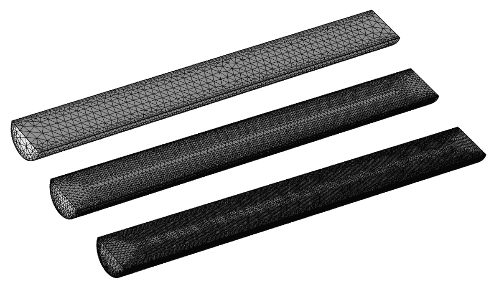

# 用 COMSOL Multiphysics 模拟管道中的层流和不可压缩内部流

> 原文：<https://medium.com/geekculture/modeling-laminar-and-incompressible-internal-flow-in-a-pipe-using-comsol-multiphysics-f06078611228?source=collection_archive---------15----------------------->

## 用计算流体动力学程序理解不可压缩流体流动

流体中的层流(在流体力学中，流体是指任何流动的东西)指的是流体颗粒在规则路径中平滑移动的行为。这与紊流形成鲜明对比，在紊流中…