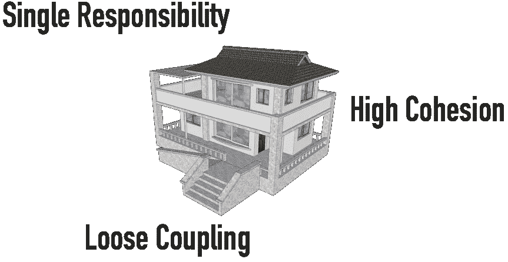

# 建模微服务

> 原文：<https://medium.com/geekculture/modeling-microservices-df0aaa89ddf9?source=collection_archive---------11----------------------->

## 在这篇文章中，我将介绍在对微服务建模时我们必须牢记的三个重要原则。

Microservices Modeling — Fundamental Principles

开发微服务的第一步是对它们建模。这有助于定义微服务的范围。这第一步关系重大。不恰当的建模会导致软件中的严重灾难…