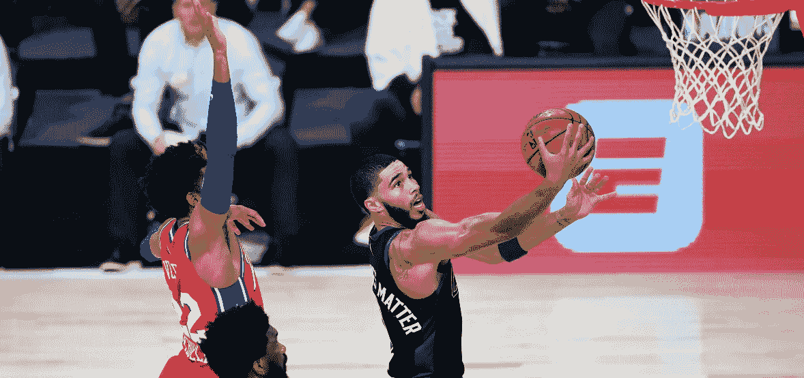
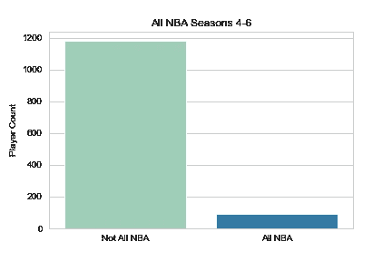
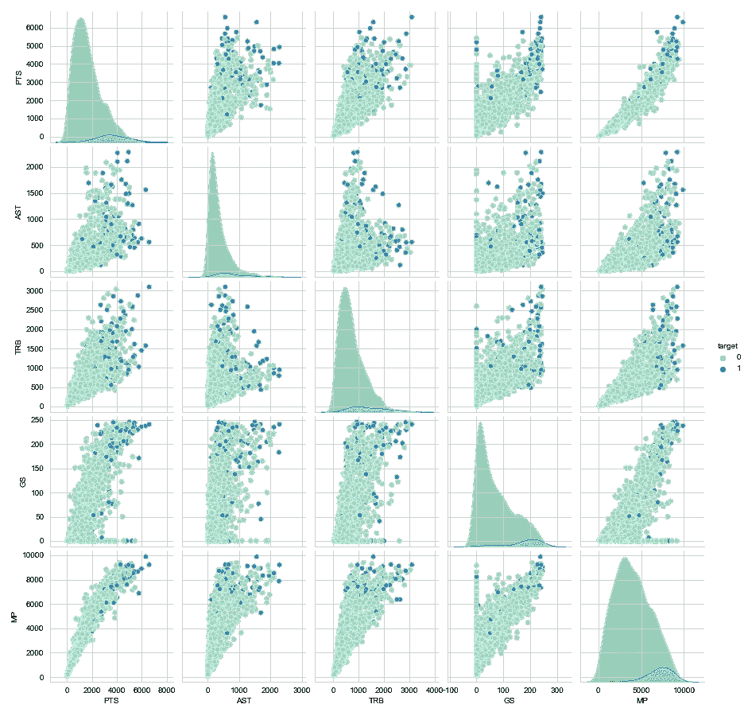
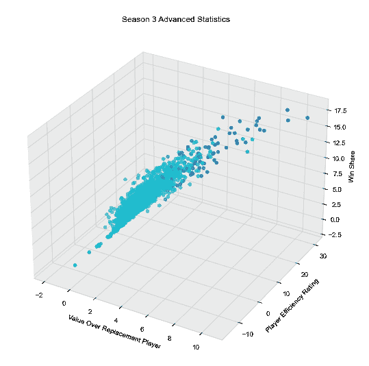
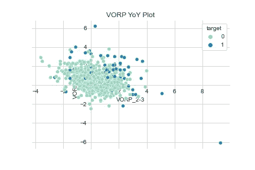
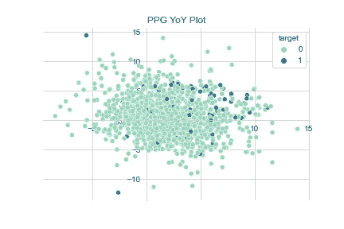

# 模拟 NBA 飞跃——第二部分

> 原文：<https://medium.com/geekculture/modeling-the-nba-leap-part-ii-7675ae101796?source=collection_archive---------36----------------------->

## 未来 NBA 全明星的分类

Source: [Action Network](https://www.actionnetwork.com/nba/76ers-vs-celtics-nba-playoffs-betting-odds-picks-predictions-game-2)

*对于本博客的第一部分，请点击* [***这里***](https://rylewww.medium.com/modeling-the-nba-leap-part-1-e9652fa64f80) *。*

回到这个话题——我们最后一次停止了由合格的 NBA 球员前三个赛季的统计数据组成的干净的数据集。这给我们留下了大约 1300 行球员和 100 多列篮球统计数据。提醒一下，我们的目标变量是在第四到第六赛季被选入 NBA 最佳阵容的球员。现在让我们开始深入研究我们的数据。

## 探索性数据分析

首先让我们看看我们的班级分布是什么样的:

Image by author

我们只有两种类型:“全联盟”或“非全联盟”如你所见，根据左边的柱状图，我们有一个主要的阶级不平衡。这是有意义的，因为在第四到第六赛季组成一支全明星阵容是一个重大的成就，我们的目标球员是像迈克尔·乔丹、科比·布莱恩特、勒布朗·詹姆斯等这样的人。

由于我们的大部分数据是连续的——我们可以开始在散点图中查看我们的数据，将我们的目标玩家编码为不同的颜色，以查看他们是否在统计上与他们的同龄人不同。让我们看看下面的 pairplot 中的一些基本累积统计数据。

Image by author

我们的 pairplot 显示了球员前三个赛季的累计得分*，助攻，篮板，比赛开始时间*和上场时间*的总和。浅绿色的圆点代表非 NBA 球员，而深蓝色的圆点代表 NBA 球员。随着我们向 x 轴和 y 轴的上限移动，你开始看到越来越多的蓝色 NBA 数据点出现。这告诉我们，即使从一些最基本的统计数据来看，所有 NBA 球员都开始将自己与联盟中的其他球员区分开来。*

Image by author

进一步看，现在我们进入一些更高级的统计。如果你还记得，这些统计数据直到 70 年代才被追踪。这些类型的统计数据真正开始区分所有 NBA 球员和他们的同龄人。左边的 3D 散点图显示了 VORP ( [*)价值超过替补球员*](https://www.basketball-reference.com/about/glossary.html) *)、PER (* [*球员效率等级*](https://www.basketball-reference.com/about/glossary.html) *)和 WS(*[*【win-share】*](https://www.basketball-reference.com/about/glossary.html)*)*之间的对比，同样，与基本统计数据一样，我们可以真正看到我们所针对的 NBA 球员类型的差异。

结合这些统计数据，我们可以开始描绘是什么造就了全明星球员。能否进一步鉴定？让我们深入研究一下，看看是否有任何形式的同比增长可以帮助我们预测最佳 NBA 球员。

Images by author

作为例子，我绘制了一个高级统计数据(VORP)和一个更基本的统计数据(PPG——每场比赛的得分)。理想情况下，我们希望在两个图的右上角看到大多数蓝队-全明星球员，因为 x 轴代表第 1 和第 2 赛季之间的差异，y 轴代表第 2 和第 3 赛季。我们确实在两个图中看到了一些分离，但不如我们只看早期散点图的统计总数时那么多。这可能向我们表明，所有 NBA 优秀的球员进入联盟后都准备好了立即做出贡献，而不需要年复一年地表现出巨大的进步。

## 后续步骤

我并不期望就这个项目的 EDA 写一整篇博文——但我打赌你能猜到任何数据科学项目中我最喜欢的部分是什么。视觉效果可以帮助识别驱动目标的特征，还可以为那些不喜欢深入了解的人带来生动的数据。

在我的下一篇文章中，我保证我们会深入一些**特征选择**和**建模**！在此之前，请提出任何问题或建议！我的[LinkedIn](https://www.linkedin.com/in/rylewww/)T32[GitHub](https://github.com/rylewww)

一个完整的笔记本的代码为这些视觉效果和许多许多其他可以找到 [**这里**](https://github.com/rylewww/Modeling-The-NBA-Leap/tree/main/Notebooks) ！

参考资料:

*   [篮球参考词汇](https://www.basketball-reference.com/about/glossary.html)