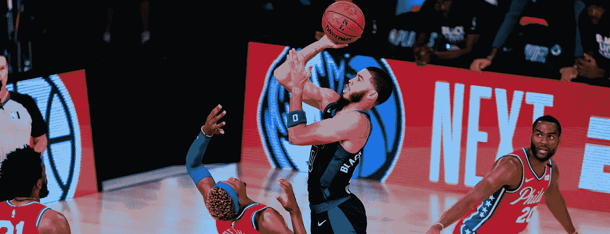
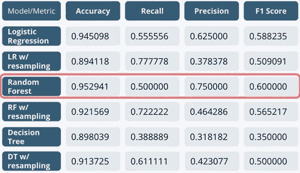
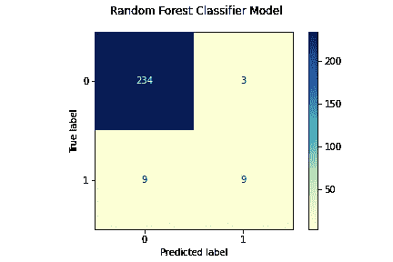
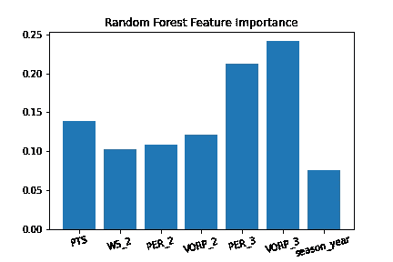

# 模拟 NBA 飞跃——第三部分

> 原文：<https://medium.com/geekculture/modeling-the-nba-leap-part-iii-74e31f55ee92?source=collection_archive---------59----------------------->

## 未来 NBA 全明星的分类



Source: [Boston Herald](https://www.bostonherald.com/2020/08/19/live-blog-celtics-vs-76ers-game-2/)

*如果你还没有，请阅读* [***第一部分***](/geekculture/modeling-the-nba-leap-part-1-e9652fa64f80)**&*[***第二部分***](/geekculture/modeling-the-nba-leap-part-ii-7675ae101796) *。**

## *概述*

*   ***商业问题—** 我们能否根据 NBA 球员在联盟的前 3 个赛季预测他们是否会在第 4-6 赛季入选全明星阵容？*
*   ***数据集** —经过网络搜集和数据格式化，我们剩下了大约 1300 名合格玩家和 100 多列统计特征。*
*   ***度量** —精确度，努力减少误报*
*   *EDA——只有 7%的合格玩家达到我们的目标。最初的分析表明，所有 NBA 水平的球员都准备好在联盟中做出高水平的贡献，将自己与同龄人区分开来。*

## *特征工程*

*这个项目的大部分功能工程是在我们格式化数据集时完成的。其中包括:*

*   *创建“每场比赛”统计数据，如**场均得分(ppg)和场均助攻(apg)***
*   *每个统计类别的年度波动*
*   *添加类别奖励*
*   *创造了一个新秀年的特性，允许玩家根据他们在哪个时代打球来分类*

*如前所述，在我们完成数据集的格式化并通过特征工程后，我们的数据集有超过 100 个特征供我们分析。*

## *特征选择和建模*

*我们将关注的模型需要是可解释的。这意味着，虽然我们可以使用更先进的建模技术来增加我们的评估指标，但这些模型不一定会向我们展示我们的特征对识别我们的目标变量有多重要。考虑到这一点，我们将利用:**逻辑回归、决策树**和**随机森林**模型，因为我们将能够从这些模型中提取可推断的洞察力，让我们看到哪些特征可以帮助预测 NBA 最佳球员。*

*确定了我们的模型类型后，我接着使用 [**递归特征消除**](https://scikit-learn.org/stable/modules/generated/sklearn.feature_selection.RFE.html) 来帮助确定哪些特征最适合每个模型，并减少我们的整体维度。有了 100 多个特征，很容易在我们的训练数据集上过度拟合我们的模型。下面是我们的随机森林模型 RFE 使用的代码。*

```
****#we first split the data into our training and testing sets***
X = df.drop(columns = 'target')
y = df['target']X_train, X_test, y_train, y_test =  train_test_split(X, y, train_size= .8, random_state= 42)***#we then scaled all of the continuous variable***s
nba_scaled = StandardScaler()nba_scaled.fit(X_train)
X_train_sc = pd.DataFrame(nba_scaled.transform(X_train), index = X_train.index, columns = X_train.columns)
X_test_sc = pd.DataFrame(nba_scaled.transform(X_test), index = X_test.index, columns = X_test.columns)***#next we instantiated our cross-validation RFE for our random forest***
rfe_rf = RFECV(estimator=RandomForestClassifier(class_weight = 'balanced', random_state = 42), step = 1, cv = 3, scoring = 'precision', n_jobs = -1, verbose = 1)
rfe_rf.fit(X_train_sc, y_train)
X_train_sc.columns[rfe_rf.get_support()]*
```

*一旦我们运行 RFE，我们的**随机森林**模型就剩下以下特征: **['PTS '，' WS_2 '，' PER_2 '，' VORP_2 '，' PER_3 '，' VORP_3']** 。**逻辑回归** & **决策树**模型也通过 RFE 选择了相似的特征。*

*接下来，选择我们的特征，我们开始为每种类型的模型调整超参数。我们对每个模型进行了密集的网格搜索，并利用 [**SMOTE**](https://machinelearningmastery.com/smote-oversampling-for-imbalanced-classification/) 重采样来解决我们主要的职业不平衡问题。一天结束时，非 SMOTE 重采样模型在测试集上表现更好。下面是用于我们的随机森林模型的代码:*

```
****#RFE columns + 'season' to account for generational trends***
rf_cols =['PTS', 'WS_2', 'PER_2', 'VORP_2', 'PER_3', 'VORP_3', 'season_year']***#paramters for our grid-search***
params = { 
    'n_estimators': [10, 25, 50, 100, 200, 500],
    'max_features': ['sqrt', 'auto', 'log2'],
    'max_depth' : [2,4,6,8,10,12,15,20],
    'criterion' :['gini', 'entropy']
}rf = RandomForestClassifier(random_state = 42)#***running the grid-search***
grid_search_RF = GridSearchCV(estimator=rf, param_grid=params, scoring=scorer, 
                              cv = 5, n_jobs = -1, verbose = 2)***#fitting our grid-searched model to our RFE data***
grid_search_RF.fit(X_train_sc[rf_cols], y_train)*
```

*一旦我们对所有的模型进行网格搜索和重新采样，我们的测试集就会得到以下结果:*

**

*Image by author*

*正如前面提到的，我们的**随机森林**模型在没有重采样的情况下取得了最大的成功。我们的准确度得分为 95.3%，比我们的基线 93%(基于每次选择主导类别的虚拟模型)高出 2.3%，但更重要的是，我们的**精确度**得分为 75%，这表明我们的模型在预测未来的 NBA 球员时，在减少误报方面做得很好。让我们更深入地了解一下我们的成功模式。*

***

Images by author* 

*根据上面的混淆矩阵，我们可以直观地看到我们的模型如何得分。虽然它在减少假阳性方面做得很好，但它在召回率为 50%的情况下与假阴性作斗争。这告诉我们，我们的模型在预测谁真正有资格成为全明星球员时可能有点严格。*

*如前所述，我们希望能够从表现最佳的模型中获得有价值的见解。有了随机森林模型，我们能够提取特征重要性，看看哪些统计数据最有助于识别未来的 NBA 球员。上图中，我们可以看到第三季的**比& VORP** 和**总积分**得分最高确定了我们的目标玩家。这可以追溯到我们之前在 EDA 上的博客，在那里我们确定，似乎所有 NBA 水平的球员都准备好了高水平的表现，并不一定表现出巨大的同比增长。*

## *后续步骤*

*该项目中有许多需要改进的地方，例如，我们希望扩展/实施:*

*   *团队成功特征，因为获胜团队和明星球员之间可能存在潜在的相关性*
*   *进一步的类别不平衡技术*
*   *更深层次的代际分析 NBA 的比赛风格在几代人的时间里发生了巨大的变化*
*   *预测我们持有的至少打了 3 个赛季，但少于 6 个赛季的球员*

*感谢您关注这个项目，如果您有任何问题/建议/意见，请联系我们。随着时间的推移，我们将继续修补这些模型和数据集，所以请关注本系列的另一个安装。在此期间，完整的项目可以在 这里查看 [**。**](https://github.com/rylewww/Modeling-The-NBA-Leap)*

*我们上 [**Linkedin**](https://www.linkedin.com/in/rylewww/) 连线吧！*

## *参考*

*   *[https://sci kit-learn . org/stable/modules/generated/sk learn . feature _ selection。RFE.html](https://scikit-learn.org/stable/modules/generated/sklearn.feature_selection.RFE.html)*
*   *[https://machine learning mastery . com/smote-over sampling-for-unbalanced-class ification/](https://machinelearningmastery.com/smote-oversampling-for-imbalanced-classification/)*