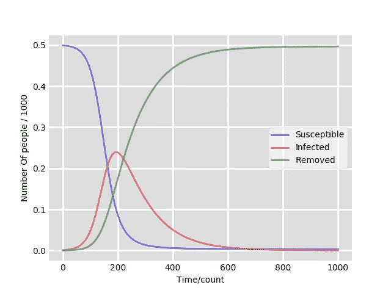
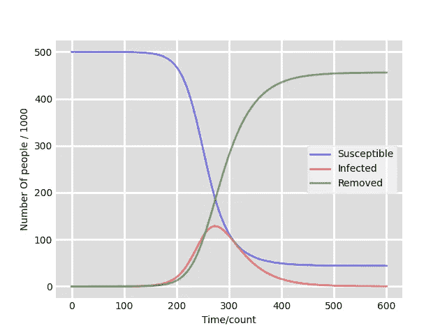

# 模拟现代疫情——发展 SIR 模型

> 原文：<https://medium.com/geekculture/modelling-a-modern-day-pandemic-developing-the-sir-model-8d77599050ce?source=collection_archive---------46----------------------->

在上一篇文章中，我们讨论了为什么我们要对疾病进行建模，以及我们可以使用哪些技术。在这一课中，我们将会看到，如何发展一个微分方程系统的模型



Source: Author


我们讨论了前一篇文章中使用的三个微分方程，所以给你一个简要的介绍。第一个表明易感图的梯度与个体的感染率成反比。第二个显示感染图的梯度等于人们被感染的速率减去人们从模型中被移除的速率。最后一张显示，去除图形的梯度与感染人数成正比。

# 构建模型

Python 是开发这个模型的理想语言选择，因为它有丰富的图形工具库和快速的开发时间。

我们首先要决定使用哪个绘图库，matplotlib 是显而易见的选择，因为它易于使用。如果你没有安装 matplotlib，你将不得不使用 pip 来安装它。

# Windows 操作系统

```
py -m pip install matplotlib
```

# **Unix/OSX**

```
python3 -m pip install matplotlib
```

将 matplotlib 添加到 python 代码中时，我们需要指定要添加 matplotlib 的哪一部分，在本例中，我们要添加 pyplot。我们还将把它安装为 plt，以避免到处编写 matplotlib.pyplot。

```
install matplotlib.pyplot as plt
```

对于我们的模型，我们还需要导入另外两个模块 numpy 和 scipy。您可以使用 pip 来完成此操作。然后我们需要将它们添加到我们的 python 代码中。对于 scipy，像 matplotlib 一样，我们需要指定我们想要的部分，我们想要可以在 scipy 的积分部分找到的微分方程解算器。所以现在代码应该是这样的

```
install matplotlib.pyplot as plt
import numpy as np
from scipy.integrate import odeint
```

在我们的主函数中，我们希望获得以下值:总人口、开始感染、开始删除、被感染的概率、被删除的概率和模型运行时间。你可以用任何你想要的方式来做，我选择让用户输入它们

```
def main():
    N = int(input("Total Population: ")) 
    I_0 = int(input("Total Number of Infected at time = 0: "))
    R_0 = int(input("Total Number of Removed at time = 0: "))
    S_0 = N - I_0 - R_0 #S_0 is starting susceptible
    alpha = float(input("Chance of Infection: ")) 
    beta = float(input("Fraction of People who recover per day: "))
    MaxTime = int(input("Time for which the model should run: "))
    RunTime = np.linspace(0, MaxTime, MaxTime)
```

虽然手动求解微分方程系统是可能的，但是用 python 函数来解决这个问题会更快。这就是 scipy 的用武之地。

```
def Find_Deriv(y, RunTime, N, alpha, beta):
    S, I, R = y
    dsdt = -alpha * S * I/N
    didt = (alpha * S * I/N) - (beta * I)
    drdt = beta * I
    return dsdt, didt, drdt
```

这个函数告诉模型在模型中给定点的微分方程是什么。我们现在必须给我们的主函数添加一些代码

```
y_0 = S_0, I_0, R_0
coord = odeint(Find_Deriv, y_0, RunTime, args = (N, alpha, beta))
S, I, R = coord.T
```

这 3 条线为每次计数生成 3 个图形的坐标。现在是简单的部分，绘制图表。

```
fig = plt.pyplot.figure(facecolor ='w')
ax = fig.add_subplot(111, facecolor = '#dddddd', axisbelow = True)
ax.plot(RunTime, S/1000, 'b', alpha = 0.5, lw = 2, label = "Susceptible")
ax.plot(RunTime, I/1000, 'r', alpha = 0.5, lw = 2, label = "Infected")
ax.plot(RunTime, R/1000, 'g', alpha = 0.5, lw = 2, label = "Removed")ax.set_xlabel('Time/count')
ax.set_ylabel('Number Of people / 1000')
ax.yaxis.set_tick_params(length = 0)
ax.xaxis.set_tick_params(length = 0)
ax.grid(b=True, which = 'major', c= 'w', lw=2, ls='-')
legend = ax.legend()
legend.get_frame().set_alpha(0.5)
for x in ('top', 'right', 'bottom', 'left'):
    ax.spines[x].set_visible(False)plt.pyplot.show()
```

一旦将这个添加到主函数中，我们就有了模型。所以把它们放在一起，我们得到了 SIR 模型

```
import matplotlib.pyplot as plt
import numpy as np
from scipy.integrate import odeintdef Find_Deriv(y, RunTime, N, alpha, beta):
    S, I, R = y
    dsdt = -alpha * S * I/N
    didt = (alpha * S * I/N) - (beta * I)
    drdt = beta * I
    return dsdt, didt, drdtdef main():
    N = int(input("Total Population: ")) #N = TotalPopulation
    I_0 = int(input("Total Number of Infected at time = 0: "))
    R_0 = int(input("Total Number of Removed at time = 0: "))
    S_0 = N - I_0 - R_0 alpha = float(input("Chance of Infection: ")) #Chance of     Infection
    beta = float(input("Fraction of People who recover per day: ")) #Fraction Of people who recover per count MaxTime = int(input("Time for which the model should run: "))
    RunTime = np.linspace(0, MaxTime, MaxTime) y_0 = S_0, I_0, R_0
    coord = odeint(Find_Deriv, y_0, RunTime, args = (N, alpha, beta))
    S, I, R = coord.T fig = plt.pyplot.figure(facecolor ='w')
    ax = fig.add_subplot(111, facecolor = '#dddddd', axisbelow = True)
    ax.plot(RunTime, S/1000, 'b', alpha = 0.5, lw = 2, label = "Susceptible")
    ax.plot(RunTime, I/1000, 'r', alpha = 0.5, lw = 2, label = "Infected")
    ax.plot(RunTime, R/1000, 'g', alpha = 0.5, lw = 2, label = "Removed") ax.set_xlabel('Time/count')
    ax.set_ylabel('Number Of people / 1000')
    ax.yaxis.set_tick_params(length = 0)
    ax.xaxis.set_tick_params(length = 0)
    ax.grid(b=True, which = 'major', c= 'w', lw=2, ls='-')
    legend = ax.legend()
    legend.get_frame().set_alpha(0.5)
    for x in ('top', 'right', 'bottom', 'left'):
        ax.spines[x].set_visible(False) plt.pyplot.show()main()
```

当您运行代码时，只要您没有犯任何错误，您将会得到一个类似这样的图形



Source: Author

在本例中:

*   总人口= 500000
*   开始感染= 1
*   移除起始= 0
*   感染几率= 0.08
*   被移除的几率= 0.03

希望这篇文章对如何构建一个基本的微分方程模型有所启发。在接下来的两篇文章中，我们将着眼于基于代理的模型的开发。