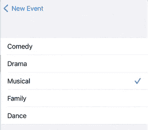

# 用 SwiftUI 选择器对可选属性建模

> 原文：<https://medium.com/geekculture/modelling-an-optional-attribute-with-swiftui-pickers-34cab2dba562?source=collection_archive---------11----------------------->

## 如何在不触及自定义代码的情况下表达“以上都不是”

How SwiftUI’s picker can look when used in the context of an iOS form

SwiftUI 中的`Picker`是一个非常通用的视图，允许用户从离散值列表中进行选择。根据您使用的平台，这些值可以显示在一个可滚动的滚轮中，作为一个 web 样式的下拉列表，一个分段列表，或者…