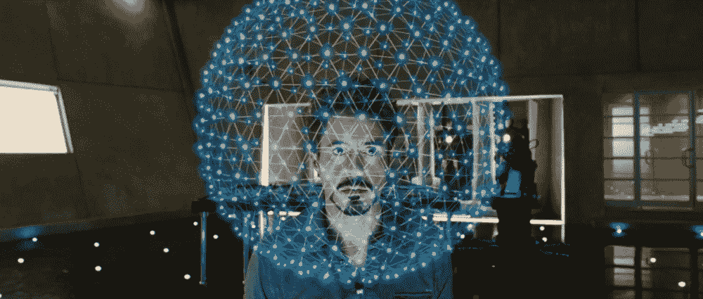
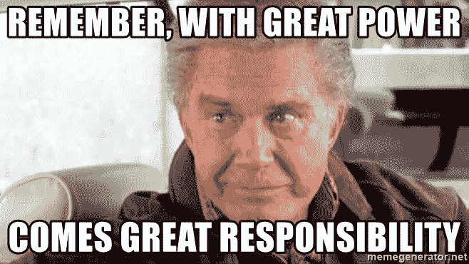

# 在 Three.js 中创建托尼·斯塔克的“Badassium”

> 原文：<https://medium.com/geekculture/modelling-tony-starks-badassium-in-three-js-11141e1316f0?source=collection_archive---------4----------------------->

学习 Three.js 绝对是一个漫长的旅程。对我来说，一个术语一个术语或一页一页地学习从来都不是一种有趣的方式。我很久以前看过钢铁侠电影，它们无疑是我最喜欢的超级英雄电影之一。所以我想为什么不尝试用 Three.js 制作钢铁侠中的一些酷的动画，比如西装革履的场景？如果我能做到的话，那就太酷了…所以我在这里尝试一些更简单，但看起来仍然很酷的东西！



The Atomic structure of “Badassium”

是的，我正试图重现托尼从他父亲的暗示中发现的新元素“钡”的全息原子结构。如果你知道更简单的方法，请在下面评论！如果有可能的话，我会非常兴奋。这并不是很难实现，但我还是花了一些时间来弄清楚如何轻松地渲染这些原子之间的相互联系的线条。

事不宜迟，让我们直接进入代码！

# 快速介绍

这是托管在 codesandbox.io 上的工作演示:

我将在这三个部分解释我的代码:

*   使用的几何形状和材料
*   所需的自定义着色器代码
*   布鲁姆效应

# 几何形状和材料

使用的几何图形是`THREE.IcosahedronGeometry(6, 6)`而不是球面几何图形，因为球面几何图形中三角形的排列方式不同，而二十面体几何图形是最接近钢铁侠 2 电影中全息视觉的几何图形。

你可以看到，我为几何体调用了`addCenterAttribute`来添加一个额外的名为`center`的缓冲属性。我将在下一节解释它在自定义着色器中的作用。

组装这个全息图需要两个网格，一个是原子，另一个是键。“为什么我不能用一个定制的网格达到同样的效果，”你可能会想。这很大程度上是因为二十面体几何中的原子和键的表现非常不同。请注意，我正在渲染要从顶点分离的线，为了实现这一点，我必须使用自定义着色器。

`atomMaterial`是容易的部分。

```
atomMaterial = new THREE.PointsMaterial({
    size: 0.8,
    color: 0x0567ba,
    map: baseTxt,
    alphaMap: alphaTxt,
    transparent: true,
    depthWrite: false
});
```

上述代码的注释:

*   我描绘原子的方式是将我定制的 alpha 纹理放在基础纹理的上面，基础纹理只是一个白色的正方形。
*   然后我将`color`设置为蓝绿色。
*   因为 alpha 纹理是部分透明的，所以`transparent`属性需要为真。
*   我还需要设置`depthWrite`为假，以消除当我的较近的原子在较远的原子前面时，在它们周围看到的硬黑边。

`bondMaterial`是更难的部分，因为我们正在使用`THREE.ShaderMaterial`。

```
bondMaterial = new THREE.ShaderMaterial({
    vertexShader: vertexShader(),
    fragmentShader: fragmentShader(),
    side: THREE.DoubleSide,
    transparent: true // this is important for the alpha value to work in the fragment shader
});
```

ShaderMaterial 让您可以自由指定自己的`vertexShader`和`fragmentShader`。但是正如本叔叔所说:



你现在背负着理解着色器如何工作的重担！我觉得，兄弟，我和你在理解所有这些着色器巫术的同一阶段。请放心，我将在下一节深入介绍自定义着色器代码。

定义好几何体和材质后，需要将它们作为`THREE.Points`和`THREE.Mesh`添加到场景中:

```
const spherePoints = new THREE.Points(geometry, atomMaterial);
const sphereLines = new THREE.Mesh(geometry, bondMaterial);scene.add(spherePoints);
scene.add(sphereLines);
```

# 编写自定义着色器代码

那么这些`vertexShader`和`fragmentShader`是什么东西呢？我强烈推荐阅读这本在线书籍[https://thebookofshaders.com/](https://thebookofshaders.com/)的前 3 页，如果你对着色器和 GLSL 没有什么背景知识的话，可以对它们有一个大致的了解。我假设您已经阅读了它，所以在这里解释代码时，我就不赘述了。

第一站，顶点着色器。它基本上是一个在你的几何体的每个顶点上运行的函数，目的是计算每个顶点在渲染空间中的最终位置。

我们在这里简单地使用了标准的顶点着色器，因为我们没有改变二十面体的顶点位置。

```
function vertexShader() {
  return `
    attribute vec3 center;
    varying vec3 vCenter;

    void main() {
      vCenter = center; gl_Position = projectionMatrix * modelViewMatrix * vec4(position, 1.0); 
    }
  `;
}
```

上述代码的注释:

*   这个`vertexShader`函数返回一个文本字符串，因为这是 GLSL 代码，而不是 javascript 代码。这段代码将在 GPU 中运行。
*   `main()`函数中的最后一行基本上是先将顶点位置从*模型空间*转换到*摄像机空间*，然后再进一步转换到*投影空间*。强烈推荐阅读[http://www . OpenGL-tutorial . org/初学者-教程/教程-3-矩阵/](http://www.opengl-tutorial.org/beginners-tutorials/tutorial-3-matrices/) 了解这些矩阵运算。
*   着色器接受`center`属性，并简单地将其作为`vCenter`提供给片段着色器。我要马上解释这个。

接下来，片段着色器。这是我们定义代码来计算顶点之间每个像素的最终颜色的地方。这就是乐趣的开始…

```
function fragmentShader() {
  return `
    varying vec3 vCenter; void main() {
      if (vCenter.x > 0.02 && vCenter.y > 0.02 && vCenter.z > 0.02) {
        discard;
      } else {
        if (vCenter.x < 0.02 && (vCenter.y < 0.25 || vCenter.z < 0.25)) {
          discard;
        }
        if (vCenter.y < 0.02 && (vCenter.x < 0.25 || vCenter.z < 0.25)) {
          discard;
        }
        if (vCenter.z < 0.02 && (vCenter.y < 0.25 || vCenter.x < 0.25)) {
          discard;
        }
      }
      gl_FragColor = vec4(0.77, 0.90 ,1.0 , 0.2);
    }
  `;
}
```

为了理解上面的代码如何处理`vCenter`属性，我们首先需要回到`addCenterAttribute`函数，看看它做了什么。

```
function addCenterAttribute(geometry) {
  const vectors = [
    new THREE.Vector3(1, 0, 0),
    new THREE.Vector3(0, 1, 0),
    new THREE.Vector3(0, 0, 1)
  ]; const position = geometry.attributes.position;
  const centers = new Float32Array(position.count * 3); for (let i = 0, l = position.count; i < l; i++) {
    vectors[i % 3].toArray(centers, i * 3);
  } geometry.setAttribute("center", new THREE.BufferAttribute(centers, 3));
}
```

它基本上是这样做的:使用`center`属性为每个顶点分配一个指向 x、y 和 z 方向的单位向量，这样片段的每 3 个顶点(片段是一个有 3 个顶点的三角形)都指向垂直的方向。

回到`fragmentShader`，然后`vec3 vCenter`的值被自动插入 3 个顶点之间的像素。因此，在片段的边缘上，`vCenter`的向量值将使 3 个分量中的一个为零。在碎片边缘内的区域，`vCenter`向量的所有 3 个分量肯定都是非零的。

如果你能理解我刚才所说的，那么片段着色器代码现在应该对你有意义了。

*   首先，我用阈值`0.02`丢弃了碎片边缘内的所有像素，基本上重建了线框效果。
*   然后，对于现在边缘上的像素，我进一步丢弃那些靠近顶点的像素，阈值为`0.25`。这基本上是修剪每条线两端 25%的长度。
*   最后，我将像素颜色设置为不透明度为 20%的浅蓝色，使线条比原子更透明。

# 布鲁姆效应

这部分只是简单地给场景添加一个发光的后期处理，这样模型全息图看起来就像电影中的视觉效果。

在 init 代码中，我们需要设置`UnrealBloomPass`和`EffectComposer`。

```
const renderScene = new RenderPass(scene, camera);const bloomPass = new UnrealBloomPass(
    new THREE.Vector2(window.innerWidth, window.innerHeight),
    params.bloomStrength,
    params.bloomRadius,
    params.bloomThreshold
);composer = new EffectComposer(renderer);
composer.addPass(renderScene);
composer.addPass(bloomPass);
```

然后在`onWindowResize`函数中，我们也需要更新作曲者的大小。

在`render`函数中，我们现在调用`composer.render()`而不是`renderer.render(scene, camera)`。

通过使用 GUI 控件打开/关闭光晕效果，您将能够看到不同之处。

就我个人而言，我觉得通过制作这个演示，我学到了很多东西，我很开心！之前不知道怎么写着色器代码。在这之后，我想我可以开始学习更复杂的着色器代码。

请在评论中告诉我你的想法！