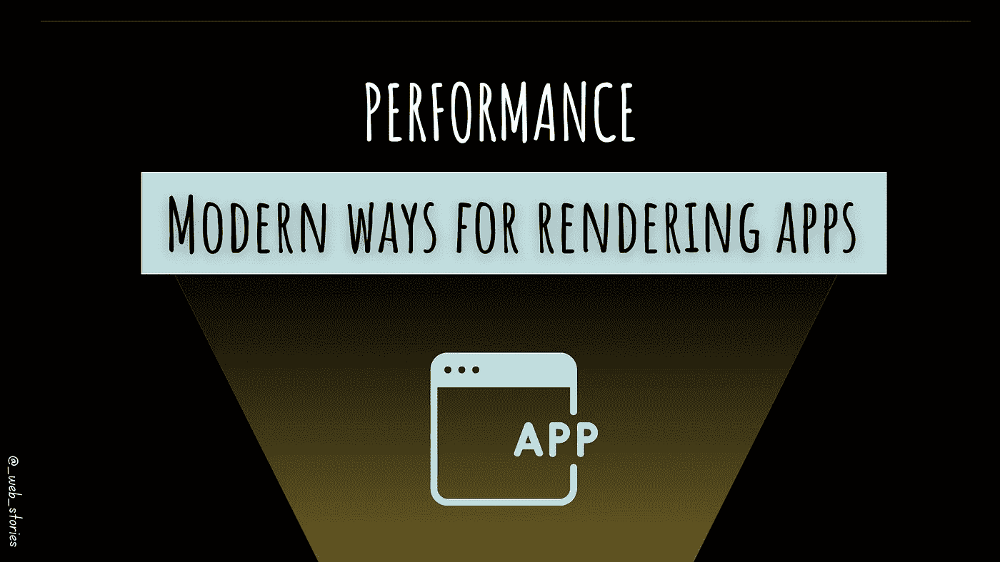

# 现代应用渲染策略

> 原文：<https://medium.com/geekculture/modern-app-rendering-strategies-8abe997d1928?source=collection_archive---------18----------------------->

## 优化应用程序性能的现代方法

By FAM

## 你好👋

## 如今，现代网络应用程序…

在本章的开始，我介绍了一些传统的和历史上已知的提高性能的方法。但是网络正以越来越多的性感动画、特写和更多内容发展。移动用户是…