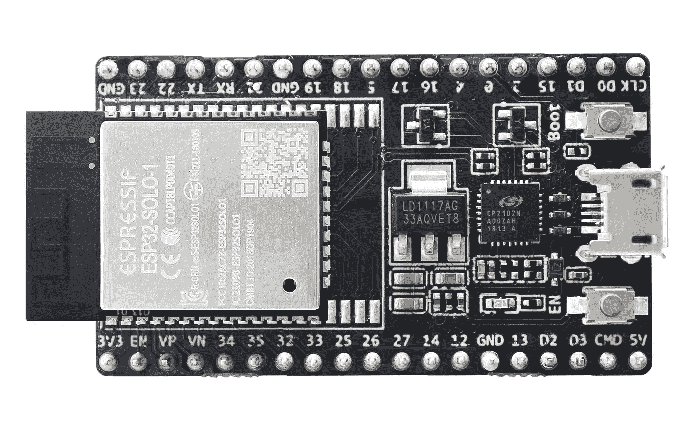

# 带有 ESP32 的现代 C++

> 原文：<https://medium.com/geekculture/modern-c-with-esp32-dcd3918dd978?source=collection_archive---------1----------------------->



ESP32-SOLO-1 board. Photo from [stringfixer.com](http://stringfixer.com)

传统上，微控制器编程是使用 C 编程语言来完成的，尤其是当您使用小型微控制器时。感谢 Arduino，我们都能够轻松地将 C++用于小型微控制器，如 ATmega328P (Arduino UNO)。众所周知，与 C 相比，C++拥有丰富的特性，但是在微控制器编程中，我们能使用多少 C++特性呢？

为了回答这个问题，我们将使用 ESP32，因为它非常强大，具有相对较大的存储容量(512 KB RAM 和 4 MB SPI 闪存)。另一个原因是 Arduino 对 ESP32 的支持默认启用了 C++11 特性。因此，您可以开始使用现代 C++而无需额外的配置。

像 C++14、C++17 甚至 C++20 这样的新标准怎么样？简而言之，你可以使用它们，但是要启用它们还需要做很多额外的工作，我们不会在这篇文章中一一介绍。

我们打算先用 C++11，在以后的帖子里再转到下一个标准版本。所以，让我们开始吧！

Arduino for ESP32 在其构建脚本中默认启用 C++11。下面是直接从 GitHub 的 [espressif/arduino-esp32](https://github.com/espressif/arduino-esp32) 库中的 platform.txt 文件中获取的完整的 ESP32 c++构建标志。

```
compiler.cpp.flags.esp32=-mlongcalls -Wno-frame-address -ffunction-sections -fdata-sections -Wno-error=unused-function -Wno-error=unused-variable -Wno-error=deprecated-declarations -Wno-unused-parameter -Wno-sign-compare -ggdb -Os -freorder-blocks -Wwrite-strings -fstack-protector -fstrict-volatile-bitfields -Wno-error=unused-but-set-variable -fno-jump-tables -fno-tree-switch-conversion **-std=gnu++11** -fexceptions -fno-rtti  -MMD -c
```

如您所见，它使用 C++11，但启用了 GNU 扩展，而不是使用普通的 C++11。我不知道他们为什么使用 GNU 扩展，但是我们会在以后的文章中解决这个问题。

好了，确认了 Arduino for ESP32 默认使用 C++11(带 GNU 扩展)。所以我们开始用 C++11 写应该不需要额外的配置。

C++11 有很多新特性，但我不打算在这篇文章中一一介绍。我建议你去看看[简森·特纳的视频](https://www.youtube.com/watch?v=D5n6xMUKU3A)，它在十二分钟内突出了 C++11 的重要部分。他很好地解释了 C++11 的每个重要部分。请随意跳到视频，然后回到这里。

现在，让我们看看下面的代码清单

在上面的代码清单中，我们使用了 C++11 的一些特性。

首先，我们使用了函数版本的`attachInterrupt`函数。通常情况下，你必须像这样用旧的 C 函数风格来定义函数

```
void interruptFunction()
{
 // ...
}
```

as `attachInterrupt`函数接受一个指向函数类型`void (*interruptCallback)(void)`的指针。C++11 引入了包装函数的 [std::function](https://en.cppreference.com/w/cpp/utility/functional/function) 类模板。

`FunctionalInterrupt.h`头文件引入了接受`std::function<void(void)>`而不是函数指针的`attachInterrupt`函数版本。这样，我们可以使用一个 *lambda 函数*来处理中断！

第 7 行引入了`using`关键字，它作为引用先前定义的类型的[类型别名](https://en.cppreference.com/w/cpp/language/type_alias)，类似于`typedef`关键字。但是，我们为什么要为中断函数定义类型别名呢？我们很快就会知道了。

我们定义了一个类型为`InterruptFn`的 [lambda 函数](https://en.cppreference.com/w/cpp/language/lambda),这是我们之前定义的。该函数坚持其给定的类型，因为它不接受任何参数，也不返回任何内容(void)。

我们使用[列表初始化语法](https://en.cppreference.com/w/cpp/language/list_initialization)初始化 lambda 函数`interruptFuncion`。在这种情况下，它的作用与下面的代码清单相同

```
InterruptFn interruptFunction = []() {
  // ...
};
```

在第 19 行，我们使用了 [auto](https://en.cppreference.com/w/cpp/language/auto) 关键字，让我们在不知道赋值的实际类型的情况下定义变量。如果你正在初始化一个有长名字的类的实例，这个关键字是很有帮助的，特别是当你使用`new`关键字时，你必须键入类名两次。

## 放弃

通常，你不希望使用 lambda 函数来处理中断，因为这可能会有性能问题。使用旧的函数语法和`IRAM_ATTR`属性仍然被认为是定义中断处理程序的最佳方法。我在这里使用 lambda 的唯一原因是为了演示 C++11 的新特性。我不鼓励您在生产环境中也这样做。所以，使用起来风险自担！

因此，如果我们将此代码编译并上传到任何具有内置 LED(引脚定义为`LED_BUILTIN`)并具有连接到 GPIO 0 的物理按钮的 ESP32 供电板，我们可以看到 LED 状态(开/关)取决于按钮状态(按下/释放)。

## 如果我们不定义和使用 InterruptFn 别名会怎样？

ESP32 的`attachInterrupt`函数是在 ESP32 的 Arduino 核心中声明和定义的。如果我们包含了`Arduino.h`头，我们将得到带有以下签名的`attachInterrupt`函数

```
void attachInterrupt(uint8_t pin, **void (*)(void)**, int mode);
```

注意，第二个参数是一个指向函数的指针。

这里我们还包括了`FunctionalInterrupt.h`头，它提供了`attachInterrupt`功能，但是具有不同的签名

```
void attachInterrupt(uint8_t pin, **std::function<void(void)> intRoutine**, int mode);
```

如果我们不明确指定中断函数的类型，编译器会感到困惑，因为我们的实现与两个`attachInterrupt`函数声明都匹配。这将导致如下所示的编译器错误

```
src/main.cpp:24:54: error: call of overloaded 'attachInterrupt(uint8_t&, setup()::<lambda()>&, int)' is ambiguous
```

这两种方法都会产生与上面相同的错误

```
auto interruptFunction{
  // ...
};// or attachInterrupt(button, [](){ /* ... */ }, CHANGE);
```

## 结论

这是 ESP32 使用现代 C++的第一篇帖子的结尾。我们没有涵盖 C++11 的所有漂亮和酷的特性，因为 C++中引入了很多东西，我还没有找到 ESP32 特性的用例，但至少我们知道我们可以使用 C++11 而无需额外的配置。

感谢阅读！请不要犹豫给我你的反馈。