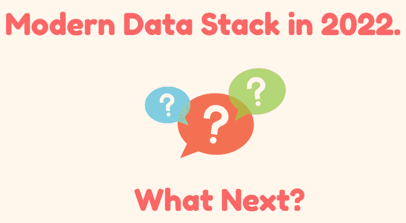
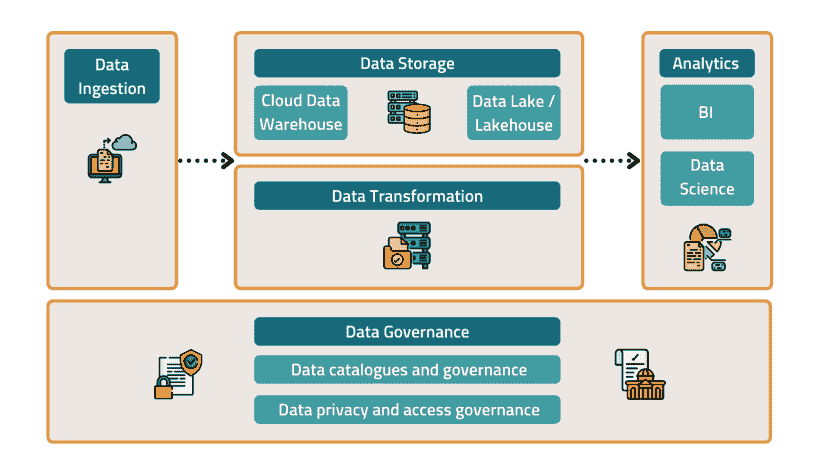
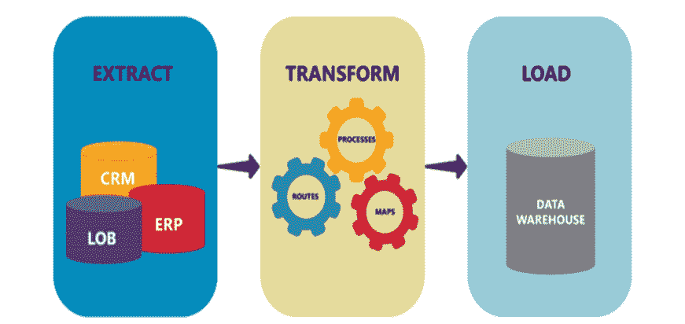
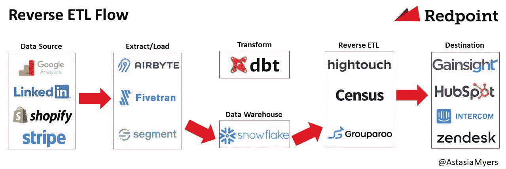

# 2022 年的现代数据堆栈—下一步是什么？

> 原文：<https://medium.com/geekculture/modern-data-stack-in-2022-whats-next-5bb5ec342d2c?source=collection_archive---------4----------------------->

Image by author

**目录:**

*   [简介 ](#6887)
*   [**2022 年现代数据栈架构**](#d60c) [**数据摄取**](#4ca7) [**数据仓库**](#e984) [**数据转换**](#0536) [**商业智能**](#aa22) [**数据治理**](#2ab3) [**数据编排**](#12a3) 
*   [**现代数据堆栈如何让企业倒闭**](#5ff3)
*   [**接下来是什么？**](#c8cb)

# 介绍

公司生成的数据量不断增加，使得数据存储比以往任何时候都更加复杂。根据[国际数据公司(IDC)](https://www.forbes.com/sites/tomcoughlin/2018/11/27/175-zettabytes-by-2025/#5755f2a05459) 的预测，到 2025 年将产生 175 兆字节的数据。这几乎是 2021 年产生的数据量(61 zettabytes)的三倍。

现代数据堆栈是指构成数据管道的一系列技术。它帮助公司从多个来源提取数据，并将其聚合到一个数据仓库中，转换数据，并将数据仓库连接到商业智能工具，以执行数据可视化等任务，从而促进决策制定。

在本文中，我们将讨论 2022 年的现代数据堆栈、它的缺陷以及它的未来。

# 2022 年的现代数据堆栈架构

The modern data stack architecture in 2022 (Source-neptune.ai)

现代数据架构中使用的架构和工具可能因公司而异。尽管如此，每个现代数据堆栈中都有许多核心组件。它们包括以下内容:

# 数据摄取

现代数据堆栈最重要的特征之一是创建单一的事实来源。它确保所有公司团队都使用相同的数据。这导致更快和更准确的见解。

数据接收是将数据从一个位置导入到一个新的目的地(如数据湖或数据仓库)进行存储和分析的过程。

创建现代数据堆栈的第一步是了解数据源。数据接收工具可以帮助您在几分钟内导入数据。

用于数据接收的工具示例包括 Improvado、Airflow、Stitch 和 Fivetran。

# 数据仓库

数据仓库是一个组织存储和组织数据的单一地方。它是公司团队访问和使用数据的地方。

由于需要存储和管理大量的数据，使用传统的关系数据库来存储结构化数据已经成为一种挑战。

NoSQL 数据库适合存储非结构化数据，但难以在混合环境中部署，因为它们与此类环境中使用的大多数工具缺乏兼容性。

为了克服这些限制，公司已经转向云数据仓库解决方案，因为他们提供自己的托管解决方案。例如，AWS 拥有用于对象存储的亚马逊简单存储服务(S3)。谷歌将 BigQuery 作为云平台的一部分。这些服务为大规模存储大量数据提供了低延迟平台。

公司用来创建数据仓库的流行工具包括 Snowflake、BigQuery、Databricks 和 Redshift。

**数据转换**

数据转换包括将数据从一种结构或格式转换为另一种结构或格式。这是使用提取、转换和加载(ETL)技术完成的。

Data transformation steps using ETL techniques (Source-www.astera.com)

数据转换在数据集成过程中起着至关重要的作用，因为它为进一步的分析、可视化和报告准备数据。数据转换适用于任何类型的数据集，无论其原始名称或格式如何。

数据转换工具包括 Dbt、Improvado DataPrep、RestApp、Alteryx、Matillon 和 MCDM。

# 商业智能

商业智能层负责分析数据并将其呈现给用户。它帮助企业确定他们的关键指标，以及它们如何随着时间的推移而变化。他们还可以建立指标之间的相互影响。

在大多数情况下，该层将您的数据转换为图形、图表和表格等可视元素。大多数商业智能工具能够帮助非技术用户在没有 SQL 知识的情况下学习和理解数据。

商业智能层中使用的工具示例包括 Looker、Tableau、Power BI 和 Domo。

# 数据治理

数据治理的目的是使企业系统中的数据可用、安全、可访问、符合内部标准和法规，并治理数据消费。它确保数据是安全、可靠和一致的。数据治理法规迫使公司想出保护数据的新方法，并依靠数据分析来做出更好的决策和简化运营。

数据治理是通过数据目录和数据隐私实现的。数据目录有助于企业跟踪和理解他们的数据，以提高可发现性、质量和共享，而数据隐私则通过解决敏感数据泄露等问题，帮助企业遵守法律。

# 数据编排

现代数据堆栈由许多层和管道组成。管理不同层之间的依赖关系、调度作业和监控数据流可能会很困难。这就是数据编排发挥作用的地方。它在数据堆栈中构建工作流和自动化流程来解决这一问题。数据编排帮助数据团队定义具有各种依赖关系的任务和数据流。

数据编排使用有向无环图(Dag)或任务的概念，显示不同数据流之间的依赖性和关系。数据编排还有助于数据工程师定义任务如何运行、重试和完成。通过数据编排，可以轻松地在云中创建、调度、监控和运行作业。

# 反向 ETL

这是一组将数据仓库数据同步到操作工具的过程或方法，如 CMS、CRM 或业务工具(如 Google Sheet、Slack 等)。

Reverse ETL Flow (Source-medium.com)

反向 ETL 帮助用户创建单一的、全面的数据源，提供公司数据的内聚视图。它提高了现有 ETL 流程的效率，并促进了运营分析。反向 ETL 过程以定义的时间间隔运行。

# 现代数据堆栈是如何让企业失败的

现代数据堆栈旨在使数据收集、分析和操作更快、更容易，从而使中小型企业成为数据驱动型企业。虽然它已经部分地实现了这一点，但是现代数据栈的实现还面临着许多障碍。这些障碍包括如下:

1.  **中间有太多的工具、流程和人员**

对于利用现代数据堆栈的企业来说，技术用户(数据科学家和数据分析师)和业务用户(销售、营销、财务和运营)能够与数据交互并参与其中至关重要。

现代数据堆栈需要添加工具来帮助具有不同技能的人从数据仓库中获取数据并使用它。这些工具促进了数据转换、商业智能、反向 ETL 和其他过程。这带来了太多的工具、流程和人员，随着用户熟悉这些工具，导致了额外的成本和复杂性。

**2。治理**

企业需要治理来扩展他们的运营。随着数据开始积累，整个公司的不同团队正在创建管道、转换和机器学习应用程序，了解谁以及人们如何与数据交互至关重要。

例如，数据可能在使用时被转换。如果没有好的技术或最佳实践来管理与数据交互的不同用户之间的转换，这会导致混乱。

**3。缓慢的业务灵活性**

现代数据堆栈中涉及的许多工具、流程和人员减缓了业务中的决策过程。数据必须经过许多工具和流程，然后才能提取洞察力以做出数据驱动的决策。

# 下一步是什么？

虽然许多数据团队已经采用了现代数据堆栈，并且围绕它的创新也在不断加速，但以下是对未来的一些预测:

1.  **统一工具**

现代数据堆栈带来了许多工具，导致复杂性和额外的成本。应对这一挑战的解决方案是拥有一个涵盖这些工具所有功能的端到端平台。[大台库在线](https://www.dataiku.com/product/dataiku-as-a-managed-service/)和 [Knowi](https://www.knowi.com/) 就是这类工具的典型例子。Dataiku Online 连接到数据，并支持可视化数据准备、集成报告、autoML 等，所有这些都在一个位置完成。Knowi 自称是一个不需要统一数据的统一分析平台。它消除了对传统 ETL 的需求，绕过了将原始数据存储在数据仓库中的要求。它可以与任何数据源进行本地交互——可以是 SQL 数据库、NoSQL 数据库、云服务、API 等。-实时以及跨来源连接数据。最重要的是，Knowi 提供了 BI 功能和基于自然语言搜索的分析。

**2。整合**

目前有太多的工具处理现代数据堆栈的每一部分，其中许多都有风投支持。随着 2022 年估值的下降以及收入和公司估值之间的预期差距，这些业务中的许多可能已经成熟，可以被更大的参与者(如雪花和 Databricks)收购，因为他们试图端到端地整合和控制堆栈。

**3。关注商业价值**

关于现代数据堆栈的最大抱怨之一是，将堆栈拼凑在一起的过多工具没有实现其推动业务价值的宣传。由于对多种工具、基于消费的模型和人员的“需求”,企业成本直线上升。除此之外，在企业内部，获得洞察力需要多长时间、总成本和复杂性方面，也有很多令人沮丧的事情。简化堆栈并专注于积极业务成果的解决方案将最有可能赢得下一个时代。