# 现代 JavaScript！👩🏻‍💻

> 原文：<https://medium.com/geekculture/modern-javascript-25cce3e5af8f?source=collection_archive---------14----------------------->

每个开发人员都必须知道的 ES6 新特性📝


# 现代 JavaScript 的特殊特性

📍JavaScript 可以被定义为一种非常强大的编程语言，它实际上是基于 ECMA 脚本。(ECMA 是基础，javascript 是基础)

📍JavaScript ES6 也称为 ECMAScript 6 或 ECMAScript 2015，是 2015 年作为 JavaScript 的新版本推出的。

在本文中，我将讨论以下主题:

> *1。范围*
> 
> *2。常数*
> 
> *3。箭头功能*
> 
> 4.函数和箭头函数
> 
> 5.处理对象
> 
> 6.冷冻法
> 
> 7.模板
> 
> 8.班级
> 
> 9.解构
> 
> 10.JavaScript 回调函数和承诺
> 
> 11.异步功能/等待

让我们开始编码**😎**

## ①范围

这是 javascript 中变量的可访问性，因此作用域控制代码中变量的可见性。有两种类型的范围:

✸ **全局变量** —这些是在块外声明的。在全局范围内声明的变量可以在代码中的任何地方被访问。

✸ **局部变量** — 这些是在一个块内部声明的。在局部范围内声明的变量只能在那个特定的块内访问。

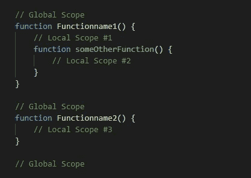

## ✸“让”关键字

✬关键字`“**let”**` 是 ES6 为了声明变量而引入的。所以我们使用“let”关键字来定义一个变量，这意味着一个特定的变量在其作用域之外是不可见的。

考虑下面的例子来理解这个概念:

带有“var”关键字的☛代码片段。(不带“let”关键字)

输出:

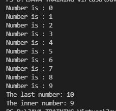

带有“let”关键字的☛代码段。

输出:

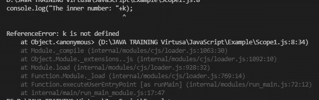

✬，这里我们得到了这个输出，因为我们在 for 循环中定义了 k，所以它不能在“for 循环”之外被访问。

✬:当你编写非常长的脚本、多个函数..等等。因此，如果你在另一个地方使用相同的变量，你可能会面临错误，有时你会在运行时得到意想不到的结果。因此，“let”关键字将帮助您避免这些问题，因为您可以使用关键字“let”来定义变量，这将保证变量在该块之外不可见。

var 和 let 的主要区别是:

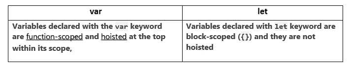

(提升是 JS 中的一个过程，这意味着在执行代码之前，函数和变量声明会到达它们作用域的顶部。)

## ②常数

## “常量”关键字

✬这是 ES6 的一个特性，用来创建常量。

✬考虑下面的例子。

输出:

```
Colombo
```

现在再次考虑下面的例子。

输出:

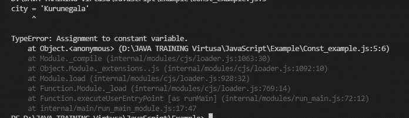

我们得到了这个错误，因为“城市”是一个常量变量。因此不允许改变它的值，相应地，**一旦一个常量被初始化，我们就没有能力改变它的值**。

但最重要的是:

> *常量只保护***一个不是对象或数组的“变量”。所以* ***如果是对象或者数组，虽然是常量*** *也可以改变值。**

*请看下面的代码及其输出来理解这一点。*

*示例:*

*输出:*

*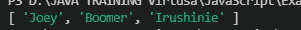*

## *③箭头函数()= >*

*✬箭头功能也是 JavaScript 的 ES6(ECMAScript 6)版本引入的另一个有趣的特性。*

*✬“箭头”函数提供了使函数表达式比传统函数更简洁的能力。*

*示例 1:*

```
*//traditional function expression
**let w= function(w, x) {
   return w* x;
}**
//with arrow functions
**let w= (w, x) => w*x;***
```

*示例 2:*

*输出:*

```
*120
120
120
25*
```

*为了你的记忆🤓➜*

***🥢如果函数中只有一个参数，可以省略括号。***

*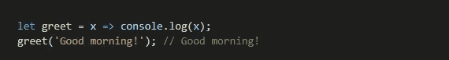**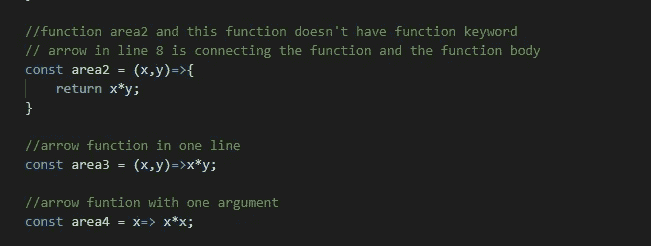*

## *④函数和箭头函数*

*✮函数和阿罗函数的行为方式不同。因为当考虑一个普通的函数时，它打印出整个函数面，而关键字“this”代表函数的调用者。但是如果你写一个箭头函数，“this”关键字并不代表调用者。*

*让我们理解使用下面的编码示例:*

*输出:*

*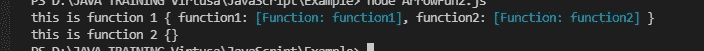*

*因此，当 arrow 函数中的“this”关键字不代表调用者时，就会发生这种情况。*

## *⑤搬运物件*

*JavaScript 中的✬对象使您能够存储多个数据集合，这些对象中的数据可以是任何类型。*

*下面是 JavaScript 中一个对象的例子*

```
*// object
**const Employee= {
    firstName: 'Joey',
    Eid:12
};***
```

*✬:让我们看下面的例子来更好地理解这一点:*

*示例:*

*Figure 1*

*输出:*

*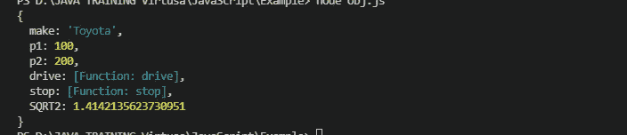*

*根据上图 1，为什么🧐代码(第 13 行)中的“`**SQRT2**`”没有键值对*

*原因是，在`**let SQRT2=Math.SQRT2;**`中——它从另一个**模块**中取了一个变量。所以你可以在对象(车辆)内部指定同样的东西。因此不需要在`**SQRT2**`和中有值，这与`**SQRT2:SQRT2**`相同。*

*示例:*

1.  *让我们看看如果你添加了`[status]: “ready”`动态属性，输出会是什么。*

*输出:它会给出以下错误*

```
***ReferenceError: status is not defined***
```

*2.现在开始创建一个名为 status 的变量，如下所示*

*Figure 2*

*输出:*

*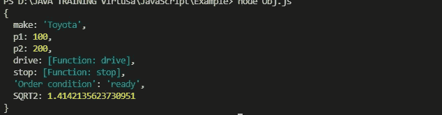*

*因此，动态属性意味着，如果你不知道执行时的键是什么，你可以用一个占位符作为键。*

*例如，如果你需要定义一个对象通过服务发送给用户，你不知道什么是键。这时，你可以有一个类似上面例子的占位符(图 2)。*

## *⑥冷冻法*

*javascript 中的对象是可变的。这意味着我们有能力在任何需要的时候改变对象的值。*

*那么如果我们需要让 javascript 对象不可变呢？**🙄***

*我们可以通过使用**`**freeze()**`**的方法来实现这一点😍所以如果我们使用这个“冻结”方法，这意味着它冻结了对象。所以没人能改变被冻结对象的值。*****

*****如果你调用`**Object.freeze(obj)**`，那么它不会改变值。*****

*****示例:不使用冻结方法*****

*****输出:*****

```
*******{ country: 'Sri Lanka' } 
{ country: 'Australia' }*******
```

*****示例:使用冻结方法*****

*****输出:*****

```
*******{ country: 'Sri Lanka' }
{ country: 'Sri Lanka' }*******
```

*****✨所以从上面的例子，我们可以理解，如果你调用`Object.freeze()`，那么它不会改变它的值。*****

*****✨，有一个对象从一个服务传递到另一个服务，如果你需要确保对象不会从一个函数到另一个函数改变，你可以使用这个冻结方法。*****

> ******💥***重要:*******

*****考虑下面的代码及其输出:*****

*****输出:*****

**********

*****根据输出，虽然名称没有改变，但 t1 的值已经改变。*****

*****为什么是**🙄*******

> ******原因是，如果你调用“对象。冻结”方法，它将只冻结第一级值，而不会冻结内部级别或第二级对象。******

## *****⑦模板*****

*****✬ JavaScript 模板字符串提供了在字符串形成中利用嵌入表达式或字符串的能力。让我们用下面的例子来理解 javascript 模板字符串。*****

*****输出:*****

```
*******Happy Work Anniversary Joey Boomer.Good luck for completing 2 years!*******
```

*****所以使用${}可以从对象中获取属性。*****

## *****⑧班级*****

*****✬这个特性也是 JS 的 ES6 版本引入的特性之一。JavaScript 中类声明的一种方式如下所示。*****

```
*******class Person{
  constructor(name, age){
    this.name= name;
    this.age= age;   }}*******
```

*****📍虽然在 Java 中我们有来自类名的构造函数，但在这里我们使用了 ***【构造函数】*** 关键字。*****

> ******下面是一个例子，展示了 JavaScript 中发生的覆盖******

*****输出:*****

```
*******Jeo is an Employee
Chriss is an Employee an manager of QA
this function is overriden*******
```

*****📍因此，当通过对象调用时，我们可以用任何东西覆盖函数。*****

*****📍你的类中可能有函数，但是运行时。但是在调用时，如果你愿意，你可以覆盖这个函数。*****

## *****⑨解构*****

*****ES6 还引入了 JavaScript 析构，它有助于将对象的属性和数组值分配到不同的变量中。*****

*****例如:ES6 之前*****

*****输出:*****

```
*******Joey
2   
male*******
```

*****例如:使用 ES6*****

*****输出:*****

```
*******Joey
2   
male*******
```

*****📝注意:*****

*****☛在对象析构中，名字的顺序根本无关紧要*****

*****☛在 JavaScript 中析构对象时，不要忘记使用相似(相同)的变量名称作为对应对象的键。*****

> ******例子:❶——销毁处理方式******

*****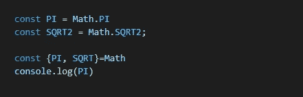*****

> ******示例:带功能的❷—destructuring******

*****输出:*****

```
*******148.83999999999997*******
```

*****让我们将上面的代码扩展如下*****

*****输出:*****

```
*******148.83999999999997
148.840
148.84000*******
```

*****const area2=({base}，{round=3}={})这里有 base，round，如果 round 值没有被传递，您可以分配一个默认值。*****

*****✹使用毁灭功能的另一种方式*****

*****下面是没有“毁灭”的传统方式。*****

*****下面是用“毁灭”的方式。*****

> ******示例:❸——用数组进行析构******

*****您可以使用数组执行这种重构，如下例所示*****

*****示例一:*****

*****实例二:*****

```
*******Output:
10
50*******
```

*****在示例ⅱ中，您可以看到我已经为一月、二月、三月和五月赋值。有 4 个属性和 5 个值，因为一个月保持为空`**(const [jan, feb, mar, , may])**`,所以现在当我们打印“Jan”时，它给出 10 作为输出。“mar”旁边的“empty property”自动跳过值“40”并将 50 分配给 may(如输出中所示)。*****

*****示例三:使用 rest 运算符*****

*****输出:*****

**********

*****在这里，[month1，…otherMonths]在“otherMonths”前面有三点运算符。因此，值“10”被分配给“month1 ”,其余的值作为新数组被分配给“otherMonths”。通过使用 rest 操作符，可以将一个数组复制到另一个数组中。*****

## *****⑩ JavaScript 回调函数和承诺*****

> ********回调函数********

*****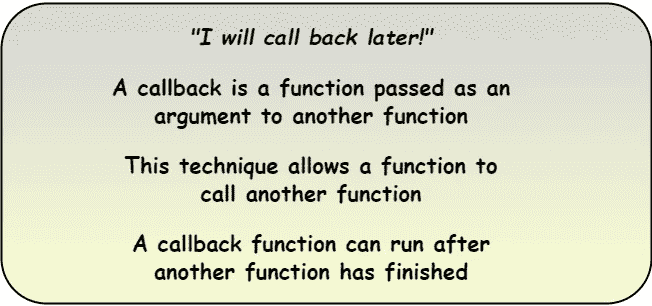*****

*****(Ref:[https://www.w3schools.com/js/js_callback.asp](https://www.w3schools.com/js/js_callback.asp))*****

*****假设你去一家果汁吧点了一些果汁，把你的名字告诉了服务员。然后你坐下，直到你点的菜准备好。然后服务员会为下一个人服务，以此类推。当你点的果汁准备好的时候，他们会叫你的名字，这样你就可以去拿你点的了。所以回调函数的工作方式也和这个场景一样。*****

*****✹回调函数可以定义为一个函数，它接受另一个函数作为参数，并在结束时自动调用那个函数。这样做的好处是我们可以等待前一个函数的结果，然后执行另一个函数调用*****

*****例如:*****

*****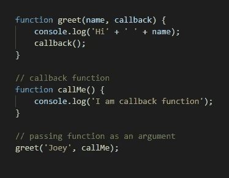*****

```
*****Output:
**Hi Joey
I am callback function*******
```

> ********承诺********

*****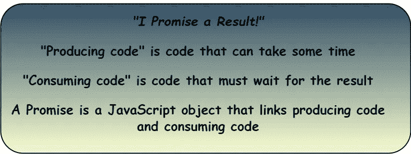*****

*****(Ref:[https://www.w3schools.com/js/js_promise.asp](https://www.w3schools.com/js/js_promise.asp))*****

*****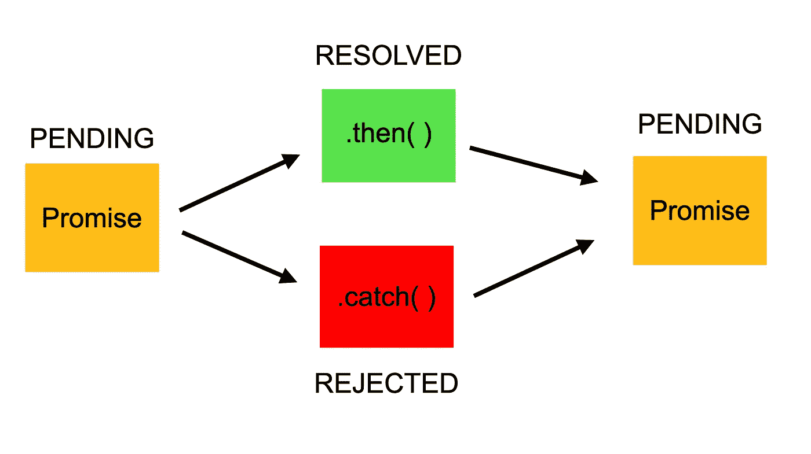*****

*****Promise*****

*****✹《一个承诺》描述了一项尚未完成的行动。JavaScript 中的承诺是在未来生成单个值的对象。所以可以解决，也可以不解决。*****

*****✹实现、拒绝或待定是 JavaScript 承诺的三种可能状态。*****

*****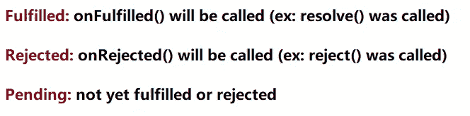*****

*****示例:*****

```
*******Output:
196783  
finished*******
```

*****✬因此，需要一些时间来给出输出，因为它需要去收集数据。*****

*****⚀ `**function fetchWebpage(URL)**` ➜函数“fetchWebpage”获取 URL*****

*****⚀ `**return new Promise((resolve,reject)**` ➜归来，对新的承诺，坚决而又拒绝。*****

**********

*****那么，我们为什么要用新的承诺来包装下面的内容呢**🙄*******

```
*******return new Promise((resolve,reject)=>{
   http.get(url,response=>{
      let responseData;
      response.on('data',data=> responseData=responseData+data);
      response.on('end',()=> resolve(responseData));
      response.on('error', reject);
});
})*******
```

*****因为“`**http.get**`”是需要时间去服务器并取回响应的东西。因此，这里需要用一个承诺来包装它，当响应准备好时，它将触发承诺的完成。*****

*****现在看看下面的例子:*****

```
*******Output: 2 undefined*******
```

*****📚注意:输出是`**2 undefined**`,因为它在结果出来之前调用了`console.log(“2”, resp.length`。*****

## *****⑪异步功能/等待*****

*****✬:我们使用“异步”函数来返回一个承诺。关键字“async”用于函数。在函数中使用“async”关键字后，这个特定的函数就是异步的。*****

*****📍“await”只在异步函数中有效。所以我们总是在异步函数中使用它。*****

*****语法(异步):*****

*****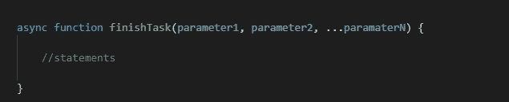*****

*****下面是我们在回调函数中讨论的示例的扩展版本:*****

```
*******Output:
2 undefined
3 197176*******
```

*****📗`**resp= await fetchWebpage(‘http://irushiniedilmika.medium.com/')**`*****

*****当我们在 async 函数中使用“await”时，它说要调用“fetchWebpage ”,后者将返回一个 promise 对象，并等待直到 promise 解析。所以一旦承诺解决了，继续下一行。*****

## *****JavaScript 的优势*****

*****📍JavaScript 易于学习、理解和实现。*****

*****📍互操作性是 javascript 的另一个优势，这意味着 JavaScript 可以用于各种应用程序。*****

*****📍使用 JS 可以创建丰富的接口。*****

*****📍扩展功能。*****

*****📍它有大量的图书馆。*****

## *****JavaScript 的缺点*****

*****📍客户端安全性。(当代码在用户的 pc 上执行时，有时会发生恶意活动。*****

*****📍浏览器支持(有时 js 在不同种类的浏览器上实现不同)。*****

# *****参考*****

 *****[## ES6 箭头功能-Java point

### ES6 中引入了箭头函数，这为您提供了一种更准确的方式来用 JavaScript 编写函数…

www.javatpoint.com](https://www.javatpoint.com/es6-arrow-function)***** *****[](https://www.w3schools.com/js/js_es6.asp) [## JavaScript ES6

### 组织良好，易于理解的网站建设教程，有很多如何使用 HTML，CSS，JavaScript 的例子…

www.w3schools.com](https://www.w3schools.com/js/js_es6.asp) [](https://www.geeksforgeeks.org/javascript-rest-operator/) [## JavaScript | Rest 参数- GeeksforGeeks

### JavaScript | Rest 参数是处理函数参数的一种改进方式，允许我们更容易地…

www.geeksforgeeks.org](https://www.geeksforgeeks.org/javascript-rest-operator/)*****