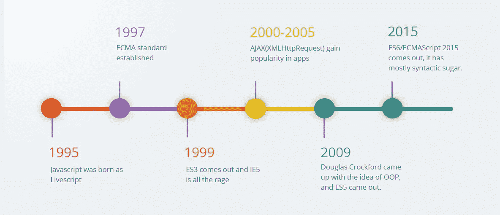
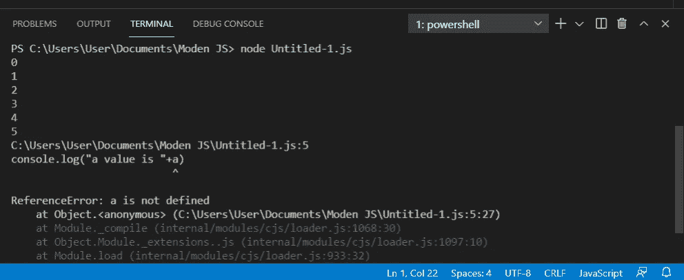
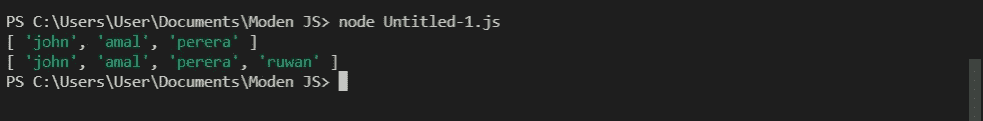
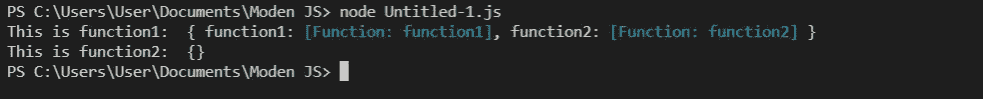
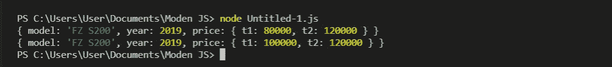
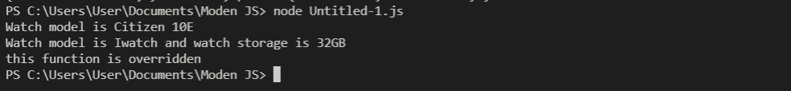

# 现代 JavaScript

> 原文：<https://medium.com/geekculture/modern-javascript-58c2410be049?source=collection_archive---------46----------------------->

如果你是一名本科 IT 学生或软件工程师，你肯定会在生活中的某个时候遇到 Java Script。也许你已经用 Java 脚本和其他语言完成了几个项目。所以欢迎大家来看另一篇文章。在这篇文章中，我将对现代 JavaScript 做一个简单的解释。在此之前，让我们看看 JavaScript 的发展。

# JavaScript 的发展

**JavaScript** 通常被称为 **JS** ，是世界上最流行的编程语言之一。JavaScript 符合 ECMAScript 规范。当我们谈到 JavaScript 的历史时，1995 年 9 月，一位名叫 Brandan Eich 的 Netscape 程序员仅用了 10 天就开发出了一种新的脚本语言。它最初被命名为 Mocha，但很快被称为 LiveScript，后来又被称为 **JavaScript** 。

JavaScript 是一种动态的计算机编程语言。它是轻量级的，最常用于任何地方。它安装在每一个现代网络浏览器上。例如，Chrome、Mozilla Firefox、Safari 以及你目前所知的所有浏览器都支持 JavaScript。 **JavaScript 引擎是执行 JavaScript 代码的计算机程序。SpiderMonkey 是第一个用于 Firefox 浏览器的 JavaScript 引擎**。谷歌 Chrome 用 V8，微软 edge 用 Chakra。

一旦你学会了 JavaScript，它将帮助你使用不同的基于 JavaScript 的框架开发优秀的前端和后端软件。一些有用的 JavaScript 框架和库是，

*   有角的
*   反应
*   jQuery
*   节点. js

# 现代 java script 特性

# 1.变量作用域

ES6 2015 引入了两个重要的新 JavaScript 关键字。那些是出租和固定的。

1.  **let 只限于声明它的块**
2.  **const 表示标识符不能被重新分配。(但是有一些边缘情况我们将在后面讨论)**

尝试是否可以执行下面的代码片段而不出现错误。

如果您运行上面的代码片段，您将得到下面的输出。无法执行第 5 行，因为 a 未定义。

原因正如我前面提到的，let 关键字只限于声明的块。所以在我们的例子中，a 是在 for 循环中定义的。所以我们不能从 for 循环的外部访问它。**所以如果你想在 for 循环之外访问‘a ’,你需要首先在 for 循环之外声明它。**

现在，通过用 const 替换 let，检查是否可以执行代码段而不出错。所以如果你尝试，你会得到同样的错误，因为 let 和 const 的行为是一样的。**但是如果你试图用 var 关键字替换它，你可以执行代码而不会得到任何错误，因为 var 具有全局作用域**。

# 2.常数

正如我之前提到的，我们不能重新赋值。但是要注意，分配给常量变量的**数组和对象是可以改变的。**看看下面的例子。

一旦你声明了数组。可以修改一下。这证明了赋给常量变量的数组和对象是可以改变的。请参见下面的输出

# 3.功能

所以在 JavaScript 中我们可以写普通函数和箭头函数。正如你在下面的代码片段中看到的。以下三个函数都给出相同的输出。

但是你需要清楚地理解函数和箭头函数的行为是不同的。看看下面的代码段。在打印对象中，我们有两个函数。函数 1 是普通函数，函数 2 是箭头函数。

在普通函数中，这个关键字代表函数的调用者。但是在箭头功能中，这个关键字并不代表呼叫者。请看下面的例子来进一步说明。

下面是上述代码片段的输出。所以你可以看到‘this’关键字可以用在普通函数中。当我们试图在 arrow 函数中使用“this”关键字时，它不起作用。它给出了未定义的像下面的输出。

# 4.目标

在 JavaScript 中我们可以有对象。所以在下面的代码片段中，我们有一个笔记本电脑对象。有两个属性和一个函数。同样在 JavaScript 中，我们可以拥有动态属性，如下图所示。

# 5.冻结

如果您使用 Object.freeze 方法，对象将被冻结，这意味着在您调用 Object.freeze 方法后，如果您试图修改对象值，它将不会得到更改。现在看看下面的例子。你对下面的代码片段输出有什么看法？让我们看看输出。

代码片段的输出如下所示。因为我们在修改对象之前调用了 Object.freeze 方法，所以对象不会被修改。

你必须记住另一件事，当你调用 **Object.freeze 方法时，它将只冻结第一级值**。看看下面的代码片段和输出，你就会明白。

# 6.班级

如果你熟悉任何面向对象的语言，你有类。所以在 JavaScript 中我们可以有如下的类。我们也可以有构造函数，但问题是在 Java 中我们不把方法名作为构造函数给出，但在 JavaScript 中我们需要这样给出。

# 7.处理解构

析构赋值语法是一个 JavaScript 表达式，它可以将数组中的值或对象中的属性解包到不同的变量中。在 JavaScript 中，有多种方法来处理析构函数。看看下面的例子。

如果你有同一个模块的多个变量，你可以写一行如下，它会给出和上面一样的输出。

我们也可以像下面这样使用析构函数。

# 8.承诺

承诺用于处理 JavaScript 中的异步操作。在处理多个异步操作时，它们很容易管理，因为回调可能会创建回调地狱，导致无法管理的代码。

JavaScript Promise 对象可以是，

1.  待定:承诺仍处于待定状态，这意味着结果未定义。
2.  已履行:承诺的操作成功。
3.  拒绝:承诺的操作不成功。

那么在上面的代码段中，为什么我们需要用一个新的承诺来包装呢？因为 HTTP 请求到服务器发送响应需要时间。因此，它被上面的承诺包裹着。在 fetchWebpage 之后，我使用了 then 关键字。所以这意味着当承诺完成的时候。catch 用于在出现错误时打印错误。同样，在 Java 中，我们可以使用 Finally 关键字，其行为与 Java Finally 关键字相同。

还有另一种方法，我们可以通过使用**异步函数和 wait** 关键字来实现。让我们看看它是如何发生的。在此之前，让我们看看什么是异步和等待。

1.  async : async 使函数返回一个承诺
2.  等待:等到承诺解决。一旦承诺解决，继续下一行。 **await 仅在异步函数中有效。**

就是这样伙计们这就是这篇文章的结尾。我希望您了解现代 JavaScript 特性。那么让我们从另一篇文章来认识一下。保持联系。

# 参考

 [## Javascript 教程

### Javascript 教程- JavaScript 是一种轻量级的解释型编程语言。它是为创造…

www.tutorialspoint.com](https://www.tutorialspoint.com/javascript/index.htm)  [## JavaScript | Promises-GeeksforGeeks

### 承诺用于处理 JavaScript 中的异步操作。在处理多个问题时，它们很容易管理…

www.geeksforgeeks.org](https://www.geeksforgeeks.org/javascript-promises/)