# 使用柏树和黄瓜的现代网络测试

> 原文：<https://medium.com/geekculture/modern-web-testing-using-cypress-and-cucumber-c25ffcf55670?source=collection_archive---------11----------------------->

# 自动化的需要

*   大多数[敏捷交付](https://about.gitlab.com/topics/agile-delivery/)团队遵循 2 周的发布周期。为了应对这些变化并交付一个没有错误的应用程序，自动化是必需的。有必要在开发阶段早期识别 bug，以提高团队的效率。
*   大多数被确定用于测试的[端到端场景](https://smartbear.com/learn/automated-testing/how-to-perform-end-to-end-testing/)都很冗长，自动化测试有助于编写更深入的测试来验证复杂的用例。这也涵盖了在手动测试中经常被避免的冗长的测试。
*   在[冲刺](https://www.atlassian.com/agile/scrum/sprints)中出现了许多新的需求，为了在没有/很少人为错误的时间表内完成测试和交付，自动化是必需的。对于大多数项目来说，有多个服务于不同目的的环境，一些环境也是特定于客户的。为了实现[连续展开](https://searchitoperations.techtarget.com/definition/continuous-deployment)，自动化是必要的。

# 解决办法

为了满足自动化的需要，[柏树](https://www.cypress.io/how-it-works/)框架与[黄瓜](https://cucumber.io/)集成是最好的选择之一。在这里，需求以场景的形式写在特征文件中，遵循行为驱动开发( [BDD](https://www.agilealliance.org/glossary/bdd/) )语法。

# 柏树简介

*   Cypress 是一个免费的开源自动化工具，[麻省理工学院许可的](https://en.wikipedia.org/wiki/MIT_License)，用 [JavaScript](https://en.wikipedia.org/wiki/JavaScript) 编写。
*   Cypress 是为现代网络构建的下一代前端测试工具。在 Cypress 端到端测试的帮助下，集成和单元测试很容易编写和调试。
*   Cypress 由一个免费、开源、本地安装的[测试运行器](https://docs.cypress.io/guides/core-concepts/test-runner)和一个[仪表板服务](https://www.cypress.io/dashboard/)组成，用于记录我们的测试。Cypress 有自己的文件夹结构，当你在特定的位置第一次打开它时，它会自动生成。它附带了现成的食谱，描述了如何测试 Cypress 中的常见场景。

# 柏树建筑

*   大多数测试工具(如 [Selenium](https://github.com/SeleniumHQ/selenium) )都是在浏览器之外运行，并通过网络执行远程命令。但是 Cypress 引擎直接在浏览器内部运行。它使 Cypress 能够在运行时通过操纵 [DOM](https://developer.mozilla.org/en-US/docs/Web/API/Document_Object_Model/Introduction) 和动态改变网络请求和响应来监听和修改浏览器行为。这反过来使得测试执行更快、更稳定。因此，它打开了新的测试方式的大门，并最终控制我们的应用程序。
*   可以很容易地为 [UI](https://en.wikipedia.org/wiki/User_interface) 和 [API](https://en.wikipedia.org/wiki/API) 操作创建测试。Cypress 直接与 API 通信，使测试能够运行，并在运行时验证请求和响应。

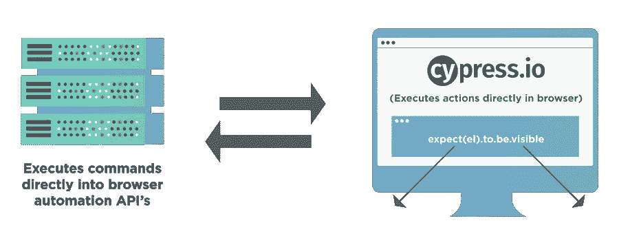

*   赛普拉斯在现代前端开发栈工作:[摩卡](https://mochajs.org/)、[柴](https://www.chaijs.com/)、[西农](https://sinonjs.org/)、 [jQuery](https://jquery.com/) 。它与开发人员通常用来编写单元测试的工具完美匹配。使用 Cypress 也可以轻松实现对使用 [React](https://reactjs.org/) 开发的 web 应用程序的 E2E 测试。
*   Cypress 背后是一个[节点服务器](https://stackabuse.com/how-to-start-a-node-server-examples-with-the-most-popular-frameworks/)进程。Cypress 和节点进程不断地相互通信、同步和执行任务。能够访问这两个部分(前端和后端)使我们能够实时响应应用程序的事件，同时在浏览器之外执行需要更高权限的任务。
*   Cypress 也通过动态读取和改变[网络流量](https://en.wikipedia.org/wiki/Web_traffic)在网络层运行。这使得 Cypress 不仅可以修改进出浏览器的所有内容，还可以修改可能干扰其自动化浏览器能力的代码。
*   Cypress 最终从上到下控制了整个自动化过程，这使它处于独特的位置，能够了解浏览器内外发生的一切。这意味着 Cypress 能够提供比任何其他测试工具更一致的结果。
*   因为 Cypress 是本地安装在我们的机器上的，所以它可以额外接入操作系统来执行自动化任务。这使得执行任务，如截图，录制视频，一般文件系统操作和网络操作成为可能。
*   Cypress 浏览器支持:[金丝雀](https://www.google.com/intl/en_in/chrome/canary/)、 [Chrome](https://www.google.com/intl/en_in/chrome/) 、[电子](https://livebook.manning.com/book/electron-in-action/chapter-1/)(默认)、 [Chromium](https://en.wikipedia.org/wiki/Chromium_(web_browser)) 、 [Mozilla Firefox](https://en.wikipedia.org/wiki/Firefox) 浏览器(beta 支持)和[微软 Edge](https://www.microsoft.com/en-us/edge) (基于 Chromium)浏览器。

# 柏树特征

*   *时间旅行* : Cypress 在测试运行时拍摄快照。我们可以将鼠标悬停在[命令日志](https://docs.cypress.io/api/commands/log)中的命令上，以查看每一步到底发生了什么。
*   可调试性 : Cypress 代码可以直接从浏览器开发工具中调试，因为代码是用 JavaScript 编写的。它还提供了可读的错误和堆栈跟踪，使得调试速度快如闪电。
*   *自动等待* : Cypress 自动等待命令和断言，然后继续前进。
*   [*间谍、存根和时钟*](https://docs.cypress.io/guides/guides/stubs-spies-and-clocks) :使用 Cypress 我们可以验证和控制函数、服务器响应或定时器的行为。
*   *截图和视频*:从 [CLI](https://en.wikipedia.org/wiki/Command-line_interface) 运行时，在失败时自动截图，或者整个测试套件的视频。
*   [*跨浏览器测试*](https://www.browserstack.com/cross-browser-testing) :在本地和优化的持续集成管道中运行 Firefox 和 Chrome 系列浏览器(包括 Edge 和 electronic)内的测试。

除此之外，它还改变了测试自动化框架引入之前的开发方式。下图非常漂亮地描绘了它:

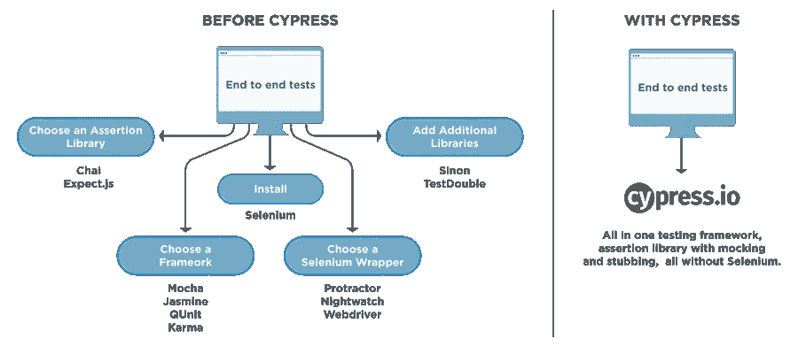

以下是 Cypress 断言、内置命令和项目中常用的自定义命令的一些参考:

1.  [*https://docs . Cypress . io/guides/core-concepts/introduction-to-Cypress . html # Cypress-Can-Be-Simple-times*](https://docs.cypress.io/guides/core-concepts/introduction-to-cypress.html#Cypress-Can-Be-Simple-Sometimes)
2.  [https://docs . cypress . io/guides/references/assertions . html # Chai](https://docs.cypress.io/guides/references/assertions.html#Chai)
3.  [*https://docs . cypress . io/guides/core-concepts/retry-ability . html # Commands-vs-assertions*](https://docs.cypress.io/guides/core-concepts/retry-ability.html#Commands-vs-assertions)
4.  [*https://docs . cypress . io/API/cypress-API/custom-commands . html #语法*](https://docs.cypress.io/api/cypress-api/custom-commands.html#Syntax)
5.  [*https://docs.cypress.io/api/commands/stub.html#Syntax*](https://docs.cypress.io/api/commands/stub.html#Syntax)

# 柏树断言

*   [断言](https://docs.cypress.io/guides/references/assertions)是确定自动化测试用例的指定步骤是否成功的确认步骤。实际上，断言验证测试中的元素、对象或应用程序的期望状态( [AUT](https://innoroo.com/blog/2018/11/22/application-under-test-glossary/) )。例如，断言使我们能够验证一些场景，比如一个元素是否可见或者是否有特定的属性、 [CSS](https://www.w3schools.com/css/) 类或者状态。
*   所有自动化测试用例都应该有断言步骤，这始终是一个推荐的实践。否则，验证应用程序是否已经达到预期状态将是不可行的。
*   Cypress 本身捆绑了由 [Chai、Sinon 和 jQuery](https://docs.cypress.io/guides/references/bundled-tools) 库提供的断言。

> 我们可以根据调用它们的主题将所有这些断言大致分为两类:**隐式**和**显式**断言。

# 隐式断言

*   当断言应用于由[父链接命令](https://docs.cypress.io/api/commands/parent)提供的对象时，它被称为隐式断言。
*   此外，这类断言通常包括诸如“ [*”的命令。*](https://docs.cypress.io/api/commands/should) 【应()】和 [*。和()*。](https://docs.cypress.io/api/commands/and)”
*   由于这些命令不是独立的，并且总是依赖于先前链接的父命令，它们自动继承并作用于由先前命令产生的对象。
*   例如:`cy.get('#loginButton').should('have.class', 'active').and('have.attr', 'href', '/login');`

> 由于`.should('have.class')`不改变主题，所以`.and('have.attr')`是针对同一个元素执行的，当您需要针对单个主题快速断言多个事物时，使用这些隐式断言会很方便。

一般来说，当我们想要:

*   断言关于同一主题的多个验证。
*   在对主题做出断言之前改变主题。

# 明确的断言

*   当需要为断言传递一个显式主题时，它属于显式断言的范畴。
*   这类断言包含命令，如"[](https://docs.cypress.io/guides/references/assertions#BDD-Assertions)*"和" [*assert()*](https://docs.cypress.io/guides/references/assertions#TDD-Assertions) "这些命令允许您传递显式的主体/对象。*
*   *例如:*

```
*const obj = { foo: 'bar' }
expect(obj).to.equal(obj)
expect(obj).to.deep.equal({ foo: 'bar' })*
```

*一般来说，当我们想要:*

*   *在对给定主题进行断言之前，执行一些定制逻辑。*
*   *对同一主题执行多个断言。*

# *常见的柏树断言*

*Cypress 提供了广泛的断言，这在 UI 自动化过程中非常方便。一些最广泛使用的柏树断言是:*

*1) *Length* :验证之前链接的命令返回的元素个数。例如:`cy.get('.demo-frame > ul > li').should('have.length',20);`*

*2) *类*:验证元素是否有提到的类。例如:`cy.get('form').find('input').should('not.have.class', 'disabled');`*

*3) *文本内容*:验证元素是否具有指定的文本。例如:`cy.get('a').parent('span').should('contain', 'Testing');`*

*4) *可见性*:验证元素是否可见。例如:`cy.get('button').should('be.visible');`*

*5) *存在*:验证该元素是否存在于 DOM 中。例如:`cy.get('#loader').should('not.exist');`*

# *柏树钩*

*Cypress 还提供了一些构造，也称为 [Cypress Hooks](https://www.toolsqa.com/cypress/cypress-hooks/) ，帮助在每个测试用例之前/之后或者测试套件中所有测试用例之前/之后执行一组特定的动作。*

*   *`before()`:在开始执行使用“描述”或“上下文”块中的“它”或“指定”指定的第一个测试之前，运行一次。*
*   *`after()`:在“描述”或“上下文”块中使用“它”或“指定”指定的所有测试完成后运行一次。*
*   *`beforeEach()`:它在开始执行使用“描述”或“上下文”块中的“它”或“指定”指定的每个测试之前运行。*
*   *`afterEach()`:它在完成使用“describe”或“context”块中的“It”或“specify”指定的每个测试后运行。*

# *赛普拉斯试跑者*

*   *Cypress 在一个独特的交互式运行器中运行测试，这个运行器允许我们在命令执行的同时查看测试中的应用程序。*

*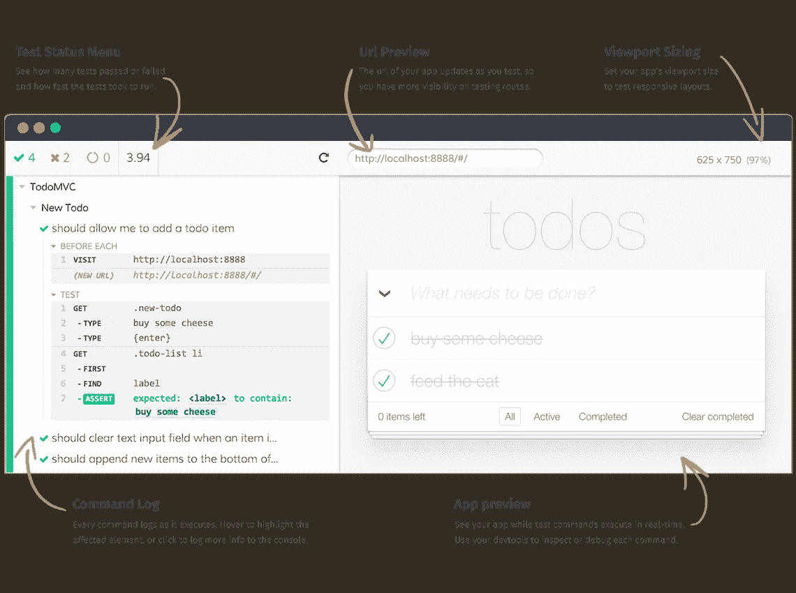*

*   *测试运行程序的左侧是我们测试套件的可视化表示。每个测试块都被正确嵌套，每个测试在被点击时，显示在测试块中执行的每个 Cypress 命令和断言，以及在相关的之前的**、每个**之前的**、每个**之后的**和**挂钩之后的**中执行的任何命令或断言。***
*   **点击命令*:当点击每个命令、断言或错误时，会在开发工具控制台中显示额外的信息。当命令执行时，单击还会将测试中的应用程序(右侧)固定到其先前的状态。*
*   **悬停在命令上*:当悬停在每个命令和断言上时，会将测试中的应用程序(右侧)恢复到该命令执行时的状态。这允许我们在测试时“时间旅行”回到应用程序以前的状态。*
*   *测试运行程序还提供了从下拉列表中选择不同浏览器的选项。通过这种方式，我们可以在本地执行跨浏览器测试，前提是安装了所有的浏览器。*

# *BDD 和黄瓜简介*

*   *测试场景直接从用户故事中开发。为了涵盖完整的用户故事和围绕它的测试，自动化测试以 BDD 格式编写，即黄瓜步骤。这些步骤是用[小黄瓜语言](https://docs.behat.org/en/v2.5/guides/1.gherkin.html)编写的，所以它们应该是每个人都可以阅读的。*
*   *在敏捷项目中，需求随着应用程序中引入的新特性而不断变化，因此 BDD 非常适合这些变化。*
*   *[给定—何时—然后](https://cucumber.io/docs/gherkin/reference/)方法允许测试人员在特征文件中任意多次使用相同的步骤，这逐渐有助于为自动化节省时间。*

*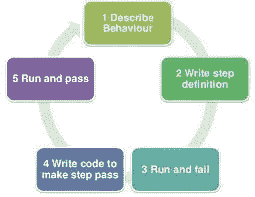*

# *BDD 框架的组件*

*   *[特性文件](https://www.toolsqa.com/cucumber/cucumber-jvm-feature-file/)是你的框架的黄瓜测试的入口点。这是一个文件，你可以在其中用描述性的小黄瓜语言(比如英语)编写你的测试或者验收标准。一个特征文件可以包括一个或多个采用“给定时间-然后”格式的场景。*

*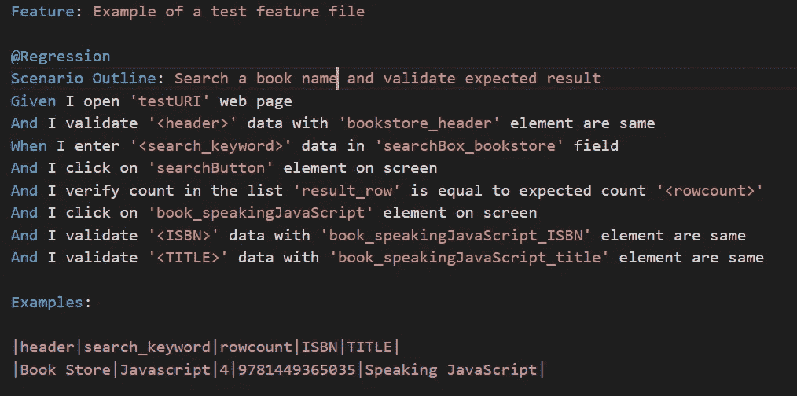*

*   *[步骤定义](https://cucumber.io/docs/cucumber/step-definitions/)是一小段附加了设计模式的代码。特征文件中提到的模式后面的注释将步骤定义链接到所有匹配的步骤。*

*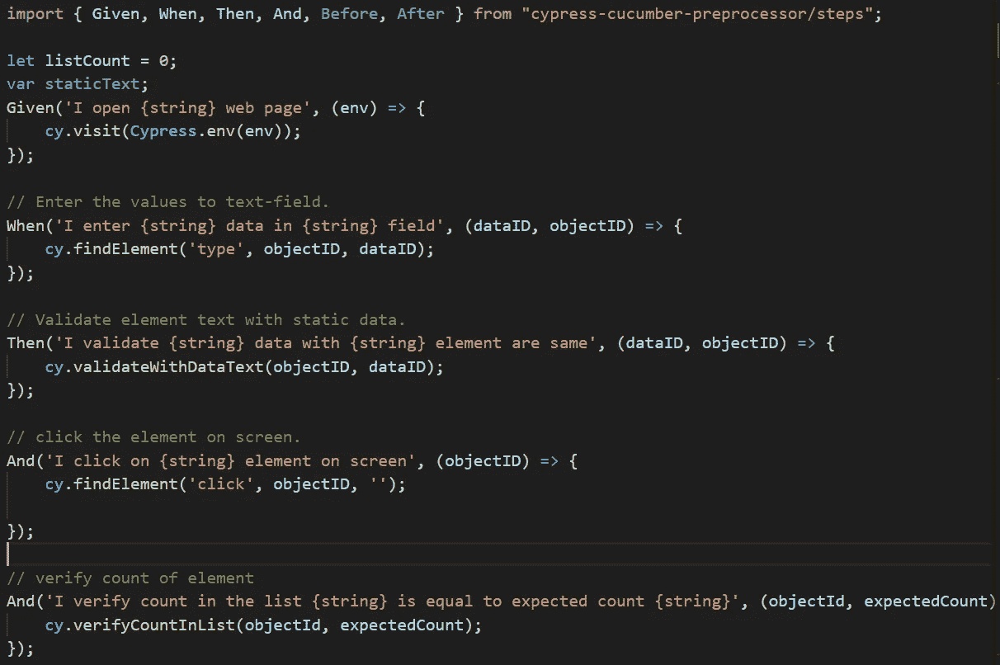*

*更多详情-*

1.  *[【https://cucumber.io/docs/bdd/】T4](https://cucumber.io/docs/bdd/)*
2.  *[*https://cucumber.io/docs/cucumber/*](https://cucumber.io/docs/cucumber/)*

# *柏树装置*

*   **运行* : `npm init`(这将创建一个 package.json 文件)*

> *确保您已经运行了 **npm init** 或者在您的项目的根目录中有一个 **node_modules** 文件夹或者 **package.json** 文件，以确保 cypress 安装在正确的目录中。*

*   **使用 npm 下载*:使用下面的命令使用节点包管理器下载 Cypress。此外，我们必须在同一个目录中执行这个命令，这意味着在项目文件夹本身内部，我们在上面做 **npm init** 时提到过。*
*   **运行* : `npm install cypress --save-dev`(这将使用所需的依赖项更新 package.json 和 package-lock.json 文件，并且还将创建一个 [node_modules](https://stackoverflow.com/questions/63294260/what-is-the-purpose-of-node-modules-folder) 文件夹)*
*   **运行:* `npx cypress open`(这将第一次启动测试运行程序，并生成一个默认的文件夹结构)*

*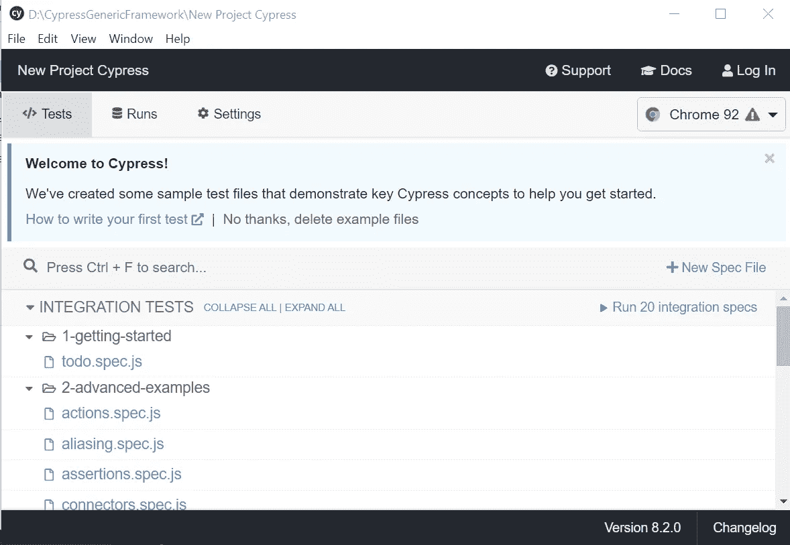*

*更多详情-*

*[*https://docs . cypress . io/guides/getting-started/installing-cypress . html*](https://docs.cypress.io/guides/getting-started/installing-cypress.html)*

# *项目结构*

*下面是 Cypress 框架的默认文件夹结构的快照:*

*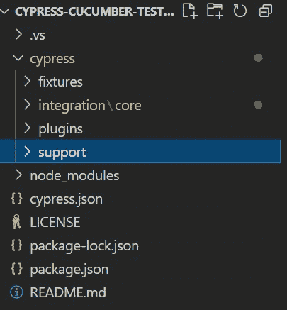*

*   *Fixtures 被用作静态数据的外部片段，可以被您的测试使用。夹具文件默认位于 **cypress/fixtures** 中，但是可以配置到另一个目录。*

*有关更多详细信息:*

*[*https://www.toolsqa.com/cypress/fixtures-in-cypress/*](https://www.toolsqa.com/cypress/fixtures-in-cypress/)*

*   *默认情况下，特征文件和步骤定义位于 **cypress/integration** 中，但可以配置到另一个目录。*
*   *默认情况下，Cypress 会在它运行的每个[单一规范文件](https://www.toolsqa.com/cypress/cypress-test-runner/)之前自动包含插件文件**Cypress/plugins/index . js**。*
*   *插件文件是一个特殊的文件，它在项目加载之前、浏览器启动之前以及测试执行期间在 Node 中执行。当 Cypress 测试在浏览器中执行时，插件文件在后台节点进程中运行，让您的测试能够通过调用 **cy.task()** 命令来访问文件系统和操作系统的其余部分。*
*   *支持文件夹包含用于 UI 和 API 相关操作的实用程序方法(自定义命令)的文件。可以创建自定义命令来为现有的内置 Cypress 命令提供不同的行为，也可以使用自定义命令来创建新命令。Cypress 中的自定义命令只不过是一个普通的 Cypress 命令。唯一的区别是它是由用户定义的，而不是 Cypress 提供的默认命令。定制命令有利于自动化您在测试中反复重复的工作流。*
*   *默认情况下，Cypress 会自动包含支持文件 **cypress/support/index.js** 。*
*   *与 Selenium 不同，Cypress 只支持 **CSS 选择器**(与 JQuery 选择器非常相似)。Cypress 也支持 Xpath 选择器。然而，这不会自动发生。换句话说，我们需要[**cypress-XPath**](https://www.npmjs.com/package/cypress-xpath)外部插件来辅助这个选择器。*

> *要安装 cypress-xpath 插件，运行命令:`npm install -D cypress-xpath`*
> 
> *然后我们需要在 cypress/support/index.js 中添加以下内容:`require('cypress-xpath')`*

*   *添加自己的自定义命令:*

*Cypress 提供了一个 API 来创建一个新的定制命令或者覆盖现有的命令来改变它们的实现。内置的 Cypress 命令也使用 API。它在语法上可以表示如下:*

```
*// Add a new commandCypress.Commands.add(name, callbackFn)
Cypress.Commands.add(name, options, callbackFn)*
```

*有关更多详细信息:*

*[*https://www.toolsqa.com/cypress/custom-commands-in-cypress/*](https://www.toolsqa.com/cypress/custom-commands-in-cypress/)*

*   *`package.json`由所有需要的附属物组成。所有 npm 包在项目根中都包含一个名为 package.json 的文件，该文件包含与项目相关的各种元数据和库。该文件向 npm 提供信息，允许它识别项目以及处理项目的依赖项。类似于来自 Maven 的`pom.xml`和 gradle 中的 build.gradle。假设您已经安装了一个节点，我们必须首先创建一个 package.json 文件。*

# *柏树中的配置*

*   *按照标准定义，配置文件为程序或框架保留一些初始设置和配置。因此，遵循同样的模式，Cypress 也提供了[特定的配置](https://docs.cypress.io/guides/references/configuration)，这些配置最初有特定的默认值，并且在需要的基础上，这些值可以被用户覆盖。*
*   *配置指定了一些键值，这些键值可以在整个测试框架中使用，并且将基于它们的默认值或更改值来指导框架的行为。*
*   *全局配置提供了 Cypress 在执行测试时考虑的所有默认配置。此外，这些配置主要与超时、环境变量、节点版本、从中读取所有集成测试的文件夹路径、fixture、命令等相关。*
*   *Cypress 提供的第一种更改默认配置值的方法是在配置文件中指定这些配置所需的值。Cypress 使用的默认配置文件是 [**cypress.json**](https://docs.cypress.io/guides/references/configuration) 。因此，无论我们想要改变什么值，我们都可以在 **cypress.json** 文件中指定那些键值对。*
*   *假设，我们想更新[**defaultCommandTimeout**](https://docs.cypress.io/guides/references/configuration)配置，并想将其从默认的*****4*秒**更改为 ***10* 秒**。因此，可以通过在 **cypress.json** 文件中指定以下值来实现:***

```
***{
  "defaultCommandTimeout": 10000
}***
```

# ***Cypress 与黄瓜预处理器的集成***

***Cucumber 与 Cypress 集成的第一步是在框架中安装 [Cucumber-preprocessor](https://github.com/TheBrainFamily/cypress-cucumber-preprocessor) 的依赖项。***

***为了安装 Cypress 的 Cucumber-preprocessor 节点模块，我们可以使用以下命令:***

***`npm install --save-dev cypress-cucumber-preprocessor`***

***当我们执行这个命令时，它将产生示例输出，如下所示:***

***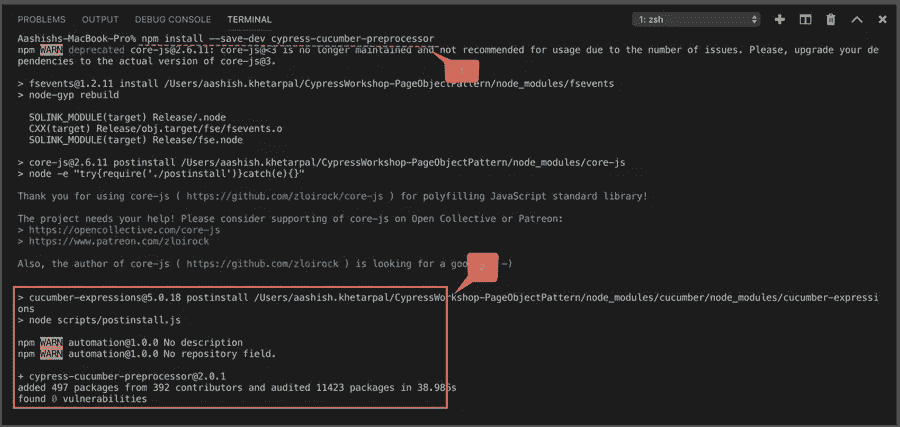***

***该模块将被添加到项目中 package.json 文件的“devDependencies”下。***

> ***现在，一旦 Cucumber-preprocessor 安装成功，下一步就是进行一些配置更改，这样 Cypress 就可以开始使用 Cucumber 并使用户能够编写 BDD 测试。***

*   ***添加到**cypress/plugins/index . js**下的插件中:***

```
***const cucumber = require('cypress-cucumber-preprocessor').defaultmodule.exports = (on, config) => {
  on('file:preprocessor', cucumber())
}***
```

*   ***为您的 Cypress 配置添加对特性文件的支持 **cypress.json** :***

```
***{
  "testFiles": "**/*.feature"
}***
```

***以 BDD 格式(特征文件)编写测试用例时需要注意的一些要点:***

***1) *导入* *语句*:我们要从**cypress-cumber-preprocessor**中导入 **Given-When-Then** 注释。原因是这些注释提供了特征文件中的步骤和步骤定义文件中的方法之间的映射。***

***2)为 Cucumber 特征文件中的语句编写步骤定义时，特征文件和步骤定义文件中的英文文本应该相同。它帮助正则表达式识别哪个步骤与哪个方法实现相匹配。***

***3)对于特征文件中用引号括起来的数据，我们将其保存为{string}。随后，我们将把它作为参数传递，就像我们使用用户名、电子邮件等一样。***

***有关更多详细信息:***

1.  ***[*https://www.npmjs.com/package/cypress-cucumber-preprocessor*](https://www.npmjs.com/package/cypress-cucumber-preprocessor)***
2.  ***[*https://www . tools QA . com/cypress/BDD-automation-framework-in-cypress/*](https://www.toolsqa.com/cypress/bdd-automation-framework-in-cypress/)***

# ***用 Mochawesome 报道***

*   ***Mocha awesome 是一个用于 JavaScript 测试框架 Mocha 的定制报告器。***
*   ***它运行在 Node.js (>=10)上，与[moch awesome-report-generator](https://www.npmjs.com/package/mochawesome-report-generator)协同工作，生成一个独立的 HTML/CSS 报告，帮助可视化您的测试运行。***
*   ***marge(mocha awesome-report-generator)是 mocha awesome 的对应物，这是一个用于 JavaScript 测试框架 mocha 的定制报告器。Marge 从 mochawesome 获取 JSON 输出，并生成一个完整的 HTML/CSS 报告，帮助可视化您的测试套件。***

> ***安装 Mochawesome:***
> 
> ****运行* : `npm install mochawesome`***

*   ***在 **cypress.json** 配置文件中添加以下内容:***

***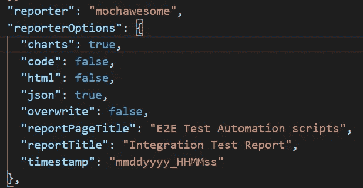***

# ***使用 Mochawesome 报告生成器的优势***

***以下是 Mochawesome 与其他 Mocha 报告工具相比的显著优势:***

*   ***Mochawesome report 是以一种移动友好和简单的方式设计的。它使用 chartJS 来可视化测试报告。***
*   ***它支持显示不同类型的钩子— `before(), beforeEach(), after(),afterAll()`等等。***
*   ***由于 Mochawesome 中的内嵌代码审查特性，特定代码行的失败可以在报告中直接看到。***
*   ***它支持堆栈跟踪日志和失败消息。***
*   ***您可以将额外的上下文信息作为附件添加到测试中，如控制台日志、环境细节、测试的自定义消息。这为报告中的测试用例提供了额外的信息。***
*   ***由于报告是用独立的 HTML/CSS 生成的，因此可以与脱机共享。HTML 扩展。***
*   ***下面是测试执行后生成的样本 Mochawesome 报告的快照:***

***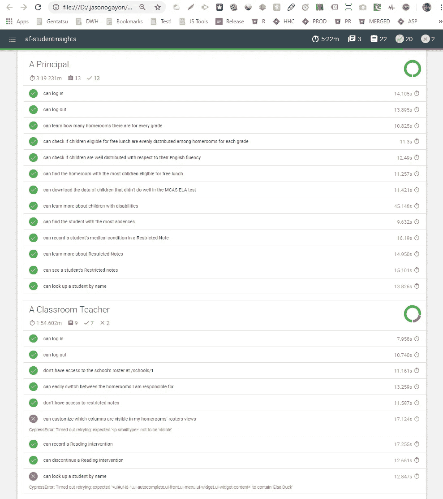***

# ***价值创造和稳定性***

*   ***与其他自动化框架相比，Cypress 更加通用。那是因为它是用 **JavaScript** 编写的，基于**摩卡**和**柴**。它在浏览器中运行时也使用 **Node.js** 。***
*   *****JavaScript** 是开发者开发网站的主要语言。因此，测试是用同一种语言创建的。使用 Cypress，您可以运行跨浏览器测试。***
*   ***Cypress 可以在 Chrome、Firefox、Edge 和 Chromium 等多种浏览器中执行测试。***
*   ***Cypress 的响应时间不到 20 毫秒。框架会在另一个测试完成后自动运行测试。这消除了停机时间和手动触发下一个测试的需要，从而加快了整个执行过程。***
*   ***为其他用例重用测试非常简单。好处是我们可以在其他项目中重用相同的框架。***
*   ***Cypress 可以与 CI/CD 工具集成，如 GitLab、Jenkins、CircleCI 等。更多详情:[https://docs . cypress . io/guides/Continuous-Integration/introduction #什么是持续集成](https://docs.cypress.io/guides/continuous-integration/introduction#What-is-Continuous-Integration)***