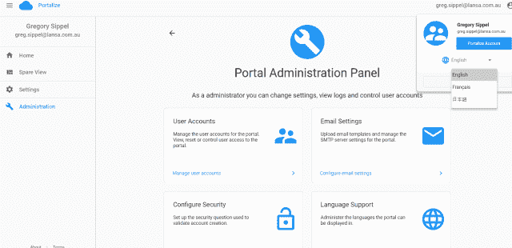
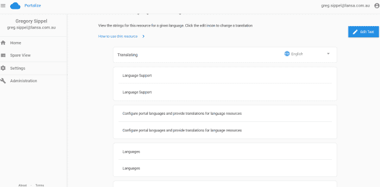
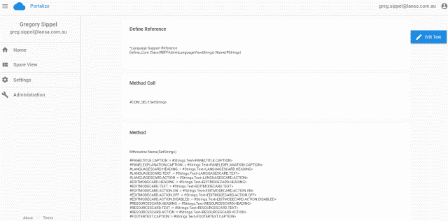
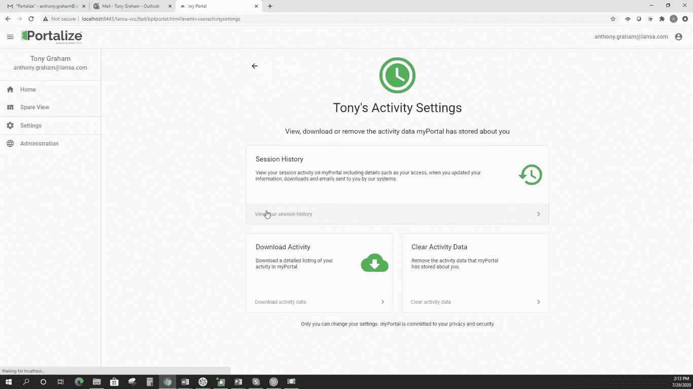
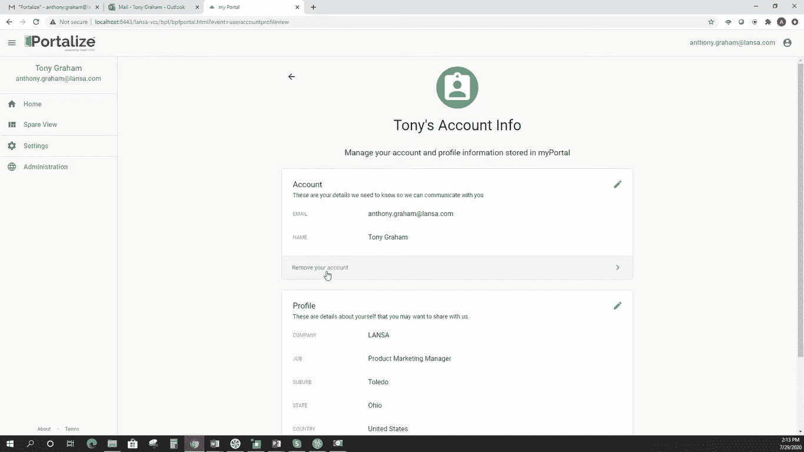
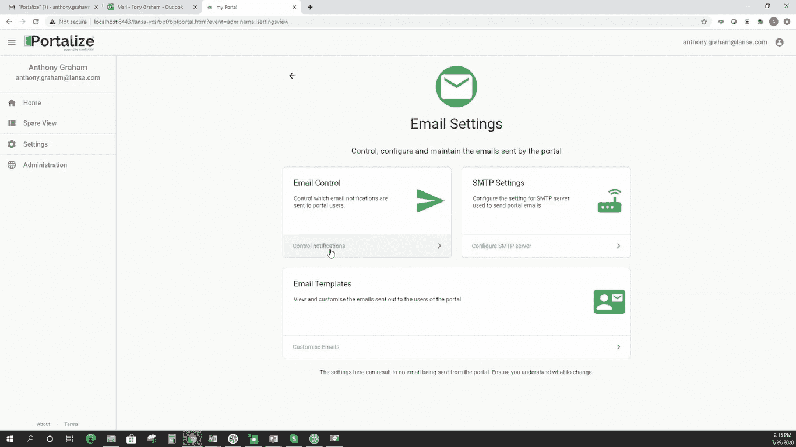

# 用强大的企业门户网站实现 IBM i 解决方案的现代化

> 原文：<https://medium.com/geekculture/modernize-ibm-i-solutions-with-powerful-enterprise-portal-for-the-web-25d172bae1ed?source=collection_archive---------33----------------------->

Photo by [Alex Kotliarskyi](https://unsplash.com/@frantic?utm_source=unsplash&utm_medium=referral&utm_content=creditCopyText) on [Unsplash](https://unsplash.com/s/photos/technology-enterprise?utm_source=unsplash&utm_medium=referral&utm_content=creditCopyText)

您已经做出了在 IBM i 平台上运行您的企业的明智决定，现在是时候利用您的投资了。

有效的 IBM i 现代化解决方案允许您优化您的企业，扩展 IT 生产力，并降低您的总体拥有成本。

现代化项目有几种实施方式。例如，您的开发人员可以学习一种新的语言(Java/Net)，前提是你有时间和资源。或者你可以选择简单的方法，把你的 IBM i 拆下来，用别的东西替换它。

虽然这可能是你对现代化的第一个想法，但从头开始也是非常耗时和昂贵的。不仅如此，您还将失去处理安全、可靠和快速交易的能力。

幸运的是，有一个更好的方法，一个改善工作流程和底线的方法。

如果您的公司有许多 5250 绿屏应用程序，并且用户和管理层都要求您进行现代化升级，那么 LANSA 将使您的生活变得更加轻松。LANSA 的 IBM i 现代化工具套件提供了从简单重构到全新开发的各种选项。

**遇见** [**被兰萨变化**](https://lansa.com/products/portalize/?utm_source=Medium&utm_medium=Leads%20Acquisition&utm_content=Article-ModernizeIBMiSolutions&utm_campaign=Article-ModernizeIBMiSolutions) **。在本文中，您可以了解到如何利用这个工具来更新您的 IBM I 解决方案。**

Portalize by LANSA 为您提供了将 IBM i 应用程序的生命周期进一步扩展到现代 web 和移动界面的能力。您可以使用具有附加功能的新 web 和移动应用程序来扩充现有系统。

您还可以加快应用程序开发的步伐，以便在预算内按时交付更多的项目。

此外，您可以通过在单一平台上标准化所有应用程序开发来减少技术债务。这允许您通过重构现有的运行良好的程序来最小化大规模现代化项目的风险。

# 什么是门户化

门户允许客户通过 web 访问 IBM i 资源。虽然在门户的上下文中，门户化远不止于此。它是一个完全可定制的预构建门户框架，加载了用户期望从最用户友好的门户中获得的开箱即用的功能。

在这里，用户可以创建帐户，设置安全问题，维护自己的详细信息和首选项，重置密码，以及使用许多其他 UX 功能。

还有，它实现了谷歌的材质设计。这意味着用户将会熟悉所有的东西，这样他们就会了解并采用新的门户。如前所述，所有这些都是可定制的，可以根据您的门户需求添加或删除。

此外，Portalize 让您可以访问到 Visual LANSA 中的最佳实践，并为一致的应用程序开发提供参考。

因为 Visual LANSA 支持它，所以您可以完全访问源代码和完全的定制控制。您可以使用内置功能使您的门户快速运行，并随时添加新功能。

门户化特征有三类:

用户功能包括登录、帐户创建/忘记密码、详细信息的用户管理和安全验证。

管理功能，即用户管理、安全性和通知，用户帐户的简单管理，可以发送通知和操作要求(忘记密码、帐户禁用等)的电子邮件引擎。)，以及会话登录控制。

最后，安全特征；包括它已通过广泛的渗透测试，IP 地址监控过量的请求，特定的 IP 地址禁令，登录请求限制，以及自动门户网站检查。

# 用 Portalize 使现代化

Portalize 提供了一种简单的应用程序现代化方法，帮助用户开发现有应用程序的现代化版本，并为支持您的制造企业的数字化转型计划奠定基础。

Tony Graham 认为，Portalize 让用户可以快速建立自己的门户网站。他接着说，“您可以将您的 Visual LANSA 应用程序直接插入功能齐全的门户，因为它是用 Visual LANSA 构建的。一切都在那里，蓄势待发。”

简而言之，他的意思是，通过 Portalize，您现在可以专注于构建解决方案，而不是花费时间开发当今大多数应用程序门户所需的复杂功能。

Portalize 最引人注目的特性之一是它的用户体验。借助易于理解和导航的用户界面，公司可以轻松创建帐户和个人资料。

您可以管理您的个人资料信息，如电子邮件、姓名、职务、公司等。此外，您可以根据自己的喜好个性化门户化界面。例如，在您的门户的颜色或主题中，您可以在明暗模式之间切换，如下面的屏幕截图所示。

此外，在 LANSA，我们非常重视安全和安保。这就是为什么除了更改密码和设置安全问题等标准用户功能之外，Portalize 还提供了许多安全功能来保护您的信息。

此外，Portalize 加载了各种电子邮件模板和自动电子邮件通知，可以根据需要单独打开或关闭。这给了用户完全的控制权。

您还可以使用门户管理面板中的门户化高级管理功能来限制用户的控制。您的管理员将完全控制对用户帐户、电子邮件设置、分析和会话跟踪等的访问。

另一个在应用程序现代化中有用的引人注目的 portalize 特性是它的自动语言翻译功能。根据 Tony Graham 的说法，以下几点使 Portalize 的多语言升级如此特别，它们是:

# 语言灵活性

Portalize 有 20 多种语言，任何人都可以很容易地使用，不管他在什么地理位置。

您可以轻松地切换到您喜欢的语言。当您影响语言更改时，此解决方案是独一无二的；它会影响您帐户中的所有内容，从生成的 pdf、电子邮件到导出的日志。

# 添加您的首选语言

找不到您的语言选项？别担心。Portalize 为您提供了添加您的首选语言的空间，它将适应以您添加的语言显示每个部分。此外，您不需要一行代码就能实现这种语言变化。

**开发者可以从 Portalize 内部看到每个选项背后的完整代码**

提供了完整的源代码，因此您的开发人员可以在各种 Visual LANSA 应用程序中获得新语言特性的示例。

它不仅仅是一个预构建门户；它为您的 Visual LANSA 开发人员提供了可以在其他应用程序中重用的强大示例和有用的文档，以帮助您的开发人员了解代码中发生了什么。

# 无缝添加新功能

当添加新功能时，您不需要使用最终用户的语言进行编码。您的开发人员可以用他们的母语开发任何新功能，您的最终用户可以进行翻译。

这样，您可以加快应用程序的开发，同时提高生产率。

# 具有不同功能的多个用户的门户

没有使用单独的 URL 实现门户化语言功能。但是，您可以在同一个 URL 中为不同的用户提供不同的功能。

换句话说，每个用户都可以为他们的实例选择他们喜欢的语言。

# 门户化是如何工作的

首先，您登录或创建一个帐户并登录。作为管理员，您可以查看管理视图，点击欢迎说明下方的“管理您的活动”链接，您将进入会话历史。您可以允许用户查看或不查看此页面。

如果您点击右上角的用户图标，它会带您到帐户和个人资料选项卡，在这里您可以编辑和保存您的信息。

“门户管理”选项卡是一项管理功能，仅适用于管理帐户。在这里您可以看到所有用户:活动的、禁用的、挂起的等等。“管理”选项卡中还有电子邮件设置，您可以在其中控制电子邮件通知，即选择您的用户可以接收的通知类型。

您可以在电子邮件设置选项卡中找到电子邮件模板部分，在这里您可以自定义电子邮件。例如，整合你的品牌颜色、外观和感觉。

使用 Portalize 定制电子邮件相对容易:

*   首先，你下载你想要编辑的邮件。该文件是一个 HTML 文件，可以用任何文本编辑器打开，并根据需要更改属性。
*   接下来，保存，然后点击编辑图标，上传您刚刚编辑的文件。

这就是用 Portalize 创建电子邮件模板的简单之处。

Portalize 有许多独特的特性，这些特性在现代化 IBM i 解决方案时非常有用。您可以在申请演示时了解更多信息。

# 您准备好更新您的 IBM i 解决方案了吗？

由 Visual LANSA 提供支持，Portalize 很容易成为市场上最可定制和最强大的门户。使用这个解决方案，您可以访问大量的 Visual LANSA 模块和代码，例如，整个门户源代码。

这给了你完全的定制能力，可以随心所欲地调整。

开始现代化项目时要考虑的两个要点是最大化 ROI 和加速业务发展。

Portalize 提供了一个负担得起的现代化选项，允许您维护和利用现有的 IBM i 应用程序，尽管是一个改进的版本。从而消除了彻底检修的需要，并最终确保了高 ROI。

您准备好让您的 IBM i 系统加速运行了吗？[联系我们](https://lansa.com/contact-us/?utm_source=Medium&utm_medium=Leads%20Acquisition&utm_content=Article-ModernizeIBMiSolutions&utm_campaign=Article-ModernizeIBMiSolutions)。