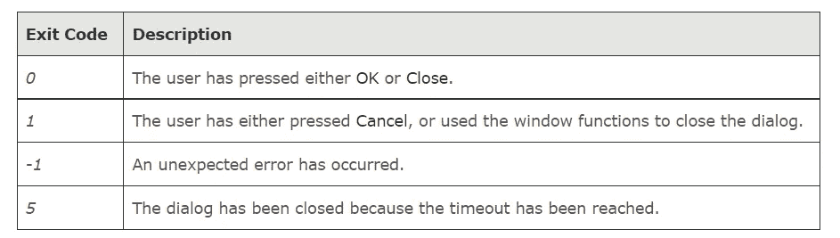

# 通过添加 GUI 使 Linux 终端和 Shell 脚本现代化

> 原文：<https://medium.com/geekculture/modernize-the-linux-terminal-and-shell-scripts-by-adding-gui-729fdedb4b1e?source=collection_archive---------3----------------------->

使用命令行很有趣，但是最好还是有一个交互式的 GUI。

许多编程语言都有创建图形界面的方法。有些，比如 Python，为创建图形用户界面提供了特殊的绑定。其他的，比如 Visual Basic，提供了自己的命令来创建 GUI。

像创建 GUI 的工具一样， **Zenity** 允许快速创建 GUI。与 whiptail 和 dialog 等更复杂的工具相比，它的功能更少。

## 什么是 Zenity？


Zenity 使我们能够创建各种类型的简单对话框。这些类型的对话可以用不同的方式定义。这是一个免费的跨平台程序，允许在命令行和 shell 脚本中执行 GTK 对话框/UI 工具包。除了 Zenity，还可以通过命令行使用原生 GUI 通知。这些工具通常预装在 linux 发行版中。

GTK 服务器是一个在 GNU 通用公共许可证下发布的开源项目。GTK 服务器项目旨在使用 GIMP 工具包(GTK)或 XForms 将图形用户界面编程引入任何解释语言。

Zenity 让我们为以下内容创建 GUI 框:

*   日历
*   文件选择
*   形式
*   目录
*   通知图标
*   消息
*   错误
*   信息
*   问题
*   警告
*   密码输入
*   进步
*   文本输入
*   文本信息
*   规模
*   彩色选择

# 那么，Zenity 有什么特别之处呢？

其他脚本语言也可以用来创建全功能的 GUI 应用程序，比如 Perl 和 Python。然而，zenity 程序支持 shell 脚本与 GUI 用户进行交互。用户界面可能不如全功能 GUI 应用程序提供的界面那么精致，但它非常适合简单的交互。

> 要了解 shell 脚本: [Shell 脚本。你可能听说过 Gursimar Singh | Medium](https://gursimar27.medium.com/shell-scripting-e95af96aed1b) 这个词

通常情况下，Zenity 会检测启动它的终端窗口，并将自己保持在该窗口上方。可以通过取消设置 *WINDOWID* 环境变量来禁用此行为。

# 消息框

Zenity 可以创建各种类型的消息框

*   信息消息框`zenity --info`

```
$ zenity --info --title="Installation complete" --text="Please restart the system" --no-wrap
```

*   警告消息框`zenity --info`

```
$ zenity --warning --title="Battery low" --text="Please plug your computer" --no-wrap
```

*   错误消息框`zenity --error`

```
$ zenity --error --title="Error" --text="Unable to delete app.log (ERR: 565)" --no-wrap
```

*   错误消息框`zenity --question`

```
if zenity --question --title="Confirm deletion" --text="Are you sure you want to delete this file?" --no-wrap 
    then
        zenity --info --title="Success" --text="app.log was removed" --no-wrap
fi
```

*   进度框

当脚本正在处理数据时，可以显示进度条( **—进度**)。Zenity 提供两种。一个是脉动条，其中一个框来回移动(使用—脉动参数),并在到达文件结束(EOF)符号后停止。第二个进度条根据百分比填充。要创建这样一个窗口，可以发出这样的命令-

```
$ zenity — progress — text=”Working hard or hardly working?” — percentage=0 –auto-close
```

# 通知

```
$ zenity --notification  --window-icon="info" --text="There are system updates necessary!"
```

Zenity 有一个发送通知的功能，但是 *notify-send* 给了我们更多调整的自由。

# 输入元素

*   日历输入框`zenity --calendar`

```
I=$(zenity --calendar)
zenity --info --text="Selected date: $I" --no-wrap
```

*   字符串输入框`zenity --calendar`

```
NAME=$(zenity --entry --title="Please enter your name")
if [ -n "$NAME" ]
then
    zenity --info --text="Hello $NAME" --no-wrap
fi
```

*   类似地，`zenity --password`可以用来捕获用户的秘密字符串，比如密码或 PIN 码。此外，密码输入还允许我们启用用户名字段。然后它将返回用户名和密码，用|字符分隔。

要通过 Zenity 输入用户名和密码，可以使用如下命令

`PRIVATE='zenity --password --username`

用户名和密码保存在变量 PRIVATE 中。username 参数是可选的，所以程序员可以在只需要密码时使用它。还是那句话，要注意安全问题。如果用户没有输入数据就关闭窗口并点击“确定”，那么$？像所有其他 Zenity 窗口一样等于“1”。

*   文件选择对话框`zenity --file-selection`

要选择文件，我们使用“ **—文件选择**”对话框。“—多个”允许选择多个文件。“—目录”允许选择目录。将所选文件的列表保存到变量时，“— separator=STRING”参数允许程序员设置字符串或字符，用作列表中项目的划分。注意，所选文件不包含用作分隔符的字符串。否则，列表中会出现不同的/更多的文件。“—文件名=路径”设置默认情况下突出显示哪个文件或目录。要使用同一对话框保存文件，请使用“--save”参数。

```
$ zenity --file-selection --title="Select a file"(or)FILE=`zenity — file-selection — multiple — directory — separator=”+++”`
```

要选择颜色，使用 **—颜色选择对话框**。"— color=# "设置最初选择的颜色，"— show-palette "显示调色板集。代码可能是这样的——COLOR = ' zenity—COLOR-selection—show-palette'。

# 列表选择

```
$ zenity --list \
 --title="Choose your OS" \
 --column="OS" --column="Interface" \
  Ubuntu Unity \
  "OS X" Marble \
  FreeBSD "Command line" \
  Fedora GNOME \
  Minix Command_line \
  Pidora XFCE \
  Lubuntu LXDE \
  "MS-Windows" Metro
```

# 访问键

访问键是使您能够从键盘执行操作，而不是使用鼠标从菜单或对话框中选择命令的键。每个访问键由菜单或对话框选项上带下划线的字母标识。

一些 Zenity 对话框支持使用访问键。要指定用作访问键的字符，请在对话框文本中该字符前加一个下划线。以下示例显示了如何将字母“C”指定为访问键:

```
**"_Choose a name".**
```

# 退出代码

Zenity 返回以下退出代码:



# 常规选项

所有 Zenity 对话框都支持以下常规选项:

```
--title=*title*
```

指定对话框的标题。

```
--window-icon=*icon_path*
```

指定在对话框的窗口框架中显示的图标。通过提供以下关键字，还可以使用 4 种股票图标:“信息”、“警告”、“问题”和“错误”。

```
--width=*width*
```

指定对话框的宽度。

```
--height=*height*
```

指定对话框的高度。

```
--timeout=*timeout*
```

指定对话框关闭前的超时时间(秒)。

# 帮助选项

Zenity 提供了各种帮助选项。一般的有:

```
--help
```

显示简短的帮助文本。

```
--help-all
```

显示所有对话框的完整帮助文本。

```
--help-general
```

# 跨平台兼容性

截至 2012 年，Zenity 可用于 Linux、BSD 和 Windows。一个到 Mac OS X 的 Zenity 端口在 [MacPorts](https://en.wikipedia.org/wiki/MacPorts) 和[家酿](https://en.wikipedia.org/wiki/Homebrew_(package_management_software))中可用。

截至 2018 年，面向 Windows 的 Zenity 端口有: [zenity-windows](https://github.com/kvaps/zenity-windows/) (基于 3.20.0 版本)和 [winzenity](https://github.com/maravento/winzenity) (基于 3.8.0 /静态链接)

Zenity 没有内置的脚本功能，所以它依赖于解释器进行处理。要创建一个无需大量修改就能在多个平台上运行的脚本，最好使用能在最广泛的操作系统上使用的解释器。一种选择是 Python 与 PyZenity 库的结合。

# python-zenity

python-zenity 是一个受 zenity 启发的 python 库。当您编写脚本时，您可以使用 python-zenity 创建简单的对话框，以图形方式与用户交互。

## 要求

*   Python 2.x (x>6)
*   PyGTK

## 装置

使用 pip 安装:

```
$ pip install python-zenity
```

或者克隆回购:

```
$ git clone [https://github.com/poulp/python-zenity.git](https://github.com/poulp/python-zenity.git)
$ cd ./python-zenity
$ python setup.py install
```

**例如，一个简单的对话框:**

```
from pythonzenity import Calendar
result = Calendar(title="Awesome Calendar",text_info="Your birthday ?")
print result
```

# 奖金:

在信息对话框中显示 CPU 空闲时间的 bash 代码是:

```
$ zenity --info --text=$(top -n 1 | grep %Cpu | awk '{print $8}') --title="CPU Idle Time"
```

我们只用一行简单的代码就可以创建它。