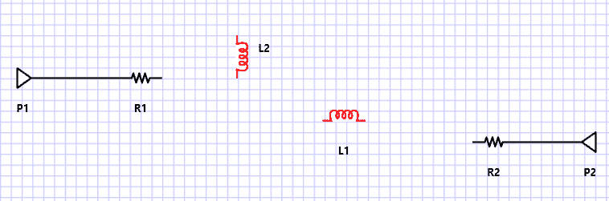
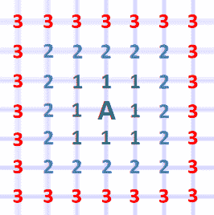
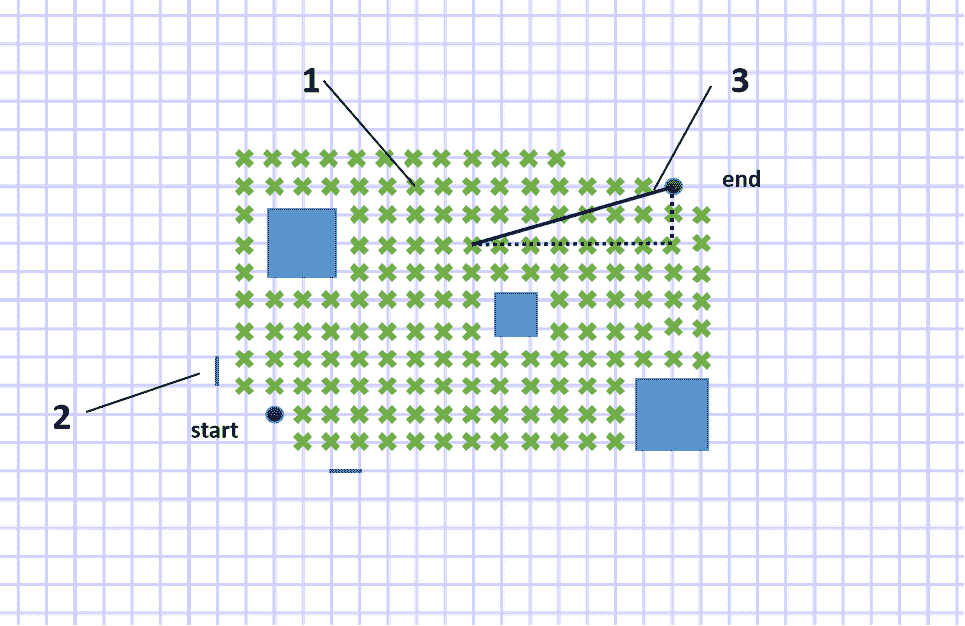
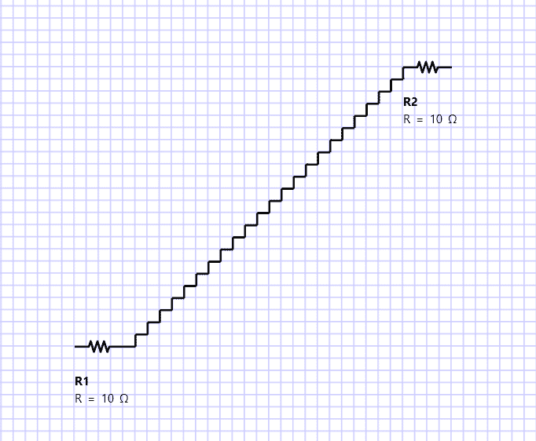
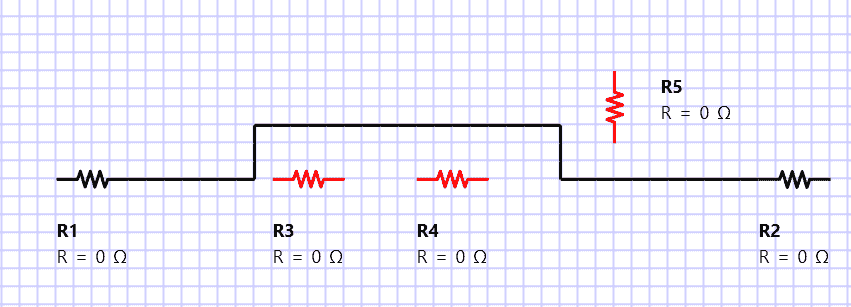

# 一种改进的网格 A*寻路算法

> 原文：<https://medium.com/geekculture/modified-a-pathfinding-algorithm-for-grid-77eea86ee029?source=collection_archive---------1----------------------->

假设你想从 A 点旅行到 B 点，你有三个选择。选项 A 是一条笔直的路径，但有许多障碍，选项 B 更长，但障碍更少，选项 C 是最长的路径，但没有障碍。你如何决定哪条路能让你在最短的时间内从 A 点到达 B 点？一种方法是基本上使用试错法，测试所有选项。但这是一个可行的策略吗？如果有超过 100 个选项，而且很多选项乍看起来都是一样的，那该怎么办？除了使用繁琐的试错法，您还需要一种方法来判断哪条路径是最好的。

# 电线寻路

当涉及到组件之间的连线时，也面临着同样的困境。看看下面的示意图

加入 R1 和 R2 的最佳途径是什么？这里有很多选择。用肉眼很容易识别出哪条路是最好的。然而，程序并不像人类那样“看”。一个程序需要一个算法来教它根据我们人类的看法选择最佳路径。

同样，对于复杂的 PCB 设计，识别最佳/最短路径的算法至关重要。PCB 的尺寸与其制造成本相关。设计人员需要找到成本最低的布线路径，使其尽可能紧凑，从而节省成本。由于 PCB 板的复杂性，这不是用肉眼就能确定的，因此设计人员需要一种算法来帮助优化最短和最具成本效益的布线。

多年来，许多算法都是为此目的而设计的。在本文中，我们将重点介绍其中的一种:A*算法。

# Dijkstra 算法

但在讨论 A*算法之前，我们必须触及 Dijkstra 的。由 Edsger W. Dijkstra 在 1956 年制定并提出的 Dijkstra 算法是 A*算法的基础。其概念是参照目的地节点分析起点和目的地之间的每个可用交叉点(或节点)。它以从开始节点向外辐射的统一模式来这样做。

在每个节点，计算一个分数。在“访问”了每个节点并计算了分数之后，通过从目的地节点通过具有最小分数的相邻交叉点一直回溯到起始节点，形成了最小成本路径。

这种方法的主要缺点是计算时间，因为它必须同等地分析所有节点，而不管节点有多不现实。换句话说，即使存在明显的最低成本路径，Dijkstra 仍然会在最终确定路径之前继续计算所有其他节点的分数。

在网格空间中，这将是一个问题。以右边的图像为例。使用 Dijkstra 的算法，从 A 点到 B 点的连接将意味着网格空间中大约 90–95%的节点(绿色十字)必须被覆盖，然后才能确定成本最低的路径。

# A*算法

而在 A*算法中，解决了 Dijkstra 的主要缺点。A*算法不是覆盖整个网格来确定成本最低的路径，而是引入一种启发式算法来帮助算法在潜在节点上找到最短路径的“方向感”。这意味着偏离目的地的节点被给予低优先级，而更接近目的地的节点被给予低优先级。

A*算法的公式如下所示:

***f(n) = g(n) + h(n)***

f(n):给一个节点的最终分数，越低越好

g(n):从源节点到节点所需的费用，越低越好

h(n):指示其作为可行路径节点的潜力的启发式得分，越低越好

利用该公式，A*算法的概括步骤给出如下:

**步骤 1:** 计算与起始节点相邻的节点的 f(n)。(开始节点得分为 0)

**步骤 2:** 将计算节点添加到“打开”列表中

**第三步:**从“开放”列表中选择一个得分最低的节点 f(n)。如果该节点是目的地。转到步骤 6

**步骤 4:** 计算与所选节点相邻的节点的 f(n)。将选定的节点移动到“关闭”列表。

**步骤 5:** 重复步骤 2–4

**步骤 6:** 回溯从目的地到起始节点的最小成本路径

每个节点都需要注意它的“父节点”，即指向它的开销最小的节点。这有助于回溯到成本最低的路径。

还值得注意的是，一些节点可能被多次访问(一个节点可以与多个节点相邻)。发生这种情况时，将检查 f(n)分数，并用计算出的最低分数更新分数。这样，它的“父”也将被更新。

# 一种改进的网格 A*算法

在网格空间中，一些参数很容易确定。通常，网格在节点之间具有统一的距离，这意味着 g(n)，从节点到节点的成本可以容易地确定。h(n)可以通过将勾股定理的斜边作为从末端节点到节点的位移来得到。这是一个正确的假设，因为在统一的网格空间中，节点将形成直角正方形，其中直角三角形的直角坐标可以很容易地确定。下图将给出推理的直观解释。

1.  一个节点
2.  2)节点之间的距离，g(n)
3.  3)端节点和节点之间的假设位移

然而，有一个问题。通常情况下，在一个网格中，对角线上的相邻节点是不被考虑的。通过使用毕达哥拉斯定理作为启发，得到的最短路径(应该是一条对角线)反而会变成一条看起来很笨拙的“阶梯”线。

为了解决这个问题，需要修改 A*算法。因为最小成本路径最终是由分数 f(n)决定的，所以当发生弯曲时，通过膨胀其分数，算法可以被“欺骗”而认为该节点没有潜力作为最短路径。

为此，可以将公式修改为

只要检测到弯曲，就会增加惩罚。这意味着理想情况下，走直线的导线总是优先，弯曲只会在绝对必要时发生(当直线的 f(n)远远超过弯曲的成本时)。

现在，我们将能够获得一个简单而干净的有线连接。

# 结论

作为一种智能且动态的算法，A*非常容易理解。除了在软件(和 PCB)中确定布线路径的应用之外，A*还可能用于交通导航软件和迷宫机器人等应用。当然，还有很多算法在效率和性能上可能胜过 A*。然而，在许多情况下，A*电位足以满足要求，并且在许多情况下易于实施。

所以为什么不试一试，今天就学会这个算法呢？

# 参考

下面是两个视频，很好的解释了 A*算法。

*原载于 2021 年 1 月 10 日*[*【http://filpal.wordpress.com】*](https://filpal.wordpress.com/2021/01/10/modified-a-pathfinding-algorithm-for-grid/)*。*