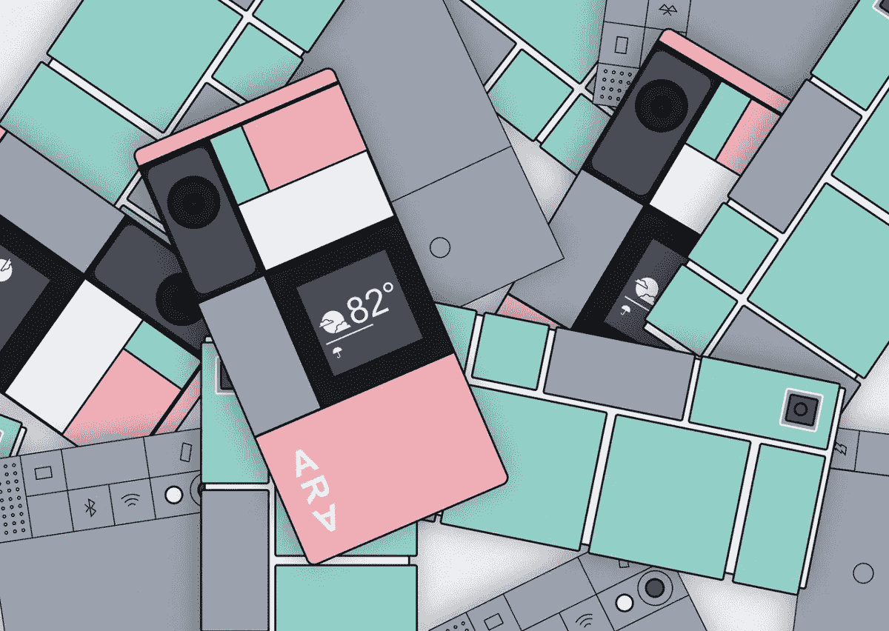
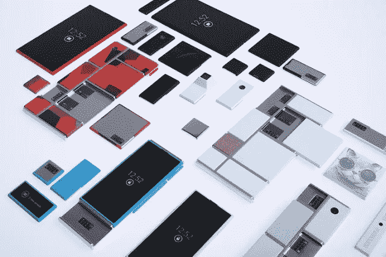
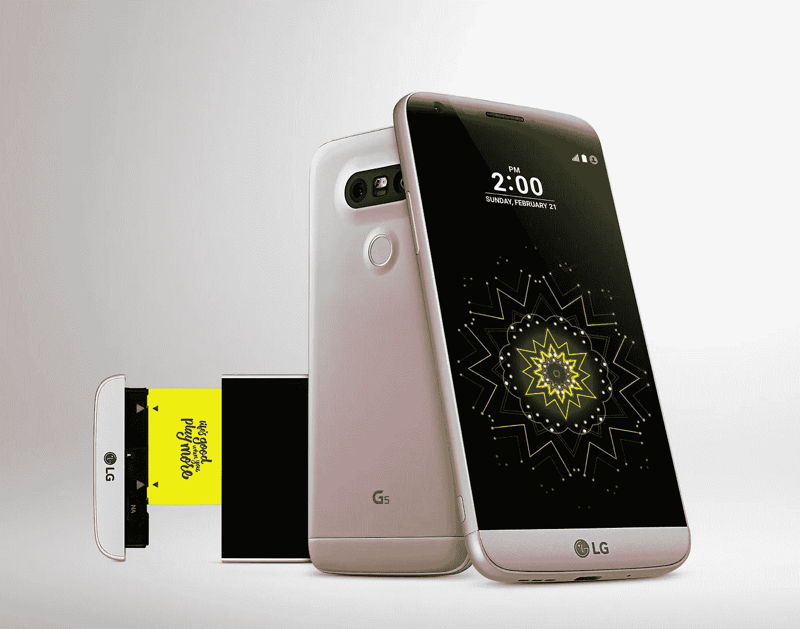
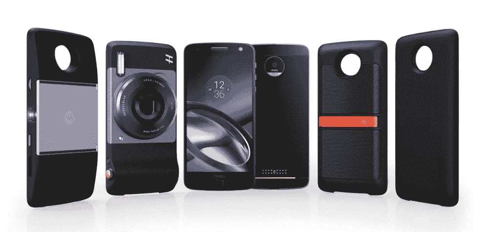

# 模块化智能手机:离现实还远吗？

> 原文：<https://medium.com/geekculture/modular-smartphones-far-from-reality-2f8b5dd4263f?source=collection_archive---------10----------------------->

Source: [VentureBeat](https://venturebeat.com/2017/01/10/inside-project-ara-googles-revolutionary-modular-phone/)

你有没有想象过，如果模块化手机真的出现，智能手机世界会是什么样子？如果我们可以长时间使用我们的智能手机，而不用担心它会过时，会怎么样？如果我们可以根据自己的选择和需求完全定制我们的智能手机，会怎么样？嗯，那是有可能的，但是没有成功。

# Ara 项目

Project Ara 是谷歌承担的一个模块化智能手机开发项目。很久以来，谷歌就有了模块化智能手机的愿景，这种智能手机可以由最终用户完全定制。该公司确实在这个方向上采取了专门的措施，获得了必要的专利，并在 2012 年收购了摩托罗拉移动。该项目由摩托罗拉的高级技术和项目小组(ATAP)启动。事实上，两年后，谷歌在 2014 年将摩托罗拉出售给联想时，保留了 ATAP 集团。

Source: [VentureBeat](https://venturebeat.com/wp-content/uploads/2013/10/motorola-project-ara-2.jpg?resize=640%2C427&strip=all?w=640&strip=all)

很明显，谷歌多年来一直在这个项目上投资。Ara 智能手机的最初设计应该有一个主框架，它将作为连接智能手机不同组件的中央核心。这些组件被设计成模块的形式，可以在任何需要的时候换进换出。基本上，人们可以更换电池模块以增加电池容量，更换相机模块以获得更好的图像质量，更换 CPU 模块以使手机更快，等等。

Ara 项目的主要目的是:

*   **减少智能手机产生的电子垃圾:**由于客户可以轻松更换模块，智能手机的生命周期有望大幅延长。人们将不再需要丢弃他们的旧手机来购买新手机，因此有效地减少了电子垃圾。
*   **为客户提供可定制的智能手机:**“一刀切”的智能手机肯定不行。不同的客户有不同的需求，他们可以根据自己的喜好选择模块来定制自己的手机。
*   **让智能手机变得更容易使用:**Ara 手机被认为是口袋友好型的，框架成本约为 15 美元。这些模块的价格取决于它们的功能。因此，Ara 手机旨在打破那些从功能手机转向的障碍。

# 亚拉计划怎么了？

Project Ara 带来的想法似乎很有前途，可能会深刻改变智能手机世界。尽管不断努力使 Ara 智能手机变得可行，但 Ara 项目并没有看到曙光。谷歌在 2016 年 9 月证实，该项目已被搁置。因此，有人可能会问——哪里出了问题？

## 技术限制

Ara 没有成功的主要原因是技术不够先进，无法制造出完全可行的商业模块化智能手机。ATAP group 的团队确实成功构建了一个相当不错的早期原型，但它远远不是一款可以向公众推出的智能手机。

Early prototype of Ara smartphone

## 计划的改变

最初提供框架和组件/模块的计划转变为(因为缺乏紧密集成)提供具有基本功能的入门手机。然后，可以将附加模块附加到该电话上，以增加功能。但是，这将使手机非常重，大多数人不会喜欢这样。

## 费用问题

Project Ara 的模块开发工具包面向第三方开发人员发布，以便他们可以创建可以添加到入门手机中的自定义模块。ATAP 团队甚至承诺在 2015 年发布一款基本的 Ara 手机。然而，他们声称的价格点几乎不可能实现。即使是首发手机似乎也有很高的材料成本。

## 领导力问题

Ara 的创始人之一丹·马科斯基已经离职，因为他的合同已经到期，由保罗·叶列缅科接任。在任期结束前，叶列缅科非常努力地让 Ara 商业化。然而，2015 年 6 月，叶列缅科离开了，Project Ara 的未来充满了不确定性。Ara 的试播被取消了，由 Regina Dugan 接管。在新领导层的领导下，Ara 转向了高端手机，失去了为各种价格段服务的初衷。该计划是在 2016 年底向开发者提供 Ara，并在 2017 年公开发布。但随后，在 Ara 为 Google I/O 2016 计划的重大展示之前，Dugan 突然离开了。由于这种领导真空，谷歌透露，Ara 项目已被无限期暂停。

Video released by Google ATAP in May 2016

# 模块化智能手机的其他尝试

LG G5 可以被认为是一款半模块化智能手机。G5 的特点是可拆卸电池(当时品牌正在远离这一概念)和模块化配件系统。然而，这方面的使用案例有限，而且热插拔是不可能的。

LG G5 (Source: [Gazelle](https://www.gazelle.com/thehorn/2017/01/24/sell-lg-g5-phone/))

摩托罗拉发布了 Moto Z 系列智能手机，可兼容名为“Moto Mods”的专用外部配件。用户可以在手机上安装迷你投影仪、360 度摄像头和立体声扬声器。此外，有很少的第三方模块也可用于 Moto Z 系列。

Moto Mods for Moto Z (Source: [TheRegister](https://www.theregister.com/2018/06/08/motorola_extends_modular_adventure_for_another_year/))

# 为什么模块化智能手机(甚至半模块化的)会失败？

不可否认，智能手机模块化的概念似乎很有趣，但就商业可行性而言，它迄今为止一直失败。不同公司试图在智能手机中提供某种模块化的尝试实际上并不成功，这种趋势也没有持续多久。原因如下:

## 有更好的可扩展性选项

当我们谈论模块化智能手机帮助用户根据他们的需求和情况扩展功能和特性集时，可以说有很多更好的选择。如果你想要响亮的声音，有蓝牙扬声器可以立即连接。如果你想要更多的备用电池，电力银行可以帮你做到这一点。如果你想要更好的相机，那么现在手机里有多个相机，它们真的很好。关键是，有几个外部附件可以帮助您轻松完成工作。此外，它们不会增加手机的重量，也可以与其他多种设备配合使用。

## 智能手机的长寿命仍然值得怀疑

有人可能会说，模块化智能手机将为智能手机提供更长的寿命，这意味着你可以使用你的手机多年而不必购买新的。嗯，智能手机是紧凑型设备，需要紧密集成。即使模块化智能手机成为现实，他们肯定不会允许核心组件，如主板，内存，天线等。被调换了。如果这些部件损坏了，你仍然需要一部新手机。此外，为手机提供更长的寿命将会违背公司的业务。

## 大多数人不关心可定制性

虽然有些人真的喜欢按照自己的方式定制手机，但事实是绝大多数人并不在乎可定制性。人们喜欢拥有别人拥有的东西。客户希望他们的手机具备所有核心功能。没有人想经历选择他们的手机应该有什么显示屏、摄像头和其他硬件功能的过程。人们只是选择一个适合自己的套餐。

## 手机的模块化实际上增加了成本

如果模块化手机很贵，没人会买。手机需要紧凑(厚度也是有限度的)，因此需要足够小的高度专业化的内部组件。模块化增加了电话的整体尺寸，并且在模块之间增加了额外的连接器层，这导致了高成本。

# 那么，模块化智能手机有前途吗？

很难说。鉴于智能手机市场、消费者、他们的需求和技术的现状，模块化智能手机似乎不会很快回归，至少不会以我们想象的方式回归。但是，我们永远不知道接下来会发生什么。

# 参考

[Ara 的兴衰靠 Venturebeat](https://venturebeat.com/2017/01/10/inside-project-ara-googles-revolutionary-modular-phone/)

[维基百科上的 Ara 项目](https://en.wikipedia.org/wiki/Project_Ara)