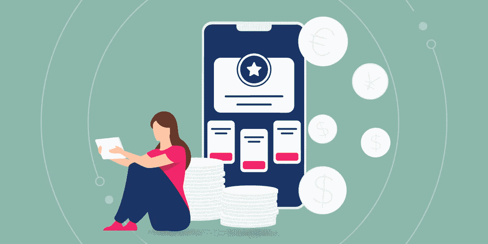
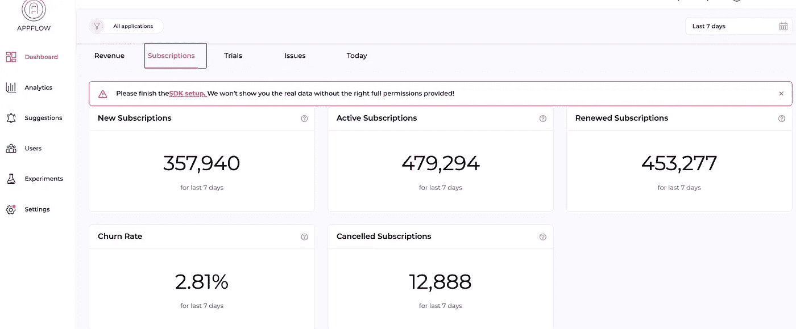
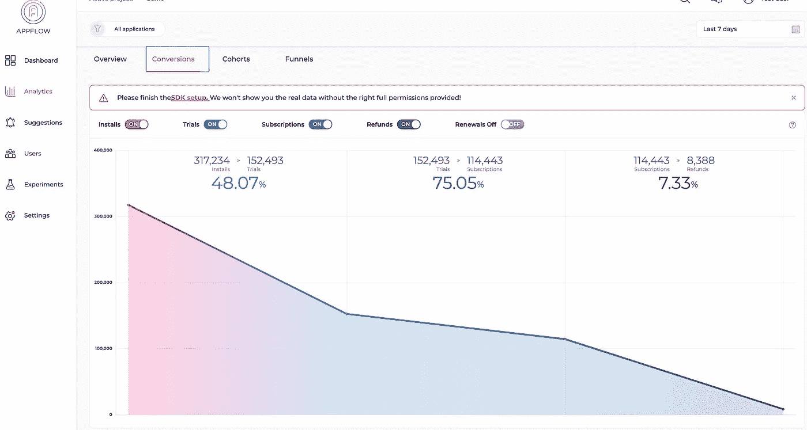

# 2022 年非游戏应用的盈利趋势

> 原文：<https://medium.com/geekculture/monetization-trends-for-non-game-apps-in-2022-995af8d5caca?source=collection_archive---------8----------------------->

据 [Sensor Tower](https://sensortower.com/blog/sensor-tower-app-market-forecast-2026) 预测，到 2026 年，非游戏应用将占据应用市场 57%的收入份额，届时苹果应用商店和 Google Play 的非游戏和游戏应用总支出预计将达到 2330 亿美元。这一数据并不令人惊讶，因为自疫情开始以来，非游戏应用的快速增长和利用。随着非游戏应用发展如此之快，货币化趋势也出现并演变。那么，非游戏应用的盈利趋势是什么？

# 什么是非游戏应用的货币化？

一般来说，*货币化*就是将某物转换成货币的过程。简单来说，货币化意味着从资产、业务或服务等中产生收入。非游戏应用的货币化是指用于从非游戏应用中赚钱的营销策略和技术。

某种程度上等于一个非游戏 app 产生财务收入的收入模式。不同的非游戏应用根据应用类型采用不同的盈利策略，这是一个至关重要的决定，因为它关系到应用的增长和非游戏应用公司的发展。越来越多的非游戏应用正在整合不同的盈利策略，以充分利用他们的应用。

[Monetization Trends for Non-game Apps in 2022](https://www.appflow.ai/blog/monetization-trends-for-non-game-apps)

# 2022 年非游戏应用的盈利趋势

# 1.应用内广告

应用内广告在大多数非游戏应用中很常见，并将继续成为最大的盈利趋势之一。大多数移动开发者对这种收入模式感到满意，因为他们可以从中获得高额利润。然而，在 2022 年，更多的注意力将放在改善用户体验上，因为用户可能会发现侵扰性和不相关的广告令人不安和不安。为了留住用户，开发者应该在广告收入和用户体验之间取得平衡。非游戏应用的应用内广告有不同的形式。最常见的是横幅广告、插播广告和原生广告。除此之外，还有三种广告趋势变得越来越流行:

**奖励视频广告:**这种广告是 2022 年最有效的广告，效果很好，尤其是在电影应用等娱乐应用中。这类非游戏应用的用户往往更愿意观看广告，以换取一部免费的完整电影。

**可玩广告:**顾名思义，它邀请非游戏 app 用户来玩一款游戏。这种广告形式是最吸引人的广告形式，因为它促使用户玩小游戏来赢得优惠券、代金券或什么都不要，这鼓励用户更多地关注游戏，如果他们赢得了优惠券，他们很可能会更加珍惜它，并愉快地使用它。

offer wall:offer wall 是一个有奖励的广告，是一个有奖励清单的页面。非游戏应用用户对这种广告更感兴趣，并倾向于在页面上花更多时间来选择他们想要的利益类型，如虚拟货币、优惠券等。

# 2.应用内购买

应用内购买是非游戏应用营销人员最常用的货币化方法，尤其是购物和电子商务应用。此类应用的用户可以免费下载和使用该应用。他们可以访问应用程序中的所有基本功能，并可以选择购买虚拟和实体产品，或者付费解锁高级功能或观看付费内容。根据一份报告，全球用户在应用内购买上花费了 3800 亿美元，这是增加应用收入的一种受欢迎的方式。因此，很明显，应用内购买仍将是非游戏应用的盈利趋势，尤其是在用户自疫情以来更依赖生活相关应用的时候。

# 3.签署

根据 Business of Apps 的数据，订阅为非游戏[订阅应用](https://www.appflow.ai/blog/top-subscription-apps?category=analysis)贡献了 82%的收入，这使得它成为 2022 年最受欢迎和最知名的货币化趋势。

越来越多的非游戏应用营销人员正在采用订阅模式作为他们的主要盈利策略，因为从长远来看，这可以为他们提供可持续和稳定的收入。此外，在最终决定订阅之前，用户更愿意注册并免费试用应用程序功能。

那么订阅作为一种盈利策略是如何运作的呢？基于订阅的非游戏应用程序通常允许一个月免费访问应用程序的高级功能，如无广告、查看付费内容、访问高级功能、优先获得支持等。在试用期间，应该向用户展示产品的价值，这样他们更有可能在试用结束后为应用付费。用户可以选择自动续订或不续订。并且他们有权在订阅到期后终止订阅。

为了防止用户[搅动](https://www.appflow.ai/blog/churn-for-subscription-apps)，应用开发者为他们的用户提供持续的价值和利益是至关重要的。除此之外，[分析订阅数据](https://www.appflow.ai/analytics)了解用户意义重大。一方面，提高留存率和避免搅动对于应用增长至关重要，另一方面，带来新用户以及改进功能和更新新功能非常重要。在所有这些情况下，你需要数据，它将充当你的北极星，帮助你评估和决定该做什么。

[Appflow.ai — In-App Subscription Analytics Tool](https://www.appflow.ai/analytics)

但是有这么多的事情要做，你有时可能会失去秩序，不开玩笑，处理数据已经可以让你疯了。那么，为什么不明智地让应用内订阅分析工具来帮忙呢？Appflow.ai 擅长数据收集和分析，提供关于留存、搅动、用户、新试用等数据。您还可以在付费墙中进行 A/B 测试，并在一个地方发送通知，为用户找到最佳订阅解决方案和营销策略，并迅速提高投资回报率。

Appflow.ai — Subscription Conversion

# 4.免费增值

免费增值是非游戏应用的另一个盈利趋势。他们向用户提供免费下载和应用程序中的功能，用户可以正常使用，除非他们需要升级。这类应用程序的一个例子是云存储类型的应用程序，它为每个用户提供高达 1GB 或 2GB 的照片和文件备份存储空间的免费计划。这种免费功能可以吸引用户轻松注册，并让人们享受免费备份的乐趣。一旦存储达到其容量限制，用户会倾向于购买更多的存储空间，因为他们习惯于使用备份，更重要的是，他们发现备份对他们很有价值。

# 5.多重货币化战略

非游戏应用最大的盈利趋势是多种盈利策略，也就是说，将几种盈利方式结合在一起。根据客户的需求提供不同的定价方案供他们选择，让他们更乐意为您的收入做出贡献。需要记住的一点是，你要为你的 app 选择最合适的货币化策略，因为不是所有的货币化都适合每一个非游戏类 app。总之，有不同的方法来赚钱的应用程序，最大的趋势，总是一个谨慎的事情。

# 最终想法

2022 年第二季度，非游戏应用首次超过游戏，并且有更快增长的趋势。随着非游戏应用程序年复一年地持续增长，营销人员和产品经理应该清楚地了解非游戏应用程序的货币化趋势，并建立更强大的货币化方法，目的是增加应用程序的收入，并确保最大的投资回报。

[***现在开始免费分析***](https://www.appflow.ai/price) *！*

 [## 面向 iOS 和 Android 的移动订阅分析- Appflow

### 在一个仪表板中公布您的移动订阅数据并计算应用收入、留存率和流失率。进入你的…

www.appflow.ai](https://www.appflow.ai/analytics)