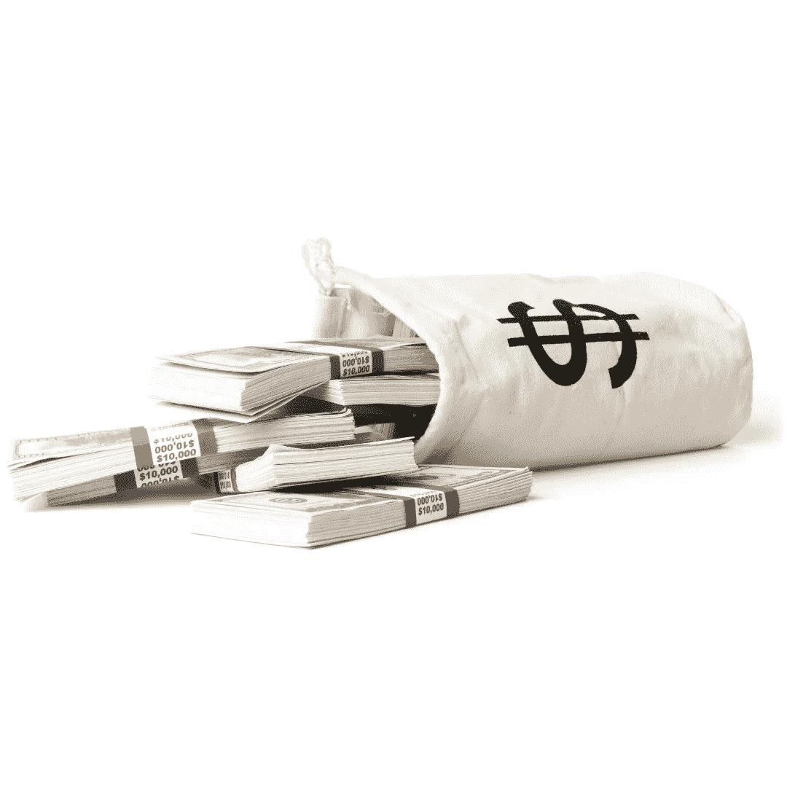

# 利用 Google AdMob 实现 React 原生 Expo 应用的货币化

> 原文：<https://medium.com/geekculture/monetize-your-react-native-expo-application-with-google-admob-f9d132eeb852?source=collection_archive---------8----------------------->

## 如何在 React 本地 Expo 应用中添加 BannerAd、InterstitialAd、RewardAd



How To Show Ads On Your React Native Expo Apps

各位原生开发者好！

我叫 Rohit Kumar Thakur。我一般写 React Native、Django、数据科学、机器学习和 Python。

在本文中，我将向您展示如何将 React Native Expo 应用程序货币化。我知道构建任何应用程序都需要时间、汗水和睡眠。而我们都知道，金钱才是最终的动力。如果你开始从你开发的应用程序中赚钱，那么你所有的努力都会有回报。那么，我们开始吧。

下面是本文的分步视频教程:

Show Ads on your react native mobile apps

# 项目设置

*   选择您选择的目录
*   在同一个目录中，打开命令提示符或终端。
*   使用命令`expo init TestAdMob`初始化并展示应用程序
*   选择空白模板并继续下载依赖项
*   使用命令:`cd TestAdMob`导航到新构建的目录
*   使用命令`expo install expo-ads-admob`安装 expo AdMob

现在，在您喜欢的代码编辑器中打开这个项目。哦！VS 代码？很好。

# 密码

## 班纳德

```
import { StatusBar } from 'expo-status-bar';
import { StyleSheet, Text, View } from 'react-native';
import React, { useEffect } from 'react';
import  { AdMobBanner } from 'expo-ads-admob';export default function App() {
  return (
    <View style={styles.container}>
      <Text>Admob Test</Text>
      <AdMobBanner
        bannerSize="fullBanner"
        adUnitID="ca-app-pub-3940256099942544/6300978111" // Test ID, Replace with your-admob-unit-id
        servePersonalizedAds // true or false
      />
      <StatusBar style="auto" />
    </View>
  );
}const styles = StyleSheet.create({
  container: {
    flex: 1,
    backgroundColor: '#fff',
    alignItems: 'center',
    justifyContent: 'center',
  },
});
```

## 间隙层

```
import { StatusBar } from 'expo-status-bar';
import { StyleSheet, Text, View } from 'react-native';
import React, { useEffect } from 'react';
import  { AdMobInterstitial } from 'expo-ads-admob';const interstitial = async () => {
  await AdMobInterstitial.setAdUnitID('ca-app-pub-3940256099942544/1033173712'); // Test ID, Replace with your-admob-unit-id
  try {
    await AdMobInterstitial.requestAdAsync();
    await AdMobInterstitial.showAdAsync();
  } catch (error) {
    console.log(e);
  }
};export default function App() {
  useEffect (() => {
    interstitial();
  },[])
  return (
    <View style={styles.container}>
      <Text>Admob Test</Text>
      <StatusBar style="auto" />
    </View>
  );
}const styles = StyleSheet.create({
  container: {
    flex: 1,
    backgroundColor: '#fff',
    alignItems: 'center',
    justifyContent: 'center',
  },
});
```

## 奖励

```
import { StatusBar } from 'expo-status-bar';
import { StyleSheet, Text, View } from 'react-native';
import React, { useEffect } from 'react';
import  { AdMobRewarded } from 'expo-ads-admob';const reward = async () => {
  await AdMobRewarded.setAdUnitID('ca-app-pub-3940256099942544/5224354917'); // Test ID, Replace with your-admob-unit-id
  try{
    await AdMobRewarded.requestAdAsync();
    await AdMobRewarded.showAdAsync();
  } catch (error){
    console.log(e)
  }
}export default function App() {
  useEffect (() => {
    reward();
  },[])
  return (
    <View style={styles.container}>
      <Text>Admob Test</Text>
      <StatusBar style="auto" />
    </View>
  );
}const styles = StyleSheet.create({
  container: {
    flex: 1,
    backgroundColor: '#fff',
    alignItems: 'center',
    justifyContent: 'center',
  },
});
```

嗯，就是这样。现在，您的设备可以显示测试广告。

Expo 提供默认的 AdUnitID。您可以使用这个 ID 进行测试。但是如果你想展示真正的广告，你必须在 [**Google AdMob**](https://admob.google.com/home/) 上注册。

在您创建帐户后，Google AdMob 会给您一个成人 ID。简单地说，用 expo AdUnitID 替换那个 id。

现在，你的手机应用程序将向你展示真正的广告。你可以从中发财。

现在，鼓掌，鼓掌，鼓掌！并关注更多关于 React Native expo 的基于项目的文章。

感谢阅读。

*更多内容看* [***说白了。报名参加我们的***](https://plainenglish.io/) **[***免费周报***](http://newsletter.plainenglish.io/) *。关注我们关于*[***Twitter***](https://twitter.com/inPlainEngHQ)*和*[***LinkedIn***](https://www.linkedin.com/company/inplainenglish/)*。加入我们的* [***社区***](https://discord.gg/GtDtUAvyhW) *。***