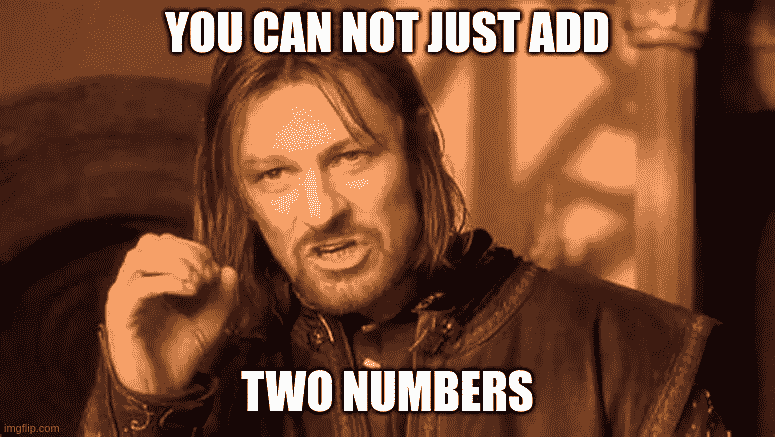

# 用 Node.js 和 PostgreSQL 进行货币操作

> 原文：<https://medium.com/geekculture/money-operations-with-node-js-and-postgresql-91d1f06ff263?source=collection_archive---------5----------------------->


如果你在做一个商业项目，你必须和钱打交道。你可能会问“那么，有什么问题呢？钱只是数字”。嗯，没那么简单。许多开发人员会犯常见的错误和/或没有考虑 Node.js 的特性。

# Node.js 中的数字

先说基础的，Node.js 中的数字是什么？强类型语言为开发人员提供了几种数字类型:

*   整数:`byte`、`int16`、`int32`、`int64`和无符号类型
*   浮点:`float32`、`float64` / `double`
*   定点/小数。有些语言提供了开箱即用，有些则没有

在 Node.js/TypeScript，只有一种存储数字的类型`number`，而且只是一种`float64`类型。意味着您可以安全地对从 *-9007199254740991* 到 *9007199254740991* 的整数进行加减乘除。但是有了除法和非整数，就没那么简单了。下面是关于浮点类型最常见的笑话:

```
> 0.1 + 0.2
0.30000000000000004
```



任何小数点后有数字的运算都是不精确的。大多数情况下你可能不会考虑到它。但是诸如账单、会计、税收等等。，这很关键。

**其实我在撒谎，Node.js v10 推出了一个新类型* `*BigInt*` *，不过我们今天就不说了。*

# 怎么解决？

想法很简单:如果非整数不能保证精度，那就用整数吧。首先，我们需要在小数点后多少位数上达成一致。如果我们谈论的是钱，最有可能的答案是存储美分的 2 位数。我们可以将一个数字存储为 *1999* ，而不是存储为 *19.99* ，记住最后两位数字代表美分。这一招可以让你安全地加，减，乘钱而不损失精度。分呢？

例如，我们希望获得净价为 *$19.99* ，增值税率为 20%。

```
netPrice = totalPrice / (1 + vatRate / 100)// with vatRate 20%
netPrice = totalPrice / 1.2
```

它给出了常规数字:

```
> 19.99 / 1.2
16.65833333333333
```

使用整数技术，我们需要做的就是在除法之后调用`Math.round`:

```
> Math.round(1999 / 1.2)
1666
```

以人类可读的格式，它给出了 16.66 美元。0.00166666666666687036 我们已经输了*了，但是对于金融操作来说，这是预期行为。*

当然，你不需要自己处理这些事情， [Currency.js](https://currency.js.org/) 的作者已经实现了所有必要的功能。这个库非常简单、轻量级，并且与浏览器兼容。

# 存储在 PostgreSQL 中


好了，现在 Node.js 里可以用钱操作了，但是 DB 呢？让我们看看 PostgreSQL 能提供什么。

## 打字钱

PostgreSQL 已经有了一个存储货币的类型。默认情况下，它在小数点后存储 2 位数字，并返回格式为`$19.99`的字符串。如果您想改变这种行为，您需要覆盖 PostgreSQL 配置中的`lc_monetary`设置。`money` type 还是挺有用的，货币字符前缀很烦人，但是 Currency.js 可以轻松解析。TypeORM 示例:

当您需要支持多种货币时，问题就出现了。`money` type 只支持一种货币设置。例如，科威特第纳尔小数点后有 3 位，与欧元和美元放在一起不方便。而`money`型不能处理加密货币。

一般来说，如果你的项目只使用一种货币，`money` type 是一个容易的选择。但如果你有在全球扩张并支持加密货币的伟大计划，你需要选择另一种方法。

## 键入十进制和数字

PostgreSQL 中的`decimal`和`numeric`类型是一样的，最多可以存储点后 *16383* 位和点前 *131072* 位。储存任何货币都绰绰有余。基本上，`money`类型是`decimal/numeric`类型的子类型，具有预设的配置和格式。对我来说，这些类型的主要头痛是选择精度和规模，这将适合所有可能的值。你的服务价格可能不会很高，但如果你需要做年度报告，总收入可能会很高。所以，要让`decimal/numeric`存储所有可能的值，需要设置最大可能值，比如说 100 亿，就是小数点前 10 位。如果你必须支持 BTC，那就是小数点后 8 位数。我们一起得到`numeric(8, 18)`，它消耗了 5 个字节。

`decimal/numeric` type 是为高精度的数字运算而创建的，它很好地实现了自己的目的。不知道补充什么:)

## bigint 类型

整数类型也可以用于 PostgreSQL 端的货币操作。我们只需要像在 Node.js 中那样以分为单位存储值，因为 PostgreSQL 是强类型的，所以您不必关心舍入:`SELECT 100/3`返回`33`。首先，我们需要创建一个包含货币列表的表，其中包含字段`id`、`symbol`和`scale`。将`currency_id`列和外键添加到包含货币的表中，并在选择查询中连接货币表。在 Node.js 端，使用选项`fromCents:true`和`precision`将其映射到 Currency.js。

与上面的类型相比，使用整数类型可能看起来过于复杂，但是使用整数类型的操作比使用`decimal/numeric`要快 50%以上。感谢 [@jasonlv_87745](http://twitter.com/jasonlv_87745) 做了一篇关于性能测量的文章[https://blog . Xen dit . engineer/benchmark-pg-numeric-integer-9c 593 D7 af 67 e](https://blog.xendit.engineer/benchmarking-pg-numeric-integer-9c593d7af67e)

# 序列化

现在我们知道了如何在 PostgreSQL 中存储钱，以及如何在 Node.js 端用它进行操作。但是如何在 HTTP 响应中返回它呢？您可以使用整数方法，返回美分金额和小数点后的位数。或者你可以用 Currency.js 把它字符串化，选择哪种方式？这完全取决于你的团队。我个人比较喜欢用字符串，因为懒得多加一个字段:)

# 几个音符

只是一些值得一提的提示

*   尽量在 DB 端进行金钱操作。PostgreSQL 和其他数据库已经证明了自己是货币操作的高性能和健壮的解决方案，只要利用这个优势。
*   最后分。我经常看到类似于`Currency(price).divide(100).multiply(percentage)`的计算，如果价格是 *0.49* ，百分比是 *20* 与 Currency.js，你将得到 *0、*，因为 *0.49 / 100* 小于 1 美分。一个简单的修复`Currency(price).multiply(percentage).divide(100)`解决了这个问题。
*   不要映射到`Number`。`pg`库自动将`bigint`、`decimal/numeric`、`money`和`float`的值映射到 Node.js 中的字符串，不要用`Number(...)`包装或者调用`parseInt`和`parseFloat`。值作为字符串返回，以避免丢失精度。如果你需要用它们做 smth，就用 Currency.js。这个建议不适用于`integer`和`smallint`类型，它们被映射到数字，因为它是安全的。
*   不要使用`.toFixed`方法。`.toFixed`将一个值舍入到精度，并以字符串形式返回。但是你可能会面临一些奇怪的情况，比如

```
> 1.055.toFixed(2)
'1.05' // but it must return '1.06'
```

# 结论

今天到此为止。希望这篇文章对你有用。如果没有，好吧，对你有好处，你已经知道关于金钱操作的一切:)欢迎在评论中提问。


*下次见！Servus！*