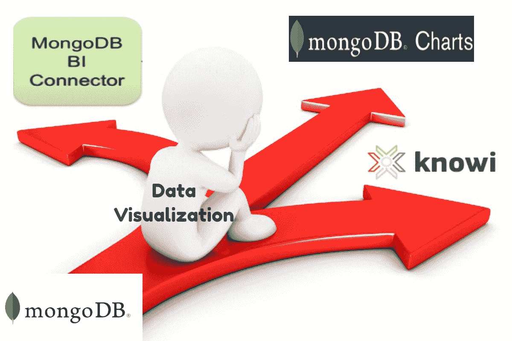
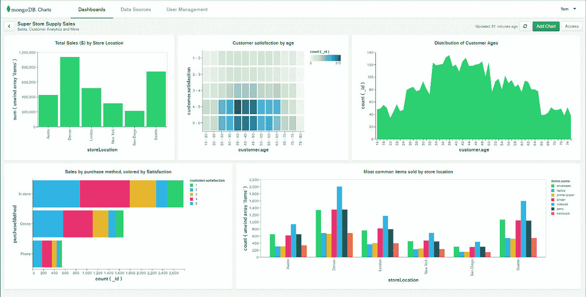
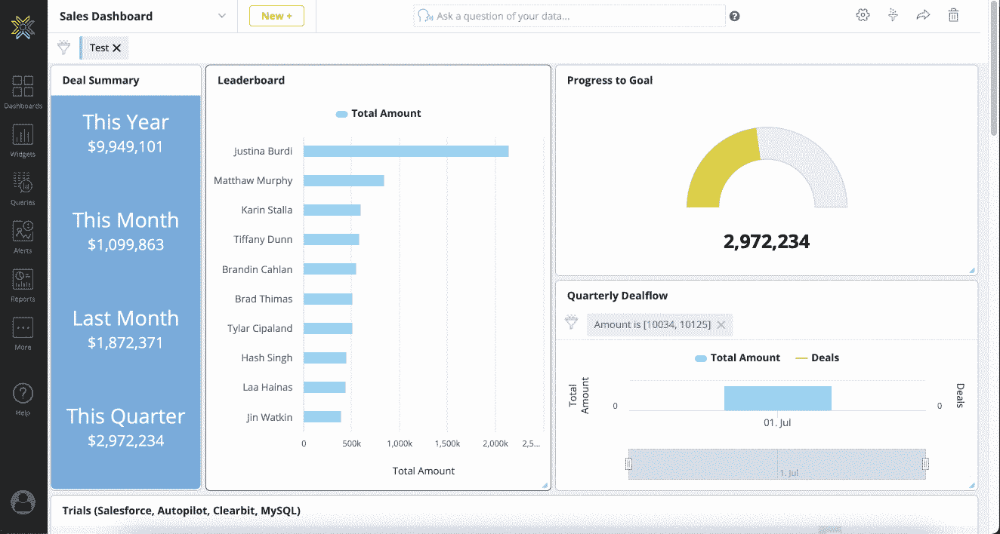

# MongoDB BI 连接器 vs MongoDB 图表 vs Knowi

> 原文：<https://medium.com/geekculture/mongodb-bi-connector-vs-mongodb-charts-vs-knowi-2315a4827578?source=collection_archive---------6----------------------->

MongoDB 数据可视化用哪种方式？

Image by Author

# 介绍

在移动和在线应用发明之前，数据管理非常简单。关系数据库将数据存储在表中，表将数据组织成行和列。现代应用程序生成的大多数数据都是非结构化的，例如，文本、社交媒体帖子、视频文件和电子邮件。该数据不能很好地适应行和列。

NoSQL 数据库是为了解决关系数据库的局限性而发明的，它们适用于非结构化数据的管理。根据 [DB-Engines 排名](https://db-engines.com/en/ranking)，MongoDB 是领先的 NoSQL 数据库。它使用文档对象模型将所有相关数据存储在同一个文档中。这使得它比关系数据库模型更加灵活。

存储数据是一回事，理解数据并付诸使用是另一回事。数据可视化是理解数据的最佳方式之一。它帮助用户以可视化的形式表示数据，并提取有意义的见解。在本文中，我们将讨论可视化 MongoDB 数据的三种典型方法— [MongoDB BI 连接器](https://docs.mongodb.com/bi-connector/current/)、 [MongoDB 图表](https://www.mongodb.com/products/charts)和 [Knowi](https://www.knowi.com/) ，以帮助您选择适合您业务的方法。

# MongoDB BI 连接器

MongoDB BI 连接器[允许您使用自己选择的 BI 工具来可视化和报告 MongoDB 数据。连接器充当在 MongoDB 和您的 BI 工具之间翻译数据和查询的层。使用 MongoDB BI 连接器来创建可视化和仪表板，以帮助您从 MongoDB 数据中提取洞察力。](https://docs.mongodb.com/bi-connector/current/)

MongoDB BI 连接器的工作方式如下:

**步骤 1:** 连接器为您的 BI 平台提供关于您需要分析的 MongoDB 集合的模式的信息。

**步骤 2:** 连接器从您的 BI 平台接收 SQL 查询，并将它们翻译成相应的 MongoDB 查询，然后发送到 MongoDB。

**步骤 3:** 连接器将结果转换成表格格式，并将其发送回您的 BI 平台进行可视化。

How the MongoDB BI Connector Works (Source-www.knowi.com)

# **MongoDB BI 连接器的优势**

以下是使用 MongoDB BI 连接器可视化 MongoDB 数据的优势:

1.  **原生于 MongoDB**

该连接器是 MongoDB 的原生产品，当用户使用 BI 平台可视化他们的数据时，它给了用户一个流畅的体验。

**2。兼容流行的商务智能平台**

MongoDB BI 连接器允许您将 MongoDB 用作 BI 平台的数据源，如 Tableau、Microsoft Power BI、Qlik、Excel、MicroStrategy 和许多其他平台。

**3。消除批量 ETL 处理**

MongoDB BI 连接器不存储数据，但它充当 BI 平台和 MongoDB 集合之间的按需读取桥梁，从而消除了批量 ETL 处理的需要。

# MongoDB BI 连接器的缺点

以下是 MongoDB BI 连接器的缺点:

1.  **仅支持 MongoDB**

MongoDB BI 连接器只与 MongoDB 兼容，因此，您不能使用它从其他数据源提取数据。

**2。不支持集合间的连接**

MongoDB 连接器不能帮助您在单个可视化中可视化来自不同 MongoDB 集合的数据。

**3。处理某些 SQL 语句的难度**

连接器不能正确映射查询，尤其是带有聚合函数的查询，比如 max、sum、avg 等等。

# MongoDB 图表

MongoDB Charts Dashboard (Source-docs.mongodb.com)

[MongoDB Charts](https://www.mongodb.com/products/charts) 是 MongoDB 的本地数据可视化工具。它的开发是为了消除数据可视化的技术障碍。MongoDB Charts 具有对文档模型的原生支持，这使用户不必担心工具、代码、数据复制或数据可视化过程中的数据移动。MongoDB 与 MongoDB Atlas 完全集成，但是您也可以将其安装到本地企业用户的服务器上。

MongoDB 图表为其用户提供了以下功能:

*   能够创建常见的数据可视化，包括条形图、折线图、热图、散点图、表格和数字图。
*   嵌入式分析将仪表板和可视化嵌入外部 web 应用程序。
*   支持 MongoDB 文档模型，包括数组和嵌套文档。
*   能够与其他团队成员共享仪表板。
*   先进的数据过滤功能，使用户无需输入查询。
*   使用新地图的地理空间数据可视化。
*   使用自定义聚合管道进行数据预处理。

在 MongoDB Atlas 中使用 MongoDB 图表很容易。您可以从 Atlas 集群中快速选择一个数据集合作为数据源，将字段从集合中拖放到 Tableau 之类的图表构建器上。可以将多个图表添加到单个仪表板中。

# MongoDB 图表的优势

MongoDB 图表为其用户提供了以下好处:

1.  **与 MongoDB Atlas 无缝集成**

MongoDB Charts 提供了与 MongoDB Atlas 的无缝集成。很容易将 MongoDB 图表连接到您的 MongoDB 项目，并从您的 Atlas 集群数据生成可视化。

**2。聚合功能**

MongoDB 图表带有内置的聚合功能。聚合使您能够将许多指标应用于您的收集数据，并执行平均值和标准差等计算，以从您的数据中获得洞察力。

**3。文档数据处理**

MongoDB 图表适合处理基于文档的数据，比如数组和文档对象。嵌套数据结构的使用为您提供了灵活性，并允许您以最适合您的应用程序的方式组织数据，同时保留创建强大可视化的能力。

# MongoDB 图表的缺点

以下是 MongoDB 图表的缺点:

1.  **只能可视化 MongoDB 数据**

MongoDB 图表只能可视化存储在 MongoDB 中的数据。如果您的数据存储在另一个数据源中，您必须寻找一个替代的数据可视化工具，或者将您的数据移动到 MongoDB。

**2。不支持跨数据集合的连接**

MongoDB 图表没有提供一种方法来连接来自不同 MongoDB 集合的数据，并将其可视化在一个图表上。每个可视化只显示来自单个数据集合的数据。这使得 MongoDB 图表成为创建简单数据可视化的唯一好的解决方案。如果您是一个真正的数据驱动型组织，您可能需要寻找一种高级的 BI 解决方案。

# Knowi

Knowi Dashboard (Source- [www.knowi.com)](http://www.knowi.com))

Knowi 是一个与 MongoDB 原生集成的 BI 工具。因此，它可以帮助您利用 MongoDB 的灵活性、速度和可伸缩性进行分析，而无需移动数据或安装驱动程序。此外，Knowi 支持跨不同数据源的连接，因此，您可以使用它来连接跨 MongoDB 数据集合的数据，并将其可视化在一个图表中。

Knowi 具有以下高级功能:

*   支持与 NoSQL 数据源以及 REST-API、SQL 数据库和 JSON/CSV 的本机集成。
*   30 多个可视化选项可排列在交互式仪表盘上。
*   自然语言 BI 功能允许非技术用户用简单的英语提问，并从数据中获得即时答案。
*   能够跨多个数据源(SQL 和 NoSQL)连接数据，无缝地混合和存储组合结果。
*   嵌入式分析，允许您将仪表板嵌入外部应用程序。
*   能够在您的数据分析工作流中使用机器学习算法。

# 知识的优势

以下是使用 Knowi 进行数据可视化的优势:

1.  **与 MongoDB 的本机集成**

Knowi 本机集成了 MongoDB。这将用户从不得不迁移数据或依赖第三方驱动程序进行集成的束缚中解放出来。

**2。支持跨多个数据源的连接**

Knowi 允许其用户整合来自不同数据源的数据，并将其可视化在一个图表上。因此，与 MongoDB 图表不同，您可以使用 Knowi 的特性来集成来自多个 MongoDB 集合的数据，并将其可视化在一个图表上。

**3。支持多种数据源**

除了 MongoDB，Knowi 还支持与其他 SQL 和 NoSQL 数据源的本地集成。这意味着与 MongoDB BI 连接器和 MongoDB 图表不同，您可以使用 Knowi 来可视化存储在其他数据源中的数据。

**4。适合非技术用户**

Knowi 基于搜索的分析功能允许非技术用户用简单的英语提问并得到答案，而不需要事先了解底层查询语言。

# 知识的缺点

以下是 Knowi BI 工具的缺点:

1.  **不开源**

Knowi 是一个商业工具。

**2。复杂的用户界面**

Knowi 为其用户提供了直观的业务用户界面。然而，它面向工程师的用户界面很复杂，用户可能需要一些时间来适应它。

**3。其开箱即用的可视化效果并不是“最漂亮的”**

Knowi 的开箱即用的可视化效果不是很漂亮，但是用户可以使用 CSS/JavaScript 定制它们。

# 结论

MongoDB 是存储非结构化数据的最受欢迎的 NoSQL 数据库。有三种不同的方法来可视化 MongoDB 数据——MongoDB BI 连接器、MongoDB 图表和 Knowi。

[MongoDB BI 连接器](https://docs.mongodb.com/bi-connector/current/)允许您使用自己选择的 BI 工具可视化 MongoDB 数据。它充当在 MongoDB 和您的 BI 工具之间翻译数据和查询的层。但是，连接器不允许您连接不同集合的数据，并在单个图表上可视化。它只支持与 MongoDB 集成作为数据源。当您需要使用您选择的 BI 工具可视化您的 MongoDB 数据时，请使用 MongoDB BI 连接器。

[MongoDB Charts](https://www.mongodb.com/products/charts) 是 MongoDB 提供的原生数据可视化工具。它本身支持文档模型，消除了在数据可视化过程中对工具、代码、数据复制或数据移动的担心。它提供了与 MongoDB Atlas 的无缝集成。但是，它只能可视化 MongoDB 数据，不能在单个图表上连接和可视化来自不同集合的数据。当您需要从 MongoDB 数据创建基本的可视化时，可以使用 MongoDB 图表。

Knowi 是一个与 MongoDB 原生集成的 BI 工具。除了 MongoDB，您可以使用 Knowi 来可视化存储在任何 SQL 或 NoSQL 数据库中的数据，而无需担心数据迁移或依赖第三方工具进行集成。Knowi 还支持跨不同数据源的连接，因此，您可以连接来自不同 MongoDB 集合的数据，并将其可视化在一个图表上。它还具有基于搜索的分析等高级功能，允许非技术用户用简单的英语提问并获得答案，而不需要事先了解底层查询语言。当您需要可视化您的 MongoDB 数据或来自任何来源的数据，而无需担心数据迁移或第三方驱动程序集成时，请使用 Knowi。当您需要连接来自多个来源的数据并将其可视化在一个图表上时，Knowi 也是一个不错的工具。