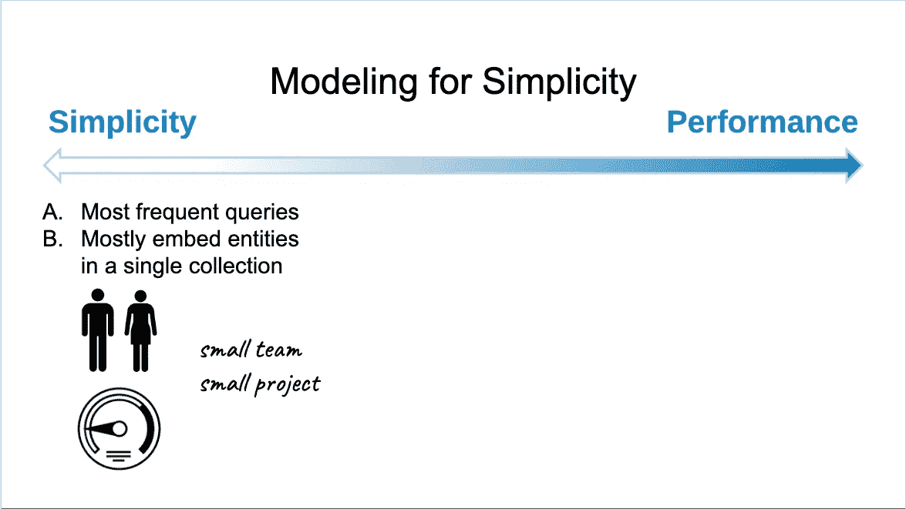
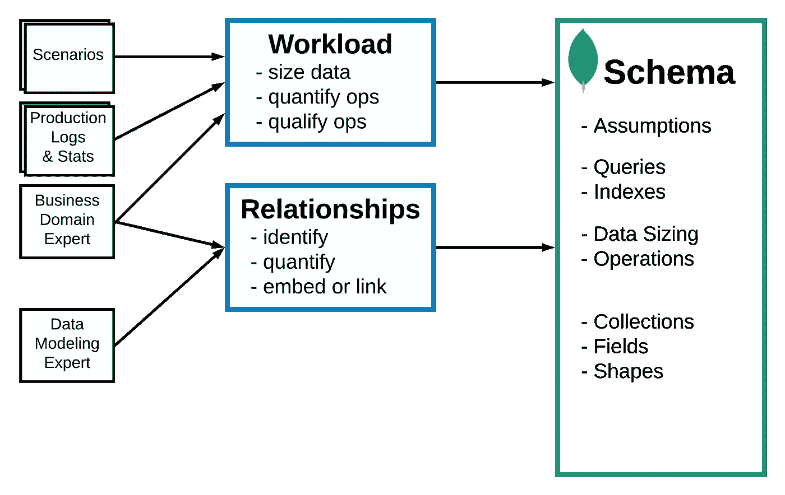
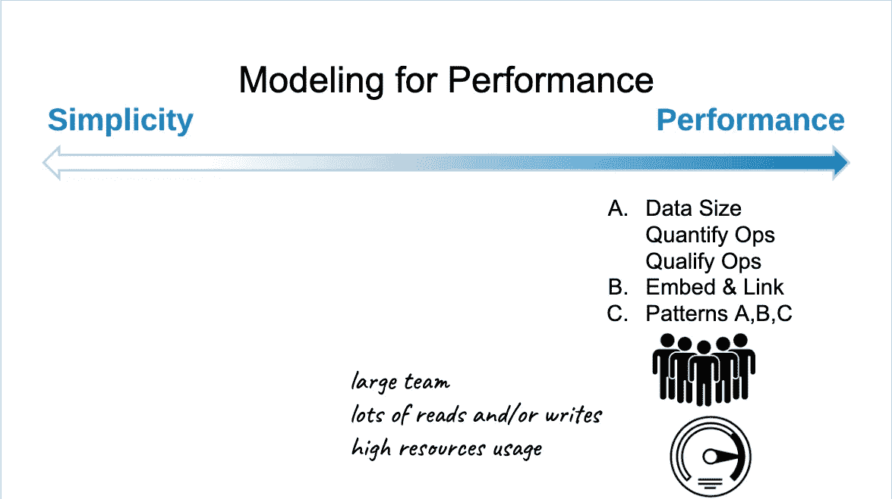
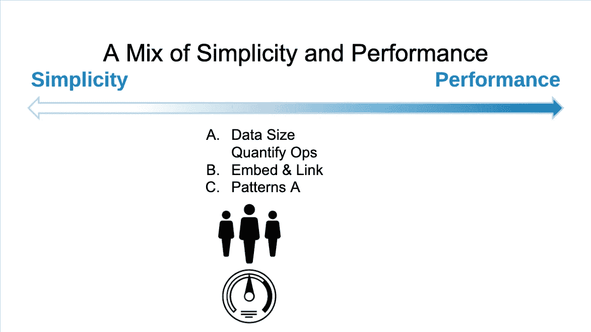

# MongoDB:数据建模至关重要，优化的第一步[数据建模系列-1]

> 原文：<https://medium.com/geekculture/mongodb-data-modeling-matters-first-step-to-optimization-data-modeling-series-1-158be911ecb8?source=collection_archive---------36----------------------->

M320,[https://university.mongodb.com/](https://university.mongodb.com/)

## MongoDB 数据建模

## MongoDB 带来了整个世界的数据建模，就像在 SQL 中预先定义模式一样，在大多数情况下，规范化是对数据建模的唯一方式。

作为 MongoDB 和数据建模的初学者，应该寻找什么。

*   数据建模的重要性。
*   数据建模方法。
*   为简单性和性能建模。
*   避免过度工程化。

## [数据建模介绍](https://docs.mongodb.com/manual/core/data-modeling-introduction/)

[*根据 mongodb 文档*](https://docs.mongodb.com/manual/core/data-modeling-introduction/) :数据建模的关键挑战是平衡应用程序的需求、数据库引擎的性能特征和数据检索模式。在设计数据模型时，始终要考虑数据的应用程序用法(即数据的查询、更新和处理)以及数据本身的固有结构。

## 为什么要数据建模？

由于 MongoDB 提供了灵活的模式结构，使用 JSON 文档，我们可以按照应用程序需要的任何方式对数据进行建模。以任何可能的方式[ ***嵌套数组/子文档、平面、表格、柱状、键值、文本、地理空间*** ]或其组合，带有适当的索引。

> 随着灵活性而来的是建模。

这有什么用？

*   **磁盘 I/O** —具有优化的读/写功能
*   **内存利用率** —改进的文档结构，带有正确的索引。
*   **CPU 利用率** —避免内存操作[排序、聚合]
*   **网络** —极简方法，避免冗余。
*   **磁盘使用** —管理所需的冗余。
*   **托管数据库**
*   **优化复杂度**。

## 方法学

为我们需要理解/收集的东西/事物建模。

*   Usage/ **Workload** —如何使用(查询/修改)以及使用量。
*   所有的组成部分——所有不同的数据集都可以转换成文档，以及它们之间的关系。
*   我们能不能用一个模式来实现它——能不能用一个模式来获得性能。

M320, [https://university.mongodb.com/](https://university.mongodb.com/)

## 建模简单胜于性能

通过有限的使用预期、响应时间、资源(内存/磁盘/IOPs/网络)保持简单以实现更快的开发不是瓶颈。
例如:*最常用的简单方法是将数据平铺在一起，避免过多缩进，是的，这会增加冗余，但会降低跨集合连接数据的复杂性，更新树结构中的节点/叶*。

M320, [https://university.mongodb.com/](https://university.mongodb.com/)

## 模拟性能胜于简单性。

在有约束条件时实现性能的模型，即所需的响应时间、优化的资源(内存/磁盘/IOPs/网络)。将不得不在方法学方面花费更多的时间来理解哪一个是最好的模式，引入增加的开发时间增加了复杂性。

## 混合模型

在不关心性能的地方和关心性能的地方创造分离。
例如:*简单性——保存主数据/配置数据的数据点/集合，性能不是问题。
绩效——报告/处理/转化…其中使用/容量/响应时间至关重要。*

M320, [https://university.mongodb.com/](https://university.mongodb.com/)

## **参考文献**:

为了更好地理解并开始数据建模。

 [## MongoDB:带有物化路径的模型树结构

### 具有物化路径的模型树结构以及如何使用

arun2pratap.medium.com](https://arun2pratap.medium.com/mongodb-model-tree-structures-with-materialized-paths-ed58f38ded3e)  [## M320:数据建模| MongoDB 大学

### M320 ADVANCED 了解您需要了解的关于 MongoDB 数据建模的一切。MongoDB 大学的所有课程都是…

university.mongodb.com](https://university.mongodb.com/courses/M320/about) 

请分享您对**数据建模**的看法，希望对您有所帮助。

编码愉快，谢谢:)