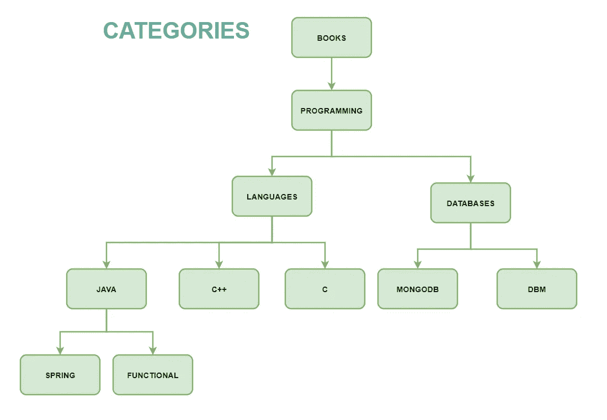

# MongoDB:带有物化路径的模型树结构

> 原文：<https://medium.com/geekculture/mongodb-model-tree-structures-with-materialized-paths-ed58f38ded3e?source=collection_archive---------0----------------------->

## MongoDB 数据建模

## 具有物化路径的模型树结构及其使用方法。

[有不同的方式来建立树形结构](https://docs.mongodb.com/manual/applications/data-models-tree-structures/)。会寻找物化的道路。

*   [**带父引用的模型树结构**](https://docs.mongodb.com/manual/tutorial/model-tree-structures-with-parent-references/)
*   [**带子参照的模型树结构**](https://docs.mongodb.com/manual/tutorial/model-tree-structures-with-child-references/)
*   [**用祖先数组建立树形结构**](https://docs.mongodb.com/manual/tutorial/model-tree-structures-with-ancestors-array/)
*   [**具有物化路径的模型树结构**](https://docs.mongodb.com/manual/tutorial/model-tree-structures-with-materialized-paths/)
*   [**具有嵌套集合的模型树结构**](https://docs.mongodb.com/manual/tutorial/model-tree-structures-with-nested-sets/)

> 如果您希望对节点进行操作，请不要按原样存储嵌入的树。这将增加树中节点操作的复杂性，您将被迫在服务端进行处理。

建模时的规则是一样的，我们应该知道(不涉及太多细节的高层次):

*   使用模式—所有操作的[DML]是什么，涉及的复杂性。
*   数据的性质—[较不频繁更改的非增长数据(主数据/配置数据/一次性数据)与持续增长的数据(统计数据/访问日志/预订/交易数据)]
*   性能—请求量、响应时间。
*   复杂性——目标查询，使用 MongoDB 的特性对其进行操作，而不是在应用程序中提取数据并执行操作。

## 使用案例:

书籍的类别，每本书都被标记在一个类别下。

*   用法—将关注不同的搜索模式。
*   数据的性质—频率较低的非增长数据。
*   性能-用索引覆盖查询字段，预期数据量低。
*   复杂性——将看到物化路径是如何帮助我们的。



## 准备数据:

```
db.categories.insertMany( [
   { _id: "Books", path: null },
   { _id: "Programming", path: ",Books," },
   { _id: "Databases", path: ",Books,Programming," },
   { _id: "Languages", path: ",Books,Programming," },
   { _id: "MongoDB", path: ",Books,Programming,Databases," },
   { _id: "dbm", path: ",Books,Programming,Databases," },
   { _id: "Java", path: ",Books,Programming,Languages," },
   { _id: "C++", path: ",Books,Programming,Languages," },
   { _id: "C", path: ",Books,Programming,Languages," }, 
   { _id: "Functional", path: ",Books,Programming,Languages,Java," },
   { _id: "Spring", path: ",Books,Programming,Languages,Java," },
   { _id: "MicroServices", path: ",Books,Programming,Languages,Java," },
] );// add index on "path" field.
db.categories.createIndex**(** **{** path**:** 1 **}** **);**
```

*   您可以查询检索整个树，按字段路径排序

```
db.categories.find().sort( { path: 1 } );//Output:
{ "_id" : "Books", "path" : null }
{ "_id" : "Programming", "path" : ",Books," }
{ "_id" : "Databases", "path" : ",Books,Programming," }
{ "_id" : "Languages", "path" : ",Books,Programming," }
{ "_id" : "MongoDB", "path" : ",Books,Programming,Databases," }
{ "_id" : "dbm", "path" : ",Books,Programming,Databases," }
{ "_id" : "Java", "path" : ",Books,Programming,Languages," }
{ "_id" : "C++", "path" : ",Books,Programming,Languages," }
{ "_id" : "C", "path" : ",Books,Programming,Languages," }
{ "_id" : "Functional", "path" : ",Books,Programming,Languages,Java," }
{ "_id" : "Spring", "path" : ",Books,Programming,Languages,Java," }
{ "_id" : "MicroServices", "path" : ",Books,Programming,Languages,Java," }
```

*   您可以在 path 字段上使用正则表达式来查找编程的后代/子代

```
db.categories.find( { path: /,Databases,/ } );// Output:{ "_id" : "MongoDB", "path" : ",Books,Programming,Databases," }
{ "_id" : "dbm", "path" : ",Books,Programming,Databases," }
```

*   查询查找所有与给定节点得分最近的相关节点。

《出埃及记》与“春天”关系最密切

将使用[文本搜索](https://docs.mongodb.com/manual/text-search/)。

```
// create text index to use text search.db.categories.createIndex( { path: "text"} );// Find the path for node "Spring"
var pathForNodeSpring = db.getCollection("categories")
      .find({_id: "Spring"}).next().path;// Use it to search the tree with score, highest score is the best // match
db.categories.find(
   { $text: { $search: pathForNodeSpring } },
   { score: { $meta: "textScore" } } // assigns score to best match.
).sort( { score: { $meta: "textScore" } } ) ;// Output:{ "_id" : "Functional", "path" : ",Books,Programming,Languages,Java,", **"score" : 2.5** }
{ "_id" : "Spring", "path" : ",Books,Programming,Languages,Java,", **"score" : 2.5** }
{ "_id" : "MicroServices", "path" : ",Books,Programming,Languages,Java,", **"score" : 2.5** }
{ "_id" : "Java", "path" : ",Books,Programming,Languages,", **"score" : 2** }
{ "_id" : "C++", "path" : ",Books,Programming,Languages,", "score" : 2 }
{ "_id" : "C", "path" : ",Books,Programming,Languages,", "score" : 2 }
{ "_id" : "Databases", "path" : ",Books,Programming,", "score" : 1.5 }
{ "_id" : "Languages", "path" : ",Books,Programming,", "score" : 1.5 }
{ "_id" : "MongoDB", "path" : ",Books,Programming,Databases,", "score" : 1.3333333333333333 }
{ "_id" : "dbm", "path" : ",Books,Programming,Databases,", "score" : 1.3333333333333333 }
{ "_id" : "Programming", "path" : ",Books,", "score" : 1 }
```

用**“得分”:2.5** 是它最接近节点“春天”的兄弟。这将有助于读者在“Spring”上找不到一本书，但应用程序仍然可以引用同一类别中的相关书籍。

## 缺点:

对节点所做的修改应该反映到所有的后代/子节点。

希望这将是有帮助的，请做评论，如果我错过了一些场景或简短的解释。