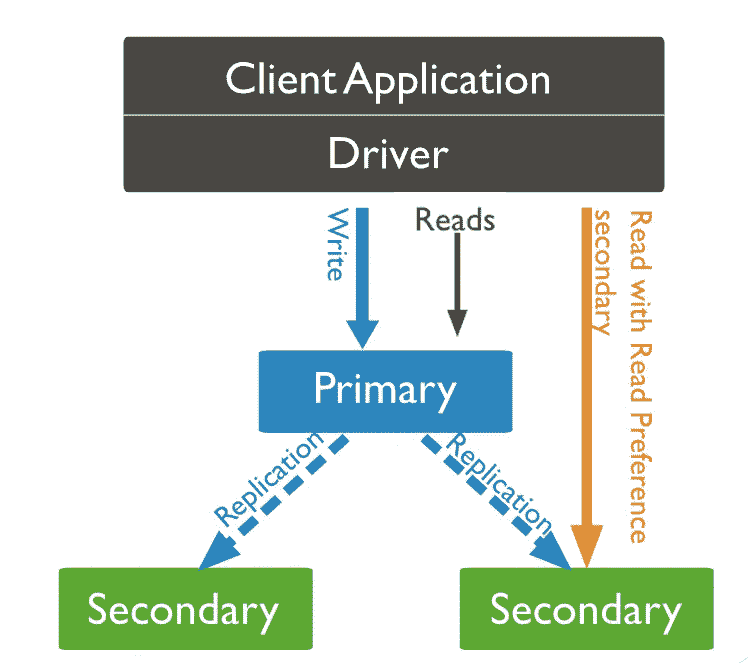

# MongoDB:从二级读取以提高性能

> 原文：<https://medium.com/geekculture/mongodb-read-from-secondary-to-boost-performance-dca938a680ac?source=collection_archive---------0----------------------->



snipped from: [https://docs.mongodb.com/manual/replication/](https://docs.mongodb.com/manual/replication/)

## MongoDB 集群

## MongoDB 从辅助节点读取数据，用例，从辅助节点读取旧数据/最新数据，支持和反对的例子。

> mongodb 3.6+版，必要时链接到 MongoDB 文档以便进一步阅读。

## 为什么我们要从辅助节点读取数据？

默认情况下，mongodb 在主服务器上读/写以保持一致性(考虑所有的首选项和配置)。

[从辅助节点读取数据的用例](https://docs.mongodb.com/manual/core/read-preference-use-cases/):

*   可以接受陈旧数据的报告/分析。
*   **写**比**读**(仍然需要处理陈旧数据)**低得多。**
*   为地理上分散的应用程序提供本地读取

## 从二级读取(旧数据):

除了`[primary](https://docs.mongodb.com/manual/core/read-preference/#primary)`之外的所有读取偏好模式都可能返回陈旧数据，因为[辅助节点](https://docs.mongodb.com/manual/reference/glossary/#term-secondary)在异步过程中从主节点复制操作。[【1】](https://docs.mongodb.com/manual/core/read-preference/#edge-cases-2-primaries)如果您选择使用非`[primary](https://docs.mongodb.com/manual/core/read-preference/#primary)`模式，请确保您的应用程序可以容忍陈旧数据，但有一种方法可以控制您想要读取多少陈旧数据，方法是给`[maxStalenessSeconds](https://docs.mongodb.com/manual/core/read-preference-staleness/#replica-set-read-preference-max-staleness)`，值“0”并不意味着没有过时，这意味着它不会寻找过时数据。

*   我们所要做的就是给[读优先级](https://docs.mongodb.com/manual/core/read-preference/)—[`[secondary](https://docs.mongodb.com/manual/core/read-preference/#secondary), [secondaryPreferred](https://docs.mongodb.com/manual/core/read-preference/#secondaryPreferred), [nearest](https://docs.mongodb.com/manual/core/read-preference/#nearest), [primaryPreferred](https://docs.mongodb.com/manual/core/read-preference/#primaryPreferred)` ]ex—`db.collection.find({}).readPref( “secondary”, [ { “region”: “South” } ] )` Java:spring-data—我们可以在 mongoTemplate bean 中指定。

```
@Bean
**public** MongoTemplate mongoTemplate() **throws** Exception {
    MongoTemplate template = **new** MongoTemplate(**this**.mongoDbFactory(), **this**.mappingMongoConverter());
    **int** maxStaleness = 91;    template.setReadPreference(ReadPreference.*secondary*(maxStaleness, TimeUnit.***SECONDS***));
    **return** template;
}
```

应用程序级别的这一更改将应用于所有读取的。

## 从辅助(最新数据)方法 1 读取:

不想读陈旧的数据，保持你所有的第二次更新。为了实现这一点，我们必须让[写问题](https://docs.mongodb.com/manual/core/replica-set-write-concern/)被所有辅助节点确认，即写问题=包括主节点在内的副本集总数。

> 当提到 write-concern =节点数时，不要忘记给出 wtimeout，因为在故障转移的情况下，写入将永远等待。

**优点:**

*   没有复制延迟。
*   故障切换将是平稳的，因为没有回滚，辅助节点也不需要同步(将始终保持同步)。
*   随着读取负载的分布，性能会有所提高(更加面向读取的系统)。

**缺点:**

*   **将失去故障切换功能**，写入将开始失败，因为其中一个辅助节点将无法进行确认。
*   写入会比较慢，因为它必须确认所有的辅助节点，但是如果在具有相同规格的相同网络中，它不会那么重要，因为这是异步完成的。

《出埃及记》

mongo shell

```
db.products.insert(
   { item: "envelopes", qty : 100, type: "Clasp" },
   { writeConcern: { w: "majority" , wtimeout: 5000 } }
)
```

春季数据

```
@Bean
**public** MongoTemplate mongoTemplateWriteAll() **throws** Exception {
    MongoTemplate template = **new** MongoTemplate(**this**.mongoDbFactory(), **this**.mappingMongoConverter());
    **int** maxStaleness = 91;
    template.setReadPreference(ReadPreference.*secondary*(maxStaleness, TimeUnit.***SECONDS***));
    **int** wTimeoutMS = 5000;
    **int** totalNoOfReplicaServer = 3;
    template.setWriteConcern(**new** WriteConcern(totalNoOfReplicaServer, wTimeoutMS));
    **return** template;
}
```

## 从辅助(最新数据)方法 2 读取:

在客户端会话中读取— [因果一致性](https://docs.mongodb.com/manual/core/read-isolation-consistency-recency/#causal-consistency)。

首先，我们需要让我们的 **readConcern** 和**write concern**成为**多数**并且对于 **readPreference** 我们可以选择任何东西，它仍然保证了临时一致性，并且对于最重要的部分，我们所有的操作都应该在客户端会话下执行。

《出埃及记》

```
// Example 1: Use a causally consistent session to ensure that the update occurs before the insert.
ClientSession session1 = client.startSession(ClientSessionOptions.builder().causallyConsistent(true).build());
Date currentDate = new Date();
MongoCollection<Document> items = client.getDatabase("test")
        .withReadConcern(ReadConcern.MAJORITY)
        .withWriteConcern(WriteConcern.MAJORITY.withWTimeout(1000, TimeUnit.MILLISECONDS))
        .getCollection("test");items.updateOne(session1, eq("sku", "111"), set("end", currentDate));Document document = new Document("sku", "nuts-111")
        .append("name", "Pecans")
        .append("start", currentDate);
items.insertOne(session1, document);
```

当你选择从二级数据库中读取最新数据或定义陈旧数据可以接受的界限时，有赞成和反对的意见。您必须处理系统中引入的额外复杂性。—快乐编码:-)